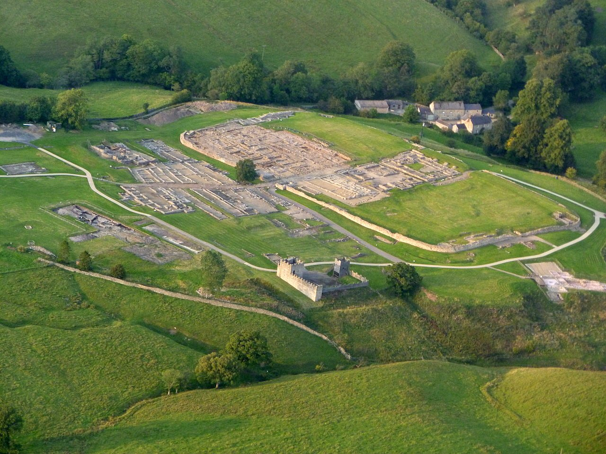

# CLAUDE.md — The Shadow of Mars Campaign Workbook

## Campaign Goal

**One sentence:** When the GM sits down at the table, every chapter has zero-prep materials ready to run.

**What "ready" means — four tabs open during play:**
1. **Cheat card** (`gm_tools/cheat_card_chN.html`) — one dark-themed browser tab: story spine (3 sentences), scene flow with DCs, OGAS table, contingencies. Fits one viewport. No scrolling.
2. **Print module** (`gm_tools/chapterNN_print.html`) — A4 two-column printout: read-aloud boxes, inline stat blocks, decision tables, NPC secrets. Can be handed to a substitute GM cold.
3. **MapTool reference** (`gm_tools/chapterNN_maptool.qmd`) — scene-by-scene table: which SVG map to load, which tokens to place, encounter notes. No guessing.
4. **NPC cards** (`gm_tools/chapterNN_npcs.html`) — one card per major NPC: portrait silhouette, OGAS (Objective/Goal/Agenda/Secret), voice line, stat block, session-by-session state.

**Plus:** handouts printed before session (HTML files in `handouts/`). SVG maps loaded in MapTool from `Maptool/maps/`.

---

## Project Overview

A Quarto book structured as a two-part D&D 5e campaign module:
- **Part 1: Player's Workbook** — spoiler-free, read by everyone at the table
- **Part 2: GM's Workbook** — DM-only content, full NPC secrets and session design

Design philosophy: **Guy Sclanders' methodology** throughout. Every design decision should pass the Sclanders checklist below.

---

## File Structure

```
index.qmd           ← Preface (how to use the book)
player_intro.qmd    ← Spoiler-free campaign overview, setting, NPCs (names/roles only)
player_guide.qmd    ← Roman world, character creation, vexillatio extraordinaria concept
peoples.qmd         ← D&D races as Roman world cultures, legal status, province origins
skills.qmd          ← Skill system overview
session0.qmd        ← Session 0 questions (player-facing)
calendar.qmd        ← Roman calendar, festivals, the campaign window
knowledge.qmd       ← DC 13/15/17 three-tier knowledge system (barrier-gated)
player_tome.qmd     ← Deep immersion guide: how to think, talk, and act like a Roman
vindolanda_guide.qmd ← Fort Vindolanda player field manual
professions.qmd     ← Roman professions and downtime activities
roles.qmd           ← The 15 unit roles of the vexillatio extraordinaria
supplies.qmd        ← Regional supply, prices, equipment degradation
food.qmd            ← Food, drink, and rationing mechanics
roman_tactics.qmd   ← Roman military formations, expanded weapons/ammunition
bestiary.qmd        ← D&D 5e stat blocks with full tactical identities
corruption.qmd      ← Expanded corruption system (player-facing)
reputation.qmd      ← Reputation and relationship system
journal.qmd         ← Campaign journal and decision tracker
atmosphere.qmd      ← Music and sound per session
gm_intro.qmd        ← OGAS framework, central mystery, master plot, NPC skill DCs
gm_session0.qmd     ← GM facilitation guide for Session 0
skill_framework.qmd ← Unified skill interaction design principles (GM reference)
germanic_tribes.qmd ← Germanic tribes, society, runes, seiðr, and magic (GM)
locations.qmd       ← Detailed location descriptions, skill check menus, vicus, living world
camp_economy.qmd    ← Six traders, Camp Level 1-3 system, role-gated upgrades (GM)
chapter1.qmd        ← Session 1: Blood and Omens
chapter2.qmd        ← Session 2: The Chieftain's Price
chapter3.qmd        ← Session 3: Through the Dark Forest
chapter4.qmd        ← Session 4: The God's Demand
chapter5.qmd        ← Session 5: The Wrath of Mars
appendix.qmd        ← Quick reference, stat blocks, handouts 1-11
images/             ← All local image assets (downloaded from Wikimedia Commons)
handouts/           ← Rendered HTML handouts (one per appendix handout, print-ready)
gm_tools/           ← GM session reference cards (one per session, browser-tab format)
audio/              ← Ambient audio guide HTML page (audio/index.html)
Maptool/            ← MapTool VTT standalone install (see Milestone 67)
  setup.sh          ← Run once to extract, configure, and download addons
  maptool.sh        ← Launch MapTool (data stays in Maptool/data/)
  tokentool.sh      ← Launch TokenTool
  campaigns/5e/     ← Campaign .cmpgn files
  addons/           ← .rptok library tokens and .mtlib add-ons
  macros/           ← MTScript macro source files (.mts)
  tokens/npcs/      ← NPC token portrait HTML previews
  maps/             ← Map images for MapTool backgrounds
  data/             ← MapTool runtime data (gitignored; created on first launch)
```

### Image Assets (all verified HTTP 200, Wikimedia Commons)

| File | Subject | License |
|---|---|---|
| `roman_empire_125.svg` | Roman Empire map, 125 AD | Public domain |
| `limes_germanicus.jpg` | Limes Germanicus frontier map | CC BY-SA 4.0 |
| `germanic_tribes.svg` | Germanic tribes, 50 AD | Public domain |
| `castra_layout.svg` | Standard Roman fort plan | CC BY-SA 4.0 |
| `vindolanda_aerial.jpg` | Vindolanda aerial photo, 2010 | CC BY-SA 2.0 |
| `saalburg_fort.jpg` | Saalburg reconstructed fort | CC BY-SA 3.0 |
| `saalburg_plan.jpg` | Saalburg fort floor plan | CC BY 2.5 |
| `legionaries.jpg` | Roman legionaries on the march | CC BY-SA 3.0 |
| `lorica_segmentata.jpg` | Roman armour, Antonine period | CC BY-SA 3.0 |
| `hadrians_wall_map.svg` | Hadrian's Wall map with Vindolanda | CC BY-SA 3.0 |
| `strix_owl.jpg` | Athenian tetradrachm owl coin, 454-404 BC | CC BY-SA 4.0 |
| `lemures_fresco.jpg` | Pompeii Lares and Serpents fresco | CC BY 2.0 |
| `genius_loci.jpg` | Pompeii lararium serpent painting | Public domain |
| `alp_nightmare.jpg` | Fuseli, *The Nightmare*, 1781 | Public domain |
| `draugar.jpg` | Norse draugr illustration, Kim Diaz Holm | CC BY 4.0 |
| `lindworm.png` | Nidhogg Norse serpent | Public domain |
| `nix_nokken.jpg` | Kittelsen, *Nokken*, 1887-92 | Public domain |
| `lar_bronze.jpg` | Bronze statuette of a Lar, Metropolitan Museum | CC0 |
| `kylver_runestone.jpg` | Kylver Runestone, Elder Futhark inscription | Public domain |
| `tollund_man.jpg` | Tollund Man, bog mummy, 400 BC | CC BY-SA 2.0 DK |
| `germanic_longhouse.jpg` | Reconstructed Germanic longhouse | CC BY-SA 3.0 |
| `vendel_helmet.jpg` | Vendel period helmet, 6th-7th century | Public domain |
| `amber_figurine.jpg` | Bronze Age amber figurine | CC BY-SA 2.5 DK |
| `odin_sacrifice.svg` | Odin at Yggdrasil, Lorenz Frolich | Public domain |
| `yggdrasil.jpg` | Yggdrasil, Norse World Tree | Public domain |

Attribution format for CC images: `*Image: [Author], Wikimedia Commons, [License].*`

---

## Guy Sclanders Methodology Checklist

Apply these to every session chapter. Before marking a session "complete", verify each box.

### Core Systems

- [ ] **OGAS per NPC** — Every NPC appearing in the session has active Objective / Goal / Agenda / Secret
- [ ] **Strong Opening** — In media res, no preamble, visceral hook in the first 5 minutes
- [ ] **Pressure Cooker** — Time pressure + incomplete information + escalating stakes
- [ ] **Meaningful Choices** — No "correct" answer; every major decision has real consequences in later sessions
- [ ] **Three Clue Rule** — Every mystery/discovery has at least 3 independent paths to find it
- [ ] **Reactive World** — NPCs advance their OGAS between sessions whether or not the party engages them

### NPC Archetypes (from Sclanders' villain framework)
- **Blunt Force Nemesis** — Direct opposition (Legate Corvinus, Sessions 1-2)
- **Never Present Villain** — Manipulation from shadows until reveal (Senator Brutus, Sessions 1-4)
- **Divine Antagonist** — Ultimate challenge beyond mortal scale (Mars, Sessions 4-5)

### Session Structure Template
Each chapter should follow this skeleton:
1. **Read-Aloud Opening** (in media res)
2. **Scene 0: Cold Open** (hook, no choices yet)
3. **Scene 1-N: Pressure Cooker Escalation** (each scene raises stakes)
4. **Decision Point** (party makes an irreversible choice)
5. **Consequence Setup** (seeds for next session)
6. **Level Advancement note**
7. **DM Notes** (NPC states, contingencies, optional encounters)

### Escalation Arc
Sessions must escalate:
- S1: Personal → Fort-level stakes
- S2: Fort → Regional stakes
- S3: Regional → Imperial stakes
- S4: Imperial → Divine stakes
- S5: All threads resolve (divine + political + personal)

---

## Session Template

The canonical session template lives at:
`https://github.com/DnD-Kamitor/The-Price-of-Dawn/blob/master/session-template.md`

A copy is maintained at `gm_tools/session_template.qmd` and is live in the GM's Workbook section of the book. When building or rebuilding any session guide, use this template as the base. Fill every section; delete only the Encounter Details block for RP-only scenes. Session-specific guides go in `gm_tools/sessionNN_guide.qmd`.

---

## Completed Milestones

All content below is live in the book. No further action required.

| # | Title |
|---|---|
| 1 | Visual Foundation — images downloaded, maps embedded, GitHub Pages .nojekyll fix |
| 2 | Player's Workbook: World Depth — daily life, pantheon, equipment, Latin phrases, session 0 |
| 3 | Session Development (Sessions 2-5) — all five chapters drafted with cold opens and OGAS |
| 4 | NPC Expansion — relationship web, per-session state table, dialogue, reaction tables |
| 5 | Location Design — Vindolanda, ruins, forest, siege arc, sacred grove |
| 6 | Roman Tactics — testudo, wedge, envelopment, siege mechanics, Germanic counter-tactics |
| 7 | Bestiary — 8 creatures with stat blocks, images, propitiation table |
| 8 | Player Assistance Tome — backstory framework, speech/thought patterns, immersion tools |
| 9 | Character Knowledge Tiers — DC 13/15/17 collapsible knowledge system |
| 10 | Professions & Downtime — 10 professions, downtime activities, collegium system |
| 11 | Germanic Tribes & Magic — tribes, society, religion, runes, shamanism, magic items |
| 12 | Handouts & Props Pack — 11 handouts, player tracker, DM quick-reference |
| 13 | Final Polish & Publish — continuity audit, GitHub Pages live |
| 14 | Roman Calendar & Sacred Year — calendar mechanics, festival table, campaign window |
| 15 | Life at the Frontier: Sensory Atlas — daily schedule, food, senses, death on the frontier |
| 16 | Fort Vindolanda: Player Guide — layout, social rules, prices, dangers |
| 17 | Campaign Journal & Decision Tracker — session templates, relationship web, corruption tracker |
| 18 | Expanded Corruption System — six stages in depth, gods, resistance, recovery rules |
| 19 | Languages of the Roman World — D&D translation table, tiers by background, sacred languages |
| 20 | knowledge.qmd Overhaul — baseline preambles, three-layer system, two new categories |
| 21 | Chapter 1 Improvement Pass — chamber read-alouds, spear reveal, OGAS table, scene 4 |
| 22 | Chapter 2 Improvement Pass — Sextus mystery, Vercingetorix voice, session transition table |
| 23 | Chapter 3 Improvement Pass — forest events d8, Thusnelda expanded, sacrifice guidance |
| 24 | Chapter 4 Improvement Pass — siege read-aloud, council stakes, tunnel scenes, antechamber |
| 25 | Chapter 5 Improvement Pass — Option C expanded, corruption level 5, Mars up close, epilogue |
| 26 | Peoples of the Empire — D&D races as Roman world cultures, legal classification, hooks |
| 27 | Legal Status and Social Standing — five legal categories, rank ceilings, status mechanics |
| 28 | Regional Supply, Equipment, Fort Economy — price index, supply cycle, degradation rules |
| 29 | Food, Drink, and Rationing — daily ration, quality tiers, drink mechanics, rationing scenarios |
| 30 | The Legion and the Magical World — Roman magical doctrine, haruspex mechanics, creature classification |
| 31 | Lex Arcana Integration — Custodes concept, virtues, augury mini-game, Fatum mechanics |
| 32 | Session 0: Character Creation Guide Rewrite — personal questions, contubernium events, three questions |
| 33 | Atmosphere: Music and Sound Per Session — per-session soundscapes, player-facing ambient guide |
| 35 | Three-Barrier Knowledge + Living Camp Economy — stat gates, six traders, Camp Level 1-3 |
| 36 | GM Session 0 Guide — consent, aloud questions with annotations, private questions, Fatum cards |
| 37 | Camp NPC Full Treatment — OGAS, per-session states, voice reference, reaction tables, siege behavior |
| 38 | Unified Skill Interaction Framework — no dead ends, cascade design, temporal gates, partial success |
| 39 | The Vicus: Civilian Settlement — layout, four named civilians, information network, siege behavior |
| 40 | Deep Religion, Deep History, Magical World — Mars in 175 AD, völva, bog offerings, flora, raven network |
| 41 | Knowledge Gate Audit — all DC-gated content behind toggles, GitHub Pages verified |
| 42 | Toggle Voice Rewrite — all DM-facing collapsibles in DM voice |
| 43 | Cross-Session Integration Notes — cascade unlocks in GM book, master integration table |
| 44 | Merge Duplicate Origin Chapters — peoples.qmd authoritative, cross-reference in player_guide |
| 45 | Session 0 Questions Audit — deduplicated, each question in the right file |
| 46 | Player Tome Reorganization — three named sections, _quarto.yml reordered |
| 47 | Expanded Roman Weapons and Ammunition — sling ammunition types, pilum, arrow types, melee subtypes |
| 48 | Bestiary Tactical Expansion — distinct tactics per creature, CR increases, tactical summary card |
| 49 | Upgradable Camp and Legionary Companions — Camp Level 1-3, upgrade triggers, companion rules |
| 51 | The Role System: Vexillatio Extraordinaria — 15 unit roles with mechanics, DC knowledge, NPC holders |
| 52 | Contubernium Reframe: The Assembled Unit — vexillatio framing, Corvinus reasoning, unit has no name |
| 53 | Expanded Roman Weapons and Ammunition (renumber of 47) — confirmed live in roman_tactics.qmd |
| 54 | Bestiary Tactical Expansion (renumber of 48) — confirmed live in bestiary.qmd |
| 55 | Upgradable Camp and Legionary Companions (renumber of 49) — role-gated triggers, vacancy degradation |
| 56 | Germanic Weapons + Magical Weapons — framea, seax, francisca, angon, three NPC weapons with story properties |
| 57 | Comprehensive Weapons and Equipment Expansion — new sling ammo (whistling, inscribed, terracotta), arrow types (trilobate, barbed, scythicon), verutum, lancea, contus, falx, siege weapons (scorpio, onager, polybolos), full armor and equipment slot system (body/helmet/arms/gloves/cloak/boots/belt) |
| 58 | Shadar-kai Spartan Shadow-Cursed Origin — racial traits, five bidirectional shadow stages, Vercingetorix reaction, corruption divergence sidebar, death ruling, Session 0 private questions, chapter 4 staging |
| 59 | Starting Level and Character Advancement — Level 3 start, milestone rationale, full arc table L3-7, role/level decoupling (player_guide.qmd) |
| 60 | Role-Based Starting Equipment Packages — all 15 roles with full kit, weight totals, class substitutions, carrying loads system, three-tier role advancement (Standard/Senior), vacancy consequence table, camp-as-living-entity framework |
| 61 | Citizenship Progression as Campaign Goal — commendationes system, active status elevation track, in-play status costs, Session 3/4/5 elevation events (peoples.qmd, session0.qmd, gm_session0.qmd) |
| 67 | MapTool Standalone Setup — MapTool 1.18.6 + TokenTool extracted from .deb into Maptool/ subfolder, both with bundled JREs. MapTool.cfg patched so MAPTOOL_DATADIR points to Maptool/data/ (all state stays local). Launchers: Maptool/maptool.sh, Maptool/tokentool.sh. Addons in Maptool/addons/ (Lib_SpellLibrary 2014+2025, Lib_MonsterMaker, Lib_Date_Time.mtlib). D&D 5e campaigns in Maptool/campaigns/5e/ (Meleks Simple 5e, Automated 5e SRD, demo). dnd5eTokens/ organized by creature type. Maps in Maptool/maps/ (5 campaign-relevant images). Setup script: Maptool/setup.sh (idempotent, re-run after git clone). |
| 68 | Conflict Resolution Protocol — Established that Nextcloud creates conflicted copies when sync detects diverging edits. Correct fix: verify conflicted copies match HEAD (they always will after a commit), then git restore the rolled-back working-tree files and delete the conflicted copies. Never merge: the conflicted copy IS the committed version. |
| 69 | Map Resource Pack — Maptool/maps/download_maps.sh downloads 64 Dice Grimorium battle maps (underground/vault for Ch1, Germanic forest/swamp/river for Ch3, ritual sites/sacred grove for Ch4-5, fort/settlement/roads for Vindolanda) and 17 RPTools art packs (Phergus+Torstan markers, dungeon tiles, four Dorpond tree packs, doors/windows, Torstan map sets). Maps extract to maps/dicegrimorium/ and maps/rptools/ (both gitignored, ~240MB total). Script is idempotent — re-run after clone. Some Dice Grimorium filenames deviate from the PascalCase slug pattern; the script hardcodes those. RPTools Library tab in MapTool 1.18.6 is silently broken (UI bug, server is up); use File > Add Resource to Library > Local Directory tab and point it at maps/dicegrimorium/ or maps/rptools/ instead. |
| 70 | NPC Token Portraits — CSS-only HTML token portraits for all 6 named NPCs in Maptool/tokens/npcs/ (corvinus, cassia, varro, brutus, vercingetorix, thusnelda). Each file has a 200x200 token (circular frame with CSS portrait silhouette) and a 50x50 map-scale version. Frame colours: gold = ally, red = antagonist, grey = unknown. Stat blocks and secrets embedded. build_campaign_maps.sh copies tokens into per-session folders. |
| 71 | Session Map Tables — "Maps for This Session" reference table added to Pre-Session Preparation in all five chapter files. Each table maps scenes to specific Dice Grimorium map files in the Maptool/maps/campaign/ session folders. No playable fort interior battlemap exists in the downloaded pack; saalburg_plan.jpg is an archaeological floor plan for player orientation only. |
| 72 | knowledge.qmd Skill Barrier Format Fix — All 45 DC collapsible headers updated from bare "DC 13" to "DC 13 Intelligence (History) — Recalling [specific topic]". All "What you know without a check" bullets reformatted from *italic:* style to **bold** — style. Section 9 ability check header corrected (Intelligence (Medicine) → Wisdom (Medicine)). Chapters 2-5, roles.qmd, roman_tactics.qmd still need the same audit (planned as agent task). |
| 74 | Creature and Generic Troop Tokens — 4 new Fort tokens (Legionary_Milites, Optio_NCO, Cult_Mars_Initiate, Cult_Mars_Fanatic). Per-session creatures: S1 vault undead (Skeleton, Ghoul, Shadow); S2 road wildlife (Wolf, Boar, Road Bandit); S3 Germanic forest (Wolf, Dire Wolf, Brown Bear, Giant Spider, Haugbui, Myling, Vættir); S4 sacred grove (Wight, Will-o-Wisp, Dryad) + Cult tokens; S5 final vault (Wraith, Wight, Shadow, Specter, Zombie). Session totals: S1=20, S2=20, S3=18, S4=20, S5=23. Removed Automated.5e.-.SRD.Only.cmpgn (94MB, over GitHub limit). |
| 75 | Role Progression Trees and Class Substitutions — Full branching advancement system added to all 15 roles in roles.qmd. Three tiers: Standard (0 comm), Veteranus (3 comm, Branch A/B choice, Perk 1), Specialis (7 comm, Perk 2). 60 campaign-specific perks total. Citizenship gates (Latinus+ or Civis) on restricted perks. Race/background/class locks with diegetic explanations. Class equipment substitution toggles added to every role (Wizard/Sorcerer/Warlock/Cleric/Druid/Bard/Rogue/Monk — no substitution for Fighter/Barbarian/Paladin/Ranger). Spec in AGENT_TASK_roles_progression.md. |
| 76 | Session 0 Prologue + Session 1 Vault Redesign — (1) gm_session0.qmd: added 5-scene in-world "Day of Arrival" prologue (road approach, processing in with Quartus, fort walk with Varro + 5 locations, vicus/Brennus tavern, shared first-night dream seeding Ch1 cold open). session0.qmd: added sensory "A Day at the Fort" orientation section. (2) chapter1.qmd: vault rebuilt from linear to branching. Left branch: Shield Hall (preserved) + hidden alcove (wax tablet warning, OTHALAN contract token, three-clue rule). Right branch: Flooded Gallery (3 Shadows, preserved Germanic warrior, framea, second contract token) + Bone Chamber (2 Ghouls + 1 Ghast, Hard encounter). Both merge: Binding Chamber (chain puzzle lock, contract scroll). Runic Corridor (floor puzzle, shield-order/rune/Religion clues, lightning damage fallback). Altar Chamber: 1 Wight + 2 Shadows replacing 2 Animated Armors; Wight speaks, exit condition exists, Persuasion DC 14 with contract scroll advantage. Scene 4 upgraded: Berserker + 2 Cultists of Mars (proximity corruption evidence). Specs in AGENT_TASK_session0_prologue.md and AGENT_TASK_session1_deep.md. |
| 73 | Full NPC Token Coverage — 13 missing named NPCs added to build_campaign_maps.sh: Lucius_Tribune (Assassin), Paterculus_AugurAssist (Acolyte), Valeria_Medicus (Mage), Quartus_Quartermaster (Thug), Rufus_Smith (Gladiator), Brennus_Taberna (Commoner), Lucilla_Postwoman (Spy), Aldric_Observer (Mage), Titus_HalfGermanic (Scout), Sigrun_Trader (Tribal Warrior), Arnulf_Firekeeper (Tribal Warrior), Edda_SpearMother (Tribal Warrior), Skadi_Healer (Acolyte). Fort_Vindolanda now holds 23 named .rptok tokens. Session folders get only session-relevant tokens (S1: fort staff 15 tokens; S2: fort+road cast 15; S3: Germanic 11; S4: ritual/siege 13; S5: full resolution cast 14). Summary counter fixed to report .rptok counts. |
| 80 | SVG Dungeon Maps — Inline SVG HTML files for all campaign sessions. S1 vault overview complete (9 rooms, grid-aligned). Design rules: solid floor fills, one grid layer drawn LAST, all coords multiples of 40px (overview) or 60px (battle). Render pipeline: Firefox headless → PNG → ImageMagick JPG. See Map Design Rules section below. |
| 79 | Source Book Integration — Learnings from HR5 Glory of Rome and Lex Arcana: Britannia applied to three files. knowledge.qmd: Coronae military crowns (Grass/Civic/Gold, DC 13/17), Lemures Roman hungry dead (Lemuria festival, appeasement rite, DC 13/15), Belatucadrus Mars of the Frontier (conceals Celtic sun god Belenus, DC 15/17). germanic_tribes.qmd: "Peoples Near the Vallum" section (Brigantes, Selgovi, Votadini, Novanti with political profiles), Alaisiagae Goddesses (four war goddesses at Vercovicium, raven omen, Valkyrie parallel, name/title/symbol table), GM collapsible for Agrona (Caledonian massacre goddess, kill-signature guide). vindolanda_guide.qmd: Agricola/Antonine Wall decline narrative, vicus supply detail, bath complex comparison, DC 13 understaffed garrison gate, Belatucadrus shrine with DC 15 Belenus gate. Reference document BOOK_LEARNINGS_AND_TASKS.md created with full source learnings and remaining Tasks A-G. |

---

## Chapter Deliverable Status

Every chapter needs exactly these files. Build them in order. Do not skip to the next chapter until the current one has all five.

| File | Purpose | Ch1 | Ch2 | Ch3 | Ch4 | Ch5 |
|------|---------|-----|-----|-----|-----|-----|
| `cheat_card_chN.html` | At-table browser tab | partial | done | done | done | done |
| `chapterNN_print.html` | A4 printable module | missing | done | done | done | done |
| `chapterNN_guide.qmd` | Full Quarto session guide | missing | done | done | done | done |
| `chapterNN_maptool.qmd` | Scene→map→token reference | missing | done | done | done | done |
| `chapterNN_npcs.html` | NPC OGAS + stat cards | missing | missing | done | done | done |

**Ch1 partial** = `cheat_card_ch1_finish.html` covers Scenes 4-5 only. Full Ch1 cheat card still missing.

**SVG maps committed:**
- Ch1: `vault_s1_overview.html` (overview only; battle maps missing)
- Ch2: `s2_fort_overview.html`, `s2_west_gate.html`, `s2_north_wall.html` (uncommitted)
- Ch3: `s3_forest_path.html`, `s3_germanic_village.html`, `s3_farbog_crossing.html`, `s3_forest_overview.html`
- Ch4: `s4_fort_siege.html`, `s4_sacred_grove.html`, `s4_sacred_grove_overview.html`
- Ch5: `s5_mars_confrontation.html`

**Handouts:** All 11 HTML files done (`handouts/handout_01` through `handout_11`). Print-ready.

**NPC tokens:** 23 named NPC HTML portraits in `Maptool/tokens/npcs/`. Player tokens: 5 in `Maptool/tokens/players/` (Iris, Julia Jana, Tanit, Rivia, Ursula).

**Audio:** `audio/index.html` done — 5-session ambient guide with YouTube search links.

---

## How to Deliver

### Quality rules (learned from failures)

**Maps must match the scene.** Never assign a generic downloaded map to a scene without knowing what happens there. If the scene is a wall assault, build a wall SVG. If it's a forest ambush, use `s3_forest_path.html`. Read the scene first, then pick/build the map.

**Story = 3 sentences max on the cheat card.** The Quarto book chapter is the deep reference. The cheat card is what the GM reads at the table in 10 seconds. Story box on the cheat card: who are the players, what is the threat, what is at stake. Nothing else.

**Cheat card fits one viewport.** If it requires scrolling to see all scenes, it is too long. Cut to essentials. Contingencies can be collapsed `<details>` elements.

**NPC cards need OGAS + one voice line.** Do not write paragraphs. Per NPC: Objective (what they want this chapter), Goal (how they pursue it), Agenda (what they do whether or not the party engages), Secret (what the party can discover). Plus one sentence of dialogue that captures their voice.

**Print module = standalone.** A substitute GM picking it up cold should be able to run the chapter. Include: read-aloud for every scene, stat block for every combat, decision table for every major branch, NPC secrets in sidebar boxes.

**MapTool reference = no ambiguity.** Each row: Scene name | SVG file to load | Tokens to place (exact names from `Maptool/tokens/`) | Encounter notes. No "see chapter2.qmd for details" — the reference is the reference.

**Always commit and push after completing a chapter's files.** Never leave uncommitted files.

### File naming
- Cheat cards: `gm_tools/cheat_card_chN.html` (N = 1-5)
- Print modules: `gm_tools/chapterNN_print.html` (NN = 01-05)
- Quarto guides: `gm_tools/chapterNN_guide.qmd`
- MapTool refs: `gm_tools/chapterNN_maptool.qmd`
- NPC cards: `gm_tools/chapterNN_npcs.html`
- Handouts: `handouts/handout_NN_slug.html`
- SVG maps: `Maptool/maps/sN_slug.html` + exported `sN_slug.jpg`

### What NOT to do
- Do not write session guides that require reading the whole Quarto book to understand. The GM tools are self-contained.
- Do not pick Dice Grimorium maps by filename. Read the scene, then decide if an existing map fits or if a new SVG is needed.
- Do not leave `<!-- TODO -->` in cheat cards without also adding the chapter to Pending Work in this file.
- Do not add files to `_quarto.yml` that do not exist yet.

---

## Conventions

### Quarto Patterns Used in This Project

**Read-aloud text** (block quote, GM reads aloud at table):
```markdown
> The smell of torch-smoke and something older fills the corridor.
> Ahead, the passage narrows.
```

**DM-only collapsible** (secrets, contingencies, OGAS):
```markdown
::: {.callout-note collapse="true"}
## DM: Corvinus knows the OTHALAN name
He was ordered to burn a document about it three years ago. He will not volunteer this. History DC 17 or direct confrontation needed.
:::
```

**Knowledge barrier (three-tier system):**
```html
<details>
<summary>DC 13 Intelligence (History) — Recalling the OTHALAN rune</summary>
DM content here.
</details>
```
Do NOT put DC-gated facts in open prose. Always put them inside a collapsible.

**Chapter YAML front matter:**
```yaml
---
title: "Chapter 2: The Chieftain's Price"
---
```
No `author`, no `date` — those come from `_quarto.yml`.

**Adding a chapter to `_quarto.yml`:** Every new `.qmd` file needs an entry under the correct `part:` block. Never add `.html` files to `_quarto.yml` — only `.qmd`.

**Figure embed:**
```markdown
{width=90% fig-align="center" fig-alt="Aerial photograph of Vindolanda excavation site."}
*Image: Vindolanda Trust, Wikimedia Commons, CC BY-SA 2.0.*
```

### Writing Tone
- **Player sections:** Present tense, "you" voice, no spoilers. Treat the reader as a capable adult who wants enough information to make interesting characters.
- **GM sections:** Direct and practical. Short sentences. No hedging. Trust the DM to improvise; give them the raw material, not a script.
- **Read-aloud text:** Block quote format (`>`). Slow, atmospheric. Short paragraphs. Specific sensory details. End on a decision or question, never a statement.

### Style Rules
- **No em dashes (--).** Use a colon, semicolon, or comma instead. For parenthetical phrases, use parentheses.
- **No AI attribution.** Do not reference AI tools in any content file. CLAUDE.md is internal; nothing from it appears in the rendered book.
- **Latin in italics.** All Latin words and phrases in prose are italicised on first use per page.
- **Active voice.** Passive constructions slow down practical reference writing.
- **DM-facing collapsibles:** Write in DM voice -- direct, first-person where natural ("Here is what I do when..."), not encyclopedia entries. The DC 17 payoff should feel like handing something valuable, not filing a report.
- **Knowledge barriers:** Three layers per entry -- (1) what every soldier knows (open), (2) DC 13/15 trained knowledge (collapsible), (3) DC 17 specialist knowledge (collapsible). No DC-gated fact in open text.

### Images
- Store all images in `images/` directory
- Embed with Quarto figure syntax: `{width=90% fig-align="center"}`
- Always include `fig-alt` for accessibility
- Attribution line immediately below each figure in italics

### Session Chapter Structure
See the Session Structure Template in the Sclanders checklist above. Chapter 1 is the reference implementation -- match its format.

### SVG Map Design Rules

All campaign maps live in `Maptool/maps/` as self-contained HTML files (`session_name.html`) with a DM reference table below the SVG. A JPG export (`session_name.jpg`) is committed alongside for MapTool import.

**Grid rule (critical for VTT):** One `<pattern id="grid">` drawn as the LAST element before room numbers. Floor fills are solid flat colours — no tiled stone/texture patterns. If texture tiles are 40px and the grid is also 40px they create a competing double-grid that shifts visually in MapTool.

**Coordinate rule:** All room `x, y, w, h` must be exact multiples of the grid cell size: 40px for overview maps (1 sq = 40px = 5ft), 60px for battle maps (1 sq = 60px = 5ft). Verify every room before rendering.

**Render pipeline:**
```bash
# 1. Extract SVG and wrap in minimal HTML
python3 -c "import re; ..."   # writes /tmp/export.html

# 2. Firefox headless screenshot (kill any running Firefox first if needed)
pkill -f librewolf; sleep 2
firefox --headless --screenshot /tmp/out.png --window-size=WxH "file:///tmp/export.html"

# 3. Convert to JPG
convert /tmp/out.png -quality 92 Maptool/maps/name.jpg
```
Do NOT use Chromium headless — it produces an all-white PNG on this system. Do NOT use ImageMagick direct SVG render — it renders darker than Firefox.

**Map files per session:**
- S1: `vault_s1_overview.html` + JPG (overview 1200×2500, 40px/sq), plus battle maps for bone chamber, altar chamber, courtyard
- S2: `s2_fort_overview.html` + JPG, `s2_west_gate.html` + JPG
- S3: forest path, Farbog crossing, Germanic village
- S4: sacred grove, fort siege
- S5: final vault, Mars confrontation

**What goes on the map (background layer only):**
- Solid floor fills, walls, archway gaps
- Architectural features: torches (sconce + flame ellipses), columns (3D shadow effect), benches (3D shadow effect), rubble (layered irregular polygons), water (wave pattern), rope ladders, chains (with link ovals), stone plinths
- Shield shapes: use proper SVG paths — heater shield `M-9,-14 Q0,-16 9,-14 L8,4 Q0,16 -8,4 Z`, oval Germanic `<ellipse>` with center boss circle and rib line, Roman scutum tall rounded rect
- Room number circles (gold border, dark fill, number only)
- Compass rose and scale bar
- NO text labels, NO encounter markers, NO DM secrets in the SVG

---

## Pending Work (Next Sessions)

### Priority 1: Commit Pending Files
Files created but NOT yet committed:
- `Maptool/maps/s2_north_wall.html` — S2 north wall SVG battle map (22×14sq, 60px/sq). Commit with s2 SVG maps.
- `Maptool/campaigns/5e/5juliromans.cmpgn` — new campaign file. Confirm keep or discard before committing.

### Priority 2: Chapter 3-5 Skeleton Documents

**Chapter 3 — Through the Dark Forest (COMPLETE)**
- [x] `gm_tools/cheat_card_ch3.html` — done
- [x] `handouts/chapter03_handouts.qmd` — done (Handout 6 + Handout 7)
- [x] `gm_tools/chapter03_maptool.qmd` — done (Brian.rptok added)
- [x] `gm_tools/chapter03_npcs.html` — done
- [x] `gm_tools/chapter03_guide.qmd` — done
- [x] `gm_tools/chapter03_print.html` — done

**Chapter 4 — The God's Demand (COMPLETE)**
- [x] `gm_tools/cheat_card_ch4.html` — done (existed)
- [x] `handouts/chapter04_handouts.qmd` — done (Handout 8 raven message + Handout 9 order of battle)
- [x] `gm_tools/chapter04_maptool.qmd` — done
- [x] `gm_tools/chapter04_npcs.html` — done (Corvinus, Lucius, Varro, Cassia, Vercingetorix, Brutus)
- [x] `gm_tools/chapter04_guide.qmd` — done
- [x] `gm_tools/chapter04_print.html` — done

**Chapter 5 — The Wrath of Mars (COMPLETE)**
- [x] `gm_tools/cheat_card_ch5.html` — done (existed)
- [x] `handouts/chapter05_handouts.qmd` — done (Handout 10 Mark of Mars + Handout 11 Arena Weapon Cards × 5)
- [x] `gm_tools/chapter05_maptool.qmd` — done (CityStreets/AncientAltar/DarkTempleInterior/NatureGoddessTemple/LabyrinthRuins)
- [x] `gm_tools/chapter05_npcs.html` — done (Mars divine, Fausta Luperci, Cassia, Varro, Corvinus, Lucius, Vercingetorix, Brutus, Thusnelda)
- [x] `gm_tools/chapter05_guide.qmd` — done (continuity tracker, 3 trial options with full mechanics, consequence menu, commendationes tally)
- [x] `gm_tools/chapter05_print.html` — done (Mars full stat block, Fausta stat block, arena weapon reference, consequence table)

**Chapter 5 — The Wrath of Mars**
- [ ] `gm_tools/cheat_card_ch5.html`
- [ ] `handouts/chapter05_handouts.qmd` — handout 10 (mark of mars) + epilogue outcome cards
- [ ] `gm_tools/chapter05_maptool.qmd` — map: s5_mars_confrontation.html
- [ ] `gm_tools/chapter05_npcs.html` — primary: Mars (divine), all returning NPCs with final fate notes

### Priority 3: Print Module for Chapter 4-5
- [ ] `gm_tools/chapter04_print.html`
- [ ] `gm_tools/chapter05_print.html`

### Priority 4: S2 Missing Combat Tokens
- [ ] `npcs/quintus_flavius.json` already exists → verify token in `Maptool/tokens/npcs/creatures/`
- [ ] Add `npcs/praetorian_guard.json` (×6 template token) — CR 1, AC 16 (lorica), HP 16, spear + shield
- [ ] Run `python3 scripts/generate_npc_tokens.py` after adding

### Priority 5: NPC Portrait Images
User requested pictures on all NPCs. Options:
- CSS silhouette tokens already exist for 23 named NPCs in `Maptool/tokens/npcs/`
- For the print module: embed base64 small portrait or reference `Maptool/tokens/npcs/[name]_token.html` screenshot
- For chapter_npcs.html files: add portrait `` slot with fallback CSS silhouette

### Commit Conventions
One milestone or major feature per commit. Commit message format:
```
[Milestone N] Short description of what was built

- Bullet list of changes
```
