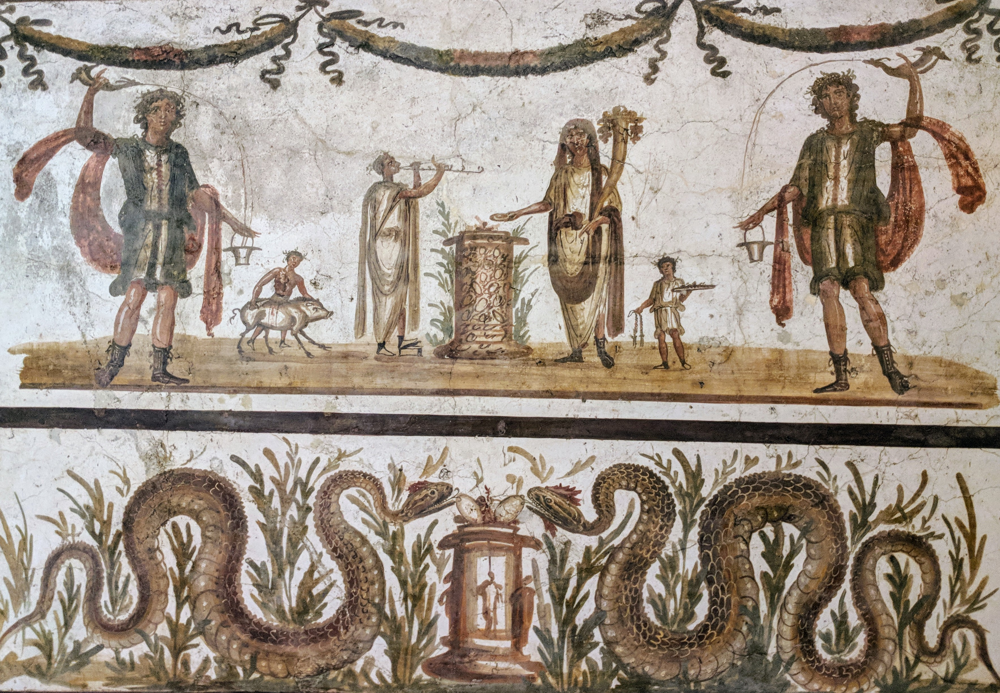
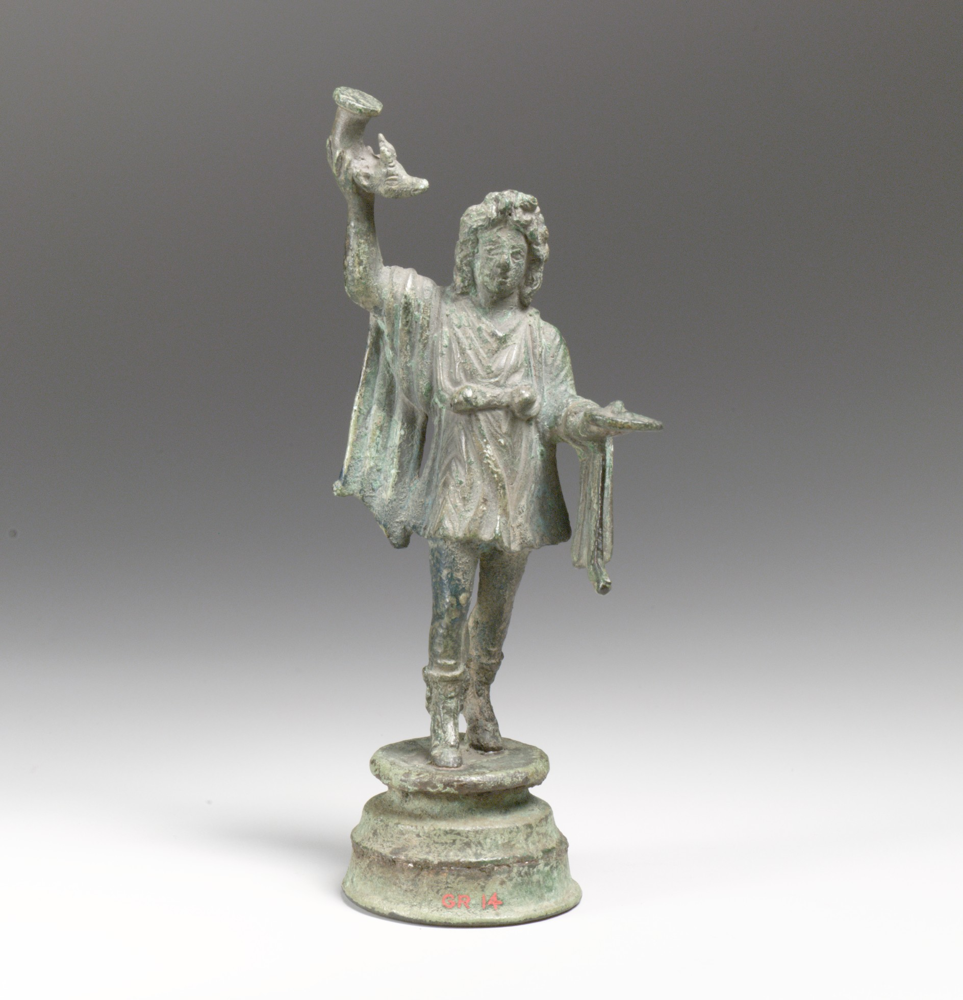
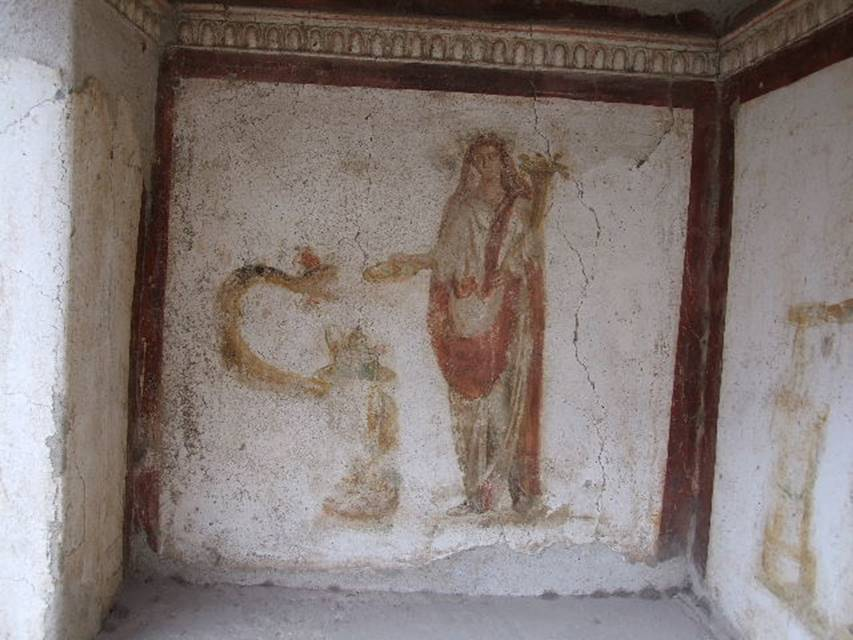
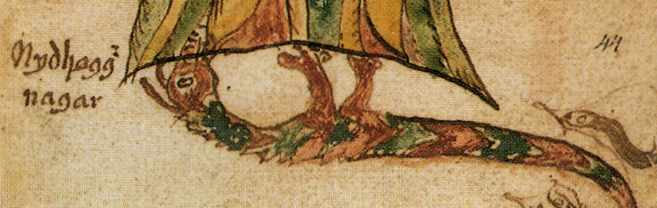
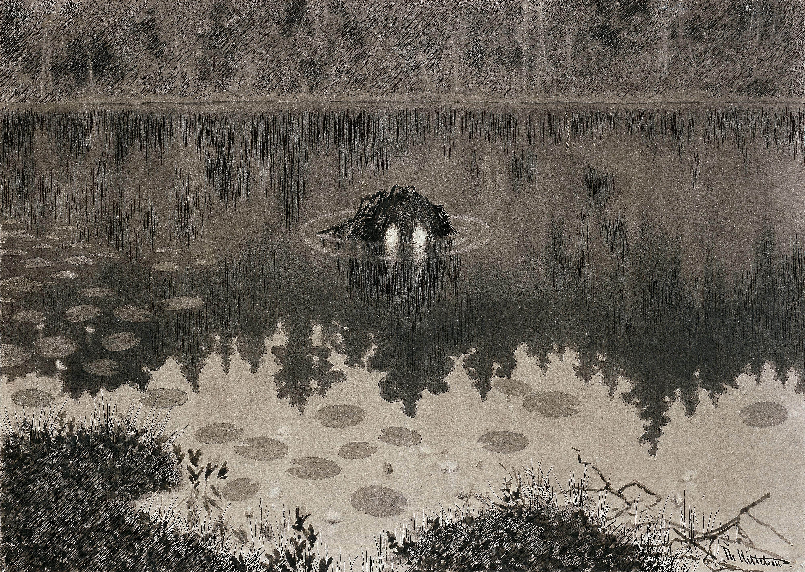

# Bestiary: Creatures of the Roman World

The world of 175 AD is not purely historical. It is a world where the gods are real, where the frontier between civilization and wilderness is also a frontier between the known and the deeply strange. This bestiary gives D&D 5e stat blocks for eight creatures drawn from Roman and Germanic mythology: entities the party may encounter, fight, bargain with, or fear.

Each entry includes the creature's historical origins, how it functions in the campaign, and suggestions for use.

---

## Roman Creatures

### Strix

{fig-alt="Silver coin showing an owl, the symbol of Athena-Minerva" width="340px"}

*The old women know the name. When a child dies in the night without cause, when a man wakes with no blood in his face and no memory of his dreams; they blame the strix. It came through the window. It took what it needed and left before dawn.*

**Historical Origins:** The strix (pl. *striges*) was one of Rome's most feared nocturnal creatures; a blood-drinking bird of ill omen, described by Ovid, Petronius, and Pliny. It could take the form of a screech owl or a humanoid woman. It flew at night and sought the blood of infants and sleeping adults. The strix was ancient when Rome was young; the Greek σTRÍΓΞ is older still.

**In the Campaign:** A strix nest near a military fort explains the unaccountable deaths of sentries (see Chapter 2 hooks). A cult of Mars might keep striges as consecrated hunters, releasing them against enemies. A single strix following the party could be a divine message from Mars, or simply a predator drawn to blood.

---

::: {.callout-note appearance="minimal"}
**STRIX**
*Small fiend, chaotic evil*

---

**Armor Class** 13 (natural armor) | **Hit Points** 45 (10d6 + 10) | **Speed** 10 ft., fly 60 ft.

| STR | DEX | CON | INT | WIS | CHA |
|:---:|:---:|:---:|:---:|:---:|:---:|
| 8 (−1) | 18 (+4) | 12 (+1) | 6 (−2) | 14 (+2) | 12 (+1) |

**Skills** Perception +4, Stealth +6
**Senses** Darkvision 120 ft., passive Perception 14
**Languages** --
**Challenge** 3 (700 XP) | **Proficiency Bonus** +2

---

**Blood Scent.** The strix can detect blood within 60 feet. It has advantage on Perception checks against any creature that is bleeding.

**Flyby.** The strix doesn't provoke opportunity attacks when it flies out of a creature's reach.

**Ill Omen.** The first time a creature sees a strix in a given night, it must succeed on a DC 11 Wisdom saving throw or be frightened until the start of its next turn.

**Sunlight Sensitivity.** In sunlight, the strix has disadvantage on attack rolls and Wisdom (Perception) checks relying on sight.

---

***ACTIONS***

**Multiattack.** The strix makes two attacks: one with its talons and one with its bite.

**Talons.** *Melee Weapon Attack:* +6 to hit, reach 5 ft., one target. *Hit:* 11 (2d6 + 4) slashing damage.

**Bite.** *Melee Weapon Attack:* +6 to hit, reach 5 ft., one target. *Hit:* 8 (1d8 + 4) piercing damage.

**Blood Drain (Recharge 5–6).** *Melee Weapon Attack:* +6 to hit, reach 5 ft., one target. *Hit:* 7 (1d6 + 4) piercing damage and the strix attaches to the target. While attached, the strix deals 7 (1d6 + 4) necrotic damage at the start of each of its turns. A creature can use its action to pull the strix free (DC 13 Strength check).

---

***DM NOTES***

> *Use striges in pairs or small flocks (2–5). They are not mindless; they will retreat if two of their number fall. They attack sleeping or isolated targets first. A strix that loses its prey will scream (a DC 12 Perception check to hear from 300 feet) before fleeing.*

**Adventure hooks:** Soldiers finding drained corpses; a captured strix that can be coerced into tracking another creature by smell; a strix nesting in the fort's grain stores (the smell of blood from slaughtered animals draws them).
:::

---

### Lemur

{fig-alt="Roman fresco showing two dancing Lares spirits flanking a sacrifice scene, with serpents below" width="480px"}

*During Lemuria, in the cold of May, the head of each household rises at midnight. He walks barefoot through the dark rooms, his thumb folded between his fingers to ward off evil, throwing black beans over his shoulder without looking back. Nine times he says: "These I cast; with these beans I redeem me and mine." The lemures gather the beans. They are satisfied. They leave.*

*Sometimes they don't leave.*

**Historical Origins:** The *lemures* (singular: *lemur*) were the restless spirits of the Roman dead; specifically those who had died violently, without proper burial, or while still bound by unresolved obligations. The festival of *Lemuria* (May 9, 11, and 13) was dedicated to appeasing them. Unlike the honored *manes* (ancestors properly mourned), lemures were considered malevolent presences.

**In the Campaign:** The dead of the frontier battles don't always stay dead. Unburied soldiers, Germanic warriors slain without proper rites, massacre victims from Chapter 1; all are potential lemures. A wise party learns to bury their dead properly. A party that doesn't may find old friends among the midnight visitors.

---

::: {.callout-note appearance="minimal"}
**LEMUR**
*Small undead, chaotic neutral*

---

**Armor Class** 12 | **Hit Points** 22 (5d6 + 5) | **Speed** 0 ft., fly 30 ft. (hover)

| STR | DEX | CON | INT | WIS | CHA |
|:---:|:---:|:---:|:---:|:---:|:---:|
| 7 (−2) | 14 (+2) | 12 (+1) | 4 (−3) | 12 (+1) | 8 (−1) |

**Damage Resistances** acid, fire, lightning, thunder; bludgeoning, piercing, and slashing from nonmagical attacks
**Damage Immunities** cold, necrotic, poison
**Condition Immunities** charmed, exhaustion, frightened, grappled, paralyzed, petrified, poisoned, prone, restrained
**Senses** Darkvision 60 ft., passive Perception 11
**Languages** Understands the languages it knew in life; cannot speak
**Challenge** 1/2 (100 XP) | **Proficiency Bonus** +2

---

**Incorporeal Movement.** The lemur can move through creatures and objects as if they were difficult terrain. It takes 5 (1d10) force damage if it ends its turn inside an object.

**Dishonored Rest.** A lemur that drops to 0 HP reforms in its location of death after 24 hours. It can be permanently destroyed only if its mortal remains are buried with proper funerary rites (at least 10 minutes of ceremony and a DC 10 Religion check). A *bless* spell cast over the remains allows the check automatically.

**Lemuria Compulsion.** During the three nights of Lemuria (historically May, but the GM may move this), lemures cannot willingly remain more than 30 feet from a living creature.

---

***ACTIONS***

**Draining Touch.** *Melee Weapon Attack:* +4 to hit, reach 5 ft., one creature. *Hit:* 5 (1d6 + 2) psychic damage. The target must succeed on a DC 12 Constitution saving throw or gain one level of exhaustion (maximum 1 from this ability, recovered on a long rest).

---

***DM NOTES***

> *Lemures are not combatants; they're environmental pressure. Use them in the aftermath of battles. A battlefield left uncleared becomes haunted within a week. The party might face 1d6 lemures for every dozen unburied dead.*

**Adventure hooks:** The party must bury fallen enemies (not just allies) to prevent a haunting; a lemur wearing the face of someone the party killed by accident; a fort commander demanding the party deal with the apparitions his men are seeing on the walls at night.
:::

---

### Larvae

{fig-alt="Bronze statuette of a dancing Roman Lar household god" width="280px"}

*The lemur is ignorance. The larva is memory. It knows what it was. It knows what was done to it. It has thought about nothing else since.*

**Historical Origins:** *Larvae* (singular: *larva*) were the most malevolent form of the Roman dead; spirits of those whose wickedness in life condemned them, or whose deaths were so violent and shameful that transformation into something evil followed naturally. They were the dark reflection of the *Lares*, the household gods. The word *larva* also meant "mask"; the creature wore the face of a person but was no longer one.

**In the Campaign:** A larvae might be a senator's assassinated predecessor, seeking revenge. A disgraced soldier executed without trial. A Germanic shaman killed by treachery. They remember the faces of those who wronged them, and they look for those faces in the living.

---

::: {.callout-note appearance="minimal"}
**LARVAE**
*Medium undead, chaotic evil*

---

**Armor Class** 14 | **Hit Points** 71 (11d8 + 22) | **Speed** 0 ft., fly 40 ft. (hover)

| STR | DEX | CON | INT | WIS | CHA |
|:---:|:---:|:---:|:---:|:---:|:---:|
| 10 (+0) | 18 (+4) | 14 (+2) | 10 (+0) | 12 (+1) | 16 (+3) |

**Skills** Perception +3, Stealth +6
**Damage Resistances** acid, fire, lightning, thunder; bludgeoning, piercing, and slashing from nonmagical attacks
**Damage Immunities** cold, necrotic, poison
**Condition Immunities** charmed, exhaustion, frightened, grappled, paralyzed, petrified, poisoned, prone, restrained
**Senses** Darkvision 60 ft., passive Perception 13
**Languages** The languages it knew in life
**Challenge** 4 (1,100 XP) | **Proficiency Bonus** +2

---

**Incorporeal Movement.** The larvae can move through creatures and objects as if they were difficult terrain. It takes 5 (1d10) force damage if it ends its turn inside an object.

**Mask of the Familiar.** As a bonus action, the larvae assumes the appearance of a recently deceased person known to one creature within 30 feet. The disguise lasts until the larvae attacks or a creature succeeds on a DC 14 Insight check.

**Corrupting Presence.** Each creature that starts its turn within 5 feet of the larvae must succeed on a DC 13 Constitution saving throw or be poisoned until the start of its next turn.

---

***ACTIONS***

**Multiattack.** The larvae makes two claw attacks.

**Corrupting Claw.** *Melee Weapon Attack:* +6 to hit, reach 5 ft., one target. *Hit:* 11 (2d6 + 4) psychic damage. The target must succeed on a DC 13 Wisdom saving throw or be frightened of the larvae until the end of its next turn.

**Horrific Visage (Recharge 5–6).** Each non-undead creature within 60 feet that can see the larvae must succeed on a DC 13 Wisdom saving throw or be frightened for 1 minute. A target can repeat the save at the end of each turn. On a success, the target is immune to this larvae's Horrific Visage for 24 hours.

---

***DM NOTES***

> *The Mask of the Familiar is the larvae's most unsettling ability. Have it appear as someone the party killed; even someone they killed justifiably. Let the party see the face of their own choices.*

**Adventure hooks:** A larvae wearing the face of a tribune the party exposed (but who was then executed); a larvae haunting the Senate chambers in Rome, wearing the mask of Brutus' predecessor; a larvae who can only be laid to rest if the truth of its murder is spoken aloud before witnesses.
:::

---

### Genius Loci

{fig-alt="Ancient Roman fresco showing a robed figure (genius) beside a serpent coiled around a round altar" width="380px"}

*The grove is older than the fort. The men who built the fort knew this. They left the central stand of oaks alone; they built around it, not through it. The Legate who built the new granary didn't know, or didn't care. He built through it.*

*The granary burned down six weeks later. No cause was found.*

**Historical Origins:** Every significant place in the Roman world had a *genius loci*; a guardian spirit embodying the essence of that location. Crossroads had their Lares compitales; springs had their nymphs; mountains their daemons; the city of Rome itself had its Genius Urbis. These spirits were propitiated with offerings and respected with behavior. The Romans were practical about this: you honored the spirit of the place because it could hurt you if you didn't.

**In the Campaign:** The sacred grove in Chapter 3 is home to a genius loci: the spirit of that specific forest. It is not evil. It is not good. It is territorial. The party's approach to the grove, their behavior within it, and their offering at the altar all affect how the genius loci responds. The spear of Mars has been degrading the genius loci's power, which is why Mars' influence is spreading.

---

::: {.callout-note appearance="minimal"}
**GENIUS LOCI**
*Large elemental, true neutral*

---

**Armor Class** 15 (natural armor) | **Hit Points** 78 (12d10 + 12) | **Speed** 30 ft., swim 30 ft.*

*\*Speed varies by location type: forest genius loci may have Climb 30 ft. instead; spring genius loci may have Burrow 20 ft.*

| STR | DEX | CON | INT | WIS | CHA |
|:---:|:---:|:---:|:---:|:---:|:---:|
| 16 (+3) | 14 (+2) | 13 (+1) | 12 (+1) | 18 (+4) | 14 (+2) |

**Skills** Nature +4, Perception +7
**Damage Resistances** bludgeoning, piercing, and slashing from nonmagical attacks
**Condition Immunities** charmed, frightened, paralyzed
**Senses** Darkvision 60 ft., tremorsense 120 ft. (within its territory only), passive Perception 17
**Languages** Understands all languages spoken in its territory; communicates through environmental signs
**Challenge** 4 (1,100 XP) | **Proficiency Bonus** +2

---

**Place Bound.** The genius loci cannot move more than 1 mile from the place it is bound to. If forced beyond this distance, it loses all traits and actions until it returns.

**Home Ground.** Within its bonded territory, the genius loci has advantage on all ability checks, saving throws, and attack rolls.

**Propitiation.** A creature that presents a suitable offering (worth 10 gp or more, or a living animal sacrifice) and succeeds on a DC 12 Religion check earns the genius loci's blessing: advantage on all checks and saves made within the territory for 24 hours.

---

***ACTIONS***

**Multiattack.** The genius loci makes two slam attacks.

**Slam.** *Melee Weapon Attack:* +5 to hit, reach 10 ft., one target. *Hit:* 12 (2d8 + 3) bludgeoning damage. The target must succeed on a DC 13 Strength saving throw or be pushed 10 feet away.

**Territorial Curse (Recharge 5–6).** All trespassers within 30 feet must succeed on a DC 14 Wisdom saving throw or take 22 (4d10) psychic damage and have disadvantage on all checks made within the territory for 24 hours. On a success: half damage, no disadvantage.

---

***REACTIONS***

**Guardian's Shield.** When a creature the genius loci has blessed would take damage, it can reduce that damage by 9 (2d8).

---

***DM NOTES***

> *The genius loci should never be fought directly if the party is paying attention. It should be negotiated with, honored, or avoided. Fighting it in its territory at full power is fighting at a severe disadvantage. Make sure players know this is a negotiation, not an encounter.*

**Campaign use:** Chapter 3's sacred grove. The grove's genius loci is weakened by the corrupted spear and will not attack the party unprovoked; it wants help. If the party performs proper rites (the skill challenge), the genius loci becomes an ally rather than an obstacle.
:::

---

## Germanic Creatures

### Alp

{fig-alt="Dark Romantic painting showing a sleeping woman with a demon crouching on her chest and a horse's head peering from behind dark curtains" width="520px"}

*The warriors sleep. In the morning, Brego cannot lift his arm. He does not remember his dreams, only that they were very heavy. He has bruises across his chest. The woman in the next village is suspected. She was seen at dusk near the camp.*

*She was probably innocent. The alp rarely leaves evidence.*

**Historical Origins:** The *Alp* (pl. *Alpen*) was a Germanic nightmare spirit; a shapeshifter that entered sleeping spaces as mist or in animal form, sat on its victims' chests, and caused paralysis, suffocation, and terrifying dreams. It was associated with the *Mara* (the origin of "nightmare," from *mare*, the crushing night spirit) and the *Trude* (a witch who rides sleeping men to death). The alp was believed to be a spirit rather than a person, though it could temporarily possess a sleeping human.

**In the Campaign:** Germanic scouts use alps as weapons; releasing them into Roman camps to exhaust soldiers before a battle. A Roman camp with an alp problem will show signs: soldiers afraid to sleep, hollow-eyed, with unexplained bruising. The party might be hired to find it, or might simply start losing sleep themselves.

---

::: {.callout-note appearance="minimal"}
**ALP**
*Small fey, chaotic evil*

---

**Armor Class** 14 (natural armor) | **Hit Points** 52 (8d6 + 24) | **Speed** 30 ft.

| STR | DEX | CON | INT | WIS | CHA |
|:---:|:---:|:---:|:---:|:---:|:---:|
| 8 (−1) | 16 (+3) | 16 (+3) | 12 (+1) | 14 (+2) | 18 (+4) |

**Skills** Deception +6, Perception +4, Stealth +5
**Damage Immunities** psychic
**Condition Immunities** frightened
**Senses** Darkvision 60 ft., passive Perception 14
**Languages** Common; the language of any sleeping creature it observes for 1 minute
**Challenge** 3 (700 XP) | **Proficiency Bonus** +2

---

**Shapechanger.** The alp can use its action to polymorph into a Small or Medium humanoid, a bat, a cat, or back into its true form. Its statistics are the same in each form. Equipment it wears or carries doesn't transform.

**Mist Form.** As a bonus action, the alp transforms into a thin mist, moving through any opening including keyholes. It cannot attack in mist form but is immune to all damage except from a spell or a weapon made of iron.

**Dream Entry.** The alp can enter the dreams of a sleeping creature within 5 feet. While in the dream, it is invisible and untargetable, but it can shape the dream's content. A creature can make a DC 14 Wisdom saving throw when it wakes to remember seeing the alp's true form.

---

***ACTIONS***

**Multiattack.** The alp makes two claw attacks.

**Claw.** *Melee Weapon Attack:* +5 to hit, reach 5 ft., one target. *Hit:* 8 (2d4 + 3) slashing damage.

**Sleep Paralysis (Recharge 5–6).** The alp presses down on a sleeping or incapacitated creature's chest. The target must succeed on a DC 14 Constitution saving throw or be paralyzed for 1 minute, taking 7 (2d6) psychic damage at the start of each of its turns from nightmare visions. The target can repeat the save at the end of each of its turns.

**Nightmare (1/Day).** The alp enters the dream of a sleeping creature within 5 feet and twists it. The target must succeed on a DC 14 Wisdom saving throw when it wakes or take 14 (4d6) psychic damage and gain no benefit from the rest.

---

***DM NOTES***

> *The alp is most effective as a slow-burn problem. Don't introduce it in combat; introduce it through exhausted soldiers, through the party gaining no benefit from a night's sleep, through a soldier who broke his wrist "in a fall" with no memory of falling. When they find it, the reveal should feel earned.*

**Iron weakness:** The alp cannot enter a space containing iron (including a closed iron lock on a door) without succeeding on a DC 13 Wisdom saving throw. This is why frontier soldiers sometimes sleep with an iron nail in their palm.
:::

---

### Draugar

{fig-alt="Dark illustration of a Norse draugr undead warrior emerging from darkness" width="480px"}

*They buried Haakon with his sword. The sword was a good one. When the Marcomanni dug up the barrow to take it, Haakon came with it.*

*They found three of the men the next morning. The other two were never found.*

**Historical Origins:** The *draugr* (pl. *draugar*) was one of the most feared creatures of Germanic and Norse belief; a corpse that rose from its burial mound to protect its grave goods, haunt its enemies, or simply spread death. Unlike a mere ghost, the draugr was physical: it could be grappled, bled, and smelled (it carried the stench of the grave). It retained the cunning and personality of the living person, magnified into obsession. The greedy became jealous; the violent became murderous; the proud became monstrous.

**In the Campaign:** The Germanic frontier has many old burial mounds. Disturbing them (even accidentally, as the party might during a march) risks waking what's inside. A draugar might also be raised deliberately by a Germanic shaman to guard a sacred site.

---

::: {.callout-note appearance="minimal"}
**DRAUGAR**
*Medium undead, chaotic evil*

---

**Armor Class** 14 (natural armor) | **Hit Points** 105 (14d8 + 42) | **Speed** 30 ft.

| STR | DEX | CON | INT | WIS | CHA |
|:---:|:---:|:---:|:---:|:---:|:---:|
| 20 (+5) | 10 (+0) | 17 (+3) | 10 (+0) | 10 (+0) | 7 (−2) |

**Saving Throws** STR +7, CON +5
**Skills** Athletics +7, Perception +2
**Damage Immunities** poison
**Condition Immunities** exhaustion, poisoned
**Senses** Darkvision 60 ft., passive Perception 12
**Languages** The languages it knew in life
**Challenge** 5 (1,800 XP) | **Proficiency Bonus** +3

---

**Grave Stench.** Each creature that starts its turn within 5 feet of the draugar must succeed on a DC 13 Constitution saving throw or be poisoned until the start of its next turn.

**Undead Fortitude.** If damage reduces the draugar to 0 HP, it must make a Constitution saving throw (DC 5 + damage taken), unless the damage is radiant or from a critical hit. On a success, the draugar drops to 1 HP instead.

**Barrow Lord.** Within 30 feet of the mound it was buried in, the draugar has advantage on all saving throws, and its attacks deal an extra 4 (1d8) necrotic damage.

**Swelling Rage.** When the draugar takes 15 or more damage from a single attack, it immediately grows to Large size (if it isn't already) until the start of its next turn. While Large, it may make one additional slam attack on its next action.

---

***ACTIONS***

**Multiattack.** The draugar makes two attacks.

**Greatclub.** *Melee Weapon Attack:* +7 to hit, reach 5 ft., one target. *Hit:* 18 (3d8 + 5) bludgeoning damage.

**Crushing Grip (Recharge 5–6).** The draugar grabs a creature within 5 feet (escape DC 15). At the start of each of the draugar's turns, a grabbed creature takes 18 (4d8) bludgeoning damage and must succeed on a DC 15 Strength saving throw or fall prone.

---

***DM NOTES***

> *The draugar's Undead Fortitude can frustrate players who expect undead to go down easily. Compensate by making its weaknesses clear: fire is effective, and the party may learn from a Germanic NPC that decapitating the corpse (a coup de grâce attack against a prone draugar) prevents Undead Fortitude from triggering.*

**Ending the threat:** A draugar is permanently destroyed only if its burial mound is purified (religious ceremony, DC 15 Religion check) or its remains burned and the ash scattered. Killing it in combat just delays the problem by a week.
:::

---

### Lindworm

{fig-alt="Illustration of Nidhogg, a serpentine Norse dragon coiled around the roots of the world tree" width="460px"}

*It is not a Roman dragon. Rome's dragons are serpents, emblems of legions, carved in bronze. This is something older. It came out of the Hercynian Forest, where the trees have never been cut, and it is the forest given hunger and a body.*

**Historical Origins:** The *lindworm* (sometimes *lindwurm*) was a serpentine dragon found throughout Germanic, Scandinavian, and Frankish tradition; a wingless wyrm of enormous size with vestigial forelimbs, a venomous bite or breath, and the mindless hunger of a natural predator. Unlike the classical dragon, the lindworm was not a hoarder or a speaker. It was a force of nature. In some tales it could be bargained with or transformed; in most, it could only be fought or fled.

**In the Campaign:** A lindworm is a Session 3 or 4 encounter at the extreme end: appropriate if the party has survived everything else and you want a true test before Rome. It might be protecting the sacred grove, drawn there by Mars' energy, or simply a creature from deep in the Hercynian that followed the sound of war.

---

::: {.callout-note appearance="minimal"}
**LINDWORM**
*Huge dragon, chaotic evil*

---

**Armor Class** 17 (natural armor) | **Hit Points** 168 (16d12 + 64) | **Speed** 40 ft., swim 40 ft., burrow 20 ft.

| STR | DEX | CON | INT | WIS | CHA |
|:---:|:---:|:---:|:---:|:---:|:---:|
| 22 (+6) | 10 (+0) | 18 (+4) | 6 (−2) | 12 (+1) | 7 (−2) |

**Saving Throws** STR +9, CON +7, WIS +4
**Skills** Athletics +9, Perception +4, Stealth +3
**Damage Immunities** poison
**Condition Immunities** poisoned
**Senses** Blindsight 30 ft., Darkvision 120 ft., passive Perception 14
**Languages** --
**Challenge** 8 (3,900 XP) | **Proficiency Bonus** +3

---

**Serpentine Body.** The lindworm can occupy another creature's space and vice versa. When it moves through a space occupied by a creature, that creature must succeed on a DC 17 Strength saving throw or be knocked prone.

**Amphibious.** The lindworm can breathe both air and water.

**Legendary Resistance (2/Day).** If the lindworm fails a saving throw, it can choose to succeed instead.

---

***ACTIONS***

**Multiattack.** The lindworm makes one bite attack and one constrict attack, or uses Poison Breath.

**Bite.** *Melee Weapon Attack:* +9 to hit, reach 10 ft., one target. *Hit:* 24 (4d8 + 6) piercing damage. The target must succeed on a DC 15 Constitution saving throw or take 14 (4d6) poison damage and be poisoned for 1 hour.

**Constrict.** *Melee Weapon Attack:* +9 to hit, reach 5 ft., one Large or smaller creature. *Hit:* 20 (4d6 + 6) bludgeoning damage and the target is grappled (escape DC 17). Until this grapple ends, the creature is restrained, and the lindworm can't constrict another target.

**Poison Breath (Recharge 5–6).** The lindworm exhales poisonous gas in a 30-foot cone. Each creature in that area must succeed on a DC 15 Constitution saving throw or take 35 (10d6) poison damage and be blinded and poisoned for 1 minute. On a success: half damage, no condition.

---

***DM NOTES***

> *A lindworm in a forest clearing is more dangerous than a lindworm in the open; it can use Constrict and disappear into the undergrowth before the party can set up. Consider using the terrain: trees it can wrap around, a river it can disappear into, areas where it can attack from below ground with its burrowing.*

**Encounter design:** A lindworm alone is a deadly encounter for a level 5–6 party. Pair it with terrain hazards (the sacred grove's roots count as difficult terrain, the riverside has the swift current) rather than additional monsters. Let it be a boss, not part of a mob.
:::

---

### Nix

{fig-alt="Dark Norwegian illustration showing a mysterious creature partially submerged in dark water among reeds" width="480px"}

*The Rhine speaks all languages. This is common knowledge among the soldiers. You can hear it muttering at night, below the sound of the current. The men who have been here long enough learn not to listen too carefully.*

*A century ago, the legions under Varus crossed the Rhine without making any offering at all.*

**Historical Origins:** The *Nix* (pl. *Nixen*, also *Nix*, *Nixe*, *Neck*, *Nokken*) was a shapeshifting water spirit found throughout Germanic, Norse, and later German folklore. It could appear as a beautiful human, a horse, a serpent, or simply as the water itself. Its purpose was always the same: lure the living into its element and drown them. The nix was not purely malevolent; in some traditions it could be propitiated with offerings, and it could be bound to a place by a promise. But its fundamental nature was predatory.

**In the Campaign:** The Rhine is the party's boundary between Roman territory and the Germanic lands (Chapters 2–3). A nix in the river can slow a crossing, pick off isolated soldiers, or serve as an information source; it has been watching the river for centuries and knows who crosses it and when. Vercingetorix's tribe has a relationship with the local nix; they know its name, and they've paid for that knowledge.

---

::: {.callout-note appearance="minimal"}
**NIX**
*Medium fey, neutral evil*

---

**Armor Class** 13 (natural armor) | **Hit Points** 71 (11d8 + 22) | **Speed** 30 ft., swim 60 ft.

| STR | DEX | CON | INT | WIS | CHA |
|:---:|:---:|:---:|:---:|:---:|:---:|
| 14 (+2) | 16 (+3) | 14 (+2) | 14 (+2) | 14 (+2) | 20 (+5) |

**Skills** Deception +7, Perception +4, Performance +7, Stealth +5
**Senses** Darkvision 60 ft., passive Perception 14
**Languages** Aquan, Common, Sylvan
**Challenge** 4 (1,100 XP) | **Proficiency Bonus** +2

---

**Amphibious.** The nix can breathe both air and water.

**Shapechanger.** The nix can use its action to polymorph into a Medium humanoid, a Large horse, or a Large serpent, or back into its true form. Its statistics are the same in each form. Its true form has iridescent scales and webbed hands.

**River Bound.** Within 1 mile of the river or lake it is bound to, the nix has advantage on all ability checks and saving throws, and regains 10 HP at the start of each of its turns while partially submerged.

**Unearthly Beauty.** Any humanoid that starts its turn within 30 feet of the nix in its humanoid form and can see it must succeed on a DC 15 Wisdom saving throw or be charmed for 1 minute. The charmed creature uses its movement to approach the nix by the most direct route. The effect ends if the charmed creature takes damage.

---

***ACTIONS***

**Multiattack.** The nix makes two claw attacks.

**Claw.** *Melee Weapon Attack:* +5 to hit, reach 5 ft., one target. *Hit:* 9 (2d6 + 2) slashing damage.

**Drowning Song (Recharge 5–6, Concentration up to 1 minute).** The nix sings. Each creature within 60 feet that can hear it must succeed on a DC 15 Wisdom saving throw or be compelled to move toward the nearest body of water, using all movement each turn. Once in water, a creature cannot willingly swim to the surface while charmed (it believes it is safe). A creature can repeat the save at the end of each of its turns.

---

***REACTIONS***

**River Drag.** When a creature enters the water within 30 feet of the nix, it can use its reaction to make a grapple attempt against that creature (+4 to hit). A grappled creature begins drowning immediately.

---

***DM NOTES***

> *The nix should be encountered before it's fought. Let the party hear about it from the German tribespeople. Let them see evidence; a soldier who wandered toward the river at night, a horse that drowned with no obvious cause. When they finally meet it, they should already know what they're dealing with and have thought about a plan.*

**Propitiation:** A nix can be bargained with. If offered a gift worth 25 gp or more (thrown into the river), it will allow safe crossing for one hour. If offered the name of its intended victim instead (a named enemy the party wants dead), it may agree to hunt that person instead. The nix keeps its agreements exactly once.
:::

---

## Bestiary Quick Reference

| Creature | CR | Type | Habitat | Combat role |
|---|---|---|---|---|
| **Strix** | 3 | Fiend | Night, military camps | Ambush hunter; pick off isolated targets |
| **Lemur** | 1/2 | Undead | Battlefields, unburied dead | Environmental haunting; exhaustion pressure |
| **Larvae** | 4 | Undead | Scenes of murder/betrayal | Psychological horror; impersonation |
| **Genius Loci** | 4 | Elemental | Sacred sites | Territorial guardian; negotiation target |
| **Alp** | 3 | Fey | Military camps, sleeping areas | Slow-burn problem; sleep deprivation |
| **Draugar** | 5 | Undead | Burial mounds | Physical powerhouse; Undead Fortitude |
| **Lindworm** | 8 | Dragon | Deep forest, rivers | Boss encounter; terrain predator |
| **Nix** | 4 | Fey | Rivers, lakes | Lure and drown; information source |

### Propitiation Table

Most of these creatures can be avoided or bargained with. The campaign rewards players who think like Romans: approach the supernatural with respect, make the appropriate offering, and be specific about what you're asking for.

| Creature | What it accepts | What it won't accept |
|---|---|---|
| Strix | Blood (cannot be propitiated; only repelled by light) | N/A |
| Lemur | Proper burial of its remains; black beans during Lemuria | Exorcism without burial |
| Larvae | Truth spoken aloud about its death; justice achieved | Lies; denial |
| Genius Loci | Wine, incense, or sacrifice at its altar; DC 12 Religion | Trespass; desecration |
| Alp | Iron placed in doorways/windowsills (repels, doesn't propitiate) | Being ignored |
| Draugar | Return of its grave goods; purification of its mound | Half-measures |
| Lindworm | Cannot be propitiated (only fought, fled, or trapped) | N/A |
| Nix | Gifts thrown into water (25 gp+); a named victim offered as trade | Empty-handed petitioners |
