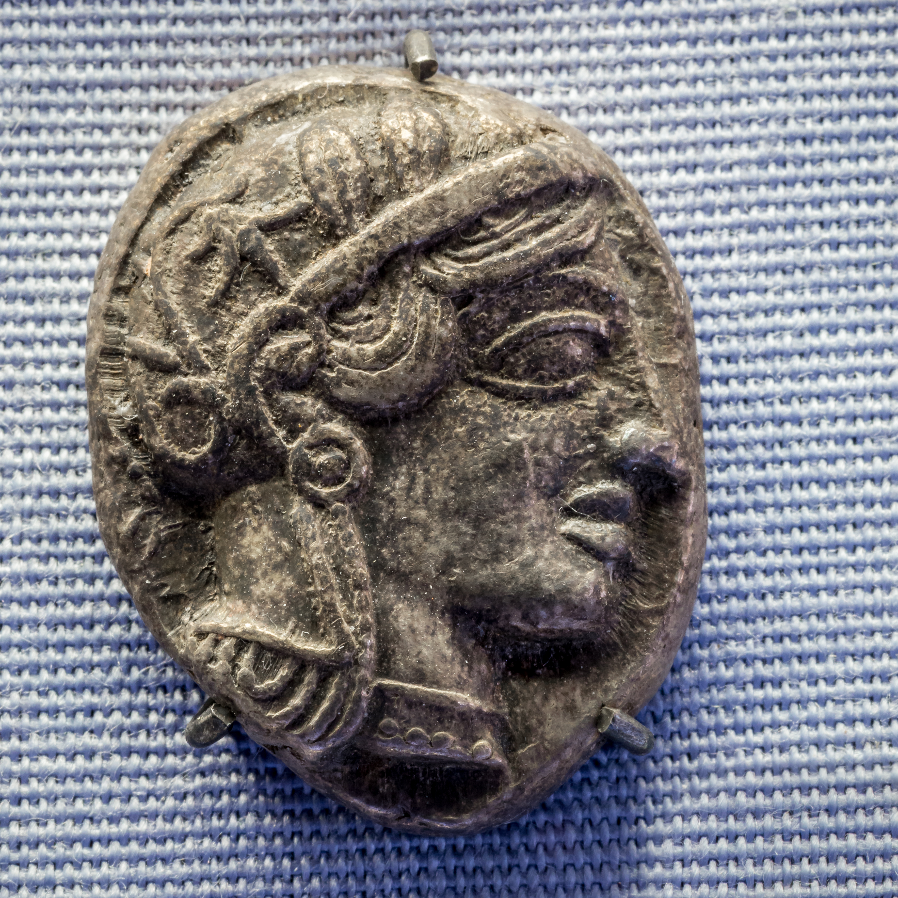
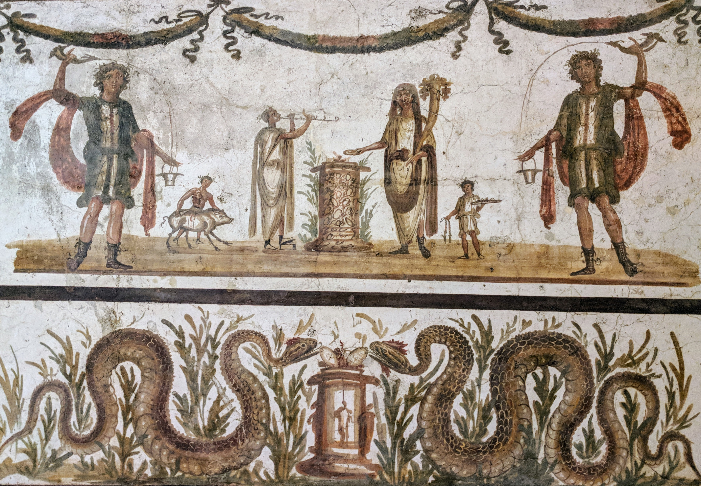
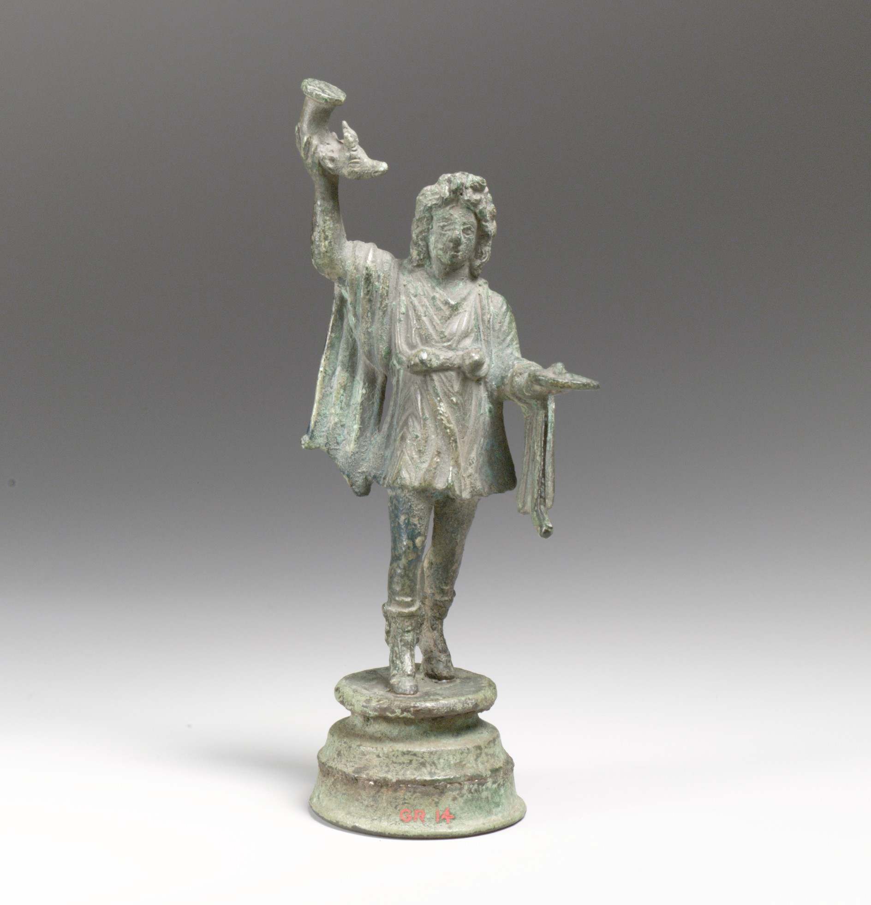
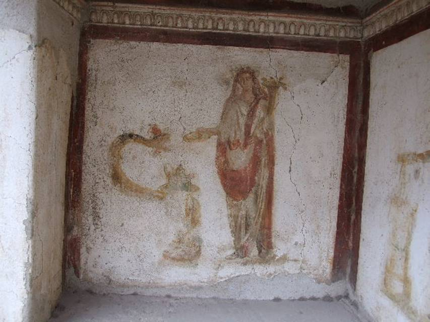
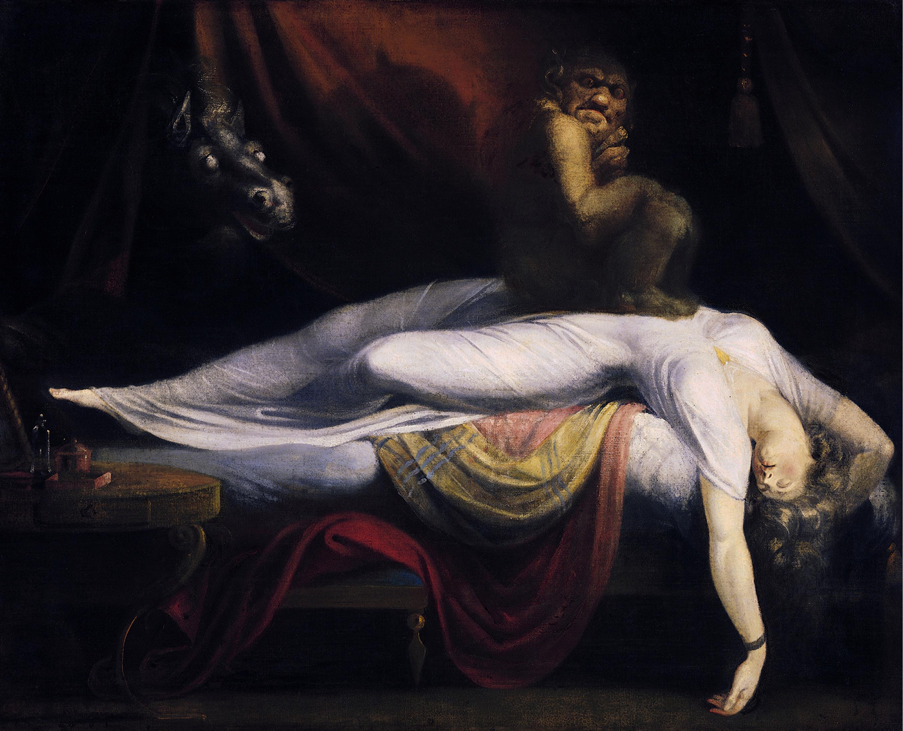
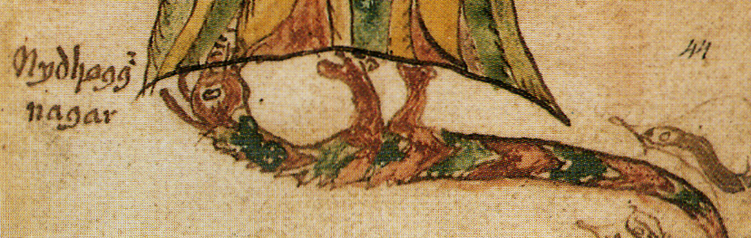
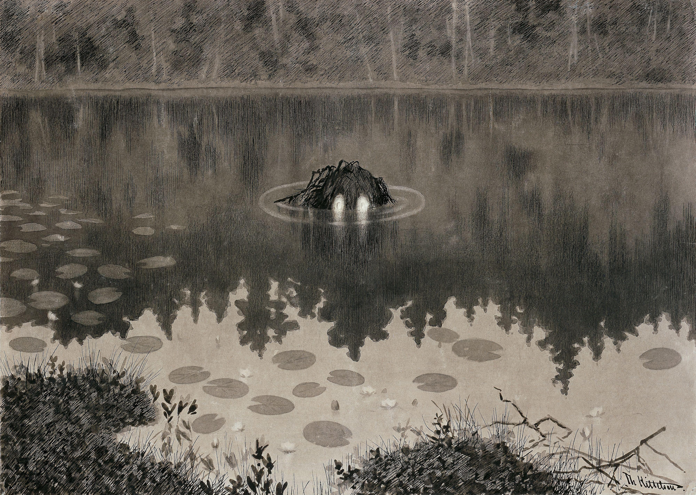

# Bestiary: Creatures of the Roman World

The world of 175 AD is not purely historical. It is a world where the gods are real, where the frontier between civilization and wilderness is also a frontier between the known and the deeply strange. This bestiary gives D&D 5e stat blocks for eight creatures drawn from Roman and Germanic mythology: entities the party may encounter, fight, bargain with, or fear.

Each entry includes the creature's historical origins, how it functions in the campaign, and tactical notes for the DM. These are not interchangeable monsters that differ only in hit points. Each creature fights the way its real-world analogue behaves: with specific triggers, retreat conditions, preferred terrain, and exploitable weaknesses. Know those, and the encounter has shape. Ignore them, and you have a dice-rolling session.

## Roman Creatures

### Strix

{fig-alt="Silver coin showing an owl, the symbol of Athena-Minerva" width="340px"}

*The old women know the name. When a child dies in the night without cause, when a man wakes with no blood in his face and no memory of his dreams; they blame the strix. It came through the window. It took what it needed and left before dawn.*

**Historical Origins:** The strix (pl. *striges*) was one of Rome's most feared nocturnal creatures: a blood-drinking bird of ill omen, described by Ovid, Petronius, and Pliny. It could take the form of a screech owl or a humanoid woman. It flew at night and sought the blood of infants and sleeping adults. The strix was ancient when Rome was young; the Greek *strígx* is older still.

**In the Campaign:** A strix nest near a military fort explains the unaccountable deaths of sentries (see Chapter 2 hooks). A cult of Mars might keep striges as consecrated hunters, releasing them against enemies. A single strix following the party could be a divine message from Mars, or simply a predator drawn to blood.

::: {.callout-note appearance="minimal"}
**STRIX**
*Small fiend, chaotic evil*

**Armor Class** 13 (natural armor) | **Hit Points** 58 (13d6 + 13) | **Speed** 10 ft., fly 60 ft.

| STR | DEX | CON | INT | WIS | CHA |
|:---:|:---:|:---:|:---:|:---:|:---:|
| 8 (−1) | 18 (+4) | 12 (+1) | 6 (−2) | 16 (+3) | 12 (+1) |

**Skills** Perception +5, Stealth +8
**Senses** Blindsight 60 ft., Darkvision 120 ft., passive Perception 15
**Languages** --
**Challenge** 4 (1,100 XP) | **Proficiency Bonus** +2

**Blood Scent.** The strix can detect blood within 60 feet. It has advantage on Perception checks against any creature that is bleeding.

**Flyby.** The strix doesn't provoke opportunity attacks when it flies out of a creature's reach.

**Hunts by Sound.** The strix does not rely on sight to locate prey. It can pinpoint the location of any creature it can hear within 60 feet, regardless of darkness, invisibility, or cover. Its Blindsight functions even in total silence by detecting breath and heartbeat.

**Ill Omen.** The first time a creature sees a strix in a given night, and only if the strix has not yet taken any damage, it must succeed on a DC 13 Wisdom saving throw or be frightened until the start of its next turn. The strix watches its prey before it strikes. It will not reveal itself while wounded.

**Light Seeker.** The strix prioritizes attacks on creatures carrying a lit torch, lantern, or active spell light. It will redirect its attack to the light source on any round a lit object is present, treating that creature as its primary target. It regards spellcasters as the most dangerous prey and targets them first if no light source is present.

**Sunlight Sensitivity.** In sunlight, the strix has disadvantage on attack rolls and Wisdom (Perception) checks relying on sight.

***ACTIONS***

**Multiattack.** The strix makes two attacks: one with its talons and one with its bite.

**Talons.** *Melee Weapon Attack:* +6 to hit, reach 5 ft., one target. *Hit:* 11 (2d6 + 4) slashing damage.

**Bite.** *Melee Weapon Attack:* +6 to hit, reach 5 ft., one target. *Hit:* 8 (1d8 + 4) piercing damage.

**Blood Drain (Recharge 5--6).** *Melee Weapon Attack:* +6 to hit, reach 5 ft., one target. *Hit:* 7 (1d6 + 4) piercing damage and the strix attaches to the target. While attached, the strix deals 7 (1d6 + 4) necrotic damage at the start of each of its turns. A creature can use its action to pull the strix free (DC 13 Strength check).

***BONUS ACTIONS***

**Strike and Withdraw.** Immediately after making a melee attack, the strix can move up to its full fly speed without provoking opportunity attacks. It uses this every round unless cornered. It will not stay in melee range between turns.

***DM NOTES***

> The strix does not fight. It harvests. It will never remain in melee for more than one round. After each attack, it withdraws to the tree line or ceiling and reassesses. The moment it takes any damage, it disengages completely and does not return until the party sleeps. Use it in pairs: one draws attention, one feeds. A strix that screams (DC 12 Perception, audible 300 feet) has already decided the target is not worth finishing tonight.

**Tactical principle:** The party's best counters are sustained light (it will not approach an area bathed in firelight), iron bells (it hunts by sound and the clanging disorients its Blindsight), and watch rotations. A party that never sleeps in total darkness will never be fed upon. A party that dismisses the first attack and sleeps normally will have one member drained by dawn.

**Adventure hooks:** Soldiers finding drained corpses; a captured strix that can be coerced into tracking another creature by smell; a strix nesting in the fort's grain stores, drawn by the smell of slaughtered animals.
:::

### Lemur

{fig-alt="Roman fresco showing two dancing Lares spirits flanking a sacrifice scene, with serpents below" width="480px"}

*During Lemuria, in the cold of May, the head of each household rises at midnight. He walks barefoot through the dark rooms, his thumb folded between his fingers to ward off evil, throwing black beans over his shoulder without looking back. Nine times he says: "These I cast; with these beans I redeem me and mine." The lemures gather the beans. They are satisfied. They leave.*

*Sometimes they don't leave.*

**Historical Origins:** The *lemures* (singular: *lemur*) were the restless spirits of the Roman dead: specifically those who had died violently, without proper burial, or while still bound by unresolved obligations. The festival of *Lemuria* (May 9, 11, and 13) was dedicated to appeasing them. Unlike the honored *manes* (ancestors properly mourned), lemures were considered malevolent presences.

**In the Campaign:** The dead of the frontier battles don't always stay dead. Unburied soldiers, Germanic warriors slain without proper rites, massacre victims from Chapter 1: all are potential lemures. A wise party learns to bury their dead properly. A party that doesn't may find old friends among the midnight visitors.

::: {.callout-note appearance="minimal"}
**LEMUR**
*Small undead, chaotic neutral*

**Armor Class** 12 | **Hit Points** 32 (7d6 + 7) | **Speed** 0 ft., fly 30 ft. (hover)

| STR | DEX | CON | INT | WIS | CHA |
|:---:|:---:|:---:|:---:|:---:|:---:|
| 7 (−2) | 14 (+2) | 12 (+1) | 4 (−3) | 12 (+1) | 8 (−1) |

**Damage Resistances** acid, fire, lightning, thunder; bludgeoning, piercing, and slashing from nonmagical attacks
**Damage Immunities** cold, necrotic, poison
**Condition Immunities** charmed, exhaustion, frightened, grappled, paralyzed, petrified, poisoned, prone, restrained
**Senses** Darkvision 60 ft., passive Perception 11
**Languages** Understands the languages it knew in life; cannot speak
**Challenge** 1 (200 XP) | **Proficiency Bonus** +2

**Incorporeal Movement.** The lemur can move through creatures and objects as if they were difficult terrain. It takes 5 (1d10) force damage if it ends its turn inside an object.

**Grave Cluster.** A lemur within 30 feet of an unburied corpse or disturbed burial object is not disoriented. A solitary lemur with no nearby dead makes all attack rolls at disadvantage: it cannot locate itself without the anchor of death. Groups of three or more lemures share a collective awareness and do not suffer this penalty.

**Scatter.** When a lemur is reduced to 0 HP, all lemures within 30 feet must succeed on a DC 12 Wisdom saving throw or be incapacitated until the end of their next turn, hovering in place as if confused. They do not flee; they simply stop.

**Dishonored Rest.** A lemur that drops to 0 HP reforms at its location of death after 24 hours. This happens twice. On the third destruction, the lemur does not reform: its persistence is broken. However, if its mortal remains are buried with proper funerary rites at any point (at least 10 minutes of ceremony and a DC 10 Religion check), it does not reform at all and is permanently at rest. A *bless* spell cast over the remains allows the Religion check automatically.

**Provoked Only.** A lemur will not attack a living creature unless that creature physically disturbs a grave, moves or handles a burial object, or damages another lemur within its awareness. They are not predators. They are interrupted.

**Lemuria Compulsion.** During the three nights of Lemuria (historically May, but the GM may move this), lemures cannot willingly remain more than 30 feet from a living creature.

***ACTIONS***

**Draining Touch.** *Melee Weapon Attack:* +4 to hit, reach 5 ft., one creature. *Hit:* 5 (1d6 + 2) psychic damage. The target must succeed on a DC 12 Constitution saving throw or gain one level of exhaustion (maximum 1 from this ability, recovered on a long rest).

***DM NOTES***

> Do not describe lemures as aggressive. They are confused and grieving. They attack because the party is in the wrong place, not because they are evil. The sound to use is not a shriek: it is a low, persistent moan, like a man calling a name he no longer remembers. If the party stops moving and holds still, a lemur will often drift past them without engaging. They are looking for something specific, and most living people are not it.

**Tactical principle:** Lemures are environmental pressure, not combatants. A battlefield left uncleared becomes haunted within a week. The right counter is burial, not combat: one lemur destroyed creates three rounds of chaos among its cluster. Destroying all of them without burying the dead just means they return tomorrow.

**Adventure hooks:** The party must bury fallen enemies (not just allies) to prevent a haunting; a lemur wearing the face of someone the party killed by accident; a fort commander demanding the party deal with the apparitions his men are seeing on the walls at night.
:::

### Larvae

{fig-alt="Bronze statuette of a dancing Roman Lar household god" width="280px"}

*The lemur is ignorance. The larva is memory. It knows what it was. It knows what was done to it. It has thought about nothing else since.*

**Historical Origins:** *Larvae* (singular: *larva*) were the most malevolent form of the Roman dead: spirits of those whose wickedness in life condemned them, or whose deaths were so violent and shameful that transformation into something evil followed naturally. They were the dark reflection of the *Lares*, the household gods. The word *larva* also meant "mask": the creature wore the face of a person but was no longer one.

**In the Campaign:** A larva might be a senator's assassinated predecessor, seeking revenge. A disgraced soldier executed without trial. A Germanic shaman killed by treachery. They remember the faces of those who wronged them, and they look for those faces in the living.

::: {.callout-note appearance="minimal"}
**LARVAE**
*Medium undead, chaotic evil*

**Armor Class** 14 | **Hit Points** 91 (14d8 + 28) | **Speed** 0 ft., fly 40 ft. (hover)

| STR | DEX | CON | INT | WIS | CHA |
|:---:|:---:|:---:|:---:|:---:|:---:|
| 10 (+0) | 18 (+4) | 14 (+2) | 10 (+0) | 12 (+1) | 18 (+4) |

**Skills** Perception +3, Stealth +6
**Damage Resistances** acid, fire, lightning, thunder; bludgeoning, piercing, and slashing from nonmagical attacks
**Damage Immunities** cold, necrotic, poison
**Condition Immunities** charmed, exhaustion, frightened, grappled, paralyzed, petrified, poisoned, prone, restrained
**Senses** Darkvision 60 ft., passive Perception 13
**Languages** The languages it knew in life
**Challenge** 5 (1,800 XP) | **Proficiency Bonus** +3

**Incorporeal Movement.** The larvae can move through creatures and objects as if they were difficult terrain. It takes 5 (1d10) force damage if it ends its turn inside an object.

**Mask of the Familiar.** At the start of each encounter, the larvae chooses a face from someone the primary target has wronged (DM selects, based on session history). This face is worn until the larvae drops below half HP. The target must succeed on a DC 15 Insight check to recognize the face as a mask rather than the person. While the face is worn and unrecognized, the target has disadvantage on all saving throws against the larvae's abilities.

**Cycling Faces.** When the larvae drops below half HP, the mask changes each round. It cycles through other faces it has observed in the target's memory, searching for the one that produces a reaction. The DM should watch for player response and describe the larvae slowing when it finds the one that lands.

**Corrupting Presence.** Each creature that starts its turn within 5 feet of the larvae must succeed on a DC 13 Constitution saving throw or be poisoned until the start of its next turn.

**Threshold Reset.** When reduced below 20 HP, the larvae passes through the nearest solid surface (wall, floor, ceiling) using Incorporeal Movement and does not return until the start of its next turn. It does not flee the area: it resets. It re-enters combat on its next turn, face restored to its opening choice.

***ACTIONS***

**Multiattack.** The larvae makes two claw attacks.

**Corrupting Claw.** *Melee Weapon Attack:* +7 to hit, reach 5 ft., one target. *Hit:* 13 (2d8 + 4) psychic damage. The target must succeed on a DC 14 Wisdom saving throw or be frightened of the larvae until the end of its next turn.

**Horrific Visage (Recharge 5--6).** Each non-undead creature within 60 feet that can see the larvae must succeed on a DC 14 Wisdom saving throw or be frightened for 1 minute. A target can repeat the save at the end of each of its turns. On a success, the target is immune to this larvae's Horrific Visage for 24 hours.

***DM NOTES***

> Before running this creature, decide whose face it will wear first. The most devastating choice is always someone the player thought they had made peace with: not the obvious villain, not the dramatic death, but the one they stopped thinking about. The face that the larvae finds and then slows on is the one the player has not resolved. That is the encounter.

**Tactical principle:** The larvae resets rather than retreating. It will not leave the room. The correct answer to Threshold Reset is to burst it down through the threshold by focusing all damage before it dips below 20 HP, then chasing it through the wall if possible. A party that lets it reset repeatedly will face a creature that has now tried every face it knows.

**Adventure hooks:** A larvae wearing the face of a tribune the party exposed (but who was then executed); a larvae haunting the Senate chambers in Rome, wearing the mask of Brutus' predecessor; a larvae who can only be laid to rest if the truth of its murder is spoken aloud before witnesses.
:::

### Genius Loci

{fig-alt="Ancient Roman fresco showing a robed figure (genius) beside a serpent coiled around a round altar" width="380px"}

*The grove is older than the fort. The men who built the fort knew this. They left the central stand of oaks alone; they built around it, not through it. The Legate who built the new granary didn't know, or didn't care. He built through it.*

*The granary burned down six weeks later. No cause was found.*

**Historical Origins:** Every significant place in the Roman world had a *genius loci*: a guardian spirit embodying the essence of that location. Crossroads had their Lares compitales; springs had their nymphs; mountains their daemons; the city of Rome itself had its Genius Urbis. These spirits were propitiated with offerings and respected with behavior. The Romans were practical about this: you honored the spirit of the place because it could hurt you if you didn't.

**In the Campaign:** The sacred grove in Chapter 3 is home to a genius loci: the spirit of that specific forest. It is not evil. It is not good. It is territorial. The party's approach to the grove, their behavior within it, and their offering at the altar all affect how the genius loci responds. The spear of Mars has been degrading the genius loci's power, which is why Mars' influence is spreading.

::: {.callout-note appearance="minimal"}
**GENIUS LOCI**
*Large elemental, true neutral*

**Armor Class** 15 (natural armor) | **Hit Points** 78 (12d10 + 12) | **Speed** 30 ft., swim 30 ft.*

*\*Speed varies by location type: forest genius loci may have Climb 30 ft. instead; spring genius loci may have Burrow 20 ft.*

| STR | DEX | CON | INT | WIS | CHA |
|:---:|:---:|:---:|:---:|:---:|:---:|
| 16 (+3) | 14 (+2) | 13 (+1) | 12 (+1) | 18 (+4) | 14 (+2) |

**Skills** Nature +4, Perception +7
**Damage Resistances** bludgeoning, piercing, and slashing from nonmagical attacks
**Condition Immunities** charmed, frightened, paralyzed
**Senses** Darkvision 60 ft., tremorsense 120 ft. (within its territory only), passive Perception 17
**Languages** Understands all languages spoken in its territory; communicates through environmental signs
**Challenge** 4 (1,100 XP) | **Proficiency Bonus** +2

**Place Bound.** The genius loci cannot move more than 1 mile from the place it is bound to. If forced beyond this distance, it loses all traits and actions until it returns.

**Home Ground.** Within its bonded territory, the genius loci has advantage on all ability checks, saving throws, and attack rolls.

**Environmental Warning.** Before the genius loci takes any direct action against intruders, it communicates displeasure through the environment: temperature drops 10 degrees, nearby water reverses current, animals in the area flee or gather silently depending on whether they serve or fear the spirit. The DM should narrate at least two environmental shifts before the genius loci acts directly. It escalates. It does not ambush.

**Desecration Trigger.** The genius loci cannot initiate combat. It can only act against a creature that actively desecrates its site: cutting down marked trees, fouling a sacred spring, breaking ritual objects, defacing altar carvings. Entering the territory, even with weapons drawn, does not trigger it. Destruction triggers it.

**Compel Respect (First Action Only).** The first action the genius loci takes in any encounter is always Compel Respect, not an attack. It cannot waive this.

**Propitiation.** A creature that presents a suitable offering (worth 10 gp or more, or a living animal sacrifice) and succeeds on a DC 12 Religion check earns the genius loci's blessing: advantage on all checks and saves made within the territory for 24 hours.

***ACTIONS***

**Compel Respect.** Each creature within 30 feet that has taken a hostile action in this territory must succeed on a DC 14 Wisdom saving throw. On a failure, the creature must make a small, genuine offering (dropping a weapon, pouring out water, speaking a name of the dead) before it can take any hostile action against the spirit. This is not magical compulsion: the creature can refuse. But refusal means the genius loci now treats it as an active desecrator.

**Multiattack.** The genius loci makes two slam attacks.

**Slam.** *Melee Weapon Attack:* +5 to hit, reach 10 ft., one target. *Hit:* 12 (2d8 + 3) bludgeoning damage. The target must succeed on a DC 13 Strength saving throw or be pushed 10 feet away.

**Territorial Curse (Recharge 5--6).** All trespassers within 30 feet must succeed on a DC 14 Wisdom saving throw or take 22 (4d10) psychic damage and have disadvantage on all checks made within the territory for 24 hours. On a success: half damage, no disadvantage.

***REACTIONS***

**Guardian's Shield.** When a creature the genius loci has blessed would take damage, it can reduce that damage by 9 (2d8).

***DM NOTES***

> The genius loci is not a monster encounter. It is a negotiation that went wrong. If the party is attacking it, something has already failed: either the party ignored the environmental warnings, or the DM skipped them. Back up. Replay the moment where the temperature dropped and the birds went silent. Ask what the party does now. That is the encounter.

**Campaign use:** Chapter 3's sacred grove. The grove's genius loci is weakened by the corrupted spear and will not attack the party unprovoked: it wants help. If the party performs proper rites (the skill challenge), the genius loci becomes an ally rather than an obstacle.
:::

## Germanic Creatures

### Alp

{fig-alt="Dark Romantic painting showing a sleeping woman with a demon crouching on her chest and a horse's head peering from behind dark curtains" width="520px"}

*The warriors sleep. In the morning, Brego cannot lift his arm. He does not remember his dreams, only that they were very heavy. He has bruises across his chest. The woman in the next village is suspected. She was seen at dusk near the camp.*

*She was probably innocent. The alp rarely leaves evidence.*

**Historical Origins:** The *Alp* (pl. *Alpen*) was a Germanic nightmare spirit: a shapeshifter that entered sleeping spaces as mist or in animal form, sat on its victims' chests, and caused paralysis, suffocation, and terrifying dreams. It was associated with the *Mara* (the origin of "nightmare," from *mare*, the crushing night spirit) and the *Trude* (a witch who rides sleeping men to death). The alp was believed to be a spirit rather than a person, though it could temporarily possess a sleeping human.

**In the Campaign:** Germanic scouts use alps as weapons, releasing them into Roman camps to exhaust soldiers before a battle. A Roman camp with an alp problem will show signs: soldiers afraid to sleep, hollow-eyed, with unexplained bruising. The party might be hired to find it, or might simply start losing sleep themselves.

::: {.callout-note appearance="minimal"}
**ALP**
*Small fey, chaotic evil*

**Armor Class** 14 (natural armor) | **Hit Points** 65 (10d6 + 30) | **Speed** 30 ft.

| STR | DEX | CON | INT | WIS | CHA |
|:---:|:---:|:---:|:---:|:---:|:---:|
| 8 (−1) | 16 (+3) | 16 (+3) | 12 (+1) | 14 (+2) | 18 (+4) |

**Skills** Deception +6, Perception +4, Stealth +7
**Damage Immunities** psychic
**Condition Immunities** frightened
**Senses** Darkvision 60 ft., passive Perception 14
**Languages** Common; the language of any sleeping creature it observes for 1 minute
**Challenge** 4 (1,100 XP) | **Proficiency Bonus** +2

**Shapechanger.** The alp can use its action to polymorph into a Small or Medium humanoid, a bat, a cat, or back into its true form. Its statistics are the same in each form. Equipment it wears or carries doesn't transform.

**Silent Approach.** The alp makes no sound when it moves. It has advantage on all Stealth checks made in dim light or darkness. Creatures cannot detect it by hearing alone.

**Mist Form.** As a bonus action, the alp transforms into a thin mist, moving through any opening including keyholes. It cannot attack in mist form but is immune to all damage except from a spell or a weapon made of iron. The moment it takes any damage while in physical form, it immediately uses this ability as a reaction and retreats to the ceiling or nearest threshold.

**Sleep Stalker.** The alp exclusively targets sleeping creatures when it first enters a space. If all creatures in the space are awake, it will not enter. It waits. It is patient.

**Dream Entry.** The alp can enter the dreams of a sleeping creature within 5 feet. While in the dream, it is invisible and untargetable, but it can shape the dream's content. A creature can make a DC 14 Wisdom saving throw when it wakes to remember seeing the alp's true form.

**Returning Threat.** If the alp is driven off without being destroyed, it returns the following night unless cold iron is placed at every threshold of the sleeping space (every door and window). A space with one unprotected threshold is treated as open. The alp notices gaps and uses them.

***ACTIONS***

**Multiattack.** The alp makes two claw attacks.

**Claw.** *Melee Weapon Attack:* +5 to hit, reach 5 ft., one target. *Hit:* 8 (2d4 + 3) slashing damage.

**Sleep Paralysis (Recharge 5--6).** The alp presses down on a sleeping or incapacitated creature's chest. The target must succeed on a DC 14 Constitution saving throw or be paralyzed until it takes damage or an ally spends an action to physically shake it awake. While paralyzed this way, the target takes 7 (2d6) psychic damage at the start of each of its turns from nightmare visions. The save DC is 14, not adjustable by resistance.

**Nightmare (1/Day).** The alp enters the dream of a sleeping creature within 5 feet and twists it. The target must succeed on a DC 14 Wisdom saving throw when it wakes or take 14 (4d6) psychic damage and gain no benefit from the rest.

***DM NOTES***

> The alp is most dangerous across multiple nights. It does not kill in one visit: it weakens. A party that dismisses the first attack will face a second with one member already exhausted. The third night, two members are exhausted. By the fourth, the party is making poor decisions in an unrelated encounter. That is the alp's actual damage.

**Tactical principle:** The counter to an alp is iron at every threshold and a guard rotation that keeps at least one person awake. Cold iron costs nothing if the party thinks to ask for it. If they don't think to ask, they deserve the problem. Germanic NPCs who respect the party will mention it once. They will not repeat it.

**Iron weakness:** The alp cannot enter a space containing iron (including a closed iron lock on a door) without succeeding on a DC 13 Wisdom saving throw. This is why frontier soldiers sometimes sleep with an iron nail in their palm.
:::

### Draugar

{fig-alt="Dark illustration of a Norse draugr undead warrior emerging from darkness" width="480px"}

*They buried Haakon with his sword. The sword was a good one. When the Marcomanni dug up the barrow to take it, Haakon came with it.*

*They found three of the men the next morning. The other two were never found.*

**Historical Origins:** The *draugr* (pl. *draugar*) was one of the most feared creatures of Germanic and Norse belief: a corpse that rose from its burial mound to protect its grave goods, haunt its enemies, or simply spread death. Unlike a mere ghost, the draugr was physical: it could be grappled, bled, and smelled. It retained the cunning and personality of the living person, magnified into obsession. The greedy became jealous; the violent became murderous; the proud became monstrous.

**In the Campaign:** The Germanic frontier has many old burial mounds. Disturbing them, even accidentally during a march, risks waking what's inside. A draugar might also be raised deliberately by a Germanic shaman to guard a sacred site.

::: {.callout-note appearance="minimal"}
**DRAUGAR**
*Medium undead, chaotic evil*

**Armor Class** 14 (natural armor) | **Hit Points** 119 (14d8 + 56) | **Speed** 30 ft.

| STR | DEX | CON | INT | WIS | CHA |
|:---:|:---:|:---:|:---:|:---:|:---:|
| 20 (+5) | 10 (+0) | 18 (+4) | 10 (+0) | 10 (+0) | 7 (−2) |

**Saving Throws** STR +8, CON +7
**Skills** Athletics +8, Perception +3
**Damage Immunities** poison
**Condition Immunities** exhaustion, poisoned
**Senses** Darkvision 60 ft., passive Perception 13
**Languages** The languages it knew in life
**Challenge** 6 (2,300 XP) | **Proficiency Bonus** +3

**Grave Stench.** Each creature that starts its turn within 5 feet of the draugar must succeed on a DC 13 Constitution saving throw or be poisoned until the start of its next turn.

**Undead Fortitude.** If damage reduces the draugar to 0 HP, it must make a Constitution saving throw (DC 5 + damage taken), unless the damage is radiant or from a critical hit. On a success, the draugar drops to 1 HP instead.

**Barrow Lord.** Within 30 feet of the mound it was buried in, the draugar has advantage on all saving throws, and its attacks deal an extra 4 (1d8) necrotic damage.

**Territorial Anchor.** The draugar will not pursue any creature beyond 100 feet from its barrow under any circumstances. It stops at that radius, watches, and returns to the mound entrance. It will wait there indefinitely. This is not cowardice: it is the boundary of what it is still protecting.

**Grave Goods Throw.** Before closing to melee, the draugar hurls grave goods (burial urns, iron tools, shields) at enemies within 30 feet. *Ranged Attack:* +8 to hit, one target. *Hit:* 14 (2d8 + 5) bludgeoning damage. The draugar uses this on its first turn of combat if any enemy is beyond 10 feet.

**Swelling Rage.** When the draugar is reduced to 60 HP or fewer (not when first bloodied), it immediately grows to Large size (if it isn't already) until the start of its next turn. While Large, it may make one additional slam attack as part of its Multiattack. This triggers earlier than most creatures expect: the draugar becomes more dangerous before the party thinks it should.

**Earth Memory.** The smell of fresh-turned earth (DC 12 Nature check to know this) causes the draugar to hesitate for 1 round: it stops moving, tilts its head, and does not attack. It is remembering burial. A character who knows this can use an action to scatter a handful of fresh earth to buy one round of inaction.

***ACTIONS***

**Multiattack.** The draugar makes two attacks.

**Greatclub.** *Melee Weapon Attack:* +8 to hit, reach 5 ft., one target. *Hit:* 18 (3d8 + 5) bludgeoning damage.

**Crushing Grip (Recharge 5--6).** The draugar grabs a creature within 5 feet (escape DC 16). At the start of each of the draugar's turns, a grabbed creature takes 18 (4d8) bludgeoning damage and must succeed on a DC 15 Strength saving throw or fall prone.

***DM NOTES***

> The draugar is a terrain encounter as much as a combat encounter. The party that lures it to the edge of its territory and then crosses the line wins. The party that fights it in the barrow does not. Make the 100-foot radius visible: describe the draugar stopping at the treeline, standing there watching, then turning back. The party should understand the rule before they need it.

**Tactical principle:** Earth Memory is a real counter. A party that learns it early (from Germanic NPCs, from a Nature check, or from trying it accidentally) gains a significant advantage. The decapitation coup de grâce (against a prone draugar) bypasses Undead Fortitude. A Germanic NPC who respects the party will share this if pressed.

**Ending the threat:** A draugar is permanently destroyed only if its burial mound is purified (religious ceremony, DC 15 Religion check) or its remains burned and the ash scattered. Killing it in combat delays the problem by a week.
:::

### Lindworm

{fig-alt="Illustration of Nidhogg, a serpentine Norse dragon coiled around the roots of the world tree" width="460px"}

*It is not a Roman dragon. Rome's dragons are serpents, emblems of legions, carved in bronze. This is something older. It came out of the Hercynian Forest, where the trees have never been cut, and it is the forest given hunger and a body.*

**Historical Origins:** The *lindworm* (sometimes *lindwurm*) was a serpentine dragon found throughout Germanic, Scandinavian, and Frankish tradition: a wingless wyrm of enormous size with vestigial forelimbs, a venomous bite or breath, and the mindless hunger of a natural predator. Unlike the classical dragon, the lindworm was not a hoarder or a speaker. It was a force of nature. In some tales it could be bargained with or transformed; in most, it could only be fought or fled.

**In the Campaign:** A lindworm is a Session 3 or 4 encounter at the extreme end: appropriate if the party has survived everything else and you want a true test before the final session. It might be protecting the sacred grove, drawn there by Mars' energy, or simply a creature from deep in the Hercynian that followed the sound of war.

::: {.callout-note appearance="minimal"}
**LINDWORM**
*Huge dragon, chaotic evil*

**Armor Class** 17 (natural armor) | **Hit Points** 207 (18d12 + 90) | **Speed** 40 ft., swim 60 ft., burrow 20 ft.

| STR | DEX | CON | INT | WIS | CHA |
|:---:|:---:|:---:|:---:|:---:|:---:|
| 22 (+6) | 10 (+0) | 20 (+5) | 6 (−2) | 12 (+1) | 7 (−2) |

**Saving Throws** STR +10, CON +9, WIS +5
**Skills** Athletics +10, Perception +5, Stealth +4
**Damage Immunities** poison
**Condition Immunities** poisoned
**Senses** Blindsight 30 ft., Darkvision 120 ft., passive Perception 15
**Languages** --
**Challenge** 10 (5,900 XP) | **Proficiency Bonus** +4

**Water Lair.** The lindworm guards a specific water source (a river bend, a deep pool, a subterranean lake) and is never found more than 1 mile from it. Pulling it away from water requires something it wants more than the water: a large, warm prey animal, or a threat to its immediate nest site.

**Serpentine Body.** The lindworm can occupy another creature's space and vice versa. When it moves through a space occupied by a creature, that creature must succeed on a DC 17 Strength saving throw or be knocked prone. As a bonus action, the lindworm can coil around a terrain feature (a large tree, a boulder, an overturned cart), granting itself three-quarters cover (+5 AC) from one direction of its choice. It must be adjacent to the terrain feature to use this.

**Amphibious.** The lindworm can breathe both air and water. While partially or fully submerged, it moves at full speed and has advantage on all ability checks and saving throws. It will retreat into water the moment it drops below 50 HP.

**Breath Economy.** The lindworm uses Poison Breath only when 3 or more creatures are within a 15-foot cone. It will spend its movement to reposition until this condition is met before breathing. It will not waste the breath on a single target.

**Legendary Resistance (2/Day).** If the lindworm fails a saving throw, it can choose to succeed instead.

***ACTIONS***

**Multiattack.** The lindworm makes one bite attack and one constrict attack, or uses Poison Breath.

**Bite.** *Melee Weapon Attack:* +10 to hit, reach 10 ft., one target. *Hit:* 24 (4d8 + 6) piercing damage. The target must succeed on a DC 17 Constitution saving throw or take 14 (4d6) poison damage and be poisoned for 1 hour.

**Constrict.** *Melee Weapon Attack:* +10 to hit, reach 5 ft., one Large or smaller creature. *Hit:* 20 (4d6 + 6) bludgeoning damage and the target is grappled (escape DC 18). Until this grapple ends, the creature is restrained, and the lindworm can't constrict another target.

**Poison Breath (Recharge 5--6).** The lindworm exhales poisonous gas in a 30-foot cone. Each creature in that area must succeed on a DC 17 Constitution saving throw or take 42 (12d6) poison damage and be blinded and poisoned for 1 minute. On a success: half damage, no condition.

***DM NOTES***

> The lindworm chooses its ground. If the party fights it at the water's edge, they are fighting on its terms. It will retreat into water when below 50 HP and must be followed to finish the encounter: it moves at full speed in water and has advantage on everything there. The correct tactical answer is fire and high ground. It cannot follow smoke uphill, and it will not leave water to pursue. A party that lures it onto dry elevated terrain and lights the underbrush behind it has found the only engagement condition where they have the advantage.

**Tactical principle:** Tell the party about the 50 HP retreat threshold through prior encounters: a Germanic hunter who survived by climbing, a drowned soldier found two miles from the river's edge with no explanation. They should go in knowing the lindworm finishes fights in water if it can.

**Encounter design:** A lindworm alone is a deadly encounter for a level 7--8 party. Pair it with terrain hazards rather than additional monsters. Let it be a boss, not part of a mob.
:::

### Nix

{fig-alt="Dark Norwegian illustration showing a mysterious creature partially submerged in dark water among reeds" width="480px"}

*The Rhine speaks all languages. This is common knowledge among the soldiers. You can hear it muttering at night, below the sound of the current. The men who have been here long enough learn not to listen too carefully.*

*A century ago, the legions under Varus crossed the Rhine without making any offering at all.*

**Historical Origins:** The *Nix* (pl. *Nixen*, also *Nix*, *Nixe*, *Neck*, *Nokken*) was a shapeshifting water spirit found throughout Germanic, Norse, and later German folklore. It could appear as a beautiful human, a horse, a serpent, or simply as the water itself. Its purpose was always the same: lure the living into its element and drown them. The nix was not purely malevolent; in some traditions it could be propitiated with offerings, and it could be bound to a place by a promise. But its fundamental nature was predatory.

**In the Campaign:** The Rhine is the party's boundary between Roman territory and the Germanic lands (Chapters 2--3). A nix in the river can slow a crossing, pick off isolated soldiers, or serve as an information source: it has been watching the river for centuries and knows who crosses it and when. Vercingetorix's tribe has a relationship with the local nix; they know its name, and they've paid for that knowledge.

::: {.callout-note appearance="minimal"}
**NIX**
*Medium fey, neutral evil*

**Armor Class** 13 (natural armor) | **Hit Points** 91 (14d8 + 28) | **Speed** 30 ft., swim 60 ft.

| STR | DEX | CON | INT | WIS | CHA |
|:---:|:---:|:---:|:---:|:---:|:---:|
| 14 (+2) | 16 (+3) | 14 (+2) | 16 (+3) | 14 (+2) | 20 (+5) |

**Skills** Deception +8, Insight +5, Perception +5, Performance +8, Stealth +6
**Senses** Darkvision 60 ft., passive Perception 15
**Languages** Aquan, Common, Sylvan
**Challenge** 5 (1,800 XP) | **Proficiency Bonus** +3

**Amphibious.** The nix can breathe both air and water.

**Shapechanger.** The nix can use its action to polymorph into a Medium humanoid, a Large horse, or a Large serpent, or back into its true form. Its statistics are the same in each form. Its true form has iridescent scales and webbed hands.

**Disguised Approach.** The nix always begins an encounter in a non-threatening form: a lost traveler on the road, a beautiful stranger watching from the bank, an injured child sitting in shallow water, a horse standing still at a ford. It will not engage in combat until its disguise is broken or until it decides to reveal itself.

**River Bound.** Within 1 mile of the river or lake it is bound to, the nix has advantage on all ability checks and saving throws, and regains 10 HP at the start of each of its turns while partially submerged.

**Unearthly Beauty.** Any humanoid that starts its turn within 30 feet of the nix in its humanoid form and can see it must succeed on a DC 15 Wisdom saving throw or be charmed for 1 minute. The charmed creature uses its movement to approach the nix by the most direct route. The effect ends if the charmed creature takes damage. If the target interacted with the nix's disguise for more than 10 minutes before the reveal, this save is made at disadvantage: trust was built, and trust is the real weapon.

**Chosen Target.** Before the session begins, the DM selects the character the nix will target with its Drowning Song. The selection is based on which character carries the most unresolved emotional stake in the current session: the one who has the most to lose, the most to grieve, or the most to want. A nix that targets randomly is just a monster. A nix that targets correctly is a mirror.

***ACTIONS***

**Multiattack.** The nix makes two claw attacks.

**Claw.** *Melee Weapon Attack:* +5 to hit, reach 5 ft., one target. *Hit:* 9 (2d6 + 2) slashing damage.

**Drowning Song (Recharge 5--6, Concentration up to 1 minute).** The nix sings. This ability functions only within 60 feet of a body of water large enough to drown in. The nix targets the Chosen Target specifically. That creature must succeed on a DC 16 Wisdom saving throw or be compelled to move toward the nearest body of water, using all movement each turn. Once in water, the creature cannot willingly swim to the surface while charmed: it believes it is safe, that it is going somewhere it has always wanted to go. All other creatures within 60 feet who can hear the song must also save (DC 16 Wisdom) or be charmed to approach the water, though they are not the primary target and can attempt the save again at the end of each turn. The Chosen Target repeats its save only at the end of each turn at disadvantage.

**Horrific Revelation (1/Day).** When the nix's disguise is broken or when it chooses to reveal its true form, every creature within 30 feet that has seen the disguise for longer than 1 minute must succeed on a DC 15 Wisdom saving throw or be frightened for 1 minute. This represents the specific horror of realizing that the thing you trusted was never what you thought.

***REACTIONS***

**River Drag.** When a creature enters the water within 30 feet of the nix, it can use its reaction to make a grapple attempt against that creature (+5 to hit). A grappled creature begins drowning immediately.

***DM NOTES***

> Decide before the session which character the nix will target and why. Its song works because it knows what you want. A soldier who misses his family hears his children's voices in the water. A soldier who fears death hears the sound of safety. The nix does not need to know this consciously: it reads what the river reads, and the river has seen everyone who crossed it. Run the disguise phase long enough that the player relaxes. The reveal is worse when they liked the person first.

**Tactical principle:** The counter to a nix is preparation. A party forewarned (by Germanic guides, by the presence of a tribe that knows its name) can set watch on whoever is most vulnerable and physically restrain them during a river crossing. The nix does not like fights on dry ground and will retreat fully into water if more than two enemies engage it away from the bank.

**Propitiation:** A nix can be bargained with. If offered a gift worth 25 gp or more (thrown into the river), it will allow safe crossing for one hour. If offered the name of its intended victim instead (a named enemy the party wants dead), it may agree to hunt that person instead. The nix keeps its agreements exactly once.
:::

## Bestiary Quick Reference

| Creature | CR | Type | Habitat | Combat Role |
|---|---|---|---|---|
| **Strix** | 4 | Fiend | Night, military camps | Strike-and-withdraw; targets light sources |
| **Lemur** | 1 | Undead | Battlefields, unburied dead | Provoked only; cluster mechanics; bury to end |
| **Larvae** | 5 | Undead | Scenes of murder/betrayal | Mask cycling; threshold reset; psychological |
| **Genius Loci** | 4 | Elemental | Sacred sites | Negotiation target; desecration required to fight |
| **Alp** | 4 | Fey | Military camps, sleeping areas | Multi-night attrition; iron thresholds counter |
| **Draugar** | 6 | Undead | Burial mounds | Terrain fight; lure to boundary; decapitate |
| **Lindworm** | 10 | Dragon | Rivers, deep forest | Boss encounter; retreats to water at 50 HP |
| **Nix** | 5 | Fey | Rivers, lakes | Disguise approach; chosen target; river drag |

## Tactical Summary Card

| Creature | CR | Ambush Trigger | Retreat Condition | Terrain Preference | One Counter-Tactic |
|---|---|---|---|---|---|
| **Strix** | 4 | Party sleeps in darkness; light source visible | Takes any damage | Tree line, rooftops, high ceilings | Sustained firelight; iron bells on the perimeter |
| **Lemur** | 1 | Grave or burial object disturbed by living creature | Will not retreat; scatters when one is destroyed | Battlefields, uncleared dead | Bury the dead; black beans during Lemuria |
| **Larvae** | 5 | Enters at full HP wearing the primary target's face | Passes through a surface below 20 HP; resets, does not flee | Enclosed spaces with history of betrayal | Burst it below 20 HP without letting it reset; chase through the wall |
| **Genius Loci** | 4 | Active desecration of its site (not mere entry) | Will not retreat; this is its only place | Sacred groves, active springs, marked sites | Propitiate before desecrating; the first action is always Compel Respect |
| **Alp** | 4 | All creatures in the space are asleep | Takes any damage (reacts with Mist Form immediately) | Sleeping quarters, closed rooms, barracks | Iron at every threshold; keep a rotating guard |
| **Draugar** | 6 | Grave goods disturbed; intruder within barrow | Will not pursue beyond 100 ft from barrow | Its own burial mound and immediate approaches | Lure it to the 100 ft boundary; fight on open ground, not inside the mound |
| **Lindworm** | 10 | Any warm creature within 60 ft of its water source | Retreats into water below 50 HP; must be followed | River bends, deep forest pools, lair approaches | Fire and high ground; deny the water retreat |
| **Nix** | 5 | Disguise broken, or it decides to reveal | Retreats fully into water if engaged away from the bank | River crossings, lake shores, fords | Know its name before crossing; tie down the Chosen Target |

### Propitiation Table

Most of these creatures can be avoided or bargained with. The campaign rewards players who think like Romans: approach the supernatural with respect, make the appropriate offering, and be specific about what you're asking for.

| Creature | What it accepts | What it won't accept |
|---|---|---|
| Strix | Blood (cannot be propitiated; only repelled by sustained light) | N/A |
| Lemur | Proper burial of its remains; black beans during *Lemuria* | Exorcism without burial |
| Larvae | Truth spoken aloud about its death; justice achieved | Lies; denial; half-truths |
| Genius Loci | Wine, incense, or sacrifice at its altar; DC 12 Religion | Trespass after the environmental warnings; desecration |
| Alp | Cold iron placed at every threshold (repels; does not propitiate) | Being ignored; one threshold left unguarded |
| Draugar | Return of its grave goods; purification of its mound | Half-measures; burial without the decapitation rite |
| Lindworm | Cannot be propitiated (only fought, fled, or trapped) | N/A |
| Nix | Gifts thrown into water (25 gp or more); a named victim offered as trade | Empty-handed petitioners; broken agreements |
