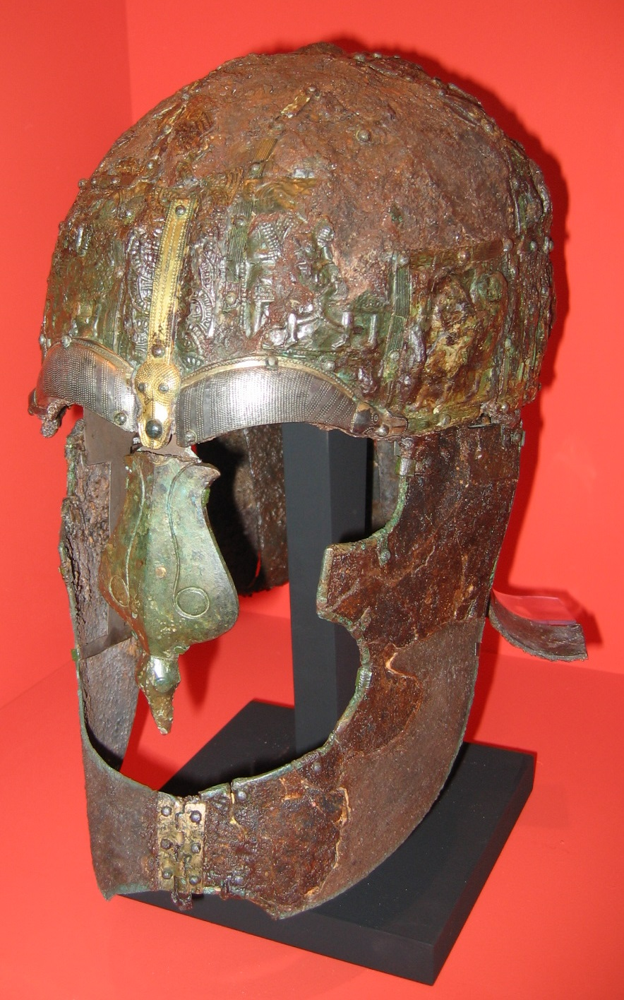
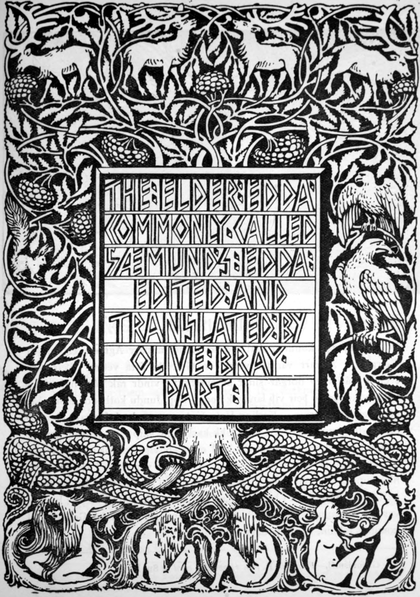
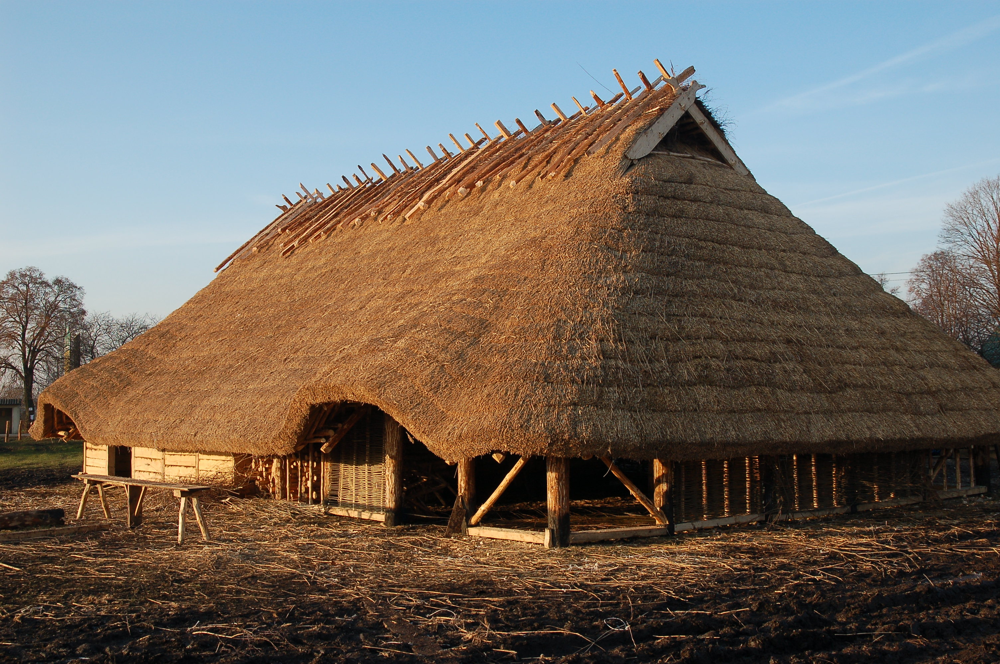
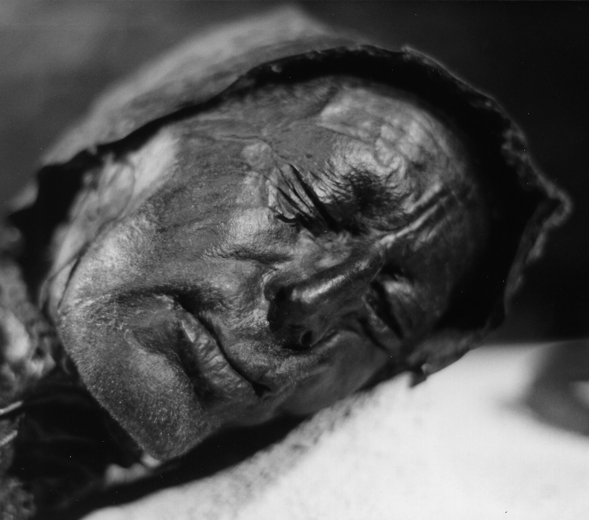

# Germanic Tribes and Magic

*GM's Workbook*

{width=90% fig-align="center" fig-alt="Map showing Roman Empire boundaries and Germanic tribal territories in 125 AD"}

The Germanic world beyond the Rhine and Danube is not a single thing. It is dozens of distinct peoples with different histories, gods, leadership structures, and relationships to Rome. The campaign's Germanic characters are not interchangeable; they come from specific places with specific cultures, specific wounds, and specific reasons for every decision they make.

This chapter gives you everything you need to run the Germanic side of the campaign authentically: the tribes and their politics, how Germanic society actually functions, the religious and magical systems that shape Germanic behavior, the runes and sacred sites the party will encounter, and a detailed breakdown of Vercingetorix's tribe as a specific living community.

---

## The Tribes of the Campaign

Four tribal groups are most relevant to events along the Danube-Germanic frontier in 175 AD. Each has a different relationship to Rome, a different internal structure, and different reasons for what they do.

---

{width=70% fig-align="center" fig-alt="Iron helmet with face guard from a Germanic Iron Age warrior burial"}

### The Marcomanni

**Territory:** The region north of the Danube, in what is now the Czech Republic and parts of southern Germany. Their primary settlement areas are in river valleys with good agricultural land.

**Relationship to Rome:** Hostile, but complicated. The Marcomanni have had trade relationships with Rome for generations; their material culture is partly Romanized. They use Roman metalwork, Roman glass, Roman wine. Their king Ballomar led the great Marcomannic invasion of 170 AD that pushed into Italy itself. The current Emperor's campaign is the Roman response. They are fighting Rome because Rome is on their territory, because their king needs to demonstrate strength to maintain his position, and because the alternative to fighting is submission.

**Leadership structure:** The Marcomanni are a kingdom rather than a loose confederation. Ballomar commands genuine royal authority, though he rules through a council of major clan chiefs who can withdraw support. His power is real but conditional; a king who loses too many battles loses his chiefs.

**What they want:** To push the Roman presence back north of the Danube and re-establish the territory they controlled before the Flavian-era consolidation of the frontier. They do not want to conquer Rome; they want Rome to leave them alone.

**In the campaign:** The Marcomanni are the primary threat in Chapters 1 and 2. Individual Marcomanni warriors and officers are antagonists, but not without the complexity their situation deserves. They are defending their homes, badly.

---

### The Quadi

**Territory:** East of the Marcomanni, along the middle Danube into modern Slovakia.

**Relationship to Rome:** The Quadi and Marcomanni are traditional allies; they coordinated the 170 AD invasion together. The Quadi are less internally unified than the Marcomanni; their leadership is more fragmented, their tribal identity looser.

**Leadership structure:** Multiple independent chieftains with nominal deference to a paramount chief. The fragmentation makes them harder to negotiate with (every chieftain has their own position) and harder to defeat permanently (you cannot simply kill the king and end the war).

**What they want:** Similar to the Marcomanni: withdrawal of Roman pressure. Some Quadi chieftains would accept a negotiated settlement; others would not. The internal disagreement is something a clever party can exploit.

**In the campaign:** Secondary threat in Chapters 1-2. More useful as a political variable: a faction within the Quadi is willing to negotiate separately from the Marcomanni, which creates a wedge that the party may be able to use, if they choose to.

---

### The Suebi

**Territory:** A broad grouping covering much of central and northern Germania. The name covers many smaller tribes who share cultural patterns: the Semnones, the Langobardi, the Hermunduri, and others.

**Relationship to Rome:** Variable. Some Suebian tribes are Roman allies (*foederati*), receiving payment to fight alongside Rome or to maintain neutrality. Others are hostile. The Suebian confederation is loose enough that you cannot treat its member groups as having a single position.

**In the campaign:** Background presence. The Suebian world is where the deep forest begins, where the sacred sites the campaign visits in Chapter 3 are located. Vercingetorix's tribe is Suebian in character if not by specific tribal identification.

---

### The Cherusci

**Territory:** Lower Rhine, northwest Germania. A tribe in long decline since the Teutoburg Forest battle; they lost too many warriors in subsequent Roman reprisal campaigns.

**Historical significance:** Arminius was Cherusci. His defeat of Varus in 9 AD using Roman-trained tactics against a Roman army is the foundational Germanic victory against Rome. Every Germanic warrior in 175 AD knows this story; it is the proof that Rome can be beaten.

**Current state:** Weakened, fragmented, in some ways broken by their own success. The Roman reprisals after Teutoburg destroyed much of the tribe. They are present in the campaign mainly as historical reference: their story is what gives other Germanic peoples their mental model of what resistance to Rome can accomplish.

---

### Vercingetorix's Tribe

*See the dedicated section later in this chapter for full details.*

Vercingetorix is not Cherusci, Marcomannic, or strictly Suebian. He leads a small independent tribe in the deep forest, east of the main Marcomannic territory, in a region where Roman intelligence is thin. His tribe is the party's most important Germanic contact and their most important source of information about the sacred grove.

---

## How Germanic Society Works

Understanding the operating principles of Germanic social life lets you run these characters without reducing them to props. The Germanic peoples the party encounters are not simple; they have their own complex systems of obligation, honor, and politics.

---

### The *Comitatus*: The War-Band

The fundamental unit of Germanic political power is not the tribe but the *comitatus*: a chief and his warrior companions. The chief surrounds himself with skilled fighters who have given him personal loyalty. The relationship is contractual in everything but name: the chief provides equipment, food, share of plunder, and public standing; the companions provide their lives.

The bond is personal. A companion's oath is to the chief, not to the tribe. When the chief dies in battle, the companions who survive him have failed in their most basic obligation. Social death follows; they become men without standing, without a patron, without a place in the community's structure. The only honorable resolution is to die with the chief or to die avenging him.

**For the DM:** This means that killing a chief decisively is often better than inflicting casualties on his warriors. The warriors may scatter, switch sides, or enter a period of mourning paralysis after the chief's death. It also means that a Germanic NPC who has lost his chief is a specific type of person: capable, probably dangerous, and deeply motivated to resolve their dishonor.

---

### The *Thing*: The Assembly

Every free Germanic man has the right to speak at the *Thing* (the tribal assembly). The *Thing* makes decisions about war, peace, major legal disputes, and leadership. It is not a democracy in the Roman or modern sense, but it is genuine collective decision-making with real authority.

A chief who wants to go to war and whose *Thing* votes against it is in a difficult position: he can override the assembly, but he does so at the cost of legitimacy. Chiefs who consistently override the *Thing* lose the support they need to function.

**For the DM:** The *Thing* creates a space for non-violent conflict resolution. If the party needs to prevent a raid, or negotiate an alliance, or stop a war, the answer might be through the *Thing* rather than through combat. A party that speaks at the *Thing* and makes a compelling argument can change the outcome of major events.

---

### *Wergild*: The Blood Price

Germanic law resolves most interpersonal violence through payment rather than punishment. Every free person has a *wergild* value proportionate to their social standing. If you kill someone, you pay their family the *wergild* or you accept that the family has the right to take blood vengeance. Vengeance creates a cycle; *wergild* ends it.

**Values (approximate, for play):**

| Status | *Wergild* |
|---|---|
| Free commoner | 200 *solidi* (roughly 50 *denarii* in trade value) |
| Warrior companion (*comitatus* member) | 600 *solidi* |
| Chief | 1200--2400 *solidi* depending on standing |
| *Volva* (shaman) | Treated as a chief; sometimes uncollectable in practice |

**For the DM:** A party that kills Germanic people without resolution creates ongoing problems. The families will pursue *wergild* claims, which translates to either payment or ongoing hostile attention. This is not automatically a combat situation; it is a social and political complication. A party that kills Marcomannic warriors, then needs to negotiate with Marcomannic clan chiefs in Chapter 3, carries those deaths with them into the negotiation.

---

### Gift-Giving as Political Currency

A Germanic chief's power is measured partly in their ability to give magnificent gifts. Weapons, ring-jewelry (*ring-giver* was a poetic title for a chief), horses, and imported Roman goods: all of these flow from chief to companion as demonstrations of the chief's power and of his regard for the recipient.

A chief who cannot give gifts loses followers. This is not metaphorical; companions will literally leave a chief who cannot maintain them. Raiding Roman territory is partly about acquiring the goods necessary to maintain political standing.

**For the DM:** The party can operate within this system. Giving a valuable gift to a Germanic chieftain is both culturally appropriate and practically effective; it is the language in which respect is expressed. A party that approaches Vercingetorix empty-handed, asking for information and alliance, is asking in a language that does not fully translate. A party that brings a meaningful gift is conducting the conversation correctly.

---

## Germanic Religion

{width=80% fig-align="center" fig-alt="19th century illustration of Odin hanging from Yggdrasil the world tree as an act of self-sacrifice"}

The gods of the Germanic peoples are not metaphors. They are present, active, and interested. This section covers the religious world your party enters when it crosses the frontier.

---

### The Gods

The Germanic pantheon in 175 AD is not yet fully formed into the systematic Norse mythology of the Viking age. The names differ by tribe and by region; what follows uses Romanized forms alongside Germanic forms where both are attested.

**Wotan / Odin (the war-god, the wanderer, the hanged god)**

The chief of the gods, though "chief" undersells the complexity. Wotan is a god of war, but also of wisdom, poetry, death, fate, and sorcery. He is a wanderer who travels disguised through the human world, testing mortals and collecting the worthy dead. He gave up one of his eyes for wisdom. He hanged himself on the World Tree for nine days to acquire knowledge of the runes. He is not a comfortable god; his favor is real but costly.

His relation to Mars: the Romans often identified Wotan with Mercury rather than Mars, because both are psychopomp gods (guides of the dead) and both are associated with eloquence and craft. This is not entirely wrong, but it misses something. Wotan is the god who picks which warriors die and which live; he is interested in who you become through the dying as much as in the killing itself.

**Donar / Thor (the thunder-god, the protector)**

The most popular god among ordinary Germanic people: straightforward, powerful, protective. He fights the serpent (*Jormungandr*) at the world's end; he drives his chariot (causing thunder) across the sky; he kills giants. He carries a war-hammer (*Mjolnir*) that always returns to his hand.

His relation to Mars: simpler and more direct than Wotan. Donar/Thor is what a soldier prays to for strength and survival. He is not complex. He does not test. He protects those who honor him.

**Nerthus (the earth goddess, the keeper of peace)**

A goddess associated with the earth, fertility, and a specific form of sacred peace. Tacitus describes her cult: a wagon covered in cloth that is drawn through the tribal territories by sacred cows; wherever the wagon passes, peace must be kept. After the procession, the wagon is washed in a sacred lake by slaves who are then drowned. The secret of what the cloth covered is never revealed.

**For the DM:** Nerthus is relevant to Chapter 3. The sacred grove is associated with Nerthus in addition to Mars (whose spear has been corrupting the grove). The conflict between Nerthus's peace and Mars's war-focus is part of why the grove is unstable.

**Tyr (the god of law and justice)**

A one-handed god who sacrificed his hand to bind the great wolf *Fenrir*, knowing the wolf would bite it off when the binding was revealed. He is the god who keeps his word even when it costs him everything. Associated with the *Thing* and with legal proceedings.

The *tiwaz* rune (his symbol) carved on a weapon blade invokes his authority: the weapon is bound to lawful use, to fighting that is just rather than random. This matters for the rune-carved weapon magic item described later.

---

### Sacred Sites

Germanic religious practice is primarily outdoors. The forest itself is the temple.

{width=80% fig-align="center" fig-alt="Illustration of Yggdrasil the Norse world tree surrounded by mythological creatures"}

**Sacred groves (*Heilige Haine*):** Specific stands of old-growth trees, usually oak, where the tribe performs its major communal rituals: sacrifice, prayer before war, oath-taking, seasonal observances. The grove in Chapter 3 is one of these. Sacred groves are not entered casually; the correct approach is with small gifts and the acknowledgment of the *genius loci*.

**Bog sacrifice:** The bog is understood as a boundary place: neither land nor water, between the human world and the world below. Offerings are made by throwing them into the bog. These can be objects (weapons, jewelry, tools) or human sacrifices in specific circumstances. The archaeological record confirms this; hundreds of bog bodies have been found with evidence of ritual sacrifice. A Germanic NPC asked about bog sacrifice will not see it as barbaric; it is the most significant form of offering they know.

**Standing stones and carved markers:** Some sites are marked with carved stones or wooden posts, often with runic inscriptions. These are memory markers, territory markers, and sometimes invocations: a post carved with the rune of Tyr at the boundary of a tribe's land is both a marking and a declaration.

**The sacred fire:** Germanic communities maintain a perpetual fire in the chief's hall. The fire is not just practical; it is the tribe's connection to the divine warmth that holds winter and darkness back. Extinguishing a chief's fire is an act of spiritual as well as political warfare.

---

## Shamanic Magic: *Seiðr* and Rune-Craft

Germanic magic in D&D 5e terms is not wizard magic. It is not structured, systematic, or reliable in the same way. It is older, wilder, and woven into the fabric of things rather than imposed on them.

Two primary magical traditions exist in the Germanic world: *seiðr* (the shamanic practice of the *volva*) and rune-craft (the carving and invocation of runic symbols). They are different in character and in who practices them.

---

### *Seiðr*: The Shaman's Way

*Seiðr* is performed by the *volva* (pl. *volur*), a female shaman who travels between communities offering prophecy, spirit work, and fate-influence. The word *seiðr* is difficult to translate: "weaving" is sometimes used, because the practice involves working with the threads of fate rather than imposing will on them directly.

The *volva* uses altered states to access information and influence. She sits on a high seat (*seidhjallr*), is induced into a trance through song and sometimes intoxicants, and in the trance state can perceive things beyond ordinary senses: the fates of individuals, the outcomes of wars, the whereabouts of the dead. She can also, in the trance state, influence outcomes: nudging fate, placing conditions on events, binding or loosening.

The practice is understood as powerful and somewhat taboo for men; a male practitioner of *seiðr* is associated with a kind of role reversal that Germanic culture finds uncomfortable. Wotan himself is said to have learned *seiðr* from Freya (the death goddess), and this is held against him even as his power is acknowledged.

**Mechanics for *seiðr*:**

A *volva* in D&D terms is built as a Divination Wizard or a Fate-focused character. Her specific abilities in the campaign's context:

- **Fate Reading (*Spå*):** Once per long rest, the *volva* can enter trance and ask one question about a specific person's future. The answer is true but expressed in symbolic terms; it takes a DC 14 Insight check to interpret correctly. Failure gives a literal interpretation that may mislead.
- **Fate Binding (*Galdre*):** The *volva* can spend three rounds of ritual to place a condition on an event: "If this warrior enters battle with anger in their heart, the first wound they take will be mortal." The condition must be specific and must relate to a choice the subject can make. DC 16 Wisdom saving throw to resist; the subject does not necessarily know the binding has been placed.
- **Spirit Contact:** In a location with a significant supernatural presence (a sacred grove, a site of violent death, a bog), the *volva* can communicate with spirits that are not otherwise visible. This requires a successful DC 13 Wisdom check and 10 minutes of ritual.
- **Death Sight:** The *volva* can see marks of death: she can identify a creature that is fated to die soon (within the next session) with a DC 15 Wisdom check. She cannot prevent the death through this ability; she can only see it.

---

### Rune-Craft

The runes are not merely an alphabet. Each rune is understood as a force in the world, a principle that exists independently of its written representation. Carving a rune correctly and with intention is also invoking the force the rune represents.

Rune-craft is practiced by warriors, smiths, and anyone with sufficient knowledge. It is not shamanic in the same way as *seiðr*; it is a skilled craft. A warrior who knows the runes can carve them into a weapon blade, a shield boss, a door post, or their own skin, and invoke specific effects.

**Mechanics:**

To activate a rune carving, the character must be proficient in the use of the rune (either through the Rune Carver background or through in-campaign training), must spend at least 10 minutes on the carving, and must succeed on a DC 13 Arcana or Religion check. Failure means the carving is inert; it does not produce the intended effect, though it does not cause harm unless the DM determines the attempt was seriously botched.

---

{width=85% fig-align="center" fig-alt="Photograph of the Kylver runestone showing the complete Elder Futhark runic alphabet carved in limestone"}

### The Elder Futhark: Twenty-Four Runes

The twenty-four runes of the Elder Futhark, with their D&D game significance:

| Rune | Name | Meaning | Game effect when carved |
|---|---|---|---|
| ᚠ | Fehu | Cattle, wealth, mobile property | Carved on a coin purse or trade goods: +2 to Persuasion checks involving commerce for the session |
| ᚢ | Uruz | Aurochs, strength, raw force | Carved on a weapon: the weapon deals +2 damage on the first hit each combat |
| ᚦ | Thurisaz | Giant, thorn, directed force | Carved on a gate or barrier: creatures attempting to force it through must make DC 14 Strength check |
| ᚨ | Ansuz | Aesir, breath, divine communication | Carved on a message or object: the intended recipient recognizes it as meant for them across any distance; they sense the sender's identity |
| ᚱ | Raidho | Ride, journey, the right path | Carved on a wagon or boot: travel by this route takes half the expected time once per journey |
| ᚲ | Kenaz | Torch, opening, knowledge | Carved on a door or seal: the carver knows if the sealed item has been opened or disturbed |
| ᚷ | Gebo | Gift, exchange, balance | Carved on two objects of equal value: the exchange is witnessed by the gods; breaking the agreement incurs divine displeasure (-1d4 to all rolls for 24 hours) |
| ᚹ | Wunjo | Joy, harmony, wish | Carved on a dwelling or camp: creatures sleeping here recover one additional HD during a long rest |
| ᚺ | Hagalaz | Hail, disruption, crisis | Carved on a surface and activated: 10-foot radius of difficult terrain (hailstones or ice, depending on climate) for 1 hour |
| ᚾ | Nauthiz | Need, constraint, necessity | Carved on a binding or cord: a creature bound by it has disadvantage on Strength checks to escape; the binding cannot be cut by mundane blades |
| ᛁ | Isa | Ice, stillness, stasis | Carved on a body of water or liquid: freezes up to 10 cubic feet of the liquid solid for 1 hour |
| ᛃ | Jera | Year, harvest, cycle | Carved on a crop field or stored grain: the food does not spoil for one month |
| ᛇ | Eihwaz | Yew, endurance, the world axis | Carved on a bow: the bow's arrows never deviate from wind; ignore cover from terrain features (though not from creatures) |
| ᛈ | Perthro | Lot-cup, fate, the hidden | Carved on dice or any object used for divination: the next reading is accurate without a check required |
| ᛉ | Algiz | Elk-sedge, protection, reaching | Carved on armor or a shield: once per short rest, the wearer can impose disadvantage on one attack roll against them as a reaction |
| ᛊ | Sowilo | Sun, victory, the will to succeed | Carved on a weapon: the weapon counts as silvered; creatures that are specifically vulnerable to sunlight have disadvantage on saves against its damage |
| ᛏ | Tiwaz | Tyr, justice, lawful victory | Carved on a weapon used in a just cause: +1 to attack rolls; the attack deals an extra 1d6 radiant damage against creatures that have broken an oath or committed treachery |
| ᛒ | Berkano | Birch, growth, new beginnings | Carved on a wound or applied to a sick person: the next Medicine check to stabilize or treat the person has advantage |
| ᛖ | Ehwaz | Horse, partnership, swift movement | Carved on two objects: their bearers can communicate telepathically within 30 feet |
| ᛗ | Mannaz | Mankind, community, the self | Carved on a threshold: the carver knows the number and nature of creatures inside |
| ᛚ | Laguz | Lake, flow, the depths | Carved on a boat or near water: the carved vessel cannot be capsized by natural means for 24 hours |
| ᛜ | Ingwaz | Ing, completion, contained power | Carved on a camp perimeter: creatures sleeping inside cannot be surprised; the perimeter lights up briefly if crossed |
| ᛞ | Dagaz | Day, breakthrough, transformation | Carved on a sealed door: the door opens silently for the carver once; the carving then fades |
| ᛟ | Othala | Ancestral land, inheritance, belonging | Carved on a dwelling: the family or group it is carved for cannot be driven from it by fear effects |

**Stacking:** Rune carvings do not stack with each other. A weapon can bear one active rune carving at a time. Carving a new rune over an old one replaces the old effect.

**Duration:** Most rune effects last until the next long rest unless specified otherwise. Permanent effects are noted.

---

## The *Volva*: Stat Block

The *volva* encountered in the campaign (she is present as a potential ally or obstacle in Chapter 3) has the following statistics. She is not a combat creature by preference; she is a negotiation and information creature who becomes dangerous only when directly threatened.

::: {.callout-note appearance="minimal"}
**VOLVA (Germanic Shaman)**
*Medium humanoid (Germanic), neutral*

---

**Armor Class** 12 (natural awareness) | **Hit Points** 65 (10d8 + 20) | **Speed** 30 ft.

| STR | DEX | CON | INT | WIS | CHA |
|:---:|:---:|:---:|:---:|:---:|:---:|
| 10 (+0) | 14 (+2) | 14 (+2) | 14 (+2) | 20 (+5) | 16 (+3) |

**Saving Throws** WIS +8, CHA +6
**Skills** Arcana +5, History +5, Insight +11, Medicine +8, Perception +8, Religion +8
**Senses** Truesight 10 ft., passive Perception 18
**Languages** Germanic (dialect), proto-Norse, some Latin
**Challenge** 5 (1,800 XP) | **Proficiency Bonus** +3

---

**Death Sight.** The volva can see marks of death on creatures fated to die within the next 24 hours. Creatures she can see who are so marked appear surrounded by a faint shadow only she can perceive.

**Fate Reading.** Once per long rest, the volva can perform a 10-minute ritual to ask one yes/no question about a specific creature's near future. The answer is always true.

**Spellcasting.** The volva is a 9th-level spellcaster. Her spellcasting ability is Wisdom (spell save DC 16, +8 to hit). She has the following spells prepared:

*Cantrips:* guidance, resistance, thaumaturgy

*1st level (4 slots):* bane, detect magic, identify, speak with animals

*2nd level (3 slots):* augury, detect thoughts, locate object, see invisibility

*3rd level (3 slots):* clairvoyance, dispel magic, speak with dead

*4th level (3 slots):* arcane eye, divination, locate creature

*5th level (1 slot):* commune, legend lore

---

***ACTIONS***

**Fate Binding.** The volva places a condition on one creature she can see within 60 feet. The target makes a DC 16 Wisdom saving throw. On a failure, the first time the target takes an action that violates the stated condition within the next 24 hours, they take 21 (6d6) psychic damage and are stunned until the end of their next turn. The condition must be specific and achievable.

**Staff.** *Melee Weapon Attack:* +3 to hit, reach 5 ft., one target. *Hit:* 4 (1d6) bludgeoning damage plus 10 (3d6) psychic damage.

---

***DM NOTES***

The volva is not a combat encounter. If the party forces a fight, she uses *bane* immediately, then *detect thoughts* to identify who is directing the aggression, then *fate binding* on that individual. She does not use violence; she uses information and fear. If reduced below 20 HP, she uses *commune* to call for divine attention and then withdraws.

The correct encounter with her is a negotiation. She wants something: information, a service performed, a wrong righted, or proof that the party deserves what they are asking for. What she wants is determined by what the party has done in previous sessions.

:::

---

{width=90% fig-align="center" fig-alt="Photograph of a reconstructed Germanic longhouse with timber walls and thatched roof"}

## Vercingetorix's Tribe

*Note: Vercingetorix is a Romanized version of his name; his actual tribal name is unpronounceable by most Roman soldiers, and he accepted the simplification long ago as the price of dealing with Rome.*

Vercingetorix leads a tribe of approximately 300 people: 80-90 warriors, the rest farmers, craftspeople, children, and elders. They occupy a permanent settlement in the deep forest roughly three days march east of the Rhine crossing. The settlement has existed in this location for four generations.

---

### Village Layout

The settlement (*dorf*) is built in a clearing surrounded by old-growth oak and ash. Three elements define it:

**The Hall (*Methalle*):** The chief's hall is the largest structure: a long timber building with a central hearth and smoke-holes in the roof. Vercingetorix holds his *Thing* here in bad weather; the sacred fire burns continuously at the east end. The hall walls bear carved runic inscriptions: protection runes on the door posts, memory runes for warriors who died well, the *Ingwaz* rune of Vercingetorix's line above the hearthfire.

**The Grove Approach:** A path leads east from the settlement toward the sacred grove. The path is marked at intervals with carved wooden posts; the posts become more elaborate the closer you get to the grove. The final post before the grove is a carved image of the World Tree; it is always freshly garlanded, regardless of season.

**The Forge:** Vercingetorix's tribe has an unusually skilled smith named Hildebrand. His forge is outside the main settlement cluster, because fire is dangerous and because the forge is considered sacred space. Hildebrand is one of perhaps a dozen people in the Germanic world who knows rune-craft at a practical level. He carved the weapon Vercingetorix carries and will, under the right circumstances, carve for the party.

---

### Named Tribe Members

**Vercingetorix (Chief, warrior)**
Built from Gladiator stat block (CR 5) plus rune-carved weapon (+1 shortsword, *Tiwaz* rune: extra 1d6 radiant against oath-breakers). OGAS: see gm_intro.qmd. His voice is direct, formal in the Roman style he has partly adopted, and quietly furious about what the spear is doing to the grove.

**Roswitha (the tribe's *volva*)**
Use the *Volva* stat block above. She knew the corruption was coming two years before anyone else did. She does not like the party, specifically, but she needs help that only outsiders can provide. She communicates in riddles by habit; if pushed for directness, she delivers it with a sharpness that surprises people.

**Hildebrand (smith, rune-carver)**
Use Commoner stat block with Athletics +6, Smith's Tools proficiency, and Arcana +5 for rune-craft specifically. He speaks very little Latin and communicates through Vercingetorix or gesture. He is the best argument for spending a session here: what he knows about rune-craft, and what he can make, is not available anywhere else.

**Thusnelda (warrior, Vercingetorix's second)**
Full OGAS and stat block in chapter3.qmd. She is the tribe's best fighter, the person Vercingetorix trusts most, and the person most opposed to involving outsiders in what she sees as a Germanic problem. Her arc through Chapter 3 is about whether she can move past that opposition.

**The Six Elders:** The tribe's council, who collectively have more authority over the *Thing* than Vercingetorix alone. They are unnamed unless the party interacts with them specifically; if that happens, name them and give them a single strong opinion each about the party's involvement.

---

### The Tribe's Relationship to Mars

Three generations ago, a Roman centurion named Sulla (unrelated to the dictator) traded a spear to the tribe's then-chief. The spear was presented as a gift of alliance; the Roman price for it was a corridor of safe passage for supply convoys. The chief accepted and held the bargain.

What Sulla actually gave them was a spear that had been in contact with Mars's sacred spear in Rome: not the original, but a weapon used in ritual proximity to it. The divine resonance was real and initially beneficial: warriors who fought with the spear were stronger, faster, and harder to kill. For two generations, the tribe flourished.

The corruption began when Brutus's cult got involved. Their ritual work with the replica spear in Rome is pulling at the divine resonance in the tribal spear, amplifying it in ways that are breaking the connection between the grove and its *genius loci*. The corruption the party is tracking is a symptom of something happening simultaneously in Rome.

Vercingetorix knows the spear is the problem. He does not know about Brutus. He needs the party to resolve what is happening at the divine level; he is willing to give them significant intelligence and assistance in exchange.

---

## Germanic Magic Items

The following items can be found, traded for, or crafted in the Germanic world. Each has a specific source and a specific cost.

---

### Rune-Carved Weapon

*Weapon (any), uncommon*

A weapon bearing a single Elder Futhark rune carved by a trained rune-carver. The specific effect depends on the rune (see the rune table above). The carving is visible as a faint luminescence in near-darkness.

**Source:** Hildebrand will carve a weapon brought to him for the right price: a service to the tribe, a significant gift (25 gp equivalent), or proof that the weapon will be used in a cause Tyr would recognize as just. He will not carve weapons for people he does not trust.

**Limitation:** The rune's effect expires after 30 days and must be re-carved. The weapon itself is not magical; only the effect of the active carving is.

---

{width=65% fig-align="center" fig-alt="Small animal figurine carved from translucent golden-brown Baltic amber"}

### Sacred Amber Amulet (*Bernstein-Talisman*)

*Wondrous item, uncommon, requires attunement*

A piece of Baltic amber carved into a simple geometric shape and worn on a cord. Amber was considered to have protective properties throughout the ancient world; the Germanic tribes traded it south in enormous quantities.

**Properties while attuned:**

- You have advantage on saving throws against fear effects.
- When you roll initiative, you can add your Wisdom modifier (minimum 0) to the roll.
- Once per day, when you would take psychic damage, you can reduce that damage to 0. The amulet cracks slightly each time this effect is used; it shatters after three uses.

**Source:** Can be purchased in Germanic market contexts for 50--100 *denarii*; a particularly fine example would be traded as a gift between chiefs. The shaman Roswitha carries one she will not sell but might give, under the right circumstances.

---

### The *Volva*'s Staff

*Staff, rare, requires attunement by a Wisdom-based spellcaster*

A staff of ash wood, seven feet long, topped with a carved horse head and wound with amber beads. It belongs to Roswitha. She will not willingly give it up. If it were somehow obtained, it has the following properties:

- Acts as a *staff of divination*: the wielder can cast *augury* at will and *divination* once per day without expending a spell slot.
- The wielder has advantage on Insight checks and can communicate with any creature that has been dead for less than one year, as *speak with dead*, once per long rest.
- The staff has 7 charges. Expending a charge adds +3 to any Wisdom saving throw or Wisdom check. It regains 1d6+1 charges at dawn.

**Note for DMs:** This item is here to define Roswitha's power level, not to be looted. If the party kills her to take it, the staff refuses to function for anyone who was present at her death for one year.

---

{width=70% fig-align="center" fig-alt="Photograph of the Tollund Man's preserved face and head emerging from dark bog peat"}

### Cursed Bog-Iron Blade

*Weapon (shortsword or dagger), uncommon, cursed*

Forged from iron recovered from a bog sacrifice site, this blade has absorbed the spiritual charge of the offering. The metal is darker than normal iron, almost black, and does not rust.

**Properties:**

- The weapon deals +1d4 necrotic damage on a hit against creatures that are alive (not undead, constructs, or elementals).
- The weapon counts as magical for the purpose of overcoming resistance.

**Curse:** The bearer cannot willingly give the weapon away. Once attuned, they must make a DC 14 Wisdom saving throw each day to resist using the weapon in preference to any other weapon available to them, even in situations where a different weapon would be clearly better. The curse ends if a *remove curse* spell is cast or if the weapon is thrown into a bog (a deliberate sacrifice; it returns to the bog and is gone).

**Source:** Found near bog sacrifice sites, or traded by Germanic people who know what it is and have decided someone else should deal with it.
