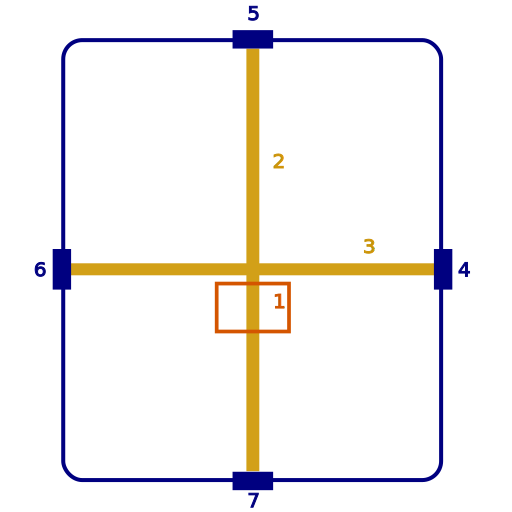
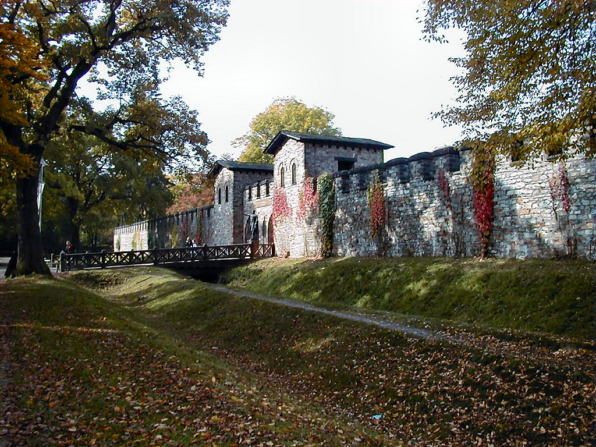

# Player's Guide

*For players — no spoilers*

## The Roman World

### Social Structure

Roman society is rigidly hierarchical, and that structure shapes daily life at the fort. At the top sits the Emperor, whose authority is absolute and whose person is considered semi-divine. Below him, the Senate governs Rome's civilian politics—though actual power shifts constantly between factions. Provincial governors and legionary legates hold authority at the local level.

For soldiers, rank determines almost everything: who you take orders from, where you sleep, how much you're paid, and what happens to you when something goes wrong. Rank must be respected even when the person holding it doesn't deserve it—at least publicly. Private opinions are your own business.

Citizens and non-citizens have different legal protections. Many soldiers serving in auxiliary units are non-citizens who earn citizenship upon honorable discharge. This distinction matters when dealing with legal disputes or appeals to Roman authority.

### The Legion

A standard Roman legion numbers around 5,000 soldiers organized into cohorts, centuries, and smaller units. Fort Vindolanda is a smaller posting—a detachment rather than a full legion—but the same chain of command applies.

Every Roman fort follows the same basic layout regardless of where it's built. Walking into Fort Vindolanda, you'd immediately recognize the structure from any other posting you've served at.

{width=90% fig-align="center" fig-alt="Diagram showing the standard layout of a Roman auxiliary fort with labeled buildings and roads"}

*Image: Redtony, Wikimedia Commons, CC BY-SA 4.0.*

Key practical points:

- **Orders come down through the chain.** You don't question an officer's orders in public. Disagreement goes through proper channels or happens in private.
- **Loyalty is owed to Rome first, your unit second, your commander third.** When those conflict, it gets complicated.
- **Soldiers are expensive to train.** Commanders generally don't throw lives away casually—but they will if the situation demands it.
- **The military has its own laws.** Desertion, insubordination, cowardice in battle, and theft from the unit are all capital offenses. Courts-martial are real.

### Frontier Life

Fort Vindolanda is not Rome. Supply shipments are irregular. Entertainment is limited. The weather is cold and wet for most of the year. Soldiers deal with boredom, isolation, and the constant low-level stress of being in hostile territory.

{width=90% fig-align="center" fig-alt="Aerial photograph of the Roman fort at Vindolanda showing fort outline and surrounding civilian settlement"}

*Image: Mike Bishop / thearmaturapress, Wikimedia Commons, CC BY-SA 2.0.*

The frontier fort is a self-contained world. Within its walls: barracks, a granary, the commander's residence (*praetorium*), the headquarters building (*principia*), workshops, a bathhouse, and a small shrine. Outside the gates, a civilian settlement (*vicus*) grows up over time—merchants, families of soldiers, taverns, and craftspeople following the money wherever the legions are posted.

{width=90% fig-align="center" fig-alt="Photograph of the reconstructed Roman fort at Saalburg showing stone walls and gate towers"}

*Image: Holger Weinandt, Wikimedia Commons, CC BY-SA 3.0.*

This breeds a particular culture: dark humor, intense unit loyalty, skepticism of anyone who wasn't there, and a kind of exhausted pragmatism about life and death. Veterans don't waste words. They've seen what happens when things go wrong, and they've learned to deal with it.

The frontier is also a place where different cultures interact constantly. Auxiliary soldiers from across the Empire serve alongside Roman citizens. Germanic traders and tribespeople move through settlements near the fort. Languages, customs, and beliefs mix in ways that wouldn't happen in Rome itself.

### Daily Life

**Timekeeping.** Romans divide the day into 12 hours from sunrise to sunset—which means summer hours are longer than winter hours. The night is divided into four watches (*vigiliae*). The fort runs on watch rotations: *prima vigilia* (first watch, dusk to ~9 PM), *secunda* (~9 PM to midnight), *tertia* (midnight to ~3 AM), *quarta* (3 AM to dawn). When someone says "meet me at the ninth hour," they mean mid-afternoon.

**Food.** A legionary's daily ration is built around *frumentum* (grain), salt, olive oil, and *acetum* (a sharp vinegar-wine soldiers mix with water, called *posca*). Properly called *posca*, it tastes terrible and keeps you alive. On the frontier you supplement with whatever's available: salt pork, hard cheese, lentils, dried figs. Fresh meat appears after religious sacrifices. If you're lucky enough to be near a Germanic settlement, you'll find barley beer (*cervisia*). Wine is for officers and festival days.

**Calendar.** The Roman year has 12 months, and three dates anchor each month: the *Kalends* (1st), the *Nones* (5th or 7th depending on the month), and the *Ides* (13th or 15th). When someone says "three days before the Ides," they mean the 11th or 12th. The month of *Martius* (March) is sacred to Mars. This is 928 AUC—the 928th year since the founding of Rome.

**Pay and Deductions.** Legionaries earn about 300 *denarii* per year, paid in three installments. But the army deducts costs: food, equipment, camp expenses. What soldiers actually pocket is much less. *Sestertii* (four to a denarius) are the everyday coin. *Aurei* (25 denarii each) are gold coins you'll rarely see unless someone important is paying you off or bribing you.

### Money and Trade

| Coin | Metal | Value |
|---|---|---|
| *As* | Copper | 1 base unit |
| *Sestertius* | Brass | 4 *asses* |
| *Denarius* | Silver | 16 *asses* / 4 *sestertii* |
| *Aureus* | Gold | 400 *asses* / 25 *denarii* |

**D&D translation:** 1 *denarius* ≈ 1 silver piece. 1 *aureus* ≈ 1 gold piece. 1 *sestertius* ≈ 2–3 copper pieces.

A soldier's daily meal costs about 1–2 *sestertii*. A night at a roadside inn (*taberna*) runs 4–8 *sestertii*. A good gladius costs 50–100 *denarii*. A horse is 500+ *denarii*. You can bribe a minor official for a few *sestertii*; a centurion's cooperation costs considerably more.

---

## The Gods Are Real

This setting runs on the assumption that the Roman pantheon is real and active. This isn't metaphorical—the gods have genuine power, genuine personalities, and genuine interest in mortal affairs.

What this means in practice:

**Augury works.** A skilled augur reading bird flights or examining animal livers can receive actual information about the future. The information is often incomplete or symbolic, but it's not made up.

**Divine magic is real.** Priests of the major gods can call on genuine divine power. The channel is faith, not just words and gestures.

**Omens carry information.** When dogs die overnight for no visible reason, or sacrificial animals show corrupted organs, these are messages. Ignoring them is unwise.

**The gods have their own priorities.** Jupiter's agenda is not your agenda. Mars does not exist to help you win your personal fight. The gods act according to their own values and long-term interests, which may or may not align with yours.

**Defying a god has consequences.** This doesn't mean you have no agency—but it means the consequences of certain actions extend beyond the mortal scale.

Your characters grew up knowing all of this. They may be devout, skeptical-but-practical, or anywhere in between, but none of them think the gods are fictional.

### The Roman Pantheon

These are the gods your characters know. Which ones they pray to, fear, or bargain with is a character choice — but all of them are real.

**Jupiter** *(Iuppiter)* — King of the gods. Sky, thunder, oaths, law. He wants: proper sacrifice, oaths honored, Rome's supremacy acknowledged. He is distant and transactional — he doesn't love mortals, but he enforces the divine order they depend on. Pray to him before legal proceedings and battles of politics. *Patron deity of Rome itself.*

**Mars** — God of war, military virtue, spring. He wants: courage shown in battle, blood offered before combat, fallen soldiers honored. He is not cruel — he respects strength and hates cowardice. If you're going into danger, he's worth propitiating. If you dishonor him, he notices. *Patron deity of soldiers and Rome's founding myth.*

**Juno** — Queen of the gods. Marriage, women, childbirth. She wants: fidelity, proper ceremony, women treated with dignity. Less immediately relevant at a frontier fort, but a powerful enemy to make. Never mock marriage or family in her hearing.

**Minerva** — Goddess of wisdom, strategy, crafts, and medicine. She wants: careful thought, mastery of craft, problems solved with intelligence rather than brute force. Surgeons, engineers, scribes, and officers benefit from her favor. *Good choice for Clerics and Wizards.*

**Apollo** — God of the sun, healing, prophecy, and arts. He wants: purity, beauty, honest prophecy respected. Augurs serve him. He is a god of truth — lies told in his presence go badly. *Essential deity for Clerics of healing and any character who uses divination.*

**Diana** — Goddess of the moon, the hunt, and the wilderness. She wants: respect for nature, proper hunting rites, the wild not wantonly despoiled. Important on the frontier, where the forest is her domain. She is self-sufficient and expects her worshippers to be the same.

**Vulcan** *(Vulcanus)* — God of fire and the forge. He wants: first-forged offerings, excellence in craft, fire respected rather than wasted. Armorers and blacksmiths honor him. If you're creating something, acknowledge him. He makes dangerous enemies — his works are inescapable.

**Mercury** *(Mercurius)* — God of travel, trade, messages, and thieves. He wants: roadside offerings, a coin thrown at a crossroads, first-sale libations. He moves fast and changes sides. Messengers, merchants, and rogues all court him. He responds to cleverness.

**Neptune** *(Neptunus)* — God of the sea, horses, and earthquakes. Less directly relevant this far inland — but if you ride horses regularly or travel by sea, a small offering is prudent. He is temperamental and his disasters come without warning.

**Venus** — Goddess of love, beauty, and desire. She wants: beauty honored, desire not shamed, Rome's destiny respected (she is mother of Aeneas, ancestor of Rome). Politically powerful through her connection to Rome's founding. Worth knowing she exists.

**Ceres** — Goddess of grain and harvest. She wants: grain offerings at harvest, prayers for supply lines and fertility. On the frontier, where food supply is a constant pressure, she matters enormously. Soldiers who mock or neglect her tend to eat poorly.

**Bacchus** *(Dionysus)* — God of wine, ecstasy, and the irrational. He wants: libations, acceptance of chaos, the masks stripped away. He is dangerous in a way the other gods aren't — his gifts are real, but they dissolve order. Approach carefully.

---

**Beyond the twelve:** Two deities deserve special mention for a frontier soldier.

**Mithras** — Not an Olympian but wildly popular in the legions. God of light, cosmic order, contracts, and brotherhood. His worship is an all-male mystery cult with seven initiation grades. If you're in a *contubernium* (8-man tent group) that all worship Mithras, you have brothers who'll die before they betray you. *Excellent background element for Fighters and Paladins.*

**Fortuna** — Goddess of luck and fate. She wants nothing — she is indifferent. But every soldier prays to her anyway, because she's the one actually deciding whether the arrow hits you or the man next to you. Small shrines to Fortuna appear in the strangest places. Soldiers carry her coin.

---

## Character Creation

### What Soldiers Look Like

Your characters live in this equipment. Roman soldiers of the Antonine period (117–193 AD) are immediately recognizable by their gear:

{width=90% fig-align="center" fig-alt="Roman reenactors dressed as 2nd-century legionaries on the march carrying shields and javelins"}

*Image: Caliga10, Wikimedia Commons, CC BY-SA 3.0.*

Not everyone at the fort wears this kit. Auxiliary troops often use their home culture's equipment. Officers and cavalry have different armour. But the lorica segmentata is the default image of a Roman legionary, and it's what imperial authority looks like on the frontier.

### Fitting the Setting

The campaign works best with characters who have a reason to be at Fort Vindolanda and a stake in what happens there. This doesn't require a complicated backstory—"I'm a soldier doing my posting" is completely valid.

Some questions to consider:

- Why is your character at this fort, specifically? Routine posting, transferred for cause, seeking something, following someone?
- What does your character want out of their military service? Pension and retirement? Glory? A way home?
- How does your character relate to Roman authority? Loyal true believer, pragmatic follower, quiet skeptic?
- What's your character's relationship with the gods? Devout, transactional, wary, indifferent?
- Which god (if any) does your character have a particular relationship with? This shapes background and motivation more than any class choice.

### Class Suggestions

All classes can work. Some fit more naturally:

| Class | Notes |
|---|---|
| **Fighter** | Natural fit. Any subclass works. Battlemaster reflects Roman tactical discipline well. |
| **Paladin** | A devout soldier sworn to a Roman deity. Which god shapes everything about this character. Mars, Minerva, and Mithras all make compelling patrons. |
| **Ranger** | Scout, tracker, or auxiliary soldier from a frontier people. |
| **Cleric** | The fort's religious specialist or a soldier with a divine calling. Consider Apollo (healing/knowledge), Mars (war), or Minerva (knowledge/war). |
| **Rogue** | Camp follower, spy, or a soldier with particular skills command finds useful. Mercury's favored. |
| **Barbarian** | An auxiliary from a Germanic, Gallic, or other frontier people. Uncommon but respected for raw effectiveness. |
| **Wizard / Artificer** | A scholar attached to the legion, or someone who learned magic before service. Rare and viewed with cautious respect. |
| **Bard** | A historian, military chronicler, or someone who blurs the line between soldier and diplomat. |
| **Druid** | Works best as a non-Roman from a frontier people; requires thought about why they're cooperating with Rome. |

### Background Suggestions

- **Soldier** — Straightforward. Comes with military rank and contacts. The default choice.
- **Acolyte** — Served a temple before or during military service. Clarify which god.
- **Sage** — Attached to the legion as a specialist. Good for Wizards and Clerics.
- **Folk Hero** — Known for something in your home region. Works for auxiliaries and provincial soldiers.
- **Outlander** — From a frontier people, now serving or attached to Rome.
- **Charlatan** — Someone operating in the spaces between the official structure. Possibly intelligence or information work.

### Ability Scores

No specific recommendations—build what fits your concept. The campaign is encounter-diverse, with combat, social, and investigation challenges. Wisdom is particularly relevant given the campaign's themes around divine influence and judgment. Pure combat builds work but will miss some of what makes this campaign interesting.

### Equipment

The following weapons and armor are standard in this setting. If your equipment list doesn't match these, ask the DM about reskinning.

**Weapons**

| Roman Name | D&D Equivalent | Damage | Notes |
|---|---|---|---|
| *Gladius* | Shortsword | 1d6 piercing | Standard legionary sidearm. Short, double-edged, for close work. |
| *Pilum* | Javelin (special) | 1d6 piercing | Heavy throwing spear. Soft iron shank bends on impact — cannot be thrown back. |
| *Spatha* | Longsword | 1d8 slashing | Cavalry and auxiliary sword. Longer reach than the gladius. |
| *Hasta* | Spear | 1d6 / 1d8 (versatile) | Standard thrusting spear. Works mounted or on foot. |
| *Pugio* | Dagger | 1d4 piercing | Legionary's backup blade. Finesse, thrown (20/60). |
| *Francisca* | Handaxe | 1d6 slashing | Germanic throwing axe. Thrown (20/60). Not standard Roman kit. |
| *Arcus* | Shortbow | 1d6 piercing | Used by auxiliary archers (*sagittarii*). |

**Armor**

| Roman Name | D&D Equivalent | AC | Notes |
|---|---|---|---|
| *Lorica segmentata* | Chain mail (heavy) | 16 | Segmented iron plate. Iconic legionary armor. Requires Str 13. |
| *Lorica hamata* | Chain mail | 13 + Dex (max 2) | Iron rings. More common for auxiliaries. More flexible. |
| *Lorica squamata* | Scale mail | 14 | Bronze/iron scales. Officers and cavalry often use this. |
| *Scutum* | Shield (+2 AC) | +2 | Large rectangular tower shield. Heavy but provides good cover. |
| *Clipeus* | Shield (+2 AC) | +2 | Round shield. Standard for auxiliaries and cavalry. Lighter than scutum. |
| *Galea* | — | — | Legionary helmet. No mechanical AC bonus; describes the character. |

---

## Roman Military Ranks

Understanding rank helps with roleplay and knowing who gives orders to whom.

| Rank | Role | Equivalent |
|---|---|---|
| **Legate** (*Legatus*) | Legion commander | General |
| **Tribune** (*Tribunus*) | Staff officer from Rome | Field adjutant |
| **Prefect** (*Praefectus*) | Commander of auxiliary unit | Major |
| **Centurion** (*Centurio*) | Commands a century (~80 men) | Company commander |
| **Optio** | Centurion's second-in-command | Platoon sergeant |
| **Tesserarius** | Watch commander, passwords | Staff sergeant |
| **Decurion** (*Decurio*) | Cavalry unit commander | Cavalry lieutenant |
| **Legionary** (*Miles*) | Standard professional soldier | Enlisted |
| **Auxiliary** (*Auxiliarius*) | Non-citizen soldier serving Rome | Allied enlisted |
| **Immunes** | Specialist soldiers (medics, engineers) | Technical specialist |

Player characters can hold ranks appropriate to their class and background. A Fighter with the Soldier background might be a legionary or optio. A Cleric might hold *immunis* status as a medical or religious specialist. A Rogue might hold no formal rank but be valued regardless.

You don't need to know Roman history in detail — this is a D&D alternate history, not a simulation. When in doubt, ask the DM how a specific social situation works.

---

## Latin in Play

You will hear Latin terms during sessions. You don't need to memorize these — but knowing them helps you feel the world.

### Commands

| Latin | Pronunciation (rough) | Meaning |
|---|---|---|
| *Pila iacite!* | PEE-la YAH-ki-tay | Throw javelins! |
| *Gladios stringite!* | GLA-dee-os STRIN-gi-tay | Draw swords! |
| *Testudo!* | tes-TOO-do | Form the tortoise! (shields up and overlapping) |
| *Ad aciem!* | ad AH-ki-em | To battle line! |
| *Cedite!* | KAY-di-tay | Give way! / Retreat! |
| *Signum!* | SIG-num | The signal! / Follow the standard! |
| *State!* | STA-tay | Halt! / Stand firm! |

### Titles and Places

| Latin | Meaning |
|---|---|
| *Principia* | Fort headquarters building |
| *Praetorium* | Commander's residence |
| *Vicus* | Civilian settlement outside the fort |
| *Contubernium* | 8-man tent group (the basic social unit of army life) |
| *Aquila* | The legion's eagle standard — sacred, never surrendered |
| *Augur* | A reader of omens, trained diviner |
| *Auspicia* | The omens themselves |
| *Votum* | A vow made to a god (binding) |

### Common Speech

| Latin | Meaning |
|---|---|
| *Salve / Salvete* | Hello (to one / to many) |
| *Vale* | Goodbye / Farewell |
| *Ita* | Yes / It is so |
| *Minime* | No / Not at all |
| *Per Iovem!* | By Jupiter! (a common oath) |
| *Dei immortales!* | Immortal gods! (shock or awe) |
| *Mars aversus est* | Mars has turned his face from us (very bad omen) |
| *Pax deorum* | The peace of the gods (ritual order; its disruption is catastrophic) |
| *Hostes* | Enemies (formal, military) |
| *Barbari* | Barbarians (anyone outside Roman civilization) |
| *Meum* | Mine (possessive — you will hear this) |

---

## Languages of the Roman World

Every D&D language maps to a real language spoken in the Roman Empire of 175 AD. When you choose a language proficiency during character creation, you are choosing which of these you know.

### The Translation Table

| D&D Language | Real-World Language | Who speaks it | Where it matters |
|---|---|---|---|
| **Common** | Latin | All Roman citizens, soldiers, officials, merchants | Everywhere within the Empire; the language of command and law |
| **Elvish** | Greek | Educated Romans, eastern provincials, philosophers, physicians | Temple archives, scholarly texts, diplomatic correspondence; essential in Rome's educated circles |
| **Goblin** | Germanic (Gothic/Suebian dialect) | Germanic tribes beyond the Rhine and Danube | The entire frontier; every diplomatic encounter in Sessions 2-3; understanding the enemy |
| **Dwarvish** | Celtic (Gallic, Brittonic) | Gallic and British auxiliary soldiers, traders from the northwest provinces | Auxiliary units, western frontier, speaking in private around Roman officers |
| **Halfling** | Aramaic / Syriac | Eastern traders, Syrian merchants, Nabataean caravans | Trade negotiations, eastern cities, the Subura's merchant quarter |
| **Gnomish** | Egyptian (Demotic) | Egyptian priests, Alexandrian scholars, Nile delta communities | Temple cults of Isis and Osiris (present on the frontier), academic texts, certain medical traditions |
| **Draconic** | Persian / Parthian | Parthian nobles, diplomatic hostages, eastern border soldiers | Rare and valuable; the language of Rome's greatest rival; marks you as someone with unusual connections |
| **Primordial** | Hebrew / Aramaic sacred register | Jewish communities, certain eastern religious traditions | Encountered in Judaea, in the Diaspora communities throughout the Empire, in certain mystery cults |
| **Sylvan** | Thracian / Illyrian | Soldiers from the Balkans, certain Danube frontier auxiliaries | Specific units; fading as the second generation becomes more Latin |
| **Druidic** | Druidic (Celtic sacred language) | The last Celtic druids in hidden groves in Gaul and Britain | Extremely rare; forbidden by Rome; encountered in Session 3 if the party meets certain Germanic ritual practitioners |
| **Thieves' Cant** | Thieves' Cant | Criminal networks throughout the Empire | The Subura, criminal *collegia*, black markets; the universal language of people who operate outside the law |
| **Infernal** | Punic (Carthaginian) | Certain North African communities with Carthaginian heritage | Rare; carries a specific weight given Rome's history with Carthage |

### Languages by Province Background

Your province of origin determines which languages you grew up speaking, separate from any class or background proficiency.

| Province | Native language (free) | Common second language | Notes |
|---|---|---|---|
| **Italia** | Latin (Common) | Greek (Elvish) | Every educated Italian knows Greek; it is the mark of good breeding |
| **Hispania** | Latin (Common) | Celtic Iberian (treat as Dwarvish) | The old Iberian languages are fading but present in rural areas |
| **Gallia** | Latin (Common) | Gaulish/Celtic (Dwarvish) | Many Gauls are bilingual; the older generation still think in Gaulish |
| **Britannia** | Latin (Common) | Brittonic (Dwarvish) | The frontier wall posts are a language mix; Germanic useful here too |
| **Syria/Judaea** | Greek (Elvish) | Aramaic (Halfling) | Latin is the third language here, not the first |
| **Egypt** | Greek (Elvish) | Egyptian Demotic (Gnomish) | Alexandrian education means Greek; the villages speak Demotic |
| **Pannonia/Moesia** | Latin (Common) | Germanic (Goblin) | Danube frontier soldiers often pick up Germanic from the federates |
| **Dacia** | Latin (Common) | Dacian (treat as Dwarvish) | Recently conquered; Latin is new here and sometimes resented |

### Languages in Play

**When it matters at the table:**

Germanic-speaking NPCs in Sessions 2-3 will not speak Latin to the party unless trust has been established. A character with Germanic (Goblin) can speak directly; others must work through Vercingetorix or use gestures and demonstration.

The vault inscription beneath the fort (Chapter 1) is in Early Proto-Germanic. Only Thusnelda (Session 3) can translate it fully. A character with Germanic proficiency recognizes individual runes but not the archaic grammar.

The encoded letter in Session 2 uses a Caesar cipher of Latin. Any Latin speaker can decode it with DC 14 Intelligence, or with advantage if they have an Intelligence score of 16+.

Greek texts in Rome's temple archives (Session 4) require Elvish (Greek) to read without assistance. The Temple of Apollo maintains a translator, but he charges and remembers who asked what.

**Learning a new language during the campaign:**

The Train downtime activity (see `professions.qmd`) covers language learning. Require 3 sessions of active training with a willing teacher (Vercingetorix can teach Germanic; a street contact in Rome can teach Greek; the *librarius* at any fort can teach Latin). After 3 sessions: the character gains the language at basic conversational level. Full proficiency requires 10 sessions.

---

## The Corruption Mechanic

There is something in this campaign that can corrupt characters who interact with it. **Your characters don't know what this is yet.** But you as a player should understand how the mechanic works so you can make informed choices when it comes up.

Corruption is tracked on a scale from **0 to 5**. It increases when characters interact with certain cursed objects or forces. It cannot be removed by short rest.

| Level | Effect |
|---|---|
| **0** | No corruption |
| **1** | Disturbing dreams of conquest and violence |
| **2** | Disadvantage on Wisdom saving throws |
| **3** | Must succeed DC 12 Wisdom save to retreat from combat |
| **4** | Must succeed DC 14 Wisdom save to avoid attacking allies when at low hit points |
| **5** | Fully corrupted — character becomes an NPC under DM control |

**This is not instant death.** Corruption accumulates through choices. You will usually know when you're risking it. The mechanic exists to make certain decisions feel meaningful and dangerous, not to punish characters arbitrarily.

A character at corruption level 5 is lost for the rest of the campaign. Levels 1–4 create complications and interesting roleplay pressure—but don't remove player agency.

---

## Notes

*Use this section to track NPCs, party decisions, and session notes.*

**NPCs I've met:**

&nbsp;

&nbsp;

&nbsp;

**Decisions the party has made:**

&nbsp;

&nbsp;

&nbsp;

**My character's deity / relationship with the gods:**

&nbsp;

&nbsp;

**Corruption level:** ☐ 0 &nbsp;&nbsp; ☐ 1 &nbsp;&nbsp; ☐ 2 &nbsp;&nbsp; ☐ 3 &nbsp;&nbsp; ☐ 4 &nbsp;&nbsp; ☐ 5

**Things I want to remember:**

&nbsp;

&nbsp;

&nbsp;
