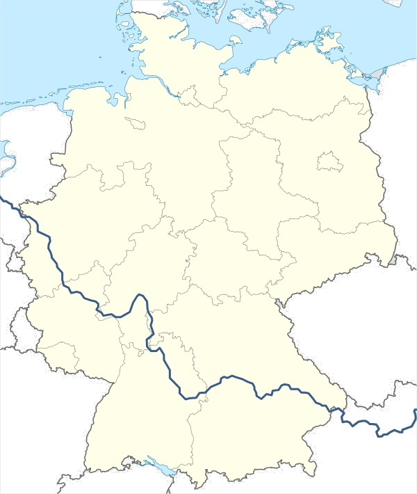

# Campaign Overview

*For players — no spoilers*

## The Setting

The year is 175 AD. Rome controls most of the known world, but its grip on the Germanic frontier is tenuous. Beyond the Rhine and Danube, tribal confederacies press against Roman borders with increasing aggression. The legions hold the line through discipline, engineering, and sheer will.

{width=100% fig-align="center" fig-alt="Map of the Roman Empire circa 125 AD showing territorial extent and frontier provinces"}

*Image: Andrein, Wikimedia Commons, Public domain.*

This is not the Rome of history textbooks. The gods are real. Priests of Jupiter call down fire. Augurs see genuine visions of the future. A soldier might survive a mortal wound because Mars willed it. Divine magic exists alongside Roman military doctrine, and both are taken seriously.

The frontier is cold, remote, and dangerous. Supply lines are long. Civilization is far away. Out here, you solve your problems with iron and pragmatism.

The Roman military has spent two centuries fortifying the Germanic frontier—a chain of forts, watchtowers, and patrol roads known as the *Limes Germanicus* stretching hundreds of miles from the Rhine to the Danube. Fort Vindolanda sits on this line. Beyond it: enemy territory.

{width=90% fig-align="center" fig-alt="Map showing the course of the Roman Limes Germanicus frontier fortifications"}

*Image: Theutatis, Wikimedia Commons, CC BY-SA 4.0.*

## The Premise

Your characters are members of a Roman military unit stationed at **Fort Vindolanda**, a legionary outpost on the Germanic frontier. The fort is routine duty—patrols, garrison work, the occasional skirmish with raiding parties.

That changes when a work crew digging a new well uncovers ancient ruins beneath the fort. What they find will pull your unit into a conflict that reaches from the Germanic forests all the way to Rome itself.

You have been selected—not for glory, but because you're capable and the commanding officer needs people he can rely on for a sensitive task.

## Themes

The campaign explores these central tensions:

- **Duty vs. Ambition** — What do you owe Rome, your unit, and yourself? When those obligations conflict, which wins?
- **Fate vs. Free Will** — The gods have plans. Augurs can see pieces of the future. Does that mean destiny is fixed—or is it a challenge to be fought?
- **Loyalty vs. Survival** — The people around you have their own agendas. Knowing who to trust, and when to stop trusting them, may matter more than combat ability.
- **Divine Intervention** — The gods of this world are real, active, and interested in mortal affairs. What does it mean to be noticed by something that vast?

## Who You Are

The party plays as a small unit of capable soldiers and specialists attached to Fort Vindolanda. Characters can be:

- Roman legionaries or officers serving their posting
- Auxiliary troops from other parts of the Empire
- Specialists attached to the legion (medics, engineers, scouts)
- Civilians with a connection to the fort (merchants, scholars, or those pressed into service)

What unites the party is assignment: you've been given a task, and the expectation is that you'll carry it out. What you do with that—and the complications that follow—is the campaign.

## What You Know at the Start

When play begins, your characters know the following as common knowledge:

- **Fort Vindolanda** is a standard garrison posting. It's not glamorous duty.
- **The Germanic tribes** to the north have been unusually active. Scouts have reported larger-than-normal raiding parties.
- **Something was found** in the ruins beneath the fort three days ago. There are rumors—dogs dying, soldiers acting strange, the augurs looking worried. Official information has been tight.
- **You've been summoned** to the principia (headquarters building) for a briefing. Whatever this is, command thinks you can handle it.

## The World Beyond the Wall

The tribes beyond the frontier are not a faceless mass. Dozens of distinct peoples—Chatti, Cherusci, Marcomanni, Quadi, and others—occupy the forests and river valleys north and east of the Limes. They trade with Rome when it's profitable, raid when it isn't, and form alliance confederacies that can put tens of thousands of warriors in the field.

{width=90% fig-align="center" fig-alt="Map showing distribution of Germanic tribal groups in central and northern Europe"}

*Image: Karl Udo Gerth, Wikimedia Commons, Public domain.*

Your characters know this world. They've patrolled its edges, traded at its boundary markets, maybe fought its warriors. The enemy is real, varied, and human.

## Key People at the Fort

These are the faces you'll encounter. What you see is what your characters know at the start.

| Name | Role |
|---|---|
| **Legate Marcus Aurelius Corvinus** | Commander of the fort. Hard man, mid-forties, scarred. |
| **Augur Cassia Liviana** | The fort's religious specialist. Pale, quiet, intense. |
| **Centurion Titus Varro** | Veteran soldier. Twenty years of service. Seen everything. |
| **Tribune Lucius Valerius Maximus** | Staff officer from Rome. Arrived recently, purpose unclear. |
| **Vercingetorix the Red** | Germanic chieftain from a neighboring tribe. Occasionally treats with Roman officers. |

There are others you'll meet as the campaign unfolds. First impressions may or may not be accurate.

## A Note on the Gods

In this world, treating the gods as real is not superstition—it's practical sense. Your characters grew up in a world where divine intervention is documented fact. Priests aren't just administrators; they're conduits for actual power. Omens aren't just cultural ritual; they carry information.

This doesn't mean the gods are friendly or on your side. It means they have their own interests, and those interests sometimes intersect with yours.
