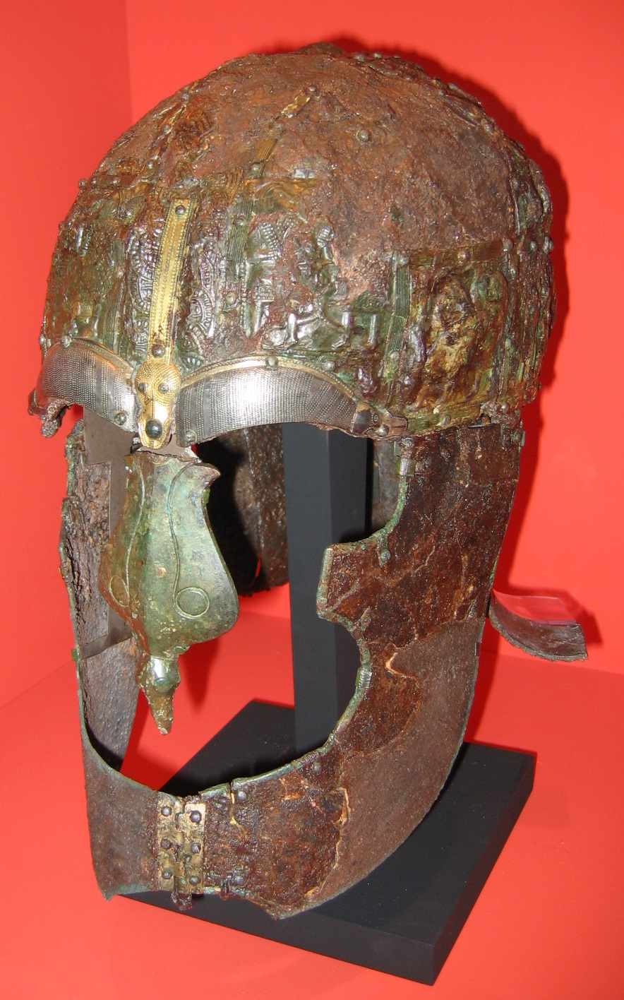
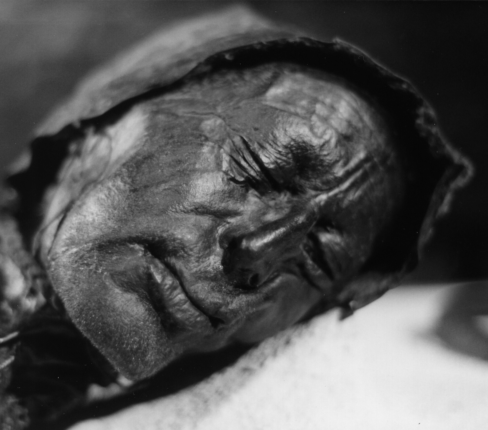

# Unit Roles: The *Vexillatio Extraordinaria*

You were not assigned to this unit. You were summoned.

Legate Corvinus sent for you individually, one at a time, for different stated reasons. The letter that reached you was brief and gave no explanation. When you arrived at the anteroom outside his office, you found others already waiting: people you may recognize by face or reputation, people whose skills are nothing like your own. You were not told why you were gathered. You were told to wait.

What Corvinus assembled is not a standard *contubernium*, the eight-man tent unit that forms the basic cell of Roman military life. It is a *vexillatio extraordinaria*: a special detachment, pulled together outside the normal chain of assignment, for a purpose that has not been officially stated. The official paperwork calls it a construction oversight team. The paperwork is wrong.

Each member of this unit holds a *role*: a formal military or religious position with defined duties, specific pay, and access that other soldiers do not have. These roles existed before you arrived and will need to be filled whether or not you fill them. Some were already occupied by others when Corvinus decided he needed this particular combination of people.

## How Roles Work

**Select one role at Session 0.** The role must match your character's qualifications: citizenship status, ability scores, and skill proficiencies as listed. No two characters can hold the same role. If you do not select a role, Corvinus assigns you the closest match to your skill set: this is a military unit, not an optional structure.

**Your role defines your access.** Each role gives you routine access to people, places, and information that other characters cannot reach without your help. This is not a power advantage: it is a texture advantage. Your *librarius* can read incoming dispatches; your *tesserarius* knows who is on watch and when the patrol gaps fall. These things matter.

**Your role comes with duties.** Between sessions, your character has performed their role's duties. This shapes what they know at the start of the next session and what resources they have access to. Neglecting duties without explanation has social consequences inside the unit.

**NPCs hold every role you do not.** The unit functions whether or not every PC holds a specialist position. Named soldiers fill the gaps and perform their jobs independently. They are colleagues, not shopkeepers: they attend the same briefings, eat at the same table, and have opinions about the party's decisions that they will share unprompted. When they die, their role becomes vacant and the unit feels the absence mechanically and personally.

## Pay Grades

Roman military pay in 175 AD comes in three official tiers:

| Grade | Latin | Annual pay | Who holds it |
|-------|-------|-----------|-------------|
| Standard | *Miles gregarius* | 300 denarii | Basic legionary; no specialist role |
| One-and-a-half | *Sesquiplicarius* | 450 denarii | Mid-tier specialists |
| Double | *Duplicarius* | 600 denarii | Senior specialists and officers |

All pay is reduced by approximately one-third through mandatory deductions for food, equipment maintenance, and the burial fund (*collegium funeraticium*). A soldier earning 300 denarii takes home roughly 200 per year.

Religious stipends (temple fund contributions) are paid separately and are not subject to military deductions.

## Role Advancement

Roles are not static appointments. They have internal rank, and rank within a role has mechanical consequences. Three tiers apply to every role in the unit.

**Probationer** (*tiro*): Newly assigned, unproven in the role's specific demands. Until you complete your first significant role-related task in the field: the once-per-session special mechanic is unavailable; pay is at the grade below the role's listed rate; some contacts and access are not yet established.

*Who starts here:* Any player who takes over a vacant role during play rather than at Session 0. NPCs recently assigned. Characters who have been demoted.

**Standard**: Fully functioning role holder. Full pay, full mechanics, full access as listed. All player characters begin at Standard tier at Session 0.

**Senior** (*senior miles*): Recognized expert, demonstrably effective under field conditions. Requires a specific achievement for each role; the trigger and bonus are listed in each role's entry. Senior tier adds one enhanced mechanic and a 50 denarii per year seniority bonus within the pay grade (DM discretion). Advancement happens immediately when the trigger is fulfilled, acknowledged at the end of the scene.

**Demotion**: Neglecting role duties for two consecutive sessions without a documented in-world reason (injury, reassignment, explicit orders) triggers demotion to Probationer. The DM announces this at the start of the third session. Recovery to Standard requires completing one significant role-related task the following session.

## Class and Equipment

The kit listed in each role's Starting Equipment section is what the Roman army issues. Whether you can use it effectively depends on your class's proficiencies. This section maps D&D class armor tiers to the four armor types in the campaign and notes thematic class fits for each role.

### Armor Tiers and Class Access

| Armor issued | Can use as-is | Substitute if lacking proficiency |
|---|---|---|
| *Lorica Segmentata* (heavy) | Fighter, Paladin, Cleric (War/Forge) | *Lorica Hamata* (medium) |
| *Lorica Hamata* or *Squamata* (medium) | Ranger, most Clerics, Artificer, Druid\* | *Linothorax* (light) |
| *Linothorax* (light) | Rogue, Bard, Warlock, Sorcerer | No substitute needed |
| No armor | Wizard, Monk (Unarmored Defense), Barbarian (Unarmored Defense) | Decline issued armor; use class AC calculation |

\*Druids will not wear metal armor by tradition. *Lorica Hamata* and *Lorica Squamata* are both iron. A druid substitutes *Linothorax* without penalty from the legion: the army's concern is functional combat readiness, not the material of the armor.

**Shields:** Issued to several roles as standard kit. Available to Fighter, Paladin, Ranger, Cleric, Druid, and Artificer. Characters without shield proficiency may carry an issued *scutum* but cannot use it for AC in combat.

**Barbarian Unarmored Defense:** The legion's requirement is functional combat readiness, not that the soldier wears a specific material. A Barbarian who declines armor and can demonstrate readiness is meeting the standard. The issued armor goes to the quartermaster. How other soldiers react to a colleague who fights unarmored and survives is a character moment worth playing.

**Monk kit:** Monks using Unarmored Defense decline all armor, which is inventoried with the quartermaster. The Roman army produces confusion and occasionally awe in response to a soldier who moves the way a trained Monk moves: this is not a disciplinary issue.

**Spellcasting equipment:** The army does not issue arcane foci or holy symbols. A spellcasting character provides their own:

- *Clerics and Paladins:* a small bronze amulet or reliquary of the patron deity, worn under the armor or on the belt
- *Druids:* a carved wooden focus or natural object, personal property
- *Wizards:* an arcane focus integrated into a personal item (carved bone stylus, engraved ring) carried in the document satchel for Librarius characters
- *Warlocks:* focus as personal item; form varies by patron type
- *Bards:* the *cornu* itself functions as a musical instrument focus for Cornicen players; any bard in another role carries a small personal instrument

### Thematic Class Fits

Any class can hold any role that meets its prerequisites. These notes highlight where class abilities and role functions align most naturally.

| Role | Strong fits | Why |
|---|---|---|
| Optio | Fighter, Paladin | Command and Aura features support formation leadership; heavy armor viable |
| Tesserarius | Ranger, Rogue | Perception required; Stealth synergy with night watch movement |
| Aquilifer | Fighter, Paladin | Heavy armor proficiency and Strength-focused builds match the physical demands |
| Signifer | Wizard, Cleric | INT 13 required; administrative duties suit high-INT builds; Cleric with banker role produces an interesting character |
| Cornicen | Bard | Performance required; Bardic Inspiration is narratively perfect for the formation signal mechanic; CON build |
| Medicus | Cleric, Artificer | WIS 13, Medicine; healing mechanics add to the role's own |
| Haruspex | Cleric, Wizard | WIS 14, Religion; *Augury* is on the Cleric spell list already |
| Faber | Artificer, Fighter | Tool proficiency required; Artificer's crafting abilities multiply the workshop mechanic |
| Librarius | Wizard, Rogue (Arcane Trickster) | INT 14; Forgery Kit; Intelligence-based builds get the most from dispatch access |
| Explorator | Ranger, Rogue | DEX 13; Natural Explorer directly applies; Cunning Action for patrol extractions |
| Frumentarius | Rogue | Deception + Insight; Uncanny Dodge for the contacts this role attracts |
| Sacerdos | Cleric, Druid | WIS 13, Religion; spell list gives the divine sign and last rites mechanics additional depth |
| Flamen Martialis | Paladin, Cleric (War) | WIS 15, genuine devotion required; divine smite and channel divinity both fit |
| Capsarius | Druid, Cleric (Life) | CON 12, Medicine; Life Cleric healing multiplier is very strong with field medic mechanic |
| Custos Armorum | Fighter, Artificer | STR 12; broad martial proficiency and tool access fit naturally |
| Foederatus | Barbarian, Fighter | STR 15; Rage directly powers the role mechanic; the most natural Barbarian home in the system |

## Universal Soldier Kit

Every soldier in the *vexillatio extraordinaria*, regardless of role, receives the following standard issue at campaign start. Add this kit to the role-specific equipment listed in each entry below for the character's complete load. Items already listed in a role kit (such as a wax tablet) are not doubled.

| Item | Weight | Notes |
|---|---|---|
| Mess kit (tin bowl, folding spoon, belt hook) | 1 lb | Stamped with unit mark; standard garrison issue |
| Tinder box (flint, steel, char cloth) | 1 lb | Kept in oiled leather pouch; field essential |
| 2× torches | 1 lb | Field issue only; not needed in fort |
| Bedroll, heavy wool | 7 lb | Doubles as emergency insulation; field and siege use |
| Water skin | 1 lb (empty) | Carried full (5 lb) on marches and patrols |
| 4 days' trail rations | 4 lb | *Buccellatum* (hardtack), salt pork, dried lentils |
| 20 ft braided hemp cord | 2 lb | Multi-purpose field use |

**Universal kit weight: 17 lb** (22 lb with full water skin)

**Starting denarii by pay grade:**

| Pay grade | Annual (net take-home) | Starting denarii |
|---|---|---|
| *Duplicarius* (600/yr) | ~400 net | 65 denarii |
| *Sesquiplicarius* (450/yr) | ~300 net | 50 denarii |
| *Miles gregarius* (300/yr) | ~200 net | 35 denarii |

Special cases: the *Haruspex* begins with 75 denarii (temple stipend front-loaded at posting start). The *Flamen Martialis* begins with 60 denarii (advance from the legate's personal patronage). The *Sacerdos* begins with 60 denarii (military rate plus shrine fund combined).

## Equipment at a Glance

All 16 roles listed with their issued armor, shield, weapons, and starting pay. Full detail (weight, class substitutions, kit rationale) is in each role's entry below.

| Role | Armor | AC | Shield | Weapons | Distinctive | Pay |
|---|---|---|---|---|---|---|
| **Optio** | Lorica Hamata | 14+Dex/+2 | Scutum | Gladius, Pugio | Hastile optioni (knobbed staff) | 65d |
| **Tesserarius** | Lorica Squamata | 14+Dex/+2 | Scutum | Gladius | Wax tablet on belt | 50d |
| **Aquilifer** | Lorica Segmentata | 17 | None | Gladius | Aquila eagle standard, Manica | 65d |
| **Signifer** | Lorica Hamata | 14+Dex/+2 | None | Gladius | Signum standard, banker's satchel | 50d |
| **Cornicen** | Lorica Squamata | 14+Dex/+2 | None | Gladius | Cornu (bronze horn) | 50d |
| **Medicus** | Lorica Hamata | 14+Dex/+2 | None | Pugio | Medical satchel, Healer's Kit | 65d |
| **Haruspex** | Linothorax | 12+Dex/+3 | None | Pugio | Bronze liver model, ritual kit | 75d |
| **Faber** | Lorica Hamata | 14+Dex/+2 | Scutum | Gladius, Dolabra | Tools kit | 50d |
| **Librarius** | Lorica Squamata | 14+Dex/+2 | None | Gladius, Pugio | Codex, cipher seal | 65d |
| **Explorator** | Lorica Squamata | 14+Dex/+2 | None | Gladius, Pugio, Verutum ×2 | Scout kit, signal mirror | 65d |
| **Frumentarius** | Lorica Hamata | 14+Dex/+2 | Scutum | Gladius, Pugio | Cipher seal (concealed) | 65d |
| **Sacerdos** | Lorica Squamata | 14+Dex/+2 | None | Pugio | Priestly kit, incense, white paludamentum | 60d |
| **Flamen Martialis** | Linothorax (red) | 12+Dex/+3 | None | Hasta (sacred spear) | Red paludamentum | 60d |
| **Capsarius** | Linothorax | 12+Dex/+3 | None | Gladius, Pugio | Capsa (medical cylinder on back) | 50d |
| **Custos Armorum** | Lorica Segmentata | 17 | Scutum | Gladius, Pugio | Armory keys, quality tools | 50d |
| **Foederatus** | Lorica Squamata or none | 14+Dex/+2 or Unarmored | Personal | Bipennis, Francisca ×2–3, Framea, or Dolabra (choose kit) | Personal combat charter (*foedus*) | 60d |

**Roles with no shield:** Aquilifer, Signifer, Cornicen, Medicus, Haruspex, Librarius, Explorator, Sacerdos, Flamen Martialis, Capsarius — the standard occupies both hands, the role requires constant arm freedom, or theological tradition forbids it.

**Heaviest armor (AC 17):** Aquilifer, Custos Armorum — both require STR 15.

**Lightest armor (AC 12+Dex/+3):** Haruspex, Flamen Martialis, Capsarius — all three prioritize mobility and fine-motor access over protection.

## Military Command Roles

### Optio (*Second-in-Command*)

**Pay:** *Duplicarius*, 600 denarii/year (take-home approximately 400)

**Prerequisites:** Citizen preferred; *Latini* with ten or more years of service may qualify. CHA 13 or STR 14. Proficiency in Athletics or Persuasion. Appointed by the centurion, confirmed by the legate. An existing *optio* must endorse you.

**Why this role exists:** A centurion commands eighty men and is regularly away from the unit on orders, in conference, or in combat. The *optio* keeps the century functioning in his absence: drilling, briefing, accounting for the dead, and making the hundred small decisions that keep a military unit from becoming a rabble. The *optio* is also responsible for the unit's discipline in ways the centurion does not want formally recorded.

**Duties between sessions:** Morning briefings, patrol schedule maintenance, casualty reports, drilling the unit, reviewing the watch log from the previous night.

**Mechanic:** Once per session, reroll one initiative (yours or an ally's, declared before or after the roll). As a bonus action, issue an order: one ally within 60 feet moves up to their speed without expending their reaction.

<strong>Starting Equipment</strong>

The optio commands from the rear of the formation: pushing stragglers forward, enforcing the line, and keeping the unit coherent when the centurion is engaged at the front. The distinctive equipment is the *hastile optioni* (the knobbed staff) rather than a *pilum*: it is the visible mark of the optio's authority and is used as much to prod soldiers back into position as to strike an enemy.

**Starting denarii:** 65 d

- **Body:** *Lorica Hamata* (AC 14 + Dexterity modifier, max +2, 22 lb). The optio moves through the ranks: forward to reinforce the front, backward to pull stragglers into line. Chainmail flexes where segmented plate would catch and slow. Senior rank warrants more than light armor; this is the natural middle.
- **Helmet:** *Galea Coolus* with back-to-front crest (AC +1, 5 lb). The optio's crest runs longitudinally like a standard soldier's, but in a distinct color or height: a mark of office that stops well short of claiming the centurion's transverse crest.
- **Shield:** *Scutum* (+2 AC, 10 lb). Carried in deployment; stored when conducting briefings and administrative duties.
- **Arms:** Leather gauntlets (1 lb). Standard for any officer who handles written records and formation reports.
- **Cloak:** *Sagum* (4 lb).
- **Boots:** *Caligae* (2 lb).
- **Belt:** *Cingulum Militare* with decorative bronze fittings and wax tablet (3 lb). The quality of the fittings is the first visible indicator of the optio's rank; a soldier who looks carefully at the belt reads the role immediately. The tablet carries the current duty roster and watch log.
- **Weapons:** *Gladius* (3 lb) + *Pugio* (1 lb). Both worn at all times.
- **Distinctive:** *Hastile optioni*, wooden staff with bronze knob (3 lb). Carried instead of a *pilum* in formation. Functions as a club (1d4 bludgeoning) if used as a weapon, but the primary purpose is authority and enforcement. Every soldier who sees the knobbed staff knows what it means and who is carrying it.

**Role kit weight:** 54 lb | **Full kit with universal issue:** 71 lb. At CHA 13 or STR 14, carrying capacity is at least 195 lb; well within comfortable range.

**Not issued:** No *pilum* (the staff replaces it in formation). No two-handed weapon. The optio is a command role, not a spearhead; their kit reflects the management of the line, not the assault on it.

**Advancement**

**Standard** (0 commendationes): Once per session, reroll one initiative (yours or an ally's). As a bonus action, issue an order moving one ally within 60 feet up to their speed.

**Veteranus** (3 commendationes): Choose one branch.

<strong>Branch A: *Ductor* — Leader of men</strong>

**Perk 1: *Impetus Ductoris*** — Once per short rest, when you give a verbal command to an ally who can hear you, they may immediately move up to half their speed as a reaction. This movement does not provoke opportunity attacks.

**Specialis** (7 commendationes):

**Perk 2: *Auctoritas*** — Your command presence is recognized by all ranks. Allied NPCs under your direct command have advantage on Wisdom saving throws against fear effects. Officers who outrank you must make a DC 14 Charisma saving throw to publicly countermand your orders in front of common soldiers; on a failure, they appear indecisive and lose one step of attitude among the soldiers present.

<strong>Branch B: *Scrutator* — Investigator and disciplinarian</strong>

**Perk 1: *Nota Suspectorum*** — You have advantage on Wisdom (Insight) checks to detect deception or gauge loyalty. When you spend at least 10 minutes interrogating a subject, the DM must tell you if the subject is actively lying, though not what the truth is.

**Specialis** (7 commendationes):

**Perk 2: *Retes Disciplinae*** — *(Latinus+)*
You maintain a quiet network of informants within the unit. Once per session, you may learn the current location and general activity of any named soldier or camp NPC without making a check: the information is accurate to within the last 2 hours.
*Requires Latini status: disciplinary authority over Roman-born soldiers is restricted to those with legal standing.*

<strong>Class equipment substitutions</strong>

**Wizard / Sorcerer / Warlock:** Replace *Lorica Hamata* and *Scutum* with: arcane focus (rod or wand), component pouch, spellbook (Wizard only), padded armor or mage armor (Sorcerer/Warlock). Retain *Gladius*, *Pugio*, *Hastile optioni*, helmet, cloak, boots, belt, and wax tablet.

**Cleric / Druid:** Replace *Scutum* with holy symbol (shield-mounted counts if proficient). Retain *Lorica Hamata* if class allows medium armor; replace with scale mail if not. Retain *Gladius* and *Pugio*; a Druid replaces the *Gladius* with a mace or staff.

**Bard:** Replace *Lorica Hamata* with leather armor. Retain *Gladius* and *Pugio*; replace *Scutum* with a hand crossbow. Add a small personal instrument (horn or mandolin). Retain *Hastile optioni* as a club.

**Paladin / Ranger:** No substitution required. Retain full kit.

**Rogue:** Replace *Lorica Hamata* with studded leather. Retain *Gladius* and *Pugio*; replace *Scutum* with a hand crossbow and shortsword.

**Monk:** Replace *Lorica Hamata* and *Scutum* with clothing (Monk's Unarmored Defense applies). Replace *Gladius* with shortsword or two handaxes. Add 10 darts. Retain *Hastile optioni* as a Monk weapon (club).

**Fighter / Barbarian:** No substitution required. Retain full kit.

<strong>The Optio's Daily Reality</strong>

The centurion commands; the optio keeps things running. In practice this means you are the person the centurion does not want to deal with personally: the soldier who is drunk before noon, the latrine roster that has not been updated in a week, the debt between two tentmates that is about to become a fight. None of this goes in the official record. You handle it, you file a note in your own log, and the centurion hears about it only if it escalates past what you can contain.

The knobbed staff is not ceremonial. You use it. In formation, men who drift from the line feel the end of the staff between their shoulders before they hear your voice. The staff is a statement about your relationship with the men you manage: close enough to reach them, far enough back to see the whole line. A centurion leads from the front; an optio manages from the rear. This distinction matters and both roles know it.

Between engagements you are primarily a bureaucrat. Morning briefings, casualty reports, equipment inspections, watch log review. The centurion arrives to the briefing and you have already done the work. If you have done it well, the centurion says nothing and that means the day is going correctly. If you have done it badly, the centurion says nothing in front of the men and says everything in private. You learn quickly to tell the difference between the two silences.

<strong>Citizenship, Authority, and the Advancement Track</strong>

The optio's authority to physically discipline soldiers without formal trial is called *coercitio*. In Roman military law this power flows from commissioned rank, which technically requires citizen or Latini standing. A citizen soldier who is struck by a non-citizen optio has grounds to protest, not to a sympathy audience, but to the legal mechanism that Roman military law provides. In practice, the centurion would back the optio; in principle, the record exists. This is why the role specification says citizen preferred: it is not tradition, it is the difference between authority that holds and authority that can be challenged.

Your path to centurion is the most clearly defined advancement track in the legion. The sequence is miles to *immunis* (skilled specialist) to optio to centurion, when a position opens. Positions open when centurions die, retire, or are transferred. In peacetime, on a stable frontier, you might serve as optio for ten years before a centurionate opens. In a campaign year, three positions might open in a month. The frontier posting is not comfortable but it is productive for advancement.

What accelerates the path is a letter. A recommendation from the legate, the provincial governor, or any senator with a military connection can move your name ahead of others who have been waiting longer. Corvinus writes recommendations selectively: soldiers who have performed under pressure, in front of witnesses, in ways that do not require him to explain the circumstances. Understanding what kind of performance earns a letter from Corvinus is part of understanding what kind of officer he is.

Centurion pay is *triplicarius*: three times standard wages, take-home approximately 600 denarii per year after deductions. Beyond pay, a centurion owns a private quarters in the barracks, employs an orderly from unit ranks without having to ask permission, and has the right of *fustigatio*: formal beating of soldiers for disciplinary offenses, recorded and reported, not the informal coercitio you exercise now. The distinction between the two is the paperwork.

<strong>History +3 — Chain of command and who reports to whom</strong>

The chain runs: *miles* (legionary) to the *decanus* (tent-leader) to the *optio* to the centurion to the *tribunus* to the legate. Each link has defined authority and defined limits. An *optio* who gives orders that contradict the centurion's is insubordinate; an *optio* who fails to pass information up the chain is negligent. You know the difference, and you know which officers in this fort are currently walking the line between the two.

The legate's staff includes a *cornicularius* (senior administrative officer), a *beneficiarius* (special assignment soldier), and a rotating set of tribunes. The fort currently has one acting tribune following the reassignment of the previous occupant.

<strong>History +5 — Political appointments vs. soldiers</strong>

Not every officer in the Roman army earned the position. Tribune appointments in particular are often political: young men from senatorial families completing their military service before returning to Rome. Some of them are capable. Many of them are not. You can tell the difference within the first week of working with them, and you know which tribune this fort recently had was not there because of his military record.

The centurion system is more reliable: centurions generally rise through the ranks. But "generally" is not "always," and a centurion who owes his appointment to a patron in Rome is a different animal from one who earned it in the field.

<strong>DC 17 Wisdom (Insight) — Who is reporting to whom outside the chain</strong>

Every large Roman military establishment has secondary information flows that bypass the official chain of command. The *frumentarii* (grain officers) are the most formal of these, but they are not the only channel. Several officers in this fort are filing information to Rome through routes that do not pass through Corvinus's desk. You do not know which ones or what they are saying. But you know the pattern: when the legate is surprised by an order that should have required his input, someone else's information got there first.

If you spend a session paying attention to which soldiers have private conversations with the dispatch rider rather than submitting written reports, you will narrow the list.

### Tesserarius (*Watch Officer*)

**Pay:** *Sesquiplicarius*, 450 denarii/year (take-home approximately 300)

**Prerequisites:** Any legal status. INT 12. Proficiency in Perception. Clean disciplinary record (no recorded infractions). Appointed by the centurion.

**Why this role exists:** The *tessera* is the daily watchword: a small clay tablet passed hand to hand from the legate's office to every watch post before sundown. If an enemy knows the password, they can walk through the gate. The *tesserarius* is personally responsible for ensuring the word travels securely and that every sentry receives it. They also maintain the watch rotation so that the same soldier is never on the same post two nights running: predictable guards are bribeable guards.

**Duties between sessions:** Assign night watch rotations, deliver the *tessera* each morning, record who was on which post, note any irregularities in the watch log.

**Mechanic:** You always know the current day's password and the complete patrol schedule. You can create a false password (DC 14 Deception, detected on DC 15 Investigation by anyone who has seen the real one). You know which posts are currently manned and by whom.

<strong>Starting Equipment</strong>

The tesserarius moves through the fort at night: checking posts, delivering the password, reading what the sentries are doing without announcing themselves at distance. The kit is lighter and quieter than a front-line soldier's, optimized for movement in confined spaces and in the dark.

**Starting denarii:** 50 d

- **Body:** *Lorica Squamata* (AC 14 + Dexterity modifier, max +2, 20 lb). Scale armor generates no Stealth disadvantage: a watch officer checking posts at the third hour of the night cannot afford to rattle at each step.
- **Helmet:** *Galea Attica*, open face (AC +1, 4 lb). The tesserarius needs to hear the post they are checking before they arrive at it. Closed cheek guards muffle the ambient sounds that indicate whether something is wrong.
- **Shield:** *Scutum* (+2 AC, 10 lb). Carried in alert conditions; left at the duty station during routine night checks. Moving through the fort's narrow internal passages with a large oval shield creates more problems than it solves.
- **Cloak:** *Sagum*, dark wool (4 lb). Advantage on Stealth checks in dim light is directly useful for a role that moves between lit checkpoints and unlit wall sections.
- **Arms:** Padded leather finger-guards (0.5 lb). Night watch requires handling wax tablets, gate keys, and latch-pins in darkness and cold; the padded leather tips protect against numb-finger errors without reducing the tactile sensitivity needed to feel whether a door has been tampered with. When making a check by touch in dim light or darkness to determine if a lock, seal, or latch has been manipulated, you have advantage.
- **Boots:** *Caligae* (2 lb). The hobnails create noise on stone floors; experienced tesserarii walk on the balls of their feet during sensitive checks.
- **Belt:** *Cingulum Militare* with wax tablet and stylus attached (3 lb). The tablet for recording watch irregularities is on-person at all times during duty hours.
- **Weapon:** *Gladius* (3 lb). The tesserarius's work is not usually combat. A single blade on the hip is the correct issue for a duty officer moving through a secured fort.

**Role kit weight:** 47 lb | **Full kit with universal issue:** 64 lb. Light enough to move through the fort without generating sound that carries ahead.

**Not issued:** No *pilum* (range engagement inside a fort is not the watch officer's role). No heavy armor. The tesserarius is not the first line; they are the person who ensures the first line is where it should be.

**Advancement**

**Standard** (0 commendationes): Know the current day's password and full patrol schedule. Create a false password (DC 14 Deception). Know which posts are manned and by whom at all times.

**Veteranus** (3 commendationes): Choose one branch.

<strong>Branch A: *Vigilator* — Watchmaster</strong>

**Perk 1: *Custodia Perfecta*** — You have advantage on Wisdom (Perception) checks while on guard duty or watching a fixed point. Allied characters you are directly supervising cannot be surprised while you are conscious and not incapacitated.

**Specialis** (7 commendationes):

**Perk 2: *Patres Stationis*** — You have trained a reliable watch rotation. Once per long rest, you may designate up to two allied NPCs as your watch. While they are on duty under your direction, you and the rest of the contubernium gain the benefits of a short rest during what would otherwise be a guard shift.

<strong>Branch B: *Infiltrator* — Counterintelligence operative</strong>

**Perk 1: *Lapsus Clandestinus*** — You have advantage on Dexterity (Stealth) checks to move through occupied civilian spaces (markets, taverns, crowds). When you follow a target for more than 1 hour without being detected, you automatically learn their next planned meeting or destination.

**Specialis** (7 commendationes):

**Perk 2: *Persona Falsa*** — You have built a civilian cover identity registered with the Frumentarius network. Once per session, you may invoke this identity to pass as a non-military person. Any NPC not already suspicious of you must succeed on a DC 15 Wisdom (Insight) check to see through the cover.

<strong>Class equipment substitutions</strong>

**Wizard / Sorcerer / Warlock:** Replace *Lorica Squamata* with padded armor or mage armor. Replace *Scutum* with arcane focus (rod or wand) and component pouch. Add spellbook (Wizard only). Retain *Gladius*, helmet, cloak, boots, and belt with wax tablet.

**Cleric / Druid:** Retain *Lorica Squamata* if class allows medium armor; replace with *Linothorax* if not. Replace *Scutum* with holy symbol (worn on cord or belt); a Druid replaces the *Gladius* with a mace or wooden staff.

**Bard:** Replace *Lorica Squamata* with leather armor. Retain *Gladius*; replace *Scutum* with a hand crossbow. Add a small personal instrument (horn or mandolin).

**Paladin / Ranger:** No substitution required. Retain full kit.

**Rogue:** No substitution required. The Tesserarius's standard kit is already well suited to Rogue builds. Retain full kit.

**Monk:** Replace *Lorica Squamata* and *Scutum* with clothing (Monk's Unarmored Defense applies). Replace *Gladius* with shortsword or two handaxes. Add 10 darts.

**Fighter / Barbarian:** No substitution required. Retain full kit.

<strong>The Tesserarius's Daily Reality</strong>

The tessera travels from the legate's office to you each evening before sundown. You carry it in person to every guard post in sequence, receiving a verbal acknowledgment from each sentry that the word has been received. You do not write the password down. You do not send it by messenger. You carry it yourself, every night, regardless of weather, regardless of your other duties that day, regardless of how many hours you have already been awake.

This is not formality. The password is the single point of failure in the fort's nighttime security. If it leaks between you and a guard post, men die. The personal delivery is the chain of custody. Your presence at each post also means you are the only officer with a complete physical picture of the watch at the moment it was established: who was actually standing at which post, how alert they were, whether there was anything irregular in the gate approaches. This information lives in your watch log, not in any official report.

The watch log is the most important document you maintain and the one most likely to matter after the fact. When something goes wrong at night, the first question is always: who was where, and who says so. You say so, in writing, with the time noted. Soldiers know this. It makes them slightly more careful when you are watching, and slightly less careful when they think you are not. Part of your job is ensuring they never know for certain which is which.

<strong>Citizenship, Authority, and the Advancement Track</strong>

There is no citizenship requirement for this role, which creates a recurring tension. The tesserarius exercises authority over citizen soldiers in the middle of the night, in the dark, at guard posts where no officer is present to co-sign the interaction. A citizen soldier who disputes a tesserarius's authority at a guard post is technically on reasonable legal ground: the tesserarius's power is delegated, not inherent, and delegation from a citizen officer to a non-citizen officer is legally thin.

In practice this tension is managed by reputation, by the watch log, and by the centurion's explicit backing. A centurion who publicly supports the tesserarius's authority makes challenges functionally impossible without direct insubordination. A centurion who is ambiguous about it, even privately, creates a vulnerability that a resentful soldier will eventually find. You know within the first week whether your centurion is giving you real authority or the appearance of it.

Your natural advancement is to optio: you have the administrative skills, the disciplinary awareness, and the detailed knowledge of the unit's patterns. What you may need to acquire is the physical presence to command in daylight and in formation, which is different from the quiet authority of a night duty officer. An optio who cannot hold a briefing commands nothing; you work in a domain where silence and precision matter. The transition requires practice in a different mode.

The tesserarius position gives you a specific asset that most soldiers lack: a detailed written record of who was on duty, when, and in what condition across the entire period of your service. This record is transferable as evidence of reliability. Officers reviewing candidates for promotion can read what you actually produced, not just what someone said about you.

<strong>Tesserarius — Official patrol schedule and gate assignments</strong>

The fort operates four watches through the night, each approximately three hours. The north gate is guarded in pairs; the east and west posterns are single-sentry positions with a roving check every two hours. The principia (headquarters building) has its own guard independent of the wall rotation.

The password changes daily. The rotation for who receives it first follows seniority by post: the north gate gets it before the east postern. This is standard procedure and anyone who knows the schedule knows the order.

<strong>Perception +5 — Gaps in the patrol pattern</strong>

No patrol schedule is perfectly enforced. The east postern's roving check runs long when Decanus Arvina is on duty: he stops at the grain store to talk to the night worker. The northwest corner of the outer wall has a blind spot between the third and fourth watch that the wall layout creates structurally. These gaps are in your log. They exist in every fort and every experienced soldier knows they exist.

The relevant question is not whether the gaps exist but whether anyone has been using them deliberately.

<strong>DC 17 Intelligence (Investigation) — Compromised guards and outside contacts</strong>

Three soldiers on the current rotation have behavior patterns that require explanation. One is always asleep at his post but never formally reported: someone is covering for him. One has been at the east postern specifically on the three nights in the past month when the civilian settlement outside the walls reported unusual sounds. One submitted a watch log for a night when you can confirm he was not actually at his assigned position.

None of this is in the official record. You noted it in a separate document. The question is what to do with it.

### Aquilifer (*Eagle Standard Bearer*)

**Pay:** *Duplicarius*, 600 denarii/year (take-home approximately 400); plus ceremonial honorarium from the legion's festival fund (50 denarii/year)

**Prerequisites:** Roman citizen (*Cives Romani*) only. Free-born, not a freedman. STR 15. Proficiency in Athletics. Minimum five years of service. Recommended by the centurion and personally confirmed by the legate. A loyalty examination is administered before the appointment is finalized.

**Note:** This role is vacant when the campaign begins. Aquilifer Gaius Metellus was found dead near the ruins entrance. The eagle is currently secured in the *principia* under double guard. Corvinus has not announced Metellus's replacement.

**Why this role exists:** The *aquila* is not a symbol. It is the legion's legal identity, its honor made physical, the object whose loss constitutes the destruction of the unit in Roman law. Three eagles were lost at Teutoburg. Their numbers were retired. The *aquilifer* carries the weight of this history every time he lifts it. He does not put it down in the field. He does not surrender it. He dies first.

**Duties between sessions:** Guard the eagle at all times when it is not secured in the *principia*. Lead the standard in formal ceremony. Perform the unit's religious rites at the fort shrine.

**Mechanic:** While you carry the eagle, all allies within 30 feet have advantage on saving throws against fear effects. If the eagle falls (you drop it or die while carrying it), all allies within 60 feet make a DC 16 Wisdom saving throw or become frightened for one minute. Once per session, invoking the eagle before a combat grants all allies a free bonus action on their first turn.

<strong>Starting Equipment</strong>

The aquilifer's kit is shaped by one constraint: one hand holds the eagle, always. In the field, both hands are not available for fighting. This eliminates shields and two-handed weapons from the role permanently. The compensation is that the most visible soldier in the unit wears the best armor the legion issues.

**Starting denarii:** 65 d

- **Body:** *Lorica Segmentata* (AC 17, 20 lb). Issued standard. The aquilifer must survive long enough to be worth watching.
- **Helmet:** *Galea* with transverse crest (AC +1, 6 lb). The crest marks the bearer at distance and in ceremony. By custom, a bear or wolf pelt is draped over the helmet and falls to the shoulders: this is traditional identification, not an additional mechanical slot.
- **Arms:** *Manica* on weapon arm (AC +2 against weapon-arm attacks, 3 lb). No shield is possible; the manica compensates for the unprotected sword side.
- **Cloak:** *Sagum* (4 lb). The eagle does not get put down for weather.
- **Boots:** *Caligae* (2 lb).
- **Belt:** *Cingulum Militare* with brass fittings (2 lb). Rank marking; required for ceremonial duties. Double-pay grade fittings are standard.
- **Weapon:** *Gladius* (1d6 piercing or slashing, finesse, 3 lb). The only weapon compatible with this role in formation: drawn right-handed while the eagle occupies the left.

**Role kit weight:** 40 lb | **Full kit with universal issue:** 57 lb. Carrying capacity at STR 15: 225 lb (half-capacity threshold: 112 lb). The strength prerequisite exists for holding the *aquila* aloft for hours under march conditions, not for managing the kit.

**Not issued:** No shield; no two-handed weapon; no ranged weapon (the stance required for archery or sling use is incompatible with standard-bearing in any formation). These are not restrictions placed on the soldier: they are the logical consequence of what the role requires.

**Class substitution:** *Lorica Segmentata* requires heavy armor proficiency (Fighter, Paladin, War/Forge Cleric). Without it, the legion issues *Lorica Hamata* instead: same visual weight, slightly less protection, no proficiency required. The STR 15 prerequisite still applies: the eagle's weight demands it regardless of armor choice.

**Note on the eagle:** The *aquila* is not personal equipment. It belongs to the legion. Its weight (approximately 15 lb for the gilded bronze assembly) is the bearer's burden in the field. When secured in the *principia*, it is guarded under separate protocol and is not the aquilifer's responsibility to stand watch over personally.

**Advancement**

**Standard** (0 commendationes): While carrying the eagle, allies within 30 feet have advantage on fear saving throws. Once per session, invoke the eagle before combat to grant allies a free bonus action on their first turn.

**Veteranus** (3 commendationes): Choose one branch.

<strong>Branch A: *Bellator* — Warrior-bearer</strong>

**Perk 1: *Aquila Vincit*** — While you carry the *aquila*, allied soldiers within 30 feet have advantage on saving throws against being frightened. As a bonus action, you may issue a battle cry, granting allies within 30 feet advantage on their next attack roll before the end of their next turn.

**Specialis** (7 commendationes):

**Perk 2: *Fortitudo Legionis*** — *(Civis)*
When you are reduced to 0 hit points while carrying the *aquila*, you may choose to remain conscious with 1 hit point. This feature recharges after a long rest. If the *aquila* falls to the ground, all allies within 60 feet must make a DC 13 Wisdom saving throw or become frightened until the start of their next turn.
*Requires full citizenship: the right to die for the aquila is a legal and religious privilege of Roman citizens.*

<strong>Branch B: *Custos Aquilae* — Sacred guardian of the eagle</strong>

**Perk 1: *Memoria Sacra*** — You have learned the rites of the *aquila*'s sacred maintenance. When you perform a 10-minute ritual prayer at the start of a day, roll a d6. On a 4 or higher, Mars grants a boon: all allies within 60 feet gain +1 to attack rolls until your next long rest. This ritual cannot be performed if the unit has an unresolved corruption penalty.

**Specialis** (7 commendationes):

**Perk 2: *Nexus Aquilae*** — *(Civis + Religion proficiency)*
You are a living conduit between the unit and Mars. Once per long rest, when an ally within 60 feet would be reduced to 0 hit points, you may use your reaction to redirect that damage to the *aquila* instead. The *aquila* is treated as an object with AC 18 and 20 hit points for this purpose. If the *aquila* reaches 0 hit points, it is desecrated: a major narrative consequence.
*Requires citizenship and religious training: this rite is reserved for those bound to Rome by law and to Mars by vocation.*

<strong>Class equipment substitutions</strong>

**Wizard / Sorcerer / Warlock:** The Aquilifer's STR 15 prerequisite and the one-hand eagle requirement make this role a poor fit for arcane casters in combat, but the appointment is possible. Replace *Lorica Segmentata* with mage armor or padded armor. Retain *Gladius* if proficient; otherwise replace with a dagger or arcane focus. Retain helmet, cloak, boots, and belt. The *aquila* always occupies one hand.

**Cleric / Druid:** Replace *Lorica Segmentata* with scale mail if class does not allow heavy armor. Retain *Gladius* (Druid: replace with mace). Holy symbol worn under armor or on the belt; does not conflict with eagle-bearing.

**Bard:** Replace *Lorica Segmentata* with leather armor. Retain *Gladius* if proficient; otherwise replace with a shortsword. The eagle occupies one hand, leaving the other for a one-handed weapon only.

**Paladin / Ranger:** No substitution required. Retain full kit. Paladin is the natural fit: STR 15, heavy armor, one hand free for the eagle.

**Rogue:** Replace *Lorica Segmentata* with studded leather. Retain *Gladius* (used as a finesse weapon one-handed; the eagle occupies the other hand).

**Monk:** The STR 15 prerequisite and the Aquilifer's combat demands are unusual for a Monk. Replace *Lorica Segmentata* with clothing (Unarmored Defense applies). The *aquila* occupies one hand; the other is free for Monk weapon strikes. Add 10 darts.

**Fighter / Barbarian:** No substitution required. Retain full kit.

<strong>The Aquilifer's Daily Reality</strong>

You carry the legal identity of the legion. This is not a description of weight or symbol: under Roman military law, the *aquila* is the instrument that constitutes the unit as a legal entity. When the legion enters into contracts, pays soldiers, receives supplies, and sends dispatches, it does so as an institutional actor, and the institutional actor is the eagle. You are the person who makes the legal institution physically present in the world.

In the field this manifests practically: you stand at a fixed position during battle, one that is carefully chosen to be visible to the maximum number of allied soldiers and minimally exposed to enemy contact. You do not advance with the assault; you do not retreat with the rearguard. You hold the center, and the unit fights around you, partly because of your safety and partly because you are the visible reference point they navigate by. When the smoke and dust of an engagement strips away every other landmark, soldiers find their position relative to where the eagle is.

Between engagements the eagle is secured in a locked chamber beneath the *principia*, under guard that rotates on the standard watch schedule but is supplemented by a second guard specifically assigned to the chamber door. You hold the key to the outer chamber; the legate holds the key to the inner shrine. Both keys are required to move the eagle for non-ceremonial purposes. You attend every formal ceremony where the eagle is present. You participate in the religious rites that accompany the eagle's movement. You do not leave the fort without accounting for the eagle's secure storage.

The animal pelt worn over your helmet is not decorative. It identifies you at distance as the person who must not be killed first: an enemy who kills the aquilifer and captures the eagle before the unit can recover it has destroyed the legion in Roman law. Germanic tribes know this. The pelt also places you in a specific visual category alongside the signifer: you are both marking yourselves as targets precisely because the units around you know that protecting those targets matters.

<strong>Citizenship, Responsibility, and the Weight of the Role</strong>

Citizenship is absolute for this role, and the reason is not tradition. The *aquilifer* is required to give a formal oath (*sacramentum*) specifically tied to the eagle at the time of appointment. This oath is a legally binding contract under Roman law, between the bearer and Jupiter Optimus Maximus, witnessed by the legion. A non-citizen cannot enter this legal contract in the same form. Attempting to create a workaround, such as having a citizen witness swear on the non-citizen bearer's behalf, produces an oath that the Roman legal system does not recognize as binding. The entire institutional function of the eagle rests on the oath being valid.

Beyond citizenship, the appointment requires a personal financial bond. The legate holds guarantees, either land deeds, family pledges, or deposited coin, against the eagle's loss or theft. If you die and the eagle is captured, the bond is not called: you fulfilled your obligation. If you surrender the eagle or allow it to be taken without fighting to the death, the bond is called and your named beneficiaries are liable. You know this when you accept the appointment. Everyone knows this. It is why the appointment comes with the highest respect in the unit and the highest personal risk.

There is no formal advancement track from aquilifer to a more senior role. The position is effectively a career endpoint for many who hold it: you serve until you retire or die, and upon retirement you receive an enhanced discharge grant reflecting the unusual nature of what you held. Some aquilifers transfer to signifer roles in larger units, leveraging their ceremonial experience and administrative visibility. A very small number, those who survived engagements where the eagle was threatened and recovered, receive direct recommendations to Rome and appointments to the imperial guard or the temple priesthoods.

The soldiers around you know your name. This is not universal. Most soldiers in a garrison of 1,000 are unknown to their colleagues beyond their immediate *contubernium*. You are known because you were at the ceremony when the oath was sworn, and everyone present heard your name said aloud before the assembled unit. That name is now attached to the eagle, and every soldier who was there carries both.

<strong>History +3 — This legion's history and battle honors</strong>

The eagle has been with this legion for generations. Its current casing dates to a repair done after a Dacian campaign forty years ago: a silversmith in Carnuntum did the work, and his mark is still on the base. Every *aquilifer* since then has known that mark by touch in the dark.

The battle honors attached to the eagle's shaft include campaigns in Britannia, two Dacian wars, and the eastern frontier under Trajan. The most recent honor is a scroll of commendation from Marcus Aurelius for service on the Danube, three years past.

<strong>History +5 — Lost eagles and the men responsible</strong>

Three legions' eagles were lost at Teutoburg: XVII, XVIII, XIX. Their numbers were never reused. Two of the three eagles were eventually recovered under Augustus and Germanicus, through intelligence operations and punitive campaigns that lasted decades.

The third was never found. Some historians believe it was ritually destroyed by the Germanic tribes. Others believe it still exists somewhere in the forest east of the Rhine. Soldiers in frontier postings do not discuss this possibility out loud.

An *aquilifer* who loses the eagle does not survive the event as a practical matter. This is not a rule; it is an understanding. The role has a built-in exit condition.

<strong>Religion +7 — The blessing spoken over the eagle</strong>

The formal dedication spoken over the eagle during installation is a legally binding oath under Roman military law. It constitutes a contract between the bearer and Jupiter Optimus Maximus, witnessed by the legion. Breaking it is not a disciplinary infraction: it is a religious offense that carries specific divine consequence.

You know the text. You know why Metellus was found dead without it having been spoken over him (he was not the formal bearer; he had temporary custody while the role was vacant). You also know that the eagle in the vault below the fort is not a military standard. It is something older, and the blessing that governs it is a different text entirely.

### Signifer (*Standard Bearer and Unit Banker*)

**Pay:** *Sesquiplicarius*, 450 denarii/year (take-home approximately 300)

**Prerequisites:** Any citizen or *Latini* status. INT 13. Must be literate in Latin. Proficiency in History or Persuasion. Appointed by the centurion.

**Why this role exists:** The *signifer* carries the unit's *signum* (the sub-unit standard, distinct from the eagle) as a battlefield rallying point. He also serves as the unit's banker: soldiers deposit their savings with the *signifer* because he cannot run. He carries the standard. The standard stays. Therefore, so does the money. It is a practical arrangement built on a reasonable assumption about human behavior under fire.

**Duties between sessions:** Carry the *signum* in formation. Maintain the death benefits ledger. Record savings deposits and withdrawals. File the monthly financial return to the legate's office.

**Mechanic:** Access to the unit savings fund (currently 100 gp at campaign start). Drawing on the fund requires DC 14 Persuasion (a majority of the unit votes to authorize it) or DC 18 Deception (forging the ledger, detected on DC 16 Investigation by anyone who checks). The fund grows when the party completes supply missions or recovers assets.

<strong>Starting Equipment</strong>

The signifer carries the *signum* in one arm in the field: a pole standard topped with discs and decorations that rally the unit's sub-element. The arm holding the standard cannot simultaneously hold a shield, so the role trades one protection for another. The kit also reflects the banking duties: the signifer carries administrative tools that most soldiers never touch.

**Starting denarii:** 50 d

- **Body:** *Lorica Hamata* (AC 14 + Dexterity modifier, max +2, 22 lb). Chainmail over segmented plate: the signifer adjusts position constantly, staying visible to the unit while managing the standard's weight and angle, and the flexibility of linked rings suits this better than rigid plates.
- **Helmet:** *Galea Coolus* with animal pelt (AC +1, 5 lb). Wolf or bear pelt draped over the helmet and shoulders is the traditional mark of the signifer: it identifies the bearer in smoke, dust, and close combat. The *galea coolus* underneath provides standard protection.
- **Arms:** Leather gauntlets (1 lb). The banking duties require writing; light gauntlets protect the hands without preventing fine work with a stylus on wax.
- **Cloak:** *Sagum* (4 lb).
- **Boots:** *Caligae* (2 lb).
- **Belt:** *Cingulum Militare* with banker's satchel (3 lb). The satchel carries the ledger, wax tablets, and stylus. It does not interfere with weapon access.
- **Weapon:** *Gladius* (1d6, 3 lb). Drawn right-handed; the *signum* occupies the left arm in formation.
- **Tool kit:** Calligrapher's Supplies (ink, quills, parchment; 5 lb). The signifer's banking records are kept on parchment, not wax: the permanent ledger requires permanent ink. Unit property, but carried by the signifer personally.

**Role kit weight:** 45 lb | **Full kit with universal issue:** 62 lb. The role has no strength prerequisite; this kit falls well within the comfortable range for typical builds.

**Not issued:** No shield (the standard occupies the arm position a shield would require). No two-handed weapon. The banker's kit is not combat equipment but must accompany the signifer between sessions for duty purposes.

**Note on the signum:** The *signum* belongs to the unit sub-element, not the signifer personally. Its weight (approximately 8 lb) is carried in the field. Between operations, the signifer is responsible for its safe storage or posting.

**Advancement**

**Standard** (0 commendationes): Access to the unit savings fund (100 gp at campaign start). Authorize withdrawals via DC 14 Persuasion or detect forgery via DC 16 Investigation.

**Veteranus** (3 commendationes): Choose one branch.

<strong>Branch A: *Auctor* — Financial guardian</strong>

**Perk 1: *Peculium Augetur*** — You have direct access to the unit's savings account. Once per session, you may draw up to 15 gold pieces from the unit's collective fund (tracked as a shared resource). You gain advantage on Charisma (Persuasion) checks with merchants and bankers when citing official legion accounts.

**Specialis** (7 commendationes):

**Perk 2: *Creditum Imperiale*** — Your reputation as an honest *signifer* opens doors in Roman financial networks. You can secure credit of up to 50 gold pieces from any Roman merchant or banker without collateral, repayable within 30 days. Military NPCs treat you as one rank higher for social interaction purposes when financial matters are in play.

<strong>Branch B: *Cerberus* — Debt enforcer</strong>

**Perk 1: *Nexus Debitorum*** — You know precisely who owes what to whom across the camp and *vicus*. Once per session, you may reveal that a named NPC owes the unit a formal debt (the DM must make this debt real and plot-relevant going forward). NPCs who owe you money have disadvantage on Charisma checks made against you.

**Specialis** (7 commendationes):

**Perk 2: *Retes Pecuniae*** — You have become the informal banker of the region. You learn automatically when any named NPC in or near the camp receives or spends a significant sum (20 gp or more). Once per session, you may intercept, freeze, or redirect one such payment, with narrative consequences determined by the DM.

<strong>Class equipment substitutions</strong>

**Wizard / Sorcerer / Warlock:** Replace *Lorica Hamata* with padded armor or mage armor. Add arcane focus (rod, wand, or for Wizard: carved bone stylus integrated into the document satchel), component pouch, and spellbook (Wizard only). The *signum* occupies one hand; the other holds the arcane focus when casting. Retain cloak, boots, belt with banker's satchel, and Calligrapher's Supplies.

**Cleric / Druid:** Retain *Lorica Hamata* if class allows medium armor. Holy symbol worn on cord or belt; shield-mounting is not possible since the *signum* occupies that arm. Druid replaces *Gladius* with a mace or wooden staff.

**Bard:** Replace *Lorica Hamata* with leather armor. The *cornu* or small instrument is a natural fit for a Bard *signifer*. Retain *Gladius*. Add a small personal instrument (mandolin or horn).

**Paladin / Ranger:** No substitution required. Retain full kit.

**Rogue:** Replace *Lorica Hamata* with studded leather. Retain *Gladius*. The absence of a shield is already standard for this role and suits Rogue combat style.

**Monk:** Replace *Lorica Hamata* with clothing (Monk's Unarmored Defense applies). Replace *Gladius* with shortsword or two handaxes. Add 10 darts. The *signum* functions as a Monk quarterstaff equivalent when used as a weapon.

**Fighter / Barbarian:** No substitution required. Retain full kit.

<strong>The Signifer's Daily Reality</strong>

You are the unit's banker before you are its standard bearer. The *signum* is the visible function; the ledger is the real one. Every soldier in the unit who is not a fool has savings deposited with you, because you cannot run. A soldier who keeps his savings in his bunk risks losing them to theft, fire, or death; a soldier who deposits them with you has the legal protection of the military savings system and the practical protection of your inability to retreat while carrying the standard.

The ledger records two things: savings balances and death benefits. The death benefits are the more sensitive document. Every soldier names a beneficiary when they deposit; the death benefits ledger is a list of who gets what if each soldier dies. You know, therefore, who would profit from each man's death. This information is not shared. It lives in the locked satchel and goes nowhere. Soldiers who have unusual financial arrangements, large deposits or complex beneficiary structures, you know, and you do not discuss them.

Between sessions the ledger is a living document. Pay arrives from the legate's office quarterly; deductions for food, equipment maintenance, and the burial fund (*collegium funeraticium*) are taken first. What remains is recorded and available for deposit or withdrawal on the soldier's request. A soldier who wants funds for a specific purchase approaches you privately; a soldier who wants to view their balance can do so on request. Withdrawals above a threshold require you to note the purpose, not as regulation but as professional habit: a soldier who cleans out their savings before a dangerous assignment is telling you something.

The banking role creates a dynamic with the unit that the standard-bearing role does not. The signum means you are known; the ledger means you are needed. Soldiers who dislike you cannot afford to make it obvious, because you hold something they want access to. Soldiers who trust you talk to you about financial pressure long before they talk to anyone else. You are, functionally, the first person to know when a soldier is in trouble.

<strong>Citizenship, Legal Functions, and the Advancement Track</strong>

The banking function of this role has real legal implications. A Roman citizen's savings deposit with a military signifer is subject to the provisions of Roman contract law: the signifer is a de facto agent of the deposit, and disputes go to Roman courts. A non-citizen soldier's deposit is legally protected under military custom rather than Roman law, which is weaker protection. This distinction rarely matters in practice but creates complexity in the event of disputed claims.

The death benefits are governed by Roman law of succession. A citizen's will (*testamentum*) is legally binding if properly witnessed and filed. The signifer's role in filing the death benefits is part of this process: you provide the ledger entry as documentation of the soldier's stated wishes, and the military legal officer uses it to process the estate. A non-citizen soldier's death benefits operate under military custom, not Roman succession law, which means the beneficiary receives what the army decides they should receive rather than what the law mandates.

Literacy is a prerequisite for this role not because of the ledger entries themselves, which are a simple format, but because the quarterly financial returns to the legate's office require the ability to draft documents in proper Latin that will be reviewed by the cornicularius. A document that is not in correct form is returned, which delays pay for the entire unit. This creates strong social pressure on the signifer to maintain a professional standard of Latin writing regardless of their background.

Advancement from signifer goes in two directions. The combat track leads to optio if the physical and command qualifications develop: the signifer has been performing leadership-adjacent functions and the administrative skill transfers. The administrative track leads to *cornicularius* (the legate's senior scribe), where the banking experience and document handling are directly applicable. The cornicularius position is the most senior administrative post available to an enlisted soldier, carries its own pay grade, and provides access to the legate's correspondence that even senior officers do not have.

<strong>Signifer — Who has savings deposited and how much</strong>

Twelve soldiers in this unit have active savings accounts with the *signifer*. The amounts range from a few dozen denarii (new recruits who have not had time to save) to over 200 denarii (veterans who have been on the frontier for multiple tours and have nowhere else to put it).

The death benefits ledger lists the named beneficiary for each soldier: mostly family members in home provinces, occasionally a colleague in the unit. You know who benefits from whom dying.

<strong>Investigation +5 — Which soldiers are in debt</strong>

Seven soldiers in the current rotation have debts that exceed their savings deposits. Two of these are gambling debts, which is illegal under military law but universally practiced. Three are supply debts to the quartermaster that have been rolling over without resolution. Two are debts to individuals outside the fort: the civilian settlement has a moneylender who charges rates that are technically extortionate.

Soldiers with unresolvable debts are vulnerable to pressure. This is not speculation; it is a documented pattern in Roman military history and in this fort specifically.

<strong>DC 17 Intelligence (Investigation) — Debts used as leverage</strong>

One of the debts currently held against a soldier in this unit connects directly to a name that appears in Brutus's correspondence network. The moneylender in the civilian settlement is not operating independently. The debt was extended deliberately, to a specific soldier, at a time that correlates with the Tribune's visit to this fort. You can document this if you spend a session reviewing the ledger against the visit records.

The soldier in question does not know who owns his debt.

### Cornicen (*Horn Blower and Signal Officer*)

**Pay:** *Sesquiplicarius*, 450 denarii/year (take-home approximately 300)

**Prerequisites:** Any legal status. CON 13. Proficiency in Performance or a musical instrument. Must pass a practical signals examination administered by the existing *cornicen*. Appointed by the centurion.

**Why this role exists:** In a battle, voice commands travel approximately fifteen feet before the noise of combat swallows them. The *cornis* (curved bronze horn) carries across a formation and can be heard over the clatter of shields and the shouting of ten thousand men. Every tactical call, every formation change, every retreat, every charge is transmitted by horn. A unit whose *cornicen* is dead is a unit that fights deaf.

**Duties between sessions:** Sound the morning *classicum* (reveille), signal the watch changes, maintain the horn in working condition, drill the signals vocabulary with the unit monthly.

**Mechanic:** As a bonus action in combat, signal a formation change: all allies within 60 feet who can hear you shift into or out of formation without expending movement or their reaction. Once per session, signal a false retreat (DC 15 Performance, opposed by enemy commander's Insight) to draw enemies out of position; on success, the enemy unit moves toward the apparent retreat for one round.

<strong>Starting Equipment</strong>

The cornicen's job requires breath, volume, and sustained physical output. The kit is lighter than any front-line role: heavy plate constricts the diaphragm and degrades the wind capacity the role depends on. The cornicen is not expected to anchor a shield wall; they are expected to stay mobile, stay visible, and stay audible through an engagement from first contact to withdrawal.

**Starting denarii:** 50 d

- **Body:** *Lorica Squamata* (AC 14 + Dexterity modifier, max +2, 20 lb). Scale armor provides solid protection without the breathing restriction of segmented plates. The absence of Stealth disadvantage is incidental but useful: a soldier who cannot be quiet when sounding a horn can still move quietly between signals.
- **Helmet:** *Galea Attica*, open-face style (AC +1, 4 lb). The open face is not optional: the cornicen must place the horn to their mouth without removing the helmet, and closed cheek guards muffle the signal at the jawline. No *galea coolus* variant is issued for this role.
- **Cloak:** *Sagum* (4 lb). Standard issue; the cornicen sounds reveille outdoors at dawn regardless of weather.
- **Arms:** Padded wrist straps, wrapped linen (1 lb). The *cornu* is a heavy bronze instrument that must be held raised and extended for the duration of a signal: the sustained load on the wrist joint, repeated across years of daily use, produces a specific repetitive-strain injury that ends careers more reliably than enemy action. The straps brace the tendons through the range of motion the instrument requires. Once per long rest, when you would suffer one level of exhaustion from sustained exertion or environmental exposure, you ignore it.
- **Boots:** *Caligae* (2 lb).
- **Belt:** *Cingulum Militare* with horn maintenance kit (2 lb). The maintenance kit contains rosin, soft cloth, and a mouthpiece spare: the *cornu* must function in all weather conditions.
- **Weapon:** *Gladius* (1d6, 3 lb). Carried on the right hip; drawn normally when not actively signaling. The cornicen fights as a standard soldier when the signal work is done.

**Role kit weight:** 35 lb | **Full kit with universal issue:** 52 lb. The lightest standard kit in the unit. This is deliberate.

**Not issued:** No helmet with extended cheek guards (blocks the mouthpiece). No heavy armor. No shield as standard: the *cornu* is carried over the shoulder on a leather strap between signals and requires both hands during active use, which makes a shield a management problem rather than an outright impossibility. A player who wants to carry a shield does so at the cost of time to transition between shield position and horn position; in a fast-moving engagement, this is a real tradeoff.

**Note on the cornu:** The *cornu* belongs to the fort's supply. Its weight (approximately 6 lb for the curved bronze instrument) is carried on a shoulder strap. Active signaling requires both hands on the horn; during that time, the gladius is sheathed.

**Advancement**

**Standard** (0 commendationes): As a bonus action, signal a formation change for all allies within 60 feet. Once per session, sound a false retreat (DC 15 Performance vs. enemy Insight).

**Veteranus** (3 commendationes): Choose one branch.

<strong>Branch A: *Tubicen* — Signal master</strong>

**Perk 1: *Signale Perturbans*** — As an action, you may sound a false or contradictory tactical signal. All enemies within 60 feet who can hear it must succeed on a DC 13 Wisdom saving throw or spend their next action following the false signal rather than their intended action.

**Specialis** (7 commendationes):

**Perk 2: *Maeander Hostium*** — After observing a coordinated group of enemies for 1 minute, you can predict their next tactical movement. The DM must describe their intended formation shift, retreat trigger, or next coordinated action before it occurs. This works once per encounter.

<strong>Branch B: *Praeceptor* — Teacher and cultural bridge</strong>

**Perk 1: *Vox Concordiae*** — *(requires Performance proficiency)*
Your music creates genuine morale improvement. During a short rest, you may perform to allow allies who can hear you to spend one fewer Hit Die while gaining the same healing. Alternatively, your performance can reduce one unit member's exhaustion level by 1 (once per long rest).
*Requires Performance proficiency: the diplomatic power of music demands formal training.*

**Specialis** (7 commendationes):

**Perk 2: *Lingua Barbarorum*** — You have used music as a bridge across the cultural divide. You learn one barbarian language of your choice (Germanic, Celtic, or Dacian). Allied Germanic NPCs have their initial attitude improved by one step toward you. You can attempt to communicate through music with creatures that share no language with you, using a Performance check contested by the creature's Insight.

<strong>Class equipment substitutions</strong>

**Wizard / Sorcerer / Warlock:** Replace *Lorica Squamata* with padded armor or mage armor. Add arcane focus and component pouch. The *cornu* itself can serve as a spellcasting focus for Bard; for Wizard/Sorcerer/Warlock, a secondary focus (rod or wand) is required alongside the horn. Retain *Gladius*, helmet, cloak, boots, and belt.

**Cleric / Druid:** Retain *Lorica Squamata* if class allows medium armor; replace with *Linothorax* if not. Holy symbol worn on cord; the *cornu* and holy symbol do not conflict. Druid replaces *Gladius* with a mace or wooden staff.

**Bard:** No substitution required. The *cornu* itself functions as a musical instrument focus for Bardic Inspiration. This is the natural fit for the role. Retain full kit.

**Paladin / Ranger:** No substitution required. Retain full kit.

**Rogue:** No substitution required. The Cornicen's light kit suits Rogue builds. Retain full kit.

**Monk:** Replace *Lorica Squamata* with clothing (Monk's Unarmored Defense applies). Replace *Gladius* with shortsword or two handaxes. Add 10 darts. The *cornu* is carried on shoulder strap as usual and does not conflict with Monk combat.

**Fighter / Barbarian:** No substitution required. Retain full kit.

<strong>The Cornicen's Daily Reality</strong>

You wake before the unit and go to sleep after it. The morning *classicum* (reveille) is sounded at first light: this is your alarm, your roster, your daily commitment that does not bend for weather, illness, or a night in which you slept two hours. The unit's day begins with your horn. If the horn is late, the watch commander notes it, the centurion notes it, and the day begins in a state of mild fault that everyone can read in your face. There is no good explanation for a late *classicum* that does not raise a question about what you were doing instead.

Practice is not optional and not private. The signals must be precise: a slight error in the retreat signal during a battle produces soldiers moving the wrong direction, which produces casualties. You practice daily, at a volume that the fort has learned to hear without reacting. New soldiers flinch the first week; veterans sleep through it. The hour of practice is part of the rhythm of the posting, and its absence is more alarming than its presence.

The physical demands are genuine. Sounding the *cornu* requires sustained diaphragm control that is closer to endurance exercise than music. A cornicen who sounds signals continuously for three hours during an engagement has used their body. The afternoon after a battle in which you were active is a recovery day, even if no one says so formally. Your lungs know. The centurion knows. The unofficial acknowledgment is that you are not assigned the most physically demanding fatigue duties on those days, which is the Roman military's version of recognizing that you have already contributed.

Between formal signals, you are present at command briefings, not as a participant but as the person who will transmit the outcome. When the centurion says "advance at the third signal," you need to have been in the room where the plan was made. You know the plans before most of the unit does, because the signals are the plan made audible.

<strong>Citizenship, Guild Craft, and the Advancement Track</strong>

There is no citizenship requirement for this role, and the reasoning is practical: signal skill is a trained craft, and craftsmen are recruited for craft, not legal status. Non-citizen cornicenes served throughout the Roman auxiliary system and occasionally transferred to legionary units. The instrument is the qualification.

What the role does require is a formal practical examination administered by an existing cornicen: you must demonstrate every standard signal pattern, including the three that vary by posting, at combat volume, without error, under observation. This examination cannot be faked. The existing cornicen has been sounding these patterns for years and will hear a mistake in the second note of the third pattern. The examination is not hostile, but it is real.

The social position of the cornicen within the unit is specific: you are the person who sounds the beginning and end of everything. You announce the watch change, the meal call, the assembly, the emergency, and the retreat. This means every soldier in the fort hears your voice, in the form of the horn, multiple times daily. Your personal anonymity is low even if you are not a command figure: every soldier knows the sound of your instrument before they know your name.

Advancement within the signals system moves toward the *tubicen*, who plays the straight military trumpet (*tuba*) and serves directly under the command staff rather than the centurion. The *tuba* has higher status, higher pay, and is heard at the command level rather than the unit level. The transition requires retraining: the embouchure and technique differ between instruments. Cornicenes who want to stay in signals work typically seek transfer to a larger unit where the cornicen's platform is more prominent. Cornicenes who want to exit the signals track have the administrative literacy and unit knowledge to transfer to tesserarius or clerking roles.

<strong>Cornicen — Roman signal vocabulary</strong>

The standard signal set includes: advance, halt, wheel left, wheel right, form testudo, break testudo, double time, retreat to standard, retreat to fort, officers to the command position, and three emergency signals (fire, breach, ambush). Each is a distinct horn pattern. You know all of them by reflex: you can sound them in the dark, while running, while someone is trying to kill you.

You also know the signals used by this specific legion, which differ in three patterns from the textbook version. Fort Vindolanda uses a variant for the night watch change that no other unit uses. Anyone who responds correctly to that variant has served here.

<strong>Perception +5 — Germanic tribal signals</strong>

The Germanic tribes do not use horns the way Rome does. They use a different instrument entirely: the *carnyx*, an upright bronze horn shaped like an animal head. Its sound is distinctive and carries differently from the *cornis*. You have heard it twice in the last year, both times before an engagement.

The Marcomanni use specific drum patterns as command signals in forest fighting. You have documented four of them from patrols and ambushes. You cannot interpret all of them, but you can identify when the pattern changes, which tells you when their command intent changes.

<strong>History +7 — Counterfeiting Roman signals to break formations</strong>

The standard Roman signal set is not secret. Every auxiliary unit that has operated alongside the legions for more than a year knows it. An enemy who has fought Romans long enough can reproduce the signals well enough to confuse a unit that is not expecting deception.

You know how this is done and what it requires: a *carnyx* player with Roman signal training, or a captured Roman *cornicen* playing under coercion, or a recording device (wax tablet with notation) from captured documents. You also know the three specific signals that, if counterfeited, would cause the most chaos in this fort's defensive formation: the retreat to fort, the all-clear at the gate, and the signals officer casualty alert. If an enemy wanted to breach Vindolanda through signal confusion, those three would be the sequence.

## Specialist Roles (*Immunes*)

Soldiers designated *immunes* are exempt from the fatigue duties that fill most of a legionary's day: construction, latrine maintenance, wood-cutting, and the various labor assignments that keep a fort functional. The exemption exists because their specialized work is considered more valuable than another pair of hands on a shovel. *Immunes* are not exempt from combat.

### Medicus (*Field Surgeon*)

**Pay:** *Duplicarius*, 600 denarii/year (take-home approximately 400)

**Prerequisites:** Any legal status. WIS 13. Proficiency in Medicine. Greek medical training is preferred and will be asked about; a character without it may still qualify if they can demonstrate practical competency. Appointed by the *praefectus castrorum* (camp prefect), not the centurion.

**Why this role exists:** The Roman army is the first military force in history to systematically invest in keeping its soldiers alive after they are wounded. A *medicus* is worth several soldiers in force multiplication terms: every wound successfully treated is a soldier returned to the line within weeks rather than lost permanently. The math is practical, not compassionate.

**Duties between sessions:** Morning sick parade (examine all soldiers reporting ill), wound dressing after any combat, epidemic monitoring, quarantine decisions.

**Mechanic:** You can stabilize a dying creature using Medicine (no action cost, just the check, DC 10). Once per day, spend 10 minutes and a healer's kit use to heal 2d6 + WIS modifier HP. You can identify poison, disease, or unusual wound cause with DC 13 Medicine and no additional resources.

<strong>Starting Equipment</strong>

The medicus does not fight if a better option exists, but they are fully authorized to defend themselves and their patients. The kit prioritizes medical capability over combat weight: the medicus is worth more alive and treating wounds than dead with a heavy shield.

**Starting denarii:** 65 d

- **Body:** *Lorica Hamata* (AC 14 + Dexterity modifier, max +2, 22 lb). Intermediate protection that does not restrict the fine motor work surgery requires: reaching into a wound demands full arm extension without plate articulation interfering. The chainmail flexes where the *segmentata*'s plates would catch.
- **Helmet:** *Galea Attica*, open face (AC +1, 4 lb). Full verbal access to the patient and clear visual range in the close angles of a surgery tent. The open face also reduces disorientation when working at an awkward angle over a casualty.
- **Arms:** Wrist-bound tourniquet cord (0 lb, always on-person) and thin wool liner gloves for cold-weather work only (0.5 lb, stored). The tourniquet cord is a flat braided leather loop pre-tied to the left wrist: it can be applied to any limb wound as a bonus action, stopping arterial bleeding without requiring a Medicine check or using the Healer's Kit. It is the one piece of equipment that has saved more soldiers than the medical training. The liner gloves are for working outdoors in sub-zero conditions and are removed before any surgery: gauntlets in a wound cavity produce outcomes the guild does not teach you to fix.
- **Cloak:** *Sagum* (4 lb).
- **Boots:** Standard military boots (3 lb). *Caligae* are too loud on the stone floors of the *valetudinarium* (the hospital building); enclosed boots allow quiet movement between patients.
- **Belt:** *Cingulum Militare* (2 lb) with field medical satchel attached (3 lb). The satchel carries linen bandages, vinegar solution, bronze probes, pitch, and three doses of *theriac*. This is the immediate-response kit for field work; the full medical stores are in the *valetudinarium*.
- **Weapon:** *Pugio* (1 lb). A medicus who needs to fight has something very wrong with the situation. The *pugio* is present as a last resort; the *gladius* is not standard issue for this role because its length is awkward when working in tight spaces around casualties.
- **Medical kit:** Healer's Kit (10 uses, 3 lb). Included in the medical satchel weight above; listed separately for character sheet tracking. The *valetudinarium* holds unlimited resupply, but the field kit is the character's portable allocation.

**Role kit weight:** 43 lb | **Full kit with universal issue:** 60 lb. Designed for a high-Wisdom character who is unlikely to have the highest Strength in the unit.

**Not issued:** No shield (prevents the free arm movement required for most medical procedures). No *pilum*. No heavy armor. The absence of heavier equipment is not a statement about courage; it is a practical decision about what will be useful in the situations this role encounters.

**Advancement**

**Standard** (0 commendationes): Stabilize a dying creature with Medicine (no action cost, DC 10). Once per day, spend 10 minutes and a healer's kit use to heal 2d6 + Wisdom modifier HP. Identify poison, disease, or wound cause at DC 13.

**Veteranus** (3 commendationes): Choose one branch.

<strong>Branch A: *Archiater* — Field surgeon</strong>

**Perk 1: *Periculum Superatur*** — When you stabilize a dying creature using Medicine, they regain 1 hit point rather than remaining at 0. When you spend a healer's kit charge to restore hit points, the target regains the maximum result for that die (no roll; treat as average plus Constitution modifier).

**Specialis** (7 commendationes):

**Perk 2: *Chirurgia Magistra*** — Once per long rest, you may perform emergency surgery on a willing creature during a short rest. The target regains hit points as if they had spent all their Hit Dice (roll them all, add Constitution modifier per die), but they must complete a long rest before benefiting from this feature again.

<strong>Branch B: *Toxicologus* — Poison and disease specialist</strong>

**Perk 1: *Venena Nota*** — You have advantage on Intelligence (Medicine) checks to identify poisons, diseases, and drugs. When you examine a poisoned creature, you automatically learn the poison's name and its effects: though not necessarily its source.

**Specialis** (7 commendationes):

**Perk 2: *Antidotum Perfectum*** — During a short rest, you may prepare an antidote to any poison you have previously identified. This antidote cures the poison without requiring a saving throw and grants the target advantage on Constitution saving throws against that specific poison for 24 hours. You may have one antidote prepared at a time.

<strong>Class equipment substitutions</strong>

**Wizard / Sorcerer / Warlock:** Replace *Lorica Hamata* with padded armor or mage armor. Add arcane focus and component pouch. A Wizard *medicus* carries the spellbook in the document satchel alongside medical reference texts: a natural integration. Retain *Pugio*, helmet, cloak, boots, belt with medical satchel, and Healer's Kit.

**Cleric / Druid:** No substitution required for Cleric (medium armor allowed). Holy symbol worn under armor or on belt. A Life Cleric is the natural fit and the healing multiplier stacks excellently with the role's daily healing mechanic. Druid: replace *Lorica Hamata* with scale mail and *Pugio* with a mace or wooden staff.

**Bard:** Replace *Lorica Hamata* with leather armor. Retain *Pugio*. Add a small personal instrument (horn or mandolin). Bardic Inspiration complements the Medicus's stabilization and field healing role.

**Paladin / Ranger:** No substitution required. Retain full kit.

**Rogue:** Replace *Lorica Hamata* with studded leather. Retain *Pugio*. The Medicus's light combat role suits Rogue builds.

**Monk:** Replace *Lorica Hamata* with clothing (Monk's Unarmored Defense applies). Replace *Pugio* with shortsword or two handaxes. Add 10 darts. Retain Healer's Kit and medical satchel.

**Fighter / Barbarian:** No substitution required. Retain full kit.

<strong>The Medicus's Daily Reality</strong>

The sick parade runs every morning regardless of what happened the night before. Soldiers who report ill are examined in order of arrival; soldiers who are genuinely sick are admitted to the *valetudinarium* (the hospital building); soldiers who are sick but functional are given work assignments appropriate to their condition; soldiers who are performing illness to avoid duty are documented and returned to their centurion with a note. You make this assessment quickly, because there are usually fifteen men in the line and the centurion wants them back. The assessment has to be right: a soldier you clear who collapses during training creates a worse outcome than a soldier you excuse who was avoiding a work party.

Surgery is the role's most visible function and least frequent demand. Most of what you do is wound care, fever management, digestive complaints from water quality, parasites, fractures from training accidents, and the slow cumulative damage of military life on bodies that have been marching, lifting, and fighting since their teens. A medicus on a stable frontier posting sees perhaps one major surgical case per month; in a campaign year, one per week. Between major cases, you are an administrator of human health at a population scale: tracking who is ill, what they have, whether it is spreading, and whether the pattern of illness says anything about conditions in the fort (a cluster of fever cases near the south wall water supply is a different problem from a cluster near the east barracks).

The *valetudinarium* is your domain. You control admission and discharge; you allocate the limited beds; you decide whether a fever case is ordinary illness or requires quarantine. These are not administrative decisions. They are decisions about whether the fort is able to field its full strength, and the centurion needs to know the honest answer, not the comfortable one. A medicus who gives the centurion false strength reports is not being kind; they are creating a tactical liability.

You also know things you are not supposed to share. What happens in the *valetudinarium* stays there: the soldier who wept through wound treatment, the officer whose injury was not from the engagement he described, the pattern of symptoms you have seen before in situations you have been told to leave alone. Professional discretion is not a courtesy. It is the reason soldiers tell you the truth.

<strong>Citizenship, Professional Ethics, and the Advancement Track</strong>

No citizenship is required, and the reason is historical: Greek medicine was better than Roman, and Greek physicians were not Roman citizens. The most skilled surgeons in the empire were typically Greek-educated, often Greek-born, and practicing under a professional ethics framework derived from Hippocratic tradition rather than Roman custom. The Roman army employed them on skill terms because the alternative was worse military medicine. This produced a recurring social anomaly: a non-citizen *medicus* whose professional judgment had formal authority over the health decisions of citizen soldiers, including officers.

This authority has limits but they are clearer than most assume. A medicus can refuse treatment for a condition that lies outside their competence without penalty. A medicus can refuse to certify a soldier as fit for duty when they are not, even if a centurion requests it, and this refusal is protected by military regulation. A medicus can quarantine a soldier over the soldier's objection and over the centurion's preference if there is medical grounds for it. These are not unlimited powers but they are real ones, and they are among the few protections in the Roman military system for a non-citizen professional's judgment against a citizen officer's convenience.

The professional guild dimension creates a second axis of authority. Your training was endorsed by a medical tradition that predates your military service and will outlast it. That tradition has standards: you do not perform procedures you are not trained for; you do not certify false medical conditions for coin; you do not provide information from the sick bay to political actors. Violations of these standards are a matter for the guild as well as the military, and guild censure can follow you out of military service into any subsequent civilian medical practice.

Advancement in the medical track moves toward *archiatros* (chief physician) at the provincial level: managing the medical facilities of multiple forts rather than one. Beyond that, a very few outstanding physicians were recruited to Rome itself, serving the households of senators and eventually the imperial court. Marcus Aurelius maintained Greek physicians at the center of his court, paid at senatorial rates, for the practical reason that their skill was worth the status anomaly. The path from frontier *medicus* to imperial physician is long, but it is a known path, and it has been walked.

<strong>Medicine +3 — Field injuries and current patient status</strong>

Three soldiers are currently on the sick list: one with a festering arrow wound from a patrol engagement two weeks ago, one with fever of unknown origin, one with a broken wrist from a training accident. The fever case concerns you. Fever with this onset pattern is either ordinary illness or early-stage Antonine Plague. You are watching it.

You can tell the difference between a blade wound and a wound made to look like a blade wound. You can tell the difference between a man who fell and a man who was pushed. These are useful distinctions.

<strong>Medicine +5 — Poison identification, antidotes, and plague differential</strong>

The Antonine Plague presents with fever, skin eruptions, and diarrhea in a specific sequence. Ordinary camp fever presents similarly but the sequence differs. You can distinguish them with Medicine DC 15 and three days of observation. The plague is fatal in roughly one-third of cases in civilian populations and somewhat lower in military ones, possibly due to better nutrition.

You know seven poisons that can be prepared from plants available within a two-day journey of this fort. You know their symptoms, their timing, and their antidotes where antidotes exist. You know which of them would be undetectable in a wine-and-water mixture at standard dilution ratios. This knowledge is kept in a locked document for obvious reasons.

<strong>DC 17 Wisdom (Medicine) — What the spear's influence does to human bodies</strong>

*Access to this information requires Cassia's trust at Ally tier. Without it, this check cannot be made regardless of the result.*

The corruption symptoms you have been seeing in patients near the excavation site are not disease. They match no known pathology. The progression follows a pattern that corresponds to the stages documented in the player-facing corruption chapter, and you have been tracking it in your medical log since the second week of the dig. You have not reported it officially because the category it would fall into is *magia illicita* and reporting it would bring consequences you cannot yet predict.

There is a treatment that slows the physical symptoms. It does not reverse the underlying condition. You will explain this to anyone who earns your confidence and asks the right question.

### Haruspex (*Divination Specialist*)

**Pay:** *Duplicarius*, 600 denarii/year (take-home approximately 400); plus temple stipend from the fort shrine, 100 denarii/year

**Prerequisites:** Roman citizen preferred; other statuses require additional endorsement. WIS 14. Proficiency in Religion. Must be approved by the *collegium haruspicum*, the professional divination guild based in Rome: a character with this role has already passed their guild examination (DC 16 Religion, treated as a past event in the character's history). Appointed by the legate.

**Why this role exists:** Before any significant Roman military action, the omens must be read. This is not superstition: it is law. A commander who launches an engagement against the advice of his *haruspex* and then loses has committed a legal offense as well as a military one. The *haruspex* is the unit's legal protection against being blamed for what the gods already knew was going to go wrong.

**Duties between sessions:** Read the morning omens before any significant planned action. Perform animal sacrifice at all required festivals. File *prodigia* reports for any unusual events that constitute official omens.

**Mechanic:** Cast *Augury* once per day without a spell slot. Before a session's main conflict, perform a pre-session divination by rolling 1d20 and giving the DM the result (they use it to calibrate one encounter that session, without telling you which one or how). Once per session, declare an action *nefastus* (ritually forbidden today): all party members gain advantage on the first saving throw of the session, and the DM removes one of their encounter options for that session.

<strong>Starting Equipment</strong>

The haruspex is a religious specialist and an officer of the divination guild, not a combat role. The kit reflects this: ceremonial in character, administratively complete, built for a role that is present at military operations but not expected to anchor a shield wall.

**Starting denarii:** 75 d

- **Body:** *Linothorax* (AC 12 + Dexterity modifier, max +3, 8 lb). Linen armor is the traditional haruspex choice: it is the armor worn in the oldest Roman priestly tradition and provides protection without claiming the identity of a fighting legionary. Most haruspices keep the *linothorax* clean and undyed; going into ceremony in segmented plate sends a message the role should not be sending.
- **Helmet:** None standard. A *galea* is available from supply on request, but the divination ceremony requires an uncovered head for the formal prayers: most haruspices leave the helmet behind and accept the tradeoff.
- **Cloak:** *Paludamentum*, white or undyed (3 lb). Worn during ceremonies only: the visually distinct cloak marks the officiating priest and is specified by the guild rites. In routine fort movement, the *sagum* is worn instead.
- **Cloak (routine):** *Sagum* (4 lb). Daily wear; the *paludamentum* is reserved for official observances and formal divination sessions.
- **Arms:** White linen divination gloves (0.5 lb). The *extispicy* guild specifies that the haruspex must handle the sacrificial organs with covered hands: this separates the reader's personal contamination from the animal's reading. Worn exclusively during the ceremony and stored in the priestly satchel afterward; visibly clean linen is part of what makes the omen credible to observers. When performing the full prescribed *extispicy* with a prepared sacrifice, you have advantage on the Religion check to determine whether the omen is genuine, ambiguous, or a deliberate falsification.
- **Boots:** Standard military boots (3 lb). The divination ceremony involves standing at a fixed outdoor position for extended periods; *caligae* are appropriate for marching and combat, not for ceremonial standing.
- **Belt:** *Cingulum Militare*, plain bronze fittings (2 lb) with priestly satchel (2 lb). The satchel carries the *libri haruspicini* reference tablets, incense (5 sticks), and the small ritual case containing a bronze liver model.
- **Weapon:** *Pugio* (1 lb). The sacrificial knife and the haruspex's personal weapon are the same blade, kept clean and sharp to a standard well above military requirement. Carried at the right hip.
- **Ritual supplies:** 5× incense sticks, ritual reference tablets, small bronze liver model for divination study. Included in satchel weight above; listed separately for character sheet tracking.

**Role kit weight:** 23 lb | **Full kit with universal issue:** 40 lb. The lightest non-Flamen kit in the unit.

**Not issued:** No shield; no *gladius*; no *pilum*; no thrown weapons; no heavy armor. A haruspex who needs to fight has already failed at their primary function, which is to tell the commander whether to fight, and when, and under what conditions.

**Advancement**

**Standard** (0 commendationes): Cast *Augury* once per day without a spell slot. Pre-session divination roll calibrates one encounter. Once per session, declare an action *nefastus* for party advantage on the first saving throw of the session.

**Veteranus** (3 commendationes): Choose one branch.

<strong>Branch A: *Augur Publicus* — Official Roman diviner</strong>

**Perk 1: *Prodigium Declaratum*** — Once per session, you may formally declare that an omen is favorable or unfavorable for a specific planned action. If favorable: allies gain advantage on their first attack roll or ability check in the relevant encounter. If unfavorable: the DM must introduce at least one additional warning or complication before any consequence arrives.

**Specialis** (7 commendationes):

**Perk 2: *Auspicia Maxima*** — *(Civis)*
Your auguries carry legal force. Military commanders must delay major operations by at least one day if you formally declare the omens adverse, following Roman religious law. This grants the party one additional planning scene before any time-pressured encounter.
*Requires full citizenship: the legal authority to halt military action on religious grounds belongs only to Roman citizens under the* lex auguralis.

<strong>Branch B: *Mystes* — Mystery tradition initiate</strong>

**Perk 1: *Ritus Antiquus*** — *(locked: Soldier background only)*
You have been initiated into pre-Roman ritual practices that survived in the military's folk religion. You may perform a 1-hour ceremony to commune with local spirits. The DM reveals one hidden fact about the current location: an environmental truth, a historical event, or a spiritual significance: not a secret about a specific NPC.
*Locked to Soldier background: knowledge of the old rites survives among long-service soldiers, not civilians.*

**Specialis** (7 commendationes):

**Perk 2: *Theologia Vetusta*** — You have reconciled Roman official religion with older local traditions, creating a personal theology recognized by neither but respected by both. You may speak with local spirits as if using the *speak with dead* spell (once per long rest), but the spirits are *genii loci* tied to the land, not the dead. Answers concern the land and its history, not specific individuals.

<strong>Class equipment substitutions</strong>

**Wizard / Sorcerer / Warlock:** No substitution to the armor required (*Linothorax* is already light). Add arcane focus and component pouch. The Wizard's arcane focus integrates naturally into the priestly satchel (carved bone stylus, engraved ring). Spellbook carried in the priestly satchel alongside the *libri haruspicini* tablets. Retain *Pugio*, cloak, boots, belt, and ritual supplies.

**Cleric / Druid:** No armor substitution required. Holy symbol worn on cord alongside the ritual satchel; the priestly kit and holy symbol do not conflict. A Cleric *haruspex* with the Augury spell on their list doubles the role's divination capacity with no mechanical conflict. Druid: replace *Pugio* with a wooden staff or mace.

**Bard:** No substitution required. The Haruspex's light kit suits Bard builds. Bardic Inspiration complements the pre-session divination role. Add a small personal instrument.

**Paladin / Ranger:** No substitution required. Retain full kit. The *Pugio* is the only weapon; Paladin substitutes may wish to add a longsword as personal property.

**Rogue:** No substitution required. The Haruspex's light kit and intelligence-gathering function suit Rogue builds naturally.

**Monk:** Replace *Pugio* with shortsword or handaxe. The Haruspex wears no heavy armor already; Monk's Unarmored Defense applies by declining *Linothorax*. Add 10 darts. Retain all priestly and ritual supplies.

**Fighter / Barbarian:** No armor substitution required (*Linothorax* is the minimum viable option for the role). A Fighter or Barbarian Haruspex is an unusual combination; the role's function remains unchanged.

<strong>The Haruspex's Daily Reality</strong>

The morning divination takes place before any significant planned action, which means before briefings, before supply convoys depart, before patrols are dispatched. You are consulted the way a staff officer consults weather conditions: practically, as part of decision-making, not as a ritual formality. When the centurion asks "what do the signs say about today's patrol route?" they are asking for a professional assessment that will factor into operational planning. Giving a vague answer or a comfortable answer is professionally negligent in the same way a surgeon who gives a false diagnosis is negligent.

The sacrifice is the primary formal method. An animal (typically a sheep or, for major decisions, an ox) is sacrificed and the organs examined in a fixed sequence: liver, gallbladder, lungs, heart, spleen, and the fatty membrane surrounding the intestines. Each organ corresponds to a domain of concern. The reading takes approximately forty minutes. The result is recorded in writing, filed with your omen log, and given verbally to the commanding officer. You are legally protected if the commander acts on your reading and the outcome is bad; you are legally exposed if you file a false reading.

Bird augury is a faster method for less critical decisions: the direction, species, and flight pattern of birds observed at a specific time and place produces a reading that requires no sacrifice and can be done in the field. The tradeoff is that bird augury is more subjective and more contested: two haruspices can read the same flight differently. Your readings are your professional reputation, and professional reputation in this guild travels faster than dispatches.

Between formal readings you keep an omen log: a daily record of unusual events, prodigia (events so outside the natural order they constitute official divine communications), and the results of all formal divinations. This log is filed quarterly with the legate's office and reviewed by the provincial religious authorities. What you write in it and what you omit shapes the official divine history of this fort.

<strong>Citizenship, the Guild, and the Advancement Track</strong>

The *collegium haruspicum* is one of the oldest professional guilds in Roman practice. Its membership requirements are the guild's own, not the army's: citizenship is preferred, literacy in the technical texts is required, and the formal examination administered by guild members is the gateway. The examination covers the standard divination systems, the edge cases in the *libri haruspicini* (the reference texts), and the religious law governing what constitutes a *prodigium* requiring Senate notification. A candidate who cannot distinguish between a bad omen and an official *prodigium* is not qualified to file omen logs with Roman legal standing.

The guild's semi-independence from Roman civic religion creates a useful professional buffer. A haruspex who declares an action *nefastus* (ritually forbidden) is invoking guild authority as well as personal judgment. A commander who overrides this declaration must do so in writing, which creates a document stating that the commander proceeded against divine advice. Roman commanders are not superstitious as a group, but they are legally conscious: that document can be used against them if the subsequent action fails. This is not a trivial protection for the haruspex or a trivial constraint on the commander.

The temple stipend (100 denarii per year from the fort shrine fund) is separate from military pay and is subject to guild governance rather than military deduction. You are, financially, a dual employee: the legion pays you for your military function and the temple fund pays you for your priestly function. These occasionally have different demands. Resolving conflicts between military orders and guild obligations is a recurring feature of the role that you learn to navigate before you leave your first posting.

Advancement within the guild runs toward senior guild positions in Rome, where the most complex divinations, Senate consultations, and imperial readings are performed. Military posting is typically early-career work: you accumulate field experience, establish your professional credibility through documented predictions, and build the omen log that constitutes your portfolio. Guild members who move to Rome bring their logs with them; the quality of the predictions, the accuracy of the readings, and the honesty of the documentation (particularly recording the occasions when you were wrong) is what senior guild members evaluate. A haruspex who only recorded successful predictions is understood to have falsified the record.

<strong>Religion +3 — Standard divination signs and their interpretations</strong>

The formal *haruspicy* system examines six organs in sequence: liver, gallbladder, lungs, heart, spleen, and the fatty membrane surrounding the intestines. Each organ corresponds to a sphere of concern (military outcome, divine favor, leadership decisions, personal fortune, supply and logistics, and the unexpected). An experienced *haruspex* can read all six in the time it takes a centurion to brief his unit.

Bird augury is a separate discipline. The relevant species, their flight patterns, and what each direction of movement indicates are covered in the *libri augurales*, which you have read and partially memorized.

<strong>Religion +5 — The libri haruspicini and what they cover</strong>

The *libri haruspicini* are the professional reference texts for divination practice. They cover not just the standard interpretations but the edge cases: what it means when the liver is missing a lobe, what to do when the sacrificial animal refuses to die cleanly, what the specific coloration patterns in the gallbladder indicate versus what the standard texts say they indicate.

The *extispicy* procedure for a major military decision takes approximately forty minutes and requires a specific sequence of prayers that predate the standard Roman ritual calendar by several centuries. The oldest stratum of the prayer language is not classical Latin; it is something older, closer to Etruscan. You know this but it is not the kind of thing you mention in public.

<strong>DC 17 Intelligence (Investigation) — Official prodigia and what Paterculus has been hiding</strong>

A *prodigium* is a specific category of omen: an event so far outside the natural order that it constitutes an official divine communication requiring a Senate response. There are twelve defined categories in Roman military law. You know all twelve. You have identified at least three events in this fort over the past month that meet the threshold.

Paterculus, this fort's *haruspex*, has been filing them as ordinary bad omens. You cannot tell from outside whether this is incompetence or deliberate suppression. But you know that officially declaring even one *prodigium* would initiate a Senate inquiry process that would bring investigators to Vindolanda within weeks. Whatever Paterculus is protecting by not filing them, it matters enough to him to take that risk with his guild standing.

### Faber (*Military Engineer and Smith*)

**Pay:** *Sesquiplicarius*, 450 denarii/year (take-home approximately 300)

**Prerequisites:** Any legal status. STR 13. Proficiency with Smith's Tools or Mason's Tools. Demonstrated practical competency (a test is administered). Appointed by the *praefectus fabrum* (chief engineer).

**Why this role exists:** A Roman legion builds as much as it fights. The *fabrica* (engineering workshop) maintains weapons, repairs fortifications, constructs siege equipment, and keeps the mechanical systems of a fort functional. A frontier posting that cannot repair its own walls is not a frontier posting; it is a liability waiting to be exploited. The *faber* is the reason the walls stay up.

**Duties between sessions:** Weapons maintenance inspections, fort structural repair as needed, siege equipment maintenance, supervision of working parties on construction assignments.

**Mechanic:** Craft or repair mundane weapons and armor at half cost with forge access. Assess structural weaknesses: DC 13 Investigation reveals a weak point in a wall, door, or structure. Once per session, improvise a piece of equipment (battering ram, caltrop field, burning pitch container) from available materials with a DC 14 Smith's Tools or Mason's Tools check.

<strong>Starting Equipment</strong>

The faber works with their hands: hammering, cutting, lifting, and assembling. The kit must protect without preventing full arm range of motion, and it must accommodate the tools that are always present alongside the weapons.

**Starting denarii:** 50 d

- **Body:** *Lorica Hamata* (AC 14 + Dexterity modifier, max +2, 22 lb). Chainmail is forge-tested, and the faber knows exactly how it performs under heat, impact, and stress. Segmented plate is problematic at the forge: the plate edges catch sparks and the joints fill with metal dust. Chainmail takes the same conditions and emerges functional.
- **Helmet:** *Galea Coolus* (AC +1, 5 lb). Full cheek guard protection matters when flying metal fragments are an occupational hazard. The hearing disadvantage is acceptable for someone who works near the hammer-noise of the *fabrica* regardless.
- **Shield:** *Scutum* (+2 AC, 10 lb). Carried when deployed. In the *fabrica* itself, the shield is racked at the door: it would interfere with both hands being used at the forge.
- **Arms:** *Manica* on weapon arm (AC +2 against weapon-arm attacks, 3 lb). The faber's weapon arm moves constantly in work, and blows from tools, collapsing materials, and mishandled metal are part of the role. The *manica* protects against both occupational injury and combat.
- **Cloak:** *Sagum* (4 lb). Work cloak, not ceremony cloak; it acquires soot and metal dust as a matter of course.
- **Boots:** *Caligae* (2 lb).
- **Belt:** *Cingulum Militare* with tool loops (2 lb). A hammer and chisel (included in Smith's Tools kit) hang from the tool loops during work; in combat, the tools are left at the site and the belt functions as standard military equipment.
- **Weapons:** *Gladius* (3 lb) + *Dolabra* (5 lb). The *dolabra* is both an entrenching tool and a weapon; the faber's is kept in better condition than the average legionary's because it is used constantly. It deals double damage against structures and fortifications.
- **Tool kits:** Smith's Tools (hammer, tongs, file, files, wire; 8 lb) and Mason's Tools (trowel, hammer, chisel, brushes; 8 lb). Stored at the *fabrica* as unit property; the character has proficiency and personal access but does not carry the full kits in the field unless specifically deployed for construction.

**Role kit weight:** 56 lb | **Full kit with universal issue:** 73 lb (tools at fabrica, not field-carried). At STR 13, carrying capacity is 195 lb; well within comfortable range.

**Not issued:** No *linothorax* (a fire hazard in forge work). No *paludamentum* (same reason: fabric near open flame is a liability). The faber's work environment means any item that catches sparks easily is an accident waiting to happen.

**Advancement**

**Standard** (0 commendationes): Craft or repair mundane weapons and armor at half cost with forge access. Assess structural weaknesses at DC 13 Investigation. Once per session, improvise a piece of equipment from available materials (DC 14 Smith's or Mason's Tools).

**Veteranus** (3 commendationes): Choose one branch.

<strong>Branch A: *Architectus* — Field engineer</strong>

**Perk 1: *Machina Belli*** — You can build or repair a siege engine (*ballista*, *scorpio*, *onager*) in half the listed construction time and at 75% of the listed cost. When you operate a siege engine you personally helped build or maintain, you add your proficiency bonus to damage rolls.

**Specialis** (7 commendationes):

**Perk 2: *Castrametatio Perfecta*** — During a long rest in the field, you may direct the unit to construct basic field fortifications: palisade stakes, a ditch, and a firing platform. These grant allies inside +2 to AC against ranged attacks and advantage on Wisdom (Perception) checks until the fortifications are dismantled.

<strong>Branch B: *Demolitor* — Demolitions and siege-breaking</strong>

**Perk 1: *Calx Viva*** — You have learned to weaponize quicklime, pitch, and fire. During a short rest, you may prepare one incendiary device. When thrown (range 20/60), it covers a 10-foot-radius area: creatures in the area must succeed on a DC 14 Dexterity saving throw or take 2d6 fire damage; the area becomes difficult terrain for 1 minute.

**Specialis** (7 commendationes):

**Perk 2: *Destructor Murorum*** — After studying a wall, fortification, or structure for 1 minute, you can identify its exact structural weakness. Siege checks targeting structures you have assessed are made with advantage, and the DM must tell you the minimum force (or exact placement) needed to bring down a specific section.

<strong>Class equipment substitutions</strong>

**Wizard / Sorcerer / Warlock:** Replace *Lorica Hamata*, *Scutum*, and *Manica* with padded armor or mage armor. Add arcane focus and component pouch. Retain *Gladius*, *Dolabra*, helmet, cloak, boots, belt with tool loops, and tool kit access. An Artificer *faber* is the natural fit: the Artificer's crafting mechanics multiply the workshop and improvisation features directly.

**Cleric / Druid:** Retain *Lorica Hamata* if class allows medium armor. Holy symbol worn on cord or belt. Druid: replace *Lorica Hamata* with scale mail and *Gladius* with a mace. Retain *Dolabra* (it is a tool as much as a weapon).

**Bard:** Replace *Lorica Hamata* with leather armor. Retain *Gladius*; replace *Scutum* with a hand crossbow. Add a small personal instrument. Retain *Dolabra*, *Manica*, and tool kits.

**Paladin / Ranger:** No substitution required. Retain full kit.

**Rogue:** Replace *Lorica Hamata* with studded leather. Retain *Gladius* and *Dolabra*; replace *Scutum* with a hand crossbow. Retain *Manica* and tool kits.

**Monk:** Replace *Lorica Hamata*, *Scutum*, and *Manica* with clothing (Monk's Unarmored Defense applies). The *Dolabra* is a Monk weapon (treat as a handaxe). Add 10 darts. Retain tool kits.

**Fighter / Barbarian:** No substitution required. Retain full kit. This is the natural fit.

<strong>The Faber's Daily Reality</strong>

Every day begins with an inspection round. You walk the fort's perimeter, noting what has changed since yesterday: new cracks in the mortar, hinge wear on the gate fittings, evidence that the south wall's problem section has shifted further. You file a mental tally and a written note when the change is significant enough to warrant it. Most days the tally is identical to the previous day. Some days you find something that needs to move up the repair priority list. Occasionally you find something that needs to move up today.

The *fabrica* is your operational base. It contains the forge, the woodworking benches, the stone-cutting equipment, and the stores of raw material that determine what repairs are possible without a supply convoy. You manage the material inventory as well as the maintenance schedule: when iron stock runs low, you file a requisition; when it runs very low, you begin deciding which repairs to defer. These decisions have consequences that are not immediately visible. The east postern hinge that gets deferred twice is not a crisis today; it is a crisis during the first sustained assault on that gate.

The working parties assigned to you are soldiers pulled from the standard duty roster. They are not engineers. They have varying skill, varying willingness, and varying ability to understand why a particular repair requires doing in a specific sequence. You supervise directly: you do not hand off work that requires precision and come back to approve it. This creates a genuine constraint on how much can be done in parallel, because your personal presence is the quality control mechanism.

Siege equipment is a separate discipline from maintenance. Building a *scorpio* (light bolt-thrower) or an *onager* (catapult) from raw materials is not the same skill as repairing a fort wall, though the tool knowledge overlaps. You have training in both; what you have in fort maintenance is years of experience reading a specific structure. What you have in siege work is theoretical knowledge and whatever you managed to practice before this posting.

<strong>Citizenship, Craft Authority, and the Advancement Track</strong>

No citizenship is required. The engineering skill is the criterion, and the Roman army recruited capable engineers from across the empire without regard to legal status. Non-citizen fabri served throughout the frontier garrisons, and the practical reality was that skill made formal legal status secondary in daily operations. A faber who can correctly calculate the load-bearing capacity of a wall repair is more valuable than a citizen faber who cannot.

The ceiling, however, is real. The *praefectus fabrum* (chief engineer) is an officer-level appointment that requires citizenship. A non-citizen faber who advances to the practical top of the engineering hierarchy will have a citizen officer placed formally above them whose actual engineering knowledge is inferior. How this is managed depends entirely on the character of the people involved: a citizen praefectus who acknowledges the situation and trusts their faber's judgment creates a functional arrangement; one who does not creates a dangerous one where good engineering advice is filtered through someone unable to evaluate it.

Your output is the most physically visible thing in the unit. The soldiers sleep behind walls you maintain; their weapons are kept in condition by your inspections; the siege equipment they rely on was built in your workshop. This visibility creates a particular form of unit reputation: soldiers do not know your name the way they know the aquilifer's, but they know when something breaks that should not have broken, and they know whose responsibility the maintenance was. A faber whose walls hold under assault has a reputation that follows them; a faber whose gate fails during a siege has a different kind of reputation.

Advancement moves through *architectus militaris* (military architect, managing construction projects rather than hands-on execution) toward *praefectus fabrum* for citizens, or toward prestigious secondment for non-citizens: being assigned to a major imperial building project, a harbor construction, or the military road network. The most skilled frontier fabri were sometimes recalled to Rome for specific projects and did not return to frontier postings: the road networks that connected the empire were built by the same men who built its frontier walls, and the empire knew which ones could be trusted to do it correctly.

<strong>Investigation +3 — Current fort condition and weak sections</strong>

The north wall is in the best condition. The south wall has a section that was repaired poorly two years ago: the mortar is wrong for the local stone and is cracking along the joint lines. The east postern gate has a hinge assembly that will fail under sustained assault; it has been on the repair list for three months and keeps being deprioritized because it requires imported iron fittings.

The *fabrica* currently has enough raw iron stock for standard maintenance for approximately four months. Specialty work (siege components, heavy fittings) requires either a supply shipment or improvisation from available materials.

<strong>DC 15 Intelligence (Investigation) — Specific repairs, timelines, and materials required</strong>

The south wall section can be restored in three days of continuous work with eight laborers and the current mortar stock. The east postern hinge requires one piece of cast iron approximately thirty centimeters in diameter; the nearest reliable source is the *fabrica* at the regional supply depot two days' march away, or a sufficiently skilled *faber* with raw iron and a day's work.

If the fort comes under siege before the east postern is repaired, that gate will fail in the first sustained assault. You have documented this in writing. The document is on Corvinus's desk. It has been there for six weeks.

<strong>DC 17 Intelligence (Investigation) — The northeast foundation</strong>

The northeast corner of the fort has an engineering problem that is not in any document and that you discovered during routine inspection four months ago. The foundation in that section sits above a spring: not a major water source, but enough water movement at depth to cause slow subsidence. The northeast barracks floor has been settling at a rate of approximately two centimeters per year for at least the past decade, based on the stress marks in the interior walls.

Under siege conditions, with the vibration of artillery and the weight of reinforced positions on the wall above, that corner section would require emergency shoring within the first two days. Without it, the wall will hold but the barracks below it will not. You know how to shore it. You have not yet had the materials or the authorization to do so.

### Librarius (*Administrative Scribe and Intelligence Clerk*)

**Pay:** *Duplicarius*, 600 denarii/year (take-home approximately 400)

**Prerequisites:** Must be literate in Latin. Citizen preferred; other statuses require a literacy examination. INT 14. Proficiency in History or Calligrapher's Supplies. Appointed by the *cornicularius* (senior scribe at the legate's office).

**Why this role exists:** The Roman military runs on paper. Pay records, supply manifests, troop rosters, incoming orders, outgoing dispatches, casualty lists, maintenance reports, legal proceedings. None of this manages itself. A unit without a *librarius* eventually ceases to exist in the administrative sense, which has practical consequences: unpaid soldiers are unreliable soldiers, and a unit that is not on the official roster does not receive supplies.

**Duties between sessions:** Draft unit dispatches, maintain the official roster, copy and file incoming orders, maintain the pay ledger, submit the monthly return to the legate's office.

**Mechanic:** Forge military documents (DC 14 Forgery, detected on DC 15 Investigation by anyone who examines them). Access incoming dispatch copies as a matter of routine: you know what Rome officially knows about this fort, including what has and has not been reported. Produce legally binding Latin documents on request.

<strong>Starting Equipment</strong>

The librarius spends most of their working time at a desk, but they are still a soldier and present at operations. The kit reflects someone who moves between the legate's office and the unit's positions, who handles documents in all weather, and who occasionally needs to observe things without attracting attention.

**Starting denarii:** 65 d

- **Body:** *Lorica Squamata* (AC 14 + Dexterity modifier, max +2, 20 lb). Scale armor is flexible, quiet, and appropriate for a soldier who moves between the principia and field positions. The absence of Stealth disadvantage is useful for a role that sometimes needs to observe or overhear things without being noticed.
- **Helmet:** *Galea Attica*, open face (AC +1, 4 lb). The librarius reads in dim conditions and writes with precision; full cheek guards create visual restriction that makes close document work harder.
- **Arms:** Leather gauntlets (1 lb). The writing kit requires clean, protected hands during transit between buildings in rain or cold.
- **Cloak:** *Birrus* (5 lb). The hood protects documents being carried in wet weather; the Stealth bonus in crowded civilian settings is useful for a role that moves through the *vicus* as part of supply and dispatch work. The hood-down option is standard in military contexts.
- **Boots:** Standard military boots (3 lb). Administrative duties require frequent movement across stone floors; *caligae* create unnecessary noise in an office environment and attract attention during sensitive work.
- **Belt:** *Cingulum Militare* (2 lb) with document satchel (3 lb). The satchel carries current dispatch copies, blank wax tablets, stylus, and ink. It is waterproofed with rendered fat applied to the leather outer surface.
- **Weapons:** *Gladius* (3 lb) + *Pugio* (1 lb). Standard legionary sidearms worn at all times.
- **Tool kits:** Calligrapher's Supplies (ink, quills, parchment; 5 lb) + Forgery Kit (duplicate seal materials, template sheets, fine knives; 5 lb). Both carried in the document satchel. The calligrapher's supplies are unit property for official documents; the forgery kit is personal property the character does not advertise.

**Role kit weight:** 53 lb | **Full kit with universal issue:** 70 lb. Standard for an INT 14 character with typical Strength.

**Not issued:** No shield (document work requires free hands; a large oval shield becomes a liability when moving through doorways carrying materials). No heavy armor. No *pilum*. The librarius's protection against threats is primarily information: knowing what is coming before it arrives.

**Advancement**

**Standard** (0 commendationes): Forge military documents (DC 14, detected on DC 15). Routine access to incoming dispatch copies. Produce legally binding Latin documents on request.

**Veteranus** (3 commendationes): Choose one branch.

<strong>Branch A: *Cornicularius* — Senior administrator</strong>

**Perk 1: *Archivum Legionis*** — You have memorized legion administrative procedure. You can produce authentic-looking military documentation (orders, travel passes, census entries, duty rosters) in 10 minutes. The DC to detect your forgeries is equal to your Intelligence (Forgery Kit or Calligrapher's Tools) check result. You have advantage on Intelligence (History) checks related to Roman law and administration.

**Specialis** (7 commendationes):

**Perk 2: *Auctoritas Scriba*** — *(Latinus+)*
Your administrative authority is recognized formally. Once per session, you may invoke administrative procedure to delay any official action (arrest, requisition, formal investigation) by 24 hours, citing pending paperwork, missing authorizations, or required review. The delay is procedurally legitimate and cannot be overridden without a scene.
*Requires Latini status: administrative authority to obstruct official action requires recognized legal standing.*

<strong>Branch B: *Agens in Rebus* — Imperial intelligence operative</strong>

**Perk 1: *Persona Non Grata*** — *(locked: Outlander background only)*
You know how to erase administrative traces. Once per session, you may remove a named NPC (or yourself) from one official record: travel papers, census rolls, duty roster, or tribunal record. The erasure is detectable on a DC 16 Intelligence (Investigation) check.
*Locked to Outlander background: only those who have lived outside Roman record-keeping understand how to unmake it.*

**Specialis** (7 commendationes):

**Perk 2: *Rete Secretorum*** — *(locked: Paladin class only)*
You have assembled a network of verified, trustworthy informants across the Limes, and the Paladin's divine sense makes you a reliable node in the network. Once per session, you may send an encrypted message and receive a reply within 24 hours from any named fort within 100 miles of your location.
*Locked to Paladin class: divine sense provides the verification system that makes the network's communications secure.*

<strong>Class equipment substitutions</strong>

**Wizard / Sorcerer / Warlock:** Replace *Lorica Squamata* with padded armor or mage armor. The arcane focus integrates naturally as a personal item in the document satchel (carved bone stylus, engraved ring). Spellbook carried in the document satchel (Wizard). Retain *Gladius*, *Pugio*, helmet, cloak, boots, belt, Calligrapher's Supplies, and Forgery Kit.

**Cleric / Druid:** Retain *Lorica Squamata* if class allows medium armor. Holy symbol worn on cord or tucked into the document satchel: a librarius keeps personal items unobtrusive. Druid: replace *Gladius* with a wooden staff or mace; replace *Lorica Squamata* with scale mail.

**Bard:** No substitution required. The Arcane Trickster Rogue and Bard are both noted as strong fits for this role. Retain full kit. Add a small personal instrument if desired.

**Paladin / Ranger:** No substitution required. Retain full kit.

**Rogue:** No substitution required. The Librarius is identified as a strong Rogue fit. Retain full kit.

**Monk:** Replace *Lorica Squamata* with clothing (Monk's Unarmored Defense applies). Replace *Gladius* with shortsword or two handaxes. Add 10 darts. Retain *Pugio*, document satchel, Calligrapher's Supplies, and Forgery Kit.

**Fighter / Barbarian:** No substitution required. Retain full kit.

<strong>The Librarius's Daily Reality</strong>

You draft, copy, file, and transmit. The monthly strength return (a count of every soldier in the unit by status: fit for duty, sick, on assignment, dead) goes to the legate's office and from there to Rome. The supply manifest records every item issued from the quartermaster. The pay ledger tracks what each soldier is owed, what deductions apply, and what was actually paid. The incoming dispatch log records every official communication received, when it arrived, and who was notified. Every document that leaves this fort under an official seal passes through your hands.

The volume is significant and the accuracy is non-negotiable. A strength return that overstates the unit's combat effectiveness looks good to Rome until Rome sends orders that rely on those numbers. A pay ledger error that underpays a soldier creates a grievance; one that overpays creates a different problem when the audit catches it. The quartermaster's supply manifest and the actual inventory must align when the supply inspector visits; a discrepancy requires explanation, and "the librarius made an error" is an explanation that ends a career. You file correctly because filing incorrectly is worse than the effort to get it right.

What makes the role extraordinary is what passes through your hands that is not in the filing system. Incoming dispatches are read before they are delivered: you make the copy that goes to the archive and then carry the original to the legate. In the time between reading and delivery you know what it says. You know what Rome is asking about. You know what the legate does not know yet. You know which questions have been asked and which answers are being prepared. This access is not a privilege that was explained to you: it is a structural consequence of your function, and your ability to use it depends entirely on your judgment about what to do with it.

The forgery capability is not a separate function. It is the same skill applied differently: the same hand, the same knowledge of official document formats, the same access to seals and parchment. A librarius who can produce a legitimate official document can produce an indistinguishable fraudulent one. The Roman military knows this and employs librarii anyway, because the alternative is a document system maintained by people who lack the skill to do it correctly. The implicit compact is that you do not use the skill against the institution that pays you.

<strong>Citizenship, Document Authority, and the Advancement Track</strong>

Latin literacy and the ability to draft legally correct Roman documents create a de facto citizenship preference, because the Roman legal document system was designed around Roman legal categories. A non-citizen librarius filing documents that reference Roman law requires a citizen co-signer for those documents to have full legal force. In practice, senior administrative officers provided this co-signature routinely, and the non-citizen librarius operated independently, but the formal requirement existed.

The more significant citizenship dimension is access. The intelligence you accumulate by handling dispatches is sensitive: what Rome knows, what Rome does not know, what is being concealed from Rome. This information in the hands of a non-citizen who has a network of contacts outside Rome is a different risk category from the same information in a citizen's hands. The Roman state understood this distinction, which is why the *cornicularius* (the senior position this role leads to) was almost always a citizen, and why the intelligence-adjacent elements of the librarius function were more carefully watched in non-citizens.

Advancement follows two tracks. The administrative track leads to *cornicularius* at the legate's office: the person who manages all correspondence flowing to and from the legate, maintains the official archive, and provides continuity of institutional knowledge when the legate changes. The cornicularius is effectively the fort's permanent administrative memory, outlasting individual commanders. The intelligence track is harder to describe formally: librarii who demonstrate the judgment to handle sensitive information without exploiting it attract the attention of people in Rome who need exactly that quality. Some librarii find themselves seconded to positions that are described vaguely but that involve document work at a considerably higher level of sensitivity than the frontier posting they left.

The starting denarii for this role reflect the higher pay grade, but the real value of the position is different: it is information, and information is a resource that does not appear in any financial ledger but compounds across time the same way savings compound.

<strong>Librarius — What Rome's official record shows</strong>

The official dispatch record for this fort, current as of the last courier departure, contains: standard strength returns (unit composition and fitness for duty), supply status, construction progress on the northern watchtower extension, and a brief notation about the archaeological discovery near the northeast barracks that describes it as "Roman-era cultural material of possible historical interest, examination ongoing."

That description was approved by Corvinus personally before transmission. It is technically accurate. It does not mention the spear, the depth of the excavation, the casualties, or the nature of the material recovered.

<strong>Investigation +5 — Gaps between the official record and what you have seen</strong>

Three things that you know about this fort are not in any document that has left it. Two of them were omitted by Corvinus's direct instruction. One was omitted because the *librarius* who drafted that particular report had already been transferred before the relevant events occurred, and no one thought to file a supplementary return.

The gap between the official record and the observed reality of this post is not unusual: frontier commanders routinely filter what Rome receives. What is unusual is the specific things that are missing. The omissions suggest Corvinus is not just managing the information flow; he is managing it in a particular direction, and that direction has a shape you are beginning to recognize.

<strong>DC 17 Intelligence (Investigation) — The sealed dispatch and what it implies</strong>

A sealed document arrived at this fort three weeks ago addressed to Corvinus personally, from an office in Rome that corresponds to Brutus's administrative position in the Senate's frontier oversight committee. Corvinus has not opened it. It sits on his desk under a paperweight. You have handled it twice in the course of your duties: it is heavier than a single sheet and thinner than a full report. It is the right weight for a set of specific instructions.

A dispatch from Brutus arriving before the excavation yielded its primary finding means Brutus had prior intelligence about this site. The question is where he got it, and whether Corvinus knew the dispatch was coming before it arrived.

### Explorator (*Scout and Frontier Intelligence Officer*)

**Pay:** *Duplicarius*, 600 denarii/year (take-home approximately 400)

**Prerequisites:** Any legal status. DEX 13. Proficiency in Stealth. Proficiency in Perception. Typically recruited from provincial auxiliaries familiar with the local terrain; Germanic-heritage soldiers are common in this role on the frontier. Appointed by the legate's intelligence officer.

**Note:** This role is only available at campaign start if the party achieved DC 17 in the Session 2 wall-hold encounter (unlocking the named soldier Flavus). If that check was not made, the *explorator* role is vacant and becomes available to a PC from Session 3 onward.

**Why this role exists:** A fort that cannot see beyond its walls is a fort that reacts rather than acts. The *exploratores* run two-to-three day patrols beyond the perimeter, maintain contact with the network of border informants (traders, local allies, and individuals whose motivations are complex), and provide the early warning that distinguishes a prepared defense from a massacre.

**Duties between sessions:** Reconnaissance patrols beyond the perimeter, track reporting on Germanic movement, informant contact maintenance.

**Mechanic:** Move at full speed without penalty in forest or wilderness terrain. Advantage on Perception checks in wilderness. Identify tracks and determine creature count, approximate size, and timing (DC 12 Survival, no tools required). Once per session, call on a border informant for one piece of local intelligence (DM provides, 1d4 hours wait time).

<strong>Starting Equipment</strong>

The explorator operates beyond the fort perimeter, often alone or in pairs, for two to three days at a time. Every pound of kit is a calculation against speed and endurance. The explorator trades armor weight and shield coverage for the mobility that keeps them alive when they cannot fight their way out.

**Starting denarii:** 65 d

- **Body:** *Lorica Squamata* (AC 14 + Dexterity modifier, max +2, 20 lb). Minimum viable protection for the role's threat environment. Reconnaissance work sometimes becomes combat at short range with no warning; the explorator needs real armor, not nothing. Scale armor provides this without the weight and noise of heavier plate.
- **Helmet:** *Galea Attica*, open face (AC +1, 4 lb). Peripheral vision and hearing are primary survival tools for a scout. Closed cheek guards degrade both. A scout who cannot hear movement in forest terrain before it becomes contact is a scout in the wrong job.
- **Arms:** Fingerless leather palm-guards (0.5 lb), personally purchased; not issued. They protect the heel of the hand during rope descent and climbing without covering the fingertips. Most exploratores buy them after their first bad rope burn rather than before. When making Athletics checks to climb or descend by rope, you have advantage. Reading tracks, testing soil temperature, and distinguishing fresh from old disturbance in earth all still require bare fingers: this is why every explorator cuts the tips.
- **Cloak:** *Sagum*, dark wool (4 lb). Advantage on Stealth checks in dim light is directly relevant: the explorator moves primarily at dawn and dusk to reduce silhouette exposure. The wool also provides weather resistance for overnight patrol stays.
- **Boots:** Standard military boots (3 lb). This is the only role issued standard military boots rather than *caligae* as default. The quartermaster's rationale is documented: hobnails on hard-packed earth or stone produce sound that carries at night and in forest, and the boot's track pattern identifies the wearer as Roman to any experienced tracker.
- **Belt:** *Cingulum Militare* (2 lb) with field pack (2 lb): fire starter, spare bowstring, cord, and one smoke signal token. Rations are from the universal kit.
- **Weapons:** *Gladius* (3 lb) + *Pugio* (1 lb). Two light *verutum* (1 lb each) carried instead of *pila* for patrol work: lighter, retrievable, and less likely to embed in a way that requires standing over the body.
- **Tool kit:** Navigator's Tools (reference maps, wax compass rose, depth cord; 2 lb). The explorator maintains personal copies of frontier maps built from their own patrols. Official copies are filed with the legate's intelligence officer; personal copies are not.

**Role kit weight:** 43 lb | **Full kit with universal issue:** 60 lb. At DEX 13 and typical Strength, well within comfortable carry for multi-day movement.

**Not issued:** No shield (impossible to move quietly through dense vegetation with a large oval shield; it also catches branches and announces position). No *pilum* (a patrol soldier cannot afford to throw their only polearm and leave it in an enemy who then retreats). No heavy armor. No *birrus* (the hood reduces peripheral vision in forest terrain, where the threats come from the sides and behind).

**Advancement**

**Standard** (0 commendationes): Move at full speed without penalty in forest or wilderness. Advantage on Perception in wilderness. Track creatures (DC 12 Survival). Once per session, call on a border informant for local intelligence (1d4 hour wait).

**Veteranus** (3 commendationes): Choose one branch.

<strong>Branch A: *Speculare* — Scout-specialist</strong>

**Perk 1: *Vestigia Legere*** — You can track creatures across any terrain type without penalty. When you spend at least 10 minutes examining a location, you can reconstruct a precise account of events that occurred there within the last 24 hours: who was present, what they did, and in what order.

**Specialis** (7 commendationes):

**Perk 2: *Silva Nota*** — You have mapped the surrounding wilderness in systematic detail. The party cannot be surprised when traveling through terrain you have previously scouted (within the current campaign region). Once per long rest, you may declare that you know a hidden route: the party avoids one random encounter and arrives 2 hours earlier than expected.

<strong>Branch B: *Reticularius* — Contact network handler</strong>

**Perk 1: *Amici in Tenebris*** — *(requires Charisma 12 or higher)*
You have cultivated a web of civilian informants: farmers, traders, and shepherds who report to you. Once per session, you may contact a local informant who can provide current information about enemy movements, strangers, or unusual events within a 30-mile radius.
*Requires Charisma 12: this network is built on personal trust, not rank or pay.*

**Specialis** (7 commendationes):

**Perk 2: *Larva*** — You have built a cover identity in the local civilian population, known under a false name and trade. NPCs do not connect you to the legion unless they have seen you in uniform or been told otherwise. You can move through civilian areas without triggering military-related wariness in NPCs, and hostile forces tracking the unit do not count you as a military target in civilian disguise.

<strong>Class equipment substitutions</strong>

**Wizard / Sorcerer / Warlock:** Replace *Lorica Squamata* with padded armor or mage armor. Add arcane focus and component pouch. The Explorator's light kit and Stealth-optimized gear translate cleanly; the absence of shield and heavy armor is already standard. Retain *Gladius*, *Pugio*, *Verutum*, helmet, cloak, boots, belt, and Navigator's Tools.

**Cleric / Druid:** Retain *Lorica Squamata* if class allows medium armor; replace with *Linothorax* if not. A Druid Explorator in wildshape is exceptionally effective at wilderness reconnaissance. Replace *Gladius* with a mace or wooden staff. Retain *Verutum* as thrown weapons.

**Bard:** No substitution required. The Explorator's light kit suits Bard builds. Retain full kit. Add a small personal instrument.

**Paladin / Ranger:** No substitution required. Retain full kit. Ranger is the natural fit: Natural Explorer directly applies, *Verutum* as thrown weapons, DEX-based combat style supported.

**Rogue:** No substitution required. The Explorator is identified as a strong Rogue fit. Retain full kit. Cunning Action for patrol extractions is directly relevant.

**Monk:** Replace *Lorica Squamata* with clothing (Monk's Unarmored Defense applies). Replace *Gladius* with shortsword or two handaxes. The *Verutum* (light thrown weapons) remain as Monk weapons. Add 10 darts. Retain Navigator's Tools.

**Fighter / Barbarian:** No substitution required. Retain full kit.

<strong>The Explorator's Daily Reality</strong>

Most of your working hours happen outside the fort. Two-to-three day patrols are the standard assignment: you leave before dawn, move to a designated observation area, spend two days watching movement patterns, tracking activity, and maintaining contact with whatever informants operate in that zone, and return through the gate at a time calculated to avoid the watch rotation that you know creates a blind spot between the third and fourth hour. You file a verbal report within the hour of return and a written summary the following morning.

The patrol is not the work; the network is. The trails you follow and the observations you make are only as valuable as the context you carry from previous contacts. An explorator who arrives at a tribal settlement without established relationships sees a village. An explorator who has spent three years building trust with specific individuals at that settlement sees a village where two families are absent who were present last month, where the supply storage building has a new lock, and where the elder's second daughter is no longer in residence. That information requires relationships. Relationships require reliability: you appear when you say you will appear, you deliver what you promise to deliver, and you do not bring soldiers with you when you said you were coming alone.

Your informants are not paid agents in the formal sense. They are people who have reasons to maintain contact with you that are not primarily financial: traders who benefit from stable frontier conditions, Germanic individuals with complicated relationships to their own tribal authority, people who want something from Rome that they believe you can help them access. Understanding what each informant wants, whether they are giving you accurate information or what they believe you want to hear, and when a contact has been turned or compromised requires more continuous attention than the patrols themselves.

The fort does not fully understand what you do. Officers who have never been outside the walls understand patrol as a military function (go to location, observe, return). The intelligence dimension, the relationship cultivation, the multi-year investment in specific human contacts, is largely invisible from the inside. You are useful in ways that are difficult to demonstrate in the regular format of military reporting.

<strong>Citizenship, Cover, and the Advancement Track</strong>

No citizenship requirement is one of the deliberate features of this role. An explorator who looks, sounds, and moves like the population they are gathering intelligence from is operationally more valuable than one who is visibly identifiable as Roman. Germanic-heritage soldiers from frontier provinces were preferred for this specific reason: they could move through Germanic settlements without immediate identification as Roman military personnel, which extended the range and depth of possible contact.

The practical consequence of the no-citizenship requirement is that non-citizen explratores could accumulate service records and relationship networks on the frontier that were not matched by anything in their formal legal status. A non-citizen explorator who had spent ten years building tribal contacts had something the Roman army could not replace quickly, which created a form of leverage that formal citizens in administrative roles rarely had. The army knew what you were worth; the question was whether it would acknowledge it in formal terms.

Honorable discharge from frontier service normally produced citizenship for a non-citizen soldier. For an explorator, this could happen through the standard 25-year service path, or through the commendationes system if specific valuable intelligence contributions were recognized by name. A named recommendation from the legate, confirming that the explorator's intelligence had materially contributed to a military outcome, would be filed with the provincial governor and could be used to petition for accelerated citizenship. The petition had to be approved by Rome, which took time and was not guaranteed, but it was a realistic path for someone with the right service record.

Advancement to *speculatores* (the elite military intelligence force, triple wages, direct imperial authority) was the prestigious track. The *speculatores* answered to the emperor through the *Princeps Peregrinorum* and were assigned to operations that the regular frontier intelligence system was not built to handle. Transfer required a security examination, a formal recommendation, and demonstrated field intelligence success that was specific and verifiable, not vague claims about general service. The examination was conducted by people from Rome who had never been to the frontier and who evaluated candidates against criteria developed by people who had also never been to the frontier. Navigating this gap was part of the challenge.

<strong>DC 13 Wisdom (Survival) — Recalling current Germanic movement patterns (automatic: patrol report covers this)</strong>

Three groups have been moving in the region in the past two weeks. One is a trade party moving along the recognized eastern route: approximately forty people, mixed goods, no weapons visible on the outriders. One is a hunting group of twelve that has been in the same area for four days, which is two days longer than the local game patterns justify. One is a party of unknown size whose tracks you found but lost at the river crossing two days ago.

The hunting group concerns you. Men who stay in one area longer than the hunting warrants are usually watching something. What they are watching at that location is the road that leads to this fort.

<strong>DC 15 Wisdom (Survival) — Locating Vercingetorix's tribe and approach route (active: three months of targeted reconnaissance required)</strong>

The tribe associated with Vercingetorix has a winter settlement approximately four hours' march northeast, in the valley that the Germanic tracks you have been following consistently avoid. You have been watching the approach to that settlement for the past three months and have identified the sentinel positions and the patrol intervals. There is a route that bypasses the outermost sentinel ring entirely. You know it because you used it on the last reconnaissance.

Whether you share this information, and with whom, is your own judgment call. Vercingetorix is not formally an enemy and not formally an ally.

<strong>DC 17 Wisdom (Perception) — What Thusnelda's scouts have been watching</strong>

You have been watching Vercingetorix's tribe. His tribe's scouts have been watching you watching them. That is normal frontier intelligence behavior. What is not normal is where their secondary surveillance has been directed.

For the past month, Thusnelda's scouts have maintained a position with line-of-sight to the northeast corner of this fort: specifically to the excavation site. They have been counting. Personnel, materials in, materials out. They know more about the progress of the excavation than most soldiers inside the fort do. You do not know what they intend to do with that information, but you know that whatever is in those ruins is as significant to them as it is to Corvinus. And unlike Corvinus, they appear to have expected it.

### Frumentarius (*Supply Officer / Imperial Intelligence Agent*)

**Pay:** *Duplicarius*, 600 denarii/year from the legion; additional classified allowance from the *Princeps Peregrinorum* (the head of imperial intelligence in Rome), amount undisclosed.

**Prerequisites:** Roman citizen only. INT 13. Proficiency in Deception. Proficiency in Insight. Not appointed by Corvinus. Selected by the *Princeps Peregrinorum* and seconded to this posting. Corvinus did not choose this person and cannot formally remove them from the unit.

**Why this role exists:** The *frumentarii* began as grain supply officers. They traveled along supply routes, monitored logistics, and ensured that the army's food moved correctly. Over time, they became something more: the empire's internal intelligence service. They still manage supply manifests. They also monitor loyalty, identify dissent, track unusual patterns of behavior in military units, and file reports to Rome that the local commander does not see before they are sent.

**Duties between sessions (official):** Manage grain supply manifests, oversee convoy scheduling, coordinate with the quartermaster on supply levels.

**Duties between sessions (actual):** Monitor the unit and fort for loyalty issues. File encrypted reports to Rome via the intelligence courier network, separate from the standard dispatch system.

**Mechanic:** Request information from the *frumentarii* network across the empire (DM provides after 1d4 days, encrypted courier round-trip). Use a coded communication system that cannot be traced to the unit by normal Investigation. Once per session, make a DC 13 Insight check against any named NPC to determine whether they are filing independent reports to Rome outside the official dispatch system.

<strong>Starting Equipment</strong>

The frumentarius's cover is a supply officer. The kit must look like a supply officer's kit while permitting the role's actual function. It is the most deliberately unremarkable issue in the unit: nothing that distinguishes, nothing that signals anything beyond a competent mid-tier specialist doing administrative work.

**Starting denarii:** 65 d (plus undisclosed classified allowance; the DM may introduce this as a plot resource)

- **Body:** *Lorica Hamata* (AC 14 + Dexterity modifier, max +2, 22 lb). Chainmail is the most common armor on the frontier garrison and the least memorable. Wearing the same thing as forty other soldiers is the point.
- **Helmet:** *Galea Coolus* (AC +1, 5 lb). Standard issue, unmodified, undistinguished.
- **Shield:** *Scutum* (+2 AC, 10 lb). Carried on duty. When conducting intelligence work in civilian areas, the shield stays at the fort: a soldier carrying a full *scutum* while visiting the *vicus* is unusual and noticed.
- **Cloak:** *Sagum* or *birrus*, selected based on context (4 or 5 lb). The *birrus* hood-up in a civilian setting is normal civilian behavior. The *sagum* in military context is standard. Both are available; the frumentarius chooses based on what they need to blend into.
- **Arms:** Civilian work gloves, rough undyed wool (1 lb). Deliberately indistinguishable from what any laborer, trader, or frontier farmer wears. No military markings; no insignia; no rank. When conducting intelligence work in the *vicus* or civilian settlements out of uniform, they make your hands look like someone else's. Worn off-duty or when working cover; stored when in uniform. A soldier who sees you wearing these while in military kit and asks about it has already noticed more than they should.
- **Boots:** *Caligae* (2 lb). Standard legionary boot; no exception here.
- **Belt:** *Cingulum Militare* (2 lb) with supply manifest case (1 lb). The coded communication materials are embedded in the supply manifest case; they appear to be routine administrative tools to anyone who does not know the cipher.
- **Weapons:** *Gladius* (3 lb) + *Pugio* (1 lb). Standard. No modifications, nothing distinctive.
- **Tool kit:** Disguise Kit (false beard, pigment, spirit gum, civilian clothing strips; 3 lb). Kept in the supply manifest case or at a concealed cache outside the fort. Not listed in official kit records.

**Role kit weight:** 44-45 lb depending on cloak | **Full kit with universal issue:** 61-62 lb. Unremarkable in both directions.

**Not issued:** Nothing unusual. Deliberately. The frumentarius's kit is specifically designed to produce no observations.

**Advancement**

**Standard** (0 commendationes): Request information from the *frumentarii* network (1d4 day delay). Coded communication untraceable by normal Investigation. Once per session, DC 13 Insight to detect NPCs filing independent reports to Rome.

**Veteranus** (3 commendationes): Choose one branch.

<strong>Branch A: *Annonarius* — Supply officer</strong>

**Perk 1: *Cursus Annonae*** — You have mastered legion supply chain procedure. Once per session, you may requisition one item from the legion's stores (worth up to 25 gp) without payment, citing operational necessity. A commanding officer must make a DC 14 Charisma (Persuasion) check to formally deny the requisition; on a failure, the denial creates a paper record that reflects poorly on the officer.

**Specialis** (7 commendationes):

**Perk 2: *Praefectus Annonae*** — *(Civis)*
Your supply authority is formally recognized. You may redirect supplies between units without approval. Once per session, you may transfer one supply category (food, arrows, healing kits, repair materials) from another unit's allocation to yours, with no check required. The transfer creates an official record that the DM tracks as a narrative consequence.
*Requires full citizenship: formal authority over inter-unit supply distribution is restricted to citizens under the annona regulations.*

<strong>Branch B: *Senior Frumentarius* — Intelligence officer</strong>

**Perk 1: *Suspecti Inversi*** — *(Civis)*
You have turned an enemy informant. Once per session, you may reveal that a named NPC is secretly working for you. The DM makes this real retroactively, but the informant's information may be outdated, incomplete, or colored by their original loyalties.
*Requires full citizenship: Frumentarii intelligence operations above supply cover require citizen authorization under the emperor's direct mandate.*

**Specialis** (7 commendationes):

**Perk 2: *Speculator Principis*** — *(Civis + Deception proficiency)*
You have direct access to Frumentarius command structure. Once per session, you may submit an official report triggering an investigation into any named NPC. The investigation begins within 3 days. NPCs who know or suspect your Frumentarius affiliation have disadvantage on Charisma checks made against you.
*Requires citizenship and Deception training: operating at this level demands both legal standing and the ability to lie convincingly to superiors.*

<strong>Class equipment substitutions</strong>

**Wizard / Sorcerer / Warlock:** Replace *Lorica Hamata* with padded armor or mage armor. The Frumentarius's cover is a supply officer; an arcane focus (rod or wand) passes as an administrative tool. Spellbook carried in the supply manifest case (Wizard). Component pouch worn under cloak. Retain *Gladius*, *Pugio*, helmet, cloak, boots, belt with manifest case, and Disguise Kit.

**Cleric / Druid:** Retain *Lorica Hamata* if class allows medium armor. Holy symbol worn concealed under armor: the Frumentarius avoids advertising religious affiliation as a matter of operational habit. Druid: replace *Lorica Hamata* with scale mail and *Gladius* with a mace.

**Bard:** No substitution required. The light kit and social skill focus suit Bard builds naturally. The musical instrument is a personal item kept concealed (not the Cornicen's *cornu*: something smaller and less military-looking). Retain full kit.

**Paladin / Ranger:** No substitution required. Retain full kit.

**Rogue:** No substitution required. The Frumentarius is identified as the strongest Rogue fit in the unit. Deception, Insight, and Uncanny Dodge all apply directly. Retain full kit.

**Monk:** Replace *Lorica Hamata* with clothing (Monk's Unarmored Defense applies). Replace *Gladius* with shortsword or two handaxes. Add 10 darts. Retain *Pugio*, cloak, boots, belt with manifest case, and Disguise Kit.

**Fighter / Barbarian:** No substitution required. Retain full kit.

<strong>The Frumentarius's Daily Reality</strong>

Your official function is supply oversight: you manage the grain manifests, coordinate convoy scheduling, and liaise with the quartermaster on stock levels. This is real work and it is done correctly, because a frumentarius whose cover is a supply officer who does not actually manage supply is a frumentarius who has failed at the most basic element of their function. The supply manifests are always up to date. The convoys leave on schedule. The quartermaster knows you by sight and by the efficiency with which your paperwork arrives.

The intelligence work happens in the margins of the supply function. The routes you travel to coordinate convoys pass through the civilian settlement, the local villages, and the supply depot two days' march away. At each location you observe: who is in correspondence with whom, whose behavior has changed, whose financial situation has shifted, what soldiers are doing with their off-hours that they do not report. None of this requires special action. It requires attention, which you maintain continuously, and the discipline to note only what is significant rather than everything you observe.

Your reports to Rome travel separately from the official military dispatch. You have a courier contact, a specific individual who appears as a commercial traveler, who collects your sealed messages on an irregular schedule designed to avoid pattern recognition. The messages are encrypted using a cipher you were given at the start of your posting. If the courier fails to appear for three consecutive scheduled contacts, you have a contingency route that involves a commercial contact in the civilian settlement. You have never needed the contingency. You check for it anyway.

The social environment you operate in is one where everyone around you is aware, at some level, that you have a secondary function. Soldiers do not discuss this openly and do not accuse you directly, but they are careful in ways that the presence of ordinary supply officers does not produce. This awareness makes your work both easier and harder: easier because overt suspicious behavior is suppressed; harder because the people you most need to observe have adjusted their behavior around your presence. The genuinely compromised soldier has had months to learn how to act normal around you. What you are looking for is the thing that normal people do not think to conceal because it has not occurred to them that it matters.

<strong>Citizenship, Imperial Authority, and the Advancement Track</strong>

Citizenship is required, and the reason is the nature of what you report. Your dispatches go to the *Princeps Peregrinorum*, the head of imperial intelligence, and are accessible to the emperor's household. A non-citizen filing intelligence reports about Roman military officers to the imperial court is a legally anomalous actor in the system: their testimony has a different weight in any subsequent proceeding, their appointment could be challenged, and their exposure, if discovered, leaves them without the legal protections that a citizen intelligence officer would have. The citizenship requirement is self-protection as much as institutional standard.

The classified allowance (beyond your military pay, source and amount undisclosed) is a practical acknowledgment that intelligence work has costs that official military budgets do not cover: bribes, gifts to informants, civilian cover expenses, and the maintenance of a lifestyle that is neither conspicuously poor nor conspicuously wealthy. The allowance is paid through a mechanism that does not appear in any document the centurion or legate can access. It represents a financial relationship with Rome that is independent of your military chain of command.

This independence is the most legally complicated element of your position. Corvinus did not appoint you and cannot formally remove you. He outranks you in the military hierarchy; he does not control you in the intelligence hierarchy. How this tension is managed depends on whether the legate is aware of it and whether he has chosen to acknowledge it. A legate who pretends the frumentarii do not have independent authority is easier to work around; one who directly confronts the dual-authority structure creates complications that require guidance from Rome to resolve.

Advancement within the intelligence system is opaque by design. Recognition comes as expanded authority or improved posting rather than formal promotion: a frumentarius who successfully documents a significant loyalty issue may find their next posting is more sensitive, their travel range expanded, their courier contact more responsive. The most successful frumentarii eventually work from Rome, analyzing intelligence rather than collecting it, coordinating field agents rather than being one. This is described as a comfortable outcome. Whether it is depends on what drew you to the role in the first place.

<strong>DM: Show this section to the Frumentarius player privately at Session 0</strong>

*This content is for the Frumentarius player only. Other players know this character handles supply. They do not know the rest.*

Your actual orders, received before you arrived at this posting, are as follows: monitor the excavation near the northeast barracks, document what is found, and report directly to Rome on the legate's handling of the discovery. You were in position before Corvinus knew what was in the ground.

You know that a sealed dispatch from Brutus's office arrived three weeks ago and that Corvinus has not opened it. You filed a report about this. You have not received a response, which means either Rome is processing it or someone is intercepting your courier.

You know one other thing that you have not yet reported: the sealed dispatch arrived two days before the excavation reached the vault. Brutus knew what was there before Corvinus found it. Your standing orders do not cover this scenario, which means you are currently operating on your own judgment.

The question you face is not whether to keep filing reports. The question is who those reports are actually serving.

<strong>Investigation +3 — Supply manifest discrepancies</strong>

The official supply manifests for this fort show standard consumption rates for a garrison of this size. The actual consumption rates, based on your independent tracking, differ in two categories: *posca* (vinegar-water, the standard soldier's drink) consumption is slightly low, suggesting either underreporting or a secondary supply source; iron stock consumption is slightly high, suggesting either more repair work than documented or materials leaving the fort without being signed out.

Small discrepancies can be noise. These have been consistent for six weeks, which means they are structural.

<strong>DC 15 Intelligence (Investigation) — Soldiers reporting to Brutus's network</strong>

You have identified two soldiers in this fort who are using the civilian mail network rather than the military dispatch system for at least some of their correspondence. Both have family in Rome. One of the letters you intercepted (legally, as part of your intelligence remit) was addressed to a name that appears in your reference files for Brutus's patronage network.

What you do not know is whether these soldiers are active agents or simply people who owe Brutus a favor and were asked to relay information once. The distinction matters for how you handle them.

<strong>DC 17 Intelligence (Investigation) — The dispatch arrived before the discovery</strong>

This is documented. The sealed dispatch from Brutus's office arrived on the third day of the excavation. The vault was not breached until the seventh day. The timing means Brutus had prior intelligence: either a previous visit to this site, access to survey records that predate the current dig, or a source inside the fort who reported the discovery at an earlier stage than the official record reflects.

If Brutus knew what was in the ground before Corvinus did, the entire chain of events that followed requires reinterpretation. You have not reported this conclusion yet. Reporting it changes everything, including your own position in what happens next.

## Religious Roles

### Sacerdos (*Fort Priest and Shrine Keeper*)

**Pay:** Basic military rate, 300 denarii/year; plus temple stipend from the fort shrine fund, 200 denarii/year additional

**Prerequisites:** Any legal status. WIS 13. Proficiency in Religion. Appointed by the legate on the recommendation of the existing priest. Must demonstrate knowledge of the complete ritual calendar through a practical examination.

**Why this role exists:** The gods are real in this world and the Roman army knows it. A fort that observes the festivals properly, maintains the shrine, and ensures the dead are buried correctly is a fort whose divine standing is managed. The *sacerdos* is the administrative specialist who keeps that relationship with the divine world functioning, the same way the *medicus* keeps the relationship between soldiers and physical health functioning.

**Duties between sessions:** Maintain the fort shrine, lead daily observances, preside at funerals and last rites, certify that festival requirements have been met for official records.

**Mechanic:** Allies who observe your morning rites before a session (player acknowledgment that their character participated) gain +1 to death saving throws for that session. You can perform last rites that prevent a dead NPC from rising as a Lemur (*Dishonored Rest* risk removed). Once per session, ask for a divine sign and receive a yes/no answer (DM determines based on current divine standing).

<strong>Starting Equipment</strong>

The sacerdos is both a shrine keeper and a soldier. The kit is split between ceremonial requirements and combat readiness, with the expectation that ceremony is the daily reality and combat is the contingency.

**Starting denarii:** 60 d

- **Body:** *Lorica Squamata* (AC 14 + Dexterity modifier, max +2, 20 lb). Scale armor is used in several priestly military traditions: the overlapping scales carry a visual echo of the augural tradition, and the absence of Stealth disadvantage suits a role that moves through the fort and *vicus* at odd hours for observances.
- **Helmet:** *Galea Coolus* (AC +1, 5 lb). Standard issue; not worn during active ceremony (the head must be uncovered for most Roman rites) but available for combat conditions.
- **Cloak (ceremony):** *Paludamentum*, white or undyed (3 lb). Worn during official observances only: the visually distinct cloak marks the officiating priest and is specified by the formal rite.
- **Cloak (routine):** *Sagum* (4 lb). Daily wear; the *paludamentum* is reserved for ceremony. Both are in the sacerdos's kit.
- **Arms:** White linen ritual gloves (0.5 lb). Roman rite specifies that offerings, sacred vessels, and the shrine's consecrated objects must not be touched with bare skin by the officiating priest. Without them, a ceremony is technically invalid and must be repeated: this is not theological pedantry, it is the legal basis on which the rite produces its effect. Worn during morning observance and formal sacrifice; stored in the priestly kit otherwise. When officiating a Roman military rite correctly (Religion DC 12), you have advantage on the check.
- **Boots:** Standard military boots (3 lb). The shrine floor is swept stone; *caligae* leave marks and their click is inappropriate during the quiet portions of the morning rite.
- **Belt:** *Cingulum Militare* (2 lb) with priestly kit attached (2 lb): incense pouch (5 sticks), small bronze sacrificial knife, two small clay offering vessels, and a wax tablet for recording the daily omen log.
- **Weapon:** *Pugio* (1 lb). The sacrificial knife and the defensive blade are the same instrument, kept clean and dedicated. Carried at the right hip.

**Role kit weight:** 40 lb | **Full kit with universal issue:** 57 lb. The *paludamentum* replaces the *sagum* during ceremonies without changing the total weight.

**Not issued:** No shield; no *gladius*; no *pilum*; no heavy armor. The sacerdos can requisition standard soldier kit from the armory if placed in combat conditions, but the default issue reflects the primary function of the role. A sacerdos in full *segmentata* conducting a burial rite is sending the wrong message to both the living and the dead.

**Advancement**

**Standard** (0 commendationes): Allies who observe morning rites gain +1 to death saving throws for the session. Last rites prevent NPC undead rising. Once per session, request a divine sign (yes/no answer).

**Veteranus** (3 commendationes): Choose one branch.

<strong>Branch A: *Pontifex* — Official military priest</strong>

**Perk 1: *Benedictio Militum*** — During a short rest, you may lead a formal prayer to the tutelary deity of your choice. Allies who participate gain temporary hit points equal to your Wisdom modifier plus your proficiency bonus. Each ally may only benefit from this once per long rest.

**Specialis** (7 commendationes):

**Perk 2: *Prodigium Imperativum*** — *(Civis)*
Your priestly authority can compel action on religious grounds. Once per session, you may declare a religious emergency (*prodigium*) requiring immediate attention. This declaration overrides non-military orders for up to 24 hours and grants the party access to restricted areas or personnel on religious grounds, with no check required.
*Requires full citizenship: the authority to invoke prodigium with legal force belongs only to citizens eligible for the collegium of Roman priests.*

<strong>Branch B: *Confessor* — Spiritual counselor</strong>

**Perk 1: *Confessio Tacita*** — Soldiers and camp residents trust you with things they would not tell anyone else. Once per session, a named NPC who interacts with you for 10 minutes or more will share one piece of information they would not normally reveal: not necessarily their deepest secret, but something genuine and useful. This works only on willing NPCs not currently under duress.

**Specialis** (7 commendationes):

**Perk 2: *Sanctuarium*** — *(locked: City Watch or Soldier background only)*
You may formally declare a space sacred. Any combat within a declared sanctuary requires all participants to make a DC 14 Wisdom saving throw or have disadvantage on attack rolls until the start of their next turn. The space does not prevent violence, but violation carries immediate social and legal consequences the DM must honor.
*Locked to law-enforcement backgrounds: only those who know what sanctuary means under Roman law know how to invoke it with force.*

<strong>Class equipment substitutions</strong>

**Wizard / Sorcerer / Warlock:** No armor substitution required (*Lorica Squamata* is medium; arcane casters without proficiency replace it with padded armor or mage armor). Add arcane focus and component pouch. A Wizard's spellbook integrates naturally with the priestly reference texts in the belt kit. Retain *Pugio*, ceremonial and daily cloak, boots, and priestly kit.

**Cleric / Druid:** No substitution required. This is the natural fit for the role. Cleric holy symbol worn on cord or mounted on a belt item; a shield-mounted symbol is not standard issue but can be requested. A Life Cleric or Nature Cleric Sacerdos makes excellent use of the morning rites mechanic. Druid: replace *Pugio* with a wooden staff or mace.

**Bard:** No armor substitution required (*Lorica Squamata* is medium; Bard replaces with leather armor). Retain *Pugio*. A small personal instrument complements the morning rites and counseling functions. Bardic Inspiration suits the Confessor branch.

**Paladin / Ranger:** No substitution required. Retain full kit. A Paladin *sacerdos* whose holy symbol also functions as a divine focus has no mechanical gaps.

**Rogue:** Replace *Lorica Squamata* with studded leather. Retain *Pugio*. The Sacerdos's access to personal confidences and fort social networks suits Rogue information-gathering.

**Monk:** Replace *Lorica Squamata* with clothing (Monk's Unarmored Defense applies). Replace *Pugio* with shortsword or handaxe. Add 10 darts. Retain all priestly kit items.

**Fighter / Barbarian:** No armor substitution required if proficiency allows (*Lorica Squamata* is medium; Barbarian without medium proficiency replaces with clothing). Retain *Pugio*.

<strong>The Sacerdos's Daily Reality</strong>

The morning rite is brief: ten minutes at the shrine before the day's duties begin, with any soldier who chooses to attend. You do not require attendance; you do not record who comes. The rite observes the correct form, addresses the relevant deities for the day of the week and position in the festival calendar, and closes. Soldiers who attend regularly do so because they find it useful, not because you have made it compulsory. The ones who attend in silence every morning without fail are worth knowing.

The festival calendar is your administrative framework. You know six months in advance which days require full sacrifice, which require formal observance, and which require only a note in the omen log confirming observance was performed. Supply requests for sacrificial animals go through the quartermaster two weeks ahead of need. If the quartermaster fails to provide, you document the failure, improvise where possible, and flag the omission in your log. Missed festivals have consequences that may not be immediate but are real: you know which ones matter most and which ones the gods are likely to forgive.

Burials are the role's most personally demanding function. When a soldier dies you perform the last rites: the specific prayers that ensure the dead do not become *lemures* (restless spirits that harm the living). These prayers have a correct form and a correct timing; performed incorrectly or out of time, the burial is in question. On a stable frontier, you have time to do this correctly. In a campaign, you may be performing last rites under fire, in the dark, on a schedule that does not match the requirements. You know what to do when the conditions are wrong, because they are sometimes wrong, and the alternative to improvising correctly is not performing the rite at all.

The shrine also serves as a point of social contact that no other role occupies. Soldiers who have questions about divine matters, private prayers they do not want to speak aloud, or situations they cannot bring to the centurion or the medicus come to the shrine and find you there. You listen. You do not carry what is said there to other roles. This is not stated policy; it is understood, and the understanding is what makes people willing to come.

<strong>Citizenship, Religious Authority, and the Advancement Track</strong>

No citizenship is technically required, but in practice the documentation functions of this role create a strong preference. The formal festival observance records carry Roman legal standing: a fort that has documented all required observances is legally protected against claims of religious negligence; a fort whose records have gaps is exposed. The sacerdos who maintains these records needs enough familiarity with Roman legal document standards to produce records that will hold up to inspection. Non-citizens can do this with training; it is simply less natural.

The significant citizenship consideration is *prodigia* reporting. If a *prodigium* (an event so outside the natural order it requires Senate notification) occurs, the sacerdos files the initial report. This report is a legal document with Roman legal standing. It initiates a process that involves the Senate and potentially the emperor. A non-citizen filing such a report has it received by Rome but its legal weight is slightly different from a citizen's filing. Whether this matters depends on whether anyone wants to contest the filing.

The intersection with the citizenship campaign goal is direct. A sacerdos who performs their religious duties correctly, files clean records, and reports accurately is building a documented service record that is directly useful for a commendatio application. The legate's endorsement of a soldier for citizenship elevation is more likely if there is a clean paper trail of professional conduct, and the sacerdos's work is, by definition, heavily documented.

Advancement follows two paths. The military path leads to larger religious responsibilities: a provincial capital has more complex religious administration than a frontier fort, more festivals, more shrines, more political sensitivity. The civilian path, upon discharge, leads to the priestly colleges in Rome or provincial centers: a soldier-priest with documented military religious service and a clean omen log is a credible candidate for civilian priestly appointments that draw on the same skills. The military service is not a detour from a religious career; it is a credential for one.

<strong>Religion +3 — Ritual calendar for a frontier posting</strong>

A frontier fort observes a modified calendar: the major festivals are maintained (you cannot practically observe every Roman religious obligation in the field), while local variations accommodate the frontier context. The festivals most relevant to this posting are the *Armilustrium* (October 19, purification of weapons before campaign season ends), the *Quinquatria* (March 19-23, Mars's main festival), and the *Lemuria* (May 9, 11, 13, for the restless dead).

You know which festivals were missed by this fort in the past year and what the expected divine consequence of each missed festival is. The *Lemuria* was observed but improperly: the correct formula was used but at the wrong time of night, which means the rite is in question.

<strong>Religion +5 — Signs of active divine presence vs. ordinary omen</strong>

There is a difference between a bad omen (a raven on the left, a sneeze before a speech) and a sign of active divine attention (repeated, patterned, escalating). The bad omen category is large and most of it is noise. Active divine attention is rare and specific.

This fort is currently receiving active divine attention. The signs have been present for approximately six weeks, correlating with the start of the excavation. You know the specific signs and you know they do not match Mars's standard operating pattern: this is not the clean intervention of a war god. It is something older and more complicated.

<strong>DC 17 Intelligence (Investigation) — Who has been making non-standard offerings at the shrine</strong>

The fort shrine accepts offerings through the official channel: you receive them, record them, and place them at the correct altar. You also know when offerings are placed at the shrine that did not come through you.

Two sets of offerings in the past month were not filed through the official channel. One was placed at Mars's altar: the offering type matches the frontier cult of Mars Ultor rather than the standard ritual, and the placement is slightly wrong in a way that suggests the person knows the form but not the tradition. The other was placed directly at the base of the shrine wall rather than at any altar, which is neither Roman nor Germanic practice. You do not know what tradition it belongs to. You kept it for examination. It is in a sealed box in your quarters.

### Flamen Martialis (*Priest of Mars*)

**Pay:** No military pay (this is a civilian religious office, technically); temple stipend from Rome, 500 denarii/year; additionally supported by the legate's personal patronage.

**Prerequisites:** Roman citizen only. Free-born, not a freedman. WIS 15. Proficiency in Religion. Must genuinely worship Mars: not merely acknowledge him as part of the Roman pantheon, but hold him as a personal patron deity. This is examined through the appointment process and is not a formality.

**Note:** This role is vacant at campaign start and cannot be filled until after Session 2, when the necessary ritual knowledge becomes accessible through the grove encounter. Corvinus is aware the role is vacant. He has not advertised this fact because the reason the previous *Flamen Martialis* left this post is not information he wants circulating.

**Why this role exists:** The frontier cult of Mars is not the civic cult practiced in Rome. It is older, more demanding, and specific to liminal spaces: the borders between Roman order and the uncontrolled world outside. A *Flamen Martialis* on the frontier is not decorative. He is the ritual specialist for the relationship between this garrison and its patron god, and he conducts rites that have direct military consequence if done correctly and direct military consequence if done incorrectly.

**Duties:** Perform Mars-specific rites (distinct from general Roman religion). Maintain any sacred weapons or objects associated with Mars. Pronounce the *devotio* if circumstances require it.

**Mechanic:** Once per session, invoke Mars directly for +1d6 damage on one weapon attack or +1d6 on one saving throw (Mars notices: this adds 1 to the collective corruption track). You can perform the *devotio* as a special action (see Session 5 mechanics). Mars tells you directly, without a check, when he is actively present in a scene: the DM notifies this player privately.

<strong>Starting Equipment</strong>

The Flamen Martialis is technically a civilian religious appointment. They receive no military-issue kit. What they wear is personal property, purchased or provided through the legate's patronage, and it reflects the frontier cult of Mars Ultor rather than the civic legionary tradition.

**Starting denarii:** 60 d

- **Body:** *Linothorax*, dyed red (AC 12 + Dexterity modifier, max +3, 8 lb). Red linen is the Mars cult vestment color, and the *linothorax* is the oldest Roman legionary armor tradition: worn before the iron age of Roman warfare, associated with Mars as a deity of boundaries and blood. It burns, which is a known limitation that wearers in this cult have accepted for generations as part of the bargain.
- **Helmet:** None during ceremony. In active combat, any available helmet may be used; there is no assigned military issue. The Flamen can request a *galea* from supply; most choose not to, on the same logic as the *haruspex*.
- **Cloak:** *Paludamentum*, deep red (3 lb). Not a rank claim: in the frontier Mars cult, the red commander's cloak is the officiating *Flamen*'s vestment during ceremony and is permitted in combat under cult doctrine.
- **Arms:** Iron dedication bands, *armillae Martis* (2 lb). Forged iron arm-rings worn on both forearms, dedicated to Mars at the moment of formal induction into the Flaminate. Not armor; not weapons. Iron rather than bronze because Mars is a god of iron and of the things iron does. When the arm-rings are visible — in combat, in ceremony, in any encounter where a person can see your forearms — soldiers who have made offerings to Mars this campaign treat their initial interaction with you as one step more favorable. Cult initiates recognize the rings immediately and do not need to be told what they mean. The rings leave faint pressure marks on the forearms from extended wear; experienced observers who know the Flaminate can read those marks even when the rings are not visible.
- **Boots:** Standard military boots (3 lb). Personal purchase, not military issue; a frontier *Flamen* wears what they can maintain.
- **Belt:** Personal, not military-issue. A belt is worn for weapon carriage but its decoration and fittings are the priest's own choices.
- **Weapon:** *Hasta* (1d8 piercing, reach, two-handed, 6 lb). The *hasta* is the sacred weapon of Mars: the oldest *ancile* ceremonies involve the spear, not the sword, and the DC 17 knowledge gate explains why carrying one matters specifically to this role. It is both weapon and symbol; the Flamen Martialis does not carry a standard gladius.

**Role kit weight:** 20 lb | **Full kit with universal issue:** 37 lb. The frontier cult doctrine frames this deliberate lightness as a statement: the Flamen Martialis is protected by Mars, not by iron. Whether that is comforting depends on how well the campaign is going.

**Not issued:** No military-issue armor; no shield; no standard legionary weapons. The entire kit is personal property, and the deliberate rejection of standard military protection is a theological position, not an oversight.

**Advancement**

**Standard** (0 commendationes): Once per session, invoke Mars for +1d6 damage or saving throw (adds 1 to collective corruption). Perform *devotio* as a special action. Mars notifies you privately when he is actively present.

**Veteranus** (3 commendationes): Choose one branch.

<strong>Branch A: *Bellator Dei* — Divine warrior</strong>

**Perk 1: *Devotio Maior*** — *(Civis + freeborn status only)*
You have sworn the greater *devotio*, consecrating your kills to Mars. Once per long rest, when you reduce an enemy to 0 hit points, you may consecrate the kill. Until the end of your next turn, you add your proficiency bonus to all damage rolls. Using this feature increases your Corruption by 1.
*Requires full citizenship and freeborn status: the devotio is a Roman legal-religious act that requires free Roman ancestry to be valid in the eyes of Mars.*

**Specialis** (7 commendationes):

**Perk 2: *Hasta Sacra*** — *(locked: Charlatan background excluded)*
You carry a weapon consecrated in the original ceremony of the Flamen Dialis rite. This weapon counts as magical for overcoming damage resistances. Once per long rest, when you hit with this weapon, the target must make a DC 14 Constitution saving throw or become frightened of Mars himself (not you) for 1 minute.
*Excluded from Charlatan background: the consecration ceremony requires genuine devotion; the rite fails for those whose faith is performance.*

<strong>Branch B: *Mysteriarch* — Mystery rite leader</strong>

**Perk 1: *Tria Arma*** — *(locked: requires genuine Mars worship: not available to those whose primary allegiance is to another deity)*
You have received the three sacred weapons of Mars in ritual vision. Once per short rest, when you make a weapon attack with a spear, javelin, or sword, you may call on Mars to guide the strike. The attack is made with advantage. If it hits, it deals maximum damage dice (do not roll; treat each die as its maximum value).
*Locked to Mars worshippers: the Tria Arma is a martial vision given only to those who have sworn primary allegiance to Mars.*

**Specialis** (7 commendationes):

**Perk 2: *Fax Martis*** — *(locked: requires freeborn Roman ancestry: not available to freed slaves or those of non-Roman parentage)*
Once per long rest, as an action, you invoke the Torch of Mars. For 1 minute, a 10-foot-radius area around you sheds bright light. Undead within this light have disadvantage on all attack rolls. Allied soldiers within the light who are below half their hit point maximum regain 1d6 hit points at the start of each of their turns.
*Locked to freeborn Romans: Mars grants his torch only to those whose blood belongs to Rome by birth and law.*

<strong>Class equipment substitutions</strong>

**Wizard / Sorcerer / Warlock:** The Flamen Martialis's WIS 15 prerequisite and genuine Mars worship requirement make arcane casters unusual in this role. If taken: retain *Linothorax* (already light). Add arcane focus and component pouch. The *hasta* remains as the sacred weapon regardless of class: it is ritual equipment, not optional. Retain all other personal kit items.

**Cleric / Druid:** This is the natural fit (Cleric of War or Nature). Retain *Linothorax* and *Hasta*. Holy symbol worn openly as personal property: the Flamen's kit is civilian religious property, not military issue. A War Cleric's Channel Divinity pairs directly with the role's Mars invocation mechanic. Druid: the *Hasta* is a spear and is a valid Druid weapon.

**Bard:** Retain *Linothorax*. The *Hasta* (reach weapon, two-handed) may be replaced with a spear (one-handed, 1d6) if the player prefers a one-handed weapon for Bard combat style. The sacred weapon requirement is the spear type, not the exact *hasta* form. Add a small personal instrument.

**Paladin / Ranger:** No substitution required. The *Hasta* is a valid weapon for both. A Paladin of devotion to Mars is an excellent thematic and mechanical fit.

**Rogue:** Retain *Linothorax*. The *Hasta* (two-handed reach weapon) does not suit Rogue combat style: replace with a spear (one-handed, 1d6) used with Sneak Attack if the target is adjacent to an ally. The sacred requirement is fulfilled by a consecrated spear of any form.

**Monk:** Replace *Linothorax* with clothing (Monk's Unarmored Defense applies). The *Hasta* is a valid Monk weapon (spear). Add 10 darts. The Monk's physical discipline and Mars's warrior ideal have thematic resonance.

**Fighter / Barbarian:** No substitution required. Retain full kit. A Barbarian Flamen Martialis whose rage is consecrated to Mars is a powerful thematic construct.

<strong>The Flamen Martialis's Daily Reality</strong>

Your appointment is technically civilian. The Roman army does not pay you; the legate's personal patronage does, channeled through the temple fund that Corvinus controls and maintains separately from military finances. You are present at this fort because the frontier cult of Mars Ultor requires a *Flamen* at a posting with active divine attention, and this posting has had active divine attention for some time. The previous *Flamen* left. You are not told exactly why, and the way no one discusses it tells you that the answer is available if you ask the right questions in the right sequence.

The frontier Mars cult observes rites that are not in the official Roman religious calendar and that the sacerdos does not perform. The distinction matters: the sacerdos maintains Rome's official divine relationship with the garrison; you maintain a different relationship, older and more specific, between the men who fight at this particular edge of the world and the god who claims sovereignty over it. These functions do not conflict. They address different divine categories. The sacerdos handles the administrative religion; you handle the religion that does not have an administrative form.

The *hasta* (the spear) is both your weapon and your principal ritual instrument. The oldest Mars rites involve the spear before the sword, and the *ancilia* ceremonies, in their most primitive form, are about weapons rather than armor. You know the formal sequence of the rites. You know which parts of the sequence have been lost and which survive in forms that are slightly corrupted from the original. What you hold together in your practice is a transmission of something that has no written text because the writing down of it was itself considered a ritual error.

You feel Mars. This is not metaphor and it is not described in your class abilities. It is a specific awareness of divine attention, distinct from ordinary religious feeling, that you have had since your initial consecration. When Mars is present in a scene, you know it differently from how a priest knows that their god is present: it is more like a physical orientation, a directional sense of where the divine attention is focused. The DM tells you when this occurs. You do not tell the party how you know.

<strong>Citizenship, the Frontier Cult, and the Nature of This Role</strong>

Free-born citizen, no exception. The frontier cult of Mars Ultor is theologically explicit about this: the Flamen represents Rome's interest in the liminal space, and Rome's interest requires Rome's legal person. A non-citizen Flamen Martialis would be representing something else, perhaps something older and less controlled, and the frontier cult doctrine considers this dangerous in specific terms that the DC 17 gate explains.

The legal isolation of your position creates a specific vulnerability. You have no formal military rank, which means the rights that military rank provides, including the legal protections of *provocatio* (appeal to the emperor against a death sentence), apply to you in your civilian capacity but not through military channels. A military officer who wants to move against you formally cannot use military law to do so; they must use civilian law, which requires bringing the case to a civilian magistrate. In practice, on a frontier posting far from civilian courts, this distinction is theoretical. The protection is Corvinus's personal patronage, which is real protection until it is not.

The commendationes system applies to you in a modified form. You cannot be elevated through military channels since you hold no military rank. But the legate can write a character endorsement that is filed with the provincial governor and used in civilian contexts, and the documentation of genuine divine service, correctly performed and recorded, is taken seriously by the priestly colleges in Rome when considering appointments. A Flamen Martialis who has served at a frontier posting where Mars was demonstrably present is a candidate for positions that require documented experience with the divine in a military context.

There is no formal advancement track. You serve here until the posting ends, until the cult's requirements change, or until you choose to leave. What happens after is entirely determined by what you did and how it is documented. The frontier cult has no Rome-based hierarchy that recognizes you; the official flamines of Mars in Rome practice a different cult and will be politely skeptical of your credentials. The reputation that matters is among the soldiers who were at this fort and who will carry what they saw with them when they leave.

<strong>Religion +3 — Mars's two faces</strong>

In Rome, Mars is the civic war god: the god of disciplined military force, of justified conflict, of the legal instrument of Roman power. He is clean, formal, and documented. His festivals are scheduled. His priests are administrators.

On the frontier, Mars is something else. The soldiers here call him Mars Ultor, the Avenger: not the god of Rome's power but the god of the space where Rome's power runs out. He is the god of the last shield wall, the god of the man who knows he is going to die and decides what to do about it. The frontier cult is older than the civic one and significantly less comfortable.

<strong>Religion +5 — The frontier cult of Mars Ultor</strong>

The frontier cult practices a set of rites that are not in the official Roman religious calendar. They are passed between *Flamines* directly, without being written down: this is deliberate. The prayer language for the binding war-vow is different from the standard Mars prayer. It is not archaic Latin; it is something older.

A soldier who makes a proper war-vow to Mars Ultor is making a contract, not a prayer. The god has been known to hold the parties to it. You know two soldiers at this fort who made war-vows to Mars Ultor at the start of the current campaign. One of them is dead. The other has been behaving in a way that suggests he believes the vow is still active.

<strong>Religion +7 — The ancilia and the three weapons</strong>

The *ancilia* are twelve sacred shields kept in Rome, said to have fallen from heaven as a divine gift during the reign of Numa. This is the official account. The *Flamen Martialis* tradition holds a different account, passed without being written: the shields were not the only objects that fell. There were three weapons. The shields were kept because they were identifiable and manageable. The weapons were distributed because they were not safe in one place.

The spear in the vault below this fort is one of the three. The other two are accounted for in separate locations that you know. What you also know, and what the previous *Flamen Martialis* apparently discovered, is that circumstances have brought information about all three to the attention of people who are not qualified to act on it. This is why Mars is paying attention to this fort specifically, and why the *devotio* option exists in Session 5.

## Support Roles

### Capsarius (*Field Medic and Medical Orderly*)

**Pay:** *Sesquiplicarius*, 450 denarii/year (take-home approximately 300)

**Prerequisites:** Any legal status. CON 12. Proficiency in Medicine or proficiency with an Herbalist Kit. Must be trained by the unit's *medicus* (requires the *medicus*'s approval). Appointed by the *praefectus castrorum*.

**Why this role exists:** The *medicus* handles surgery, diagnosis, and complex cases. The *capsarius* handles everything that needs to happen before the *medicus* arrives: cleaning wounds, applying pressure, administering available medications, and deciding which of the three men bleeding on the ground goes first. The *capsa* (the cylindrical leather case that gives the role its name) contains the immediate treatment supplies: bandages, vinegar, basic medications. The *capsarius* carries it into the field.

**Duties between sessions:** Carry the medical kit in the field, perform immediate wound care, assist in surgery, maintain the medical supply inventory.

**Mechanic:** Stabilize a dying creature as a bonus action (not a full action). Administer a potion to an unconscious ally as a bonus action. If no *medicus* is present in the party, you function as a basic field medic (Medicus mechanic at -1d6 on the healing roll).

<strong>Starting Equipment</strong>

The capsarius runs toward casualties while the rest of the unit is still fighting. Speed and free hands matter more than any other consideration. The *capsa* (medical cylinder) is always carried; the combat kit is subordinate to it.

**Starting denarii:** 50 d

- **Body:** *Linothorax* (AC 12 + Dexterity modifier, max +3, 8 lb). The lightest viable armor: the capsarius needs to close distance to a casualty quickly, work over them without body armor interfering with arm position, then move to the next. Heavier armor makes all three slower. A capsarius armored enough to survive a direct hit but too slow to reach the casualty in time has failed.
- **Helmet:** *Galea Attica*, open face (AC +1, 4 lb). Hearing the field clearly is a survival tool: the capsarius is often working behind the main line, locating the most salvageable casualties partly by the sounds they make.
- **Arms:** Linen forearm wraps (0.5 lb). Kept in the *capsa* and tied on before working in contaminated conditions: infected wounds, disease cases, bog water casualties. They take thirty seconds to put on and thirty seconds to burn after. They do nothing for combat. They have kept more capsarii alive than any armor the role could theoretically carry. When treating a casualty with an active infection or contagion, you have advantage on the Medicine check to avoid contracting it yourself.
- **Cloak:** *Sagum* (4 lb). Doubled over, the heavy wool functions as a stretcher for moving a single casualty with a second person's help: a use that has saved more lives than its weather resistance.
- **Boots:** *Caligae* (2 lb). Speed on natural terrain is essential; the grip advantage on wet ground is the directly relevant property for a soldier running across a field after rain.
- **Belt:** *Cingulum Militare* (2 lb) with tourniquet braid and bone needle roll attached (0.5 lb). The tourniquet braid is a flat leather loop pre-tied to the belt: applied as a bonus action to any limb wound to halt arterial bleeding without a Medicine check. The bone needle roll holds three suture needles threaded with waxed linen; it enables field closure on a wound that a bandage alone cannot seal.
- **Weapon:** *Gladius* (3 lb). A single sidearm; the capsarius does not fight if they can avoid it.
- **Distinctive:** The *capsa* (4 lb, fully stocked). The leather cylinder carried on the back or over one shoulder contains the immediate care supplies: linen bandage strips, vinegar solution, pitch for deep wounds, a bronze probe, and three doses of *theriac*. This is the role-defining piece of equipment. A soldier who has been hit and sees the *capsa* knows help is coming.
- **Medical kit:** Healer's Kit (3 uses, included in capsa above) + Herbalist Kit (dried plant stock, mortar, pestle; 3 lb). The herbalist kit is separate from the capsa and carried on the belt or in a small pouch. It enables the bog rosemary preparation and other plant-based treatments that the capsa alone does not cover.

**Role kit weight:** 31 lb | **Full kit with universal issue:** 48 lb. The second-lightest combat-viable kit in the unit.

**Not issued:** No shield (prevents the rapid position changes required when working over a casualty). No *pilum*. No heavy armor. The capsarius's protection is speed and the battlefield convention that killing the medic first is bad practice. Roman armies generally observe this. Germanic tribes are less consistent.

**Advancement**

**Standard** (0 commendationes): Stabilize a dying creature as a bonus action. Administer a potion to an unconscious ally as a bonus action. Function as a basic field medic when no *medicus* is present (Medicus healing at -1d6).

**Veteranus** (3 commendationes): Choose one branch.

<strong>Branch A: *Ambulans* — Combat medic</strong>

**Perk 1: *Celeritas Medici*** — When you use your action to administer healing (including a healing spell, healer's kit, or Medicus feature), you may move up to half your speed before or after the action without provoking opportunity attacks. You can drag an unconscious creature up to your full speed as part of this movement.

**Specialis** (7 commendationes):

**Perk 2: *Triage Perfecta*** — Once per encounter, when you treat a downed ally as a bonus action, you choose the outcome: you may either stabilize them normally, or restore them to 1 hit point and allow them to act on their next turn (rather than waiting a full round to regain consciousness after stabilization).

<strong>Branch B: *Herbalista* — Field herbalist</strong>

**Perk 1: *Pharmacopoeia Militaris*** — *(locked: Urban backgrounds only: Criminal, Charlatan, Guild Artisan, Noble, Urchin)*
During a long rest in any settled area (camp, *vicus*, town), you may restock your healer's kit to full charges without paying, sourcing from local herbalists and markets. In the field, you can identify medicinal plants with a DC 10 Intelligence (Nature) check and create 1d4 healer's kit charges worth of healing supplies per long rest.
*Locked to Urban backgrounds: knowledge of where to find and barter for medicinal components requires familiarity with markets and apothecary networks.*

**Specialis** (7 commendationes):

**Perk 2: *Andromeda Secretum*** — You have developed a compound with no Roman name, its recipe taught by a Germanic captive healer. Once per long rest, you may administer it to a willing creature. For the next 24 hours, the target does not need to eat or sleep, gains advantage on Constitution saving throws, and cannot be affected by natural disease. The compound is mildly addictive. The DM tracks the narrative consequences of extended use.

<strong>Class equipment substitutions</strong>

**Wizard / Sorcerer / Warlock:** Replace *Linothorax* with padded armor or mage armor (no change for classes that already use mage armor). Add arcane focus and component pouch. The *capsa* remains as the role-defining item and is carried alongside the arcane focus. Retain *Gladius*, helmet, cloak, boots, belt, *capsa*, Healer's Kit, and Herbalist Kit.

**Cleric / Druid:** No substitution required. A Life Cleric Capsarius is extraordinarily effective: the healing multiplier stacks with field medicine. Holy symbol worn on cord or belt, clear of the *capsa* straps. Druid: replace *Linothorax* with scale mail and *Gladius* with a mace or wooden staff.

**Bard:** No armor substitution required (*Linothorax* is light; Bard can use it). Retain *Gladius*. Bardic Inspiration and the stabilization mechanic both function as bonus actions, creating meaningful action economy decisions. Add a small personal instrument.

**Paladin / Ranger:** No substitution required. Retain full kit.

**Rogue:** No substitution required. The Capsarius's light kit, bonus action stabilization, and mobility suit Rogue builds. Retain full kit.

**Monk:** Replace *Linothorax* with clothing (Monk's Unarmored Defense applies). Replace *Gladius* with shortsword or two handaxes. Add 10 darts. The *capsa* is carried on the back as usual. Retain Healer's Kit and Herbalist Kit.

**Fighter / Barbarian:** No substitution required. Retain full kit. The Capsarius's CON 12 prerequisite and mobility-focused kit suit Barbarian builds; declining armor for Unarmored Defense is accepted by the legion.

<strong>The Capsarius's Daily Reality</strong>

You run toward the casualty while the fighting is still happening. This is the entire role, expressed in one sentence. Every other element of what you do, the morning medical inventory, the bandage stocks, the study under the medicus, the herbalism, is preparation for the moment when someone goes down in a place where the medicus cannot reach them yet and you can.

The *capsa* is always on your body during operations. Its weight (approximately four kilograms fully stocked) is part of your normal physical experience. You know when a bandage roll was used and not replaced because the weight is wrong. You check it before every patrol and after every engagement, because an empty capsa in the field is not a problem you discover at the moment you need it.

Triage is the cognitive skill that separates competent capsarii from excellent ones. After an engagement, there are typically more casualties than you can treat simultaneously, which means you make decisions in real time about who receives attention first. The calculus is not kindness: it is survivability and urgency. A soldier with a severe wound who has already lost too much blood before you reach them is not your first priority; a soldier with a serious but manageable wound who is losing blood now is. The medicus taught you how to make this assessment quickly. You have practiced it in training. In the field, you make it faster, because the time you spend thinking is time the manageable wound is becoming the severe one.

The unit knows you differently from how it knows the medicus. The medicus is the authority; you are the first responder. Soldiers who have been treated by you in the field carry that experience differently from soldiers who have been treated in the *valetudinarium*: they know what your hands feel like when they are trying to save someone's life. This creates a specific bond that the role's other functions do not produce. Some soldiers will approach you before they approach the medicus, not for medical reasons but because the trust established in a field situation is more personal than anything that happens in the hospital.

<strong>Citizenship, the Medic Compact, and the Advancement Track</strong>

No citizenship requirement. The role demands physical courage and medical competence; legal status adds nothing to either. Non-citizen capsarii served throughout the frontier forces, and the implicit battlefield compact, that you do not kill the medic and the medic treats everyone who needs treating without regard to faction, extended across the frontier in practice if not in Roman military law.

The battlefield compact is real but informal. Roman soldiers generally did not target Germanic medics and Germanic forces generally did not target Roman capsarii, not because of any written agreement but because both sides had learned that the alternative produced worse outcomes for both. This convention held imperfectly: Germanic forces were less consistent than Roman ones in observing it, particularly in raids and ambushes where the compact's social enforcement mechanism (other soldiers' reputation for observing it) broke down. You know this. It changes how you move during an engagement.

You are subordinate to the medicus in medical authority: they set protocol, determine treatment standards, and approve your practices. This is not a social hierarchy; it is a professional one, and it functions because the medicus is more trained, not because they outrank you. A capsarius who has found a treatment the medicus has not encountered brings it to the medicus rather than implementing it independently. The bog rosemary discovery is the correct example: you found it, it works, and the right next step is telling the medicus, not administering it broadly without their knowledge.

Advancement from capsarius to medicus is a formal track. The medicus evaluates your practical competence through observation; you study the texts they assign and ask questions they can evaluate. When they judge you ready, they endorse you for the formal medical examination, administered by a senior medical officer at the provincial level. The examination covers surgical technique, pharmacology, triage, and plague differential. Passing it means a pay grade increase and a change in title. What does not change immediately is the relationship with the unit, which takes time to rebuild on new terms.

<strong>Medicine +3 — Standard wound care and triage decisions</strong>

The immediate priority after a combat engagement is not the most badly wounded: it is the most salvageable. A soldier who has lost too much blood before you reached him is not a triage priority; a soldier who has a manageable wound and shock is. You make this calculation in seconds, because you have made it before, and you know the specific signs.

You carry: linen bandage strips, vinegar solution, pitch for sealing deep wounds, a bronze probe for locating embedded metal, and three doses of *theriac* (an all-purpose compound medication whose actual efficacy is disputed but whose psychological value is not). The *capsa* weighs approximately four kilograms fully stocked.

<strong>DC 15 Wisdom (Nature) — Identifying medicinal plants within reach of the fort (passive: Nature +5 or Herbalist Kit proficiency qualifies)</strong>

Within a half-day's walking distance from Vindolanda, the following plants are available: yarrow (wound staunching), willow bark (fever reduction), wormwood (digestive problems), elder flower (respiratory complaints, mildly), and bog rosemary in the wetland area three hours northeast. Standard herbalism knowledge covers the first four. The fifth is less commonly known.

Bog rosemary (*Andromeda polifolia*) is native to the bog region and requires specific preparation. Correctly dried and brewed, it produces something worth knowing about, but the preparation is not in the standard herbalism texts.

<strong>DC 16 Wisdom (Medicine) + Herbalist Kit — Bog rosemary preparation</strong>

Bog rosemary tea, prepared from dried leaves using a cold-steep method rather than boiling (boiling destroys the relevant compound), provides advantage on saving throws against the Alp's Sleep Paralysis for eight hours per dose. This is not in any Roman medical text. You discovered it by accident while treating a soldier who had been showing symptoms consistent with repeated nightmare-type attacks and gave him the tea as a sleep aid.

The *medicus* does not know this yet. Valeria, the herb trader in the civilian settlement, does not know this yet. The information is worth something to both of them, and they will respond differently to receiving it.

### Custos Armorum (*Weapons Keeper and Armory Officer*)

**Pay:** *Sesquiplicarius*, 450 denarii/year (take-home approximately 300)

**Prerequisites:** Any legal status with a clean disciplinary record. STR 12. Proficiency with Smith's Tools or Leatherworker's Tools. Literate enough to maintain inventory (INT 10 minimum). Appointed by the centurion; a background check by the *frumentarius* is standard procedure.

**Note:** The current *custos armorum*, Brutianus, is present at campaign start but will be absent by Session 3. His departure creates a vacancy and exposes a pattern of unauthorized armory access that will require investigation.

**Why this role exists:** Eighty soldiers, each with a full kit. Weapons that are not maintained fail. Weapons that are not accounted for disappear. Ammunition that is not tracked runs out at the worst possible moment. The *custos armorum* is the person who stands between "fully equipped fighting unit" and "armed rabble with varying standards." They are also the person who knows, with precision, when something has been taken that should not have been.

**Duties between sessions:** Daily weapons inspection, armory inventory, issue and return of all weapons from the locked armory, ammunition accounting.

**Mechanic:** Hold a key to the armory (normally locked to non-officers). Know the complete current weapons and ammunition inventory. Identify a weapon's quality and condition by inspection (DC 11, no proficiency required). Once per session, locate a specific weapon type within the fort's supply chain in one hour (barring siege conditions).

<strong>Starting Equipment</strong>

The custos armorum manages the armory and has access to the best-maintained equipment available to anyone in the fort. A weapons keeper who goes into combat in substandard gear is a standing joke in every garrison, and it does not happen.

**Starting denarii:** 50 d

- **Body:** *Lorica Segmentata* (AC 17, 20 lb). The custos armorum maintains the segmented plate for eighty soldiers; they know exactly how good it is when it is maintained correctly because they are the one maintaining it. Their own kit is the reference standard.
- **Helmet:** *Galea Coolus* (AC +1, 5 lb). Standard issue, in exemplary condition for the same reason.
- **Shield:** *Scutum* (+2 AC, 10 lb). In exemplary condition. The custos armorum's shield is the visual demonstration of what a properly maintained *scutum* looks like.
- **Arms:** Leather gauntlets (1 lb). Required for smithwork: bare hands on a file leave skin behind, and bare hands on heated metal are not survivable.
- **Cloak:** *Sagum* (4 lb).
- **Boots:** *Caligae* (2 lb).
- **Belt:** *Cingulum Militare* (2 lb) with armory key on a separate cord. The key is not an equipment slot item; it is the most important piece of equipment for the role, and it is always on the person of the custos armorum, not left at a station.
- **Weapons:** *Gladius* (3 lb) + *Pugio* (1 lb). Both in exceptional condition, maintained by the person responsible for all the weapons in the unit. It would be embarrassing otherwise.
- **Tool kit:** Smith's Tools or Leatherworker's Tools (character's choice based on prerequisite path; 8 lb). Stored at the armory as unit property. The character has proficiency and unrestricted personal access; the tools are not field-carried unless the role requires it.

**Role kit weight:** 50 lb | **Full kit with universal issue:** 67 lb (tools at armory, not field-carried). At STR 12, carrying capacity is 180 lb; well within comfortable range.

**Not issued:** No *pilum* as standard assignment. The custos armorum issues them to others; their own combat role is fort defense, not field engagement. No unusual weapons, despite having access to all of them: maintaining a reliable inventory requires that the record not have unexplained gaps, and the weapons keeper taking things from their own stock for personal use is the scenario they are specifically employed to prevent.

**Class substitution:** *Lorica Segmentata* requires heavy armor proficiency (Fighter, Paladin, War/Forge Cleric). Without it, substitute *Lorica Hamata*. The irony of a weapons keeper in substandard armor is noted in-world; a Ranger or Rogue custos armorum explains this with their preferred combat style, and the explanation is accepted.

**Advancement**

**Standard** (0 commendationes): Hold the armory key. Know the complete weapons and ammunition inventory. Identify weapon quality and condition (DC 11). Once per session, locate a specific weapon type within one hour.

**Veteranus** (3 commendationes): Choose one branch.

<strong>Branch A: *Praefectus Armorum* — Armory master</strong>

**Perk 1: *Visio Armorum*** — You can identify any weapon or piece of armor by sight alone. You know its exact condition, estimated remaining durability, and whether it has been modified, damaged, or sabotaged. Any weapon or armor that you personally maintain grants +1 to its associated roll (attack roll or AC) while in good condition.

**Specialis** (7 commendationes):

**Perk 2: *Inventarium Perfectum*** — Your armory records are exact. Any weapon theft, unauthorized modification, or equipment sabotage affecting items under your oversight is automatically detected by you within 24 hours. Once per session, you may loan a named item from armory stores (worth up to 50 gp) to the party: an item that "fell off the manifest" and carries no official record of transfer.

<strong>Branch B: *Mercator* — Black market dealer</strong>

**Perk 1: *Furtivus Commercium*** — *(locked: Soldier or City Watch background: military family only)*
You have established contacts in the military black market. You can acquire any mundane item (including controlled or otherwise restricted goods) in any settlement, at 150% of standard cost, within 1d4 days. You are never asked where you obtained the goods.
*Locked to military backgrounds: knowledge of which supply officers to bribe, and how, is insider knowledge from service.*

**Specialis** (7 commendationes):

**Perk 2: *Res Obscurae*** — *(locked: Paladin class only)*
You have handled enough military contraband, cursed weapons, and spiritually charged items that you have developed an instinct for what is wrong about an object. When you handle an item for 1 minute, you learn whether it is magical, cursed, or spiritually significant: though not what it does or how to use it.
*Locked to Paladin class: the Paladin's divine sense underlies this ability; it is not experience alone but sensitivity to the divine.*

<strong>Class equipment substitutions</strong>

**Wizard / Sorcerer / Warlock:** Replace *Lorica Segmentata* with padded armor or mage armor. Replace *Scutum* with arcane focus (rod or wand) and component pouch. Add spellbook (Wizard only). Retain *Gladius*, *Pugio*, helmet, cloak, boots, belt with armory key, and tool kit access.

**Cleric / Druid:** Replace *Lorica Segmentata* with scale mail if class does not allow heavy armor. Retain *Scutum* if proficient. Holy symbol worn on cord or belt. Druid: replace *Lorica Segmentata* with scale mail, *Scutum* with a wooden shield if proficient, and *Gladius* with a mace.

**Bard:** Replace *Lorica Segmentata* with leather armor. Retain *Gladius* and *Pugio*; replace *Scutum* with a hand crossbow. Add a small personal instrument. The Custos Armorum Bard is unusual but the role's wide weapons access and tool proficiency suit it.

**Paladin / Ranger:** No substitution required. Retain full kit.

**Rogue:** Replace *Lorica Segmentata* with studded leather. Retain *Gladius* and *Pugio*; replace *Scutum* with a hand crossbow. The Rogue custos armorum explains the armor choice through combat style (noted as accepted in-world).

**Monk:** Replace *Lorica Segmentata*, *Scutum*, and gauntlets with clothing (Monk's Unarmored Defense applies). Replace *Gladius* with shortsword or two handaxes. Add 10 darts. Retain *Pugio*, belt with armory key, and tool kit access.

**Fighter / Barbarian:** No substitution required. Retain full kit. Fighter and Artificer are the natural fits for this role.

<strong>The Custos Armorum's Daily Reality</strong>

Every weapon in the fort is your responsibility. This is not a figure of speech. When a gladius is issued, you sign the issue record; when it is returned, you sign the return record and inspect the condition. When a *pilum* comes back bent past the point of repair, you condemn it, record the condemnation, and move it to the condemned stock pile. When a soldier reports that their lorica segmentata has a damaged plate, you assess, decide whether it requires the faber or can be handled in the armory, and create the maintenance record. At any point, if the camp prefect wants to know the exact state of the unit's weapons and armor, you can tell them, accurately, within a margin that requires an hour of cross-checking the logs.

The armory key is the most important physical object in your possession. It is on your person at all times you are not sleeping; while sleeping, it is on a cord around your neck or within arm's reach. The armory contains weapons. Weapons in the wrong hands during the night are a specific category of catastrophe that Roman military security is designed to prevent, and the single physical safeguard against it is the key and the person who holds it. You do not lend it. You do not leave it at a duty station. If you are incapacitated, the protocol for accessing the armory without the key involves the centurion, the optio, and a formal record of emergency access. You know the protocol.

The inspection discipline is the role's daily texture. Eighty sets of lorica segmentata, sixty-four gladii in service condition, twenty-two scuta ready for deployment. Each piece of equipment has a standard. The standard is not cosmetic: a sword that looks sharp but has wrong edge geometry will chip under hard use; a shield that looks solid but has a crack in the boss layer will fail under a direct blow. You know the difference. The soldiers often do not, which is why the inspection exists.

The condemned stock is a specific management problem. Condemned weapons are weapons that have been pulled from service but not yet disposed of: broken shafts, blades past useful resharpening, plates that have failed past repair. Condemned stock that sits in the armory for too long becomes a storage problem and, more seriously, a temptation: iron is valuable, and condemned pilum heads are small and heavy and easy to move without being noticed. You track condemned stock with the same attention you track service stock, for exactly this reason.

<strong>Citizenship, Accountability, and the Advancement Track</strong>

No citizenship is formally required, but the background check by the frumentarius is standard and it is not cursory. The armory is the fort's weapons reserve; its security is a direct function of the fort's ability to defend itself. A custos armorum whose loyalty is uncertain, whose external contacts are unaccounted for, or whose financial situation is irregular is a risk that the frumentarius will document and the centurion will act on. The check is conducted the same way for citizens and non-citizens, but the threshold for "uncertain" is somewhat lower for non-citizens in practice.

The irony of full access producing the most careful record-keeping is structural. A custos armorum who wanted to profit from armory access could do so. The temptation exists and is not small: weapons are valuable, and there is a black market in military-grade iron throughout the frontier. But every removal leaves a trace in the log, and a log that does not balance is an automatic investigation. The role's culture consequently selects for meticulous people who understand that their integrity is demonstrated through the quality of the record, not through their statements about their own honesty.

Citizens and non-citizens in this role face the same accountability mechanism: the log. What the log shows is independent of legal status. A citizen custos armorum with a clean log and a non-citizen with a clean log are treated identically by the inspection process. This makes the role somewhat more meritocratic than most, within the narrow domain of what the log measures.

Advancement moves through the logistics track toward *praefectus armorum* (weapons depot commander) at the provincial level, overseeing multiple armories rather than one. The most skilled custos armorum were sometimes recruited to the imperial *fabricae* (arms factories), traveling between facilities and conducting quality inspections of production. This was a prestigious civilian appointment that paid better than frontier military service and used exactly the same skills. Upon discharge from military service, the documented record of armory management was also useful for civilian roles as a merchant's goods-keeper, warehouse manager, or estate administrator, where the ability to maintain accurate inventory records under accountability was directly valued.

<strong>Role access (no check) — Current armory contents</strong>

Current armory stock: sixty-four *gladii* in service condition, eight awaiting repair, four condemned; thirty-two *pila* (heavy), eighteen in service condition; forty-one *pila* (light), thirty in service condition; three *scorpiones* (light bolt-throwers) with twelve bolts each; approximately four hundred sling stones (loose weight, not precision ammunition); eighty sets of lorica segmentata, twelve requiring repair; twenty-two *scuta* in service condition, six awaiting repair.

Lead sling shot: fourteen pouches of twenty, held by the quartermaster, requires signed requisition.

<strong>DC 15 Intelligence (Investigation) — Identifying substandard and tampered weapons (active: close physical inspection of current service cycle weapons)</strong>

Three weapons in the current issue are below standard in ways that are not obvious on casual inspection. One *gladius* has a blade that has been resharpened to the point that the edge geometry is wrong: it will hold an edge poorly and chip under hard use. Two *pila* have shafts that have been slightly thinned near the join, which will cause them to break on impact instead of bending. Normal wear can produce this; deliberate modification produces this more consistently.

You have pulled these from service. You have not yet determined whether the substandard condition is accidental or deliberate.

<strong>DC 17 Intelligence (Investigation) — Connecting unauthorized armory removals to the excavation (active: cross-reference condemned stock log against excavation night schedule)</strong>

Someone has been removing *pilum* heads from the armory. Not complete *pila*: specifically the iron heads, removed from condemned shafts that were awaiting disposal. The heads are small, heavy, and easily concealed. The armory log does not show these removals because they were made from condemned stock, which is tracked differently.

The pattern of removals correlates precisely with the nights when the northeast barracks excavation access point was unsealed. Not approximately: precisely. Every night the excavation ran after dark, iron was removed from the condemned stock. You have the log. The conclusion is available to anyone willing to draw it.

What the iron was used for in the ruins below is not something you can determine from armory records. But the consistent timing means it was not accidental removal. Someone needed iron near the excavation site on specific nights, and they did not want it on the official record.

## Allied Forces

Rome does not win its wars alone. Never has. The frontier is full of people who fight well and who are not Roman citizens, and the army has always found ways to use them. The *foederatus* is the oldest and most straightforward: a warrior bound to the legion by a personal treaty rather than a formal enlistment, fighting for agreed compensation under the authority of a specific commander.

The *vexillatio extraordinaria* has one position of this type. It exists because some tasks require someone who is not subject to all the constraints of Roman military discipline, who can bring their own weapon and their own combat style, and who can be pointed at something and trusted to hit it hard. Corvinus recruited for this slot directly, outside the standard process.

---

### Foederatus (*Allied Warrior / Treaty Fighter*)

**Pay:** *Sesquiplicarius*, 450 denarii/year (take-home approximately 300, minus rations and kit maintenance at a reduced rate reflecting the non-standard nature of the appointment)

**Prerequisites:** Peregrinus or below — Roman citizenship disqualifies this role. A citizen fights as a legionary or auxiliary, not as a treaty ally; the distinction is legal and cannot be papered over. STR 15. Proficiency with martial weapons. Barbarian class or a background clearly indicating warrior-culture heritage (DM discretion for the latter). Recruited personally by the legate from outside the standard system.

**Note:** You carry a *foedus*: a personal combat charter, one page, in Latin, signed by Corvinus and sealed with his office ring. It states that you fight under his authority on terms agreed separately from standard legionary service. You are attached to the unit; you are not enrolled in it. The document expires when Corvinus's command expires, which means it expires when he does. You know this.

**NPC holder:** If no PC takes this role, it is held by Brennos, a Gaulish veteran fighter who spent eight years in arena circuits before a contract with the 20th Valeria Victrix brought him north. He is competent, unglamorous, and will be killed at the start of Session 2 if no PC fills the role beforehand — his death is the inciting event that makes the vacancy visible to Corvinus and creates the opening for the party to nominate a replacement.

**Why this role exists:** There are things a trained legionary cannot do in a formed unit. A legionary is a line tool: expensive to train, expensive to replace, and most effective when used the way the training manual says to use them. What Corvinus needs for this particular unit is someone who can move to the front of a situation, hit it harder than the situation expects, and not stop. The Roman army has used allied warriors for this since before the Republic and is not embarrassed about it. The *foederatus* is not a legionary. Rome knows this and so do you.

**Duties between sessions:** Maintain personal combat readiness; weapons in working order; available for any assignment that requires a direct physical answer. No administrative duties. No watch rotation unless you choose to volunteer. Optional role in prisoner handling and informal interrogation where a legionary's involvement would create a legal record that someone does not want to exist.

**Mechanic:** When you enter Rage, each ally within 15 feet who can see or hear you gains advantage on their next attack roll before the start of your next turn. The battle-cry effect is real: the surge is audible and visible, and the soldiers around you respond to it before they have time to think. Once per session, you may issue a formal personal challenge (*provocatio*) to a single creature within 60 feet. The target must either accept single combat (stepping forward to engage you alone for the next minute, or until one combatant drops) or make a DC 14 Wisdom saving throw; on a failure it has disadvantage on attack rolls against creatures other than you until the challenge is resolved or one minute passes. Creatures that understand no language still respond to the *provocatio*: the challenge is physical and loud and leaves no ambiguity about what you want. Additionally, your *foedus* gives you limited legal latitude: once per session you may refuse a direct order from any officer below centurion rank without formal penalty. Produce the document; the officer backs down or takes it to the centurion, which creates a scene. The scene is a mechanic: it is information about who in the unit respects the *foedus* and who resents it.

<strong>Starting Equipment</strong>

The *foederatus* does not come from the Roman equipment system. Their kit reflects where they came from, not where they arrived. Corvinus's office issues the minimum required to mark you as attached to the unit. Everything else you carry is yours.

**Starting denarii:** 60 d

- **Body:** *Lorica Squamata* (AC 14 + Dex modifier, max +2, 20 lb) — issued, formal, optional. If your Unarmored Defense gives you better AC than scale armor, the quartermaster takes the armor back and both of you sign a record noting it was offered and declined. This happens more often than the records suggest.
- **Helmet:** *Galea Coolus* (AC +1, 5 lb) — issued. Most *foederati* on the frontier wear it; it does not require them to be Roman to function.
- **Arms:** Nothing issued by Rome. Most *foederati* from Germanic or Gallic backgrounds arrive with personal bracers or wrist wraps made in their home tradition (1–2 lb, no AC bonus): leather cord-wrapped, carved bone plates, or hammered iron rings depending on origin. These are private property; the quartermaster does not record them. Kit A characters often carry wrist wraps that double as grip insurance on the *framea* shaft. Kit B characters with the *bipennis* benefit from forearm leather that absorbs handle-vibration on heavy strikes. Kit C characters typically carry nothing — the *dolabra* requires wrist freedom, not protection. Whatever you bring, it will be the first thing the unit's soldiers notice about your kit, and they will draw conclusions from it.
- **Cloak:** *Sagum*, rough undyed wool (4 lb). The only issued item that marks you as unit-attached without stating your legal status. Soldiers will read it and understand what you are.
- **Boots:** *Caligae*, standard (2 lb).
- **Belt:** *Cingulum Militare* (2 lb), undecorated. No rank markings. You are not ranked in the Roman sense.
- **Weapons — choose one primary kit at Session 0:**

*Kit A — Germanic Warrior:* Three *franciscae* (throwing axes, 1d6 slashing each, thrown 15/30 ft, near-miss distraction effect, 3 lb each), one *framea* (versatile: 1d6 one-handed / 1d8 two-handed, piercing, thrown 20/60 ft, +1d4 on charge, 4 lb), one *seax* (1d6 slashing, finesse, 2 lb). A personal *parma* (Germanic round shield, AC +1, 6 lb) if carried from background — not issued by Rome.

*Kit B — Shock Fighter:* One *bipennis* (double-headed battle axe, personal property, not issued: Martial weapon, 1d12 slashing, heavy, two-handed, 7 lb; no coin value — it came with you and you are not selling it), two *franciscae* (3 lb each). This is the great weapon option. The *bipennis* is not in the Roman arsenal, which is why you still have it.

*Kit C — Brawler:* One *dolabra* (1d8 piercing, two-handed, double damage vs. structures and stone, 5 lb) + one *gladius* (1d6 piercing or slashing, finesse, 3 lb). Appropriate for a character who came through a work gang, mine labor, or frontier construction before this posting.

**Note on the *falx*:** A *foederatus* carrying a *falx* (1d10 slashing, two-handed, bypasses shields — see roman_tactics.qmd) is operating under their combat charter. The legal risk property does not apply to this role: Corvinus's written authorization is the counter-argument, and every soldier who sees it knows it exists. Other soldiers will still look at the blade. That is their right.

**Role kit weight (Kit B, with issued armor):** 46 lb (*lorica squamata* 20, helmet 5, cloak 4, boots 2, belt 2, *bipennis* 7, two *franciscae* 6) | **Without armor (Unarmored Defense):** 26 lb | **Full kit with universal issue and issued armor:** approximately 60 lb. At STR 15, carrying capacity is 225 lb; all configurations are comfortable.

**Not issued:** No *pilum* — formation weapons are issued to soldiers who hold a position in the Roman line. No *lorica segmentata*. No staff of rank. You are not part of the formation; you are what happens when the formation needs something it cannot do.

**Advancement**

**Standard** (0 commendationes): Battle-cry advantage aura on Rage entry (15 ft, allies who see or hear you). Once per session, *provocatio* (DC 14 Wisdom save or disadvantage against non-challenger targets for 1 minute). Once per session, invoke the *foedus* to refuse an order from a sub-centurion officer without formal penalty.

**Regional Warrior Tradition** — choose one at Session 0. This choice is permanent. It reflects where you learned to fight before Rome, gives you a passive combat ability that is always active, and shapes how every NPC in the campaign reads you from the first session onward.

<strong>Germanic — *Furor Teutonicus*</strong>

The Roman military has a phrase for what you do when you Rage. It is not a compliment and it is not an insult. It is a tactical classification in the training manuals, and every soldier who has served on the Rhine frontier knows it on sight.

*Covers the forest and plains tribes of the Rhine interior: Chatti, Chamavi, Cherusci, Suebi, Marcomanni. The Franks as a named confederation do not exist until the 3rd century — Rhine-delta cavalry peoples go to the Batavian entry. For the wolf-cult berserker tradition, see Northern Germanic below.*

**Combat:** While Raging, you are immune to the frightened condition. When you enter Rage, each enemy within 30 feet that can see or hear you must succeed on a DC 12 Wisdom saving throw or lose the ability to take the Disengage action until the start of your next turn. The Disengage action lets a creature move away without triggering opportunity attacks — a failed save means they cannot retreat safely; any movement away from you this turn provokes your opportunity attack. The surge holds them in place the way a hunting scream holds prey.

**Narrative:** Officers treat you with tactical respect. Common soldiers keep personal distance until you give them a reason to close it. You have advantage on Intimidation checks when your Germanic origin is known and relevant, and advantage on Survival checks to navigate or track in forest and river terrain.

Culture, Appearance, and Warfare

Germanic warriors of the Rhine forests wear their hair long and loose or bound back. Torc or twisted iron arm-rings mark warrior status — the ring was given at first kill, added to with each major victory. Furs are common over chainmail or padded leather; the animal chosen for a cloak is sometimes deliberate: wolf for ferocity, bear for endurance.

Woad markings appear in ritual or war-cult contexts — blue-black paste rubbed into geometric cuts on the forearms and face, done the night before battle with specific intent. Not universal; more common in the warrior-cult traditions (see Northern Germanic). For most Rhine Germanic warriors the intimidation is carried in the body, not the paint.

Weapons: *framea* (versatile spear, the tribe's standard weapon), *francisca* (throwing axe, released at close range to disrupt shields before contact), *seax* (short knife, always on the body). The warrior who picks up a Roman *gladius* and keeps it is making a statement about what they think of Roman craft; this happens more often than Romans document.

The warrior dead go to the hall of chosen fighters — the *einherjar* concept predates the Viking age. A good death is a witnessed death, in motion, not lying down.

{width=65% fig-align="center"}

*Image: Vendel helmet, Swedish History Museum. Public domain.*

<strong>Gallic — *Virtus Gallica*</strong>

Your people have been fighting Romans for three hundred years. Some of them are Romans now. You are here to decide which category you fall into, and you have not finished deciding.

**Combat:** When you hit a creature with a melee attack on your turn, you may use your bonus action to shove them up to 5 feet in any direction without an ability check. When fighting with a weapon in each hand, you add your Strength modifier to the off-hand attack's damage roll.

**Narrative:** Gallic warriors occupy an uncomfortable middle position: almost legible, never quite trusted, occasionally respected with the warmth reserved for capable enemies who eventually came around. Roman soldiers sometimes recognize the guard and footwork from their own training without knowing where it came from. You have advantage on History checks relating to Gaul, the northern road network, and the supply infrastructure of Belgica and Lugdunensis. Gallic NPCs in civilian settlements treat their first interaction with you as one step more favorable than their base disposition.

Culture, Appearance, and Warfare

Gallic warriors were documented by Caesar and Polybius with consistent details: tall, mustached, wearing their hair lime-washed and spiked upright for battle. The lime stiffened the hair into a rigid crest visible above the shield line, made the warrior look larger, and smelled of ash and earth when wet. Clean-shaved cheeks; the mustache was the status marker, not the beard.

Woad: geometric patterns in blue on face and upper arms, sometimes the chest. Applied before battle. The patterns vary by tribe and lineage; a Gallic warrior from Belgica and one from Lugdunensis carry different marks, and other Gauls can read the difference. The woad does not wash off cleanly; experienced observers can tell a warrior who has fought recently from one who has not.

Weapons: the long slashing *spatha* (long sword, predecessor of the cavalry sword Rome later adopted), a large oval or rectangular shield, *carnyx* (bronze war-horn shaped like a shrieking animal, sounded before and during battle — its sound is designed to be heard across a battlefield and to unsettle formation infantry). The severed head of a named enemy was taken and preserved; displayed at the warrior's dwelling, sometimes embalmed in cedar oil. This practice was documented across Gaul and was not considered exceptional by those who did it.

The Druids were officially suppressed after Anglesey in 61 AD, but suppression at the imperial level does not dissolve practice at the community level. A Gallic warrior in 175 AD carries religious tradition that is alive in the villages even if it is absent from official records.

<strong>Caledonian — *Reiv*</strong>

Your people cost Rome 50,000 casualties through ambush and attrition without ever fighting a pitched battle Rome could force. What Romans fear about the north is not the strength of the charge — it is the silence before it and the nothing left after.

**Combat:** When you take the Disengage action, you may make one melee weapon attack as part of the same action before or after moving — strike-and-fade is a single sequence. When you enter Rage while not currently in combat (you chose the moment), each enemy within 30 feet that can see or hear you must succeed on a DC 13 Wisdom saving throw or have disadvantage on their first attack roll this round. The war-scream is a psychological instrument, not a performance. You cannot be surprised while in natural terrain (forest, hills, moorland, marsh).

**Narrative:** The garrison at Vindolanda has heard about the Caledonians from veterans on the northern posts — specific stories, not general impressions. Roman punitive expeditions all ended the same way: Rome built things, held them as long as it could, and eventually withdrew. You chose to come through the Wall. Every soldier who understands what that means treats the fact with specific seriousness. You have advantage on Survival and Perception checks in highland and moorland terrain. The Selgovi, Votadini, and Novanti have distinct relationships with different Caledonian groups; the DM determines initial NPC attitude based on your specific tribal origin.

Culture, Appearance, and Warfare

Tacitus described Caledonian warriors as red-haired and large-framed. Woad was in wide use — applied in spiraling patterns on the face, shoulders, and arms. The spiral motif recurs in Caledonian metalwork and stone carving; it is not decorative in the way a Roman would understand decoration. It marks passage, identity, and the ongoing relationship between the warrior and the land.

Some warriors fought naked or near-naked in specific ritual contexts: removing the barrier between the body and the earth, offering themselves to the land's judgment. This was not recklessness. It was a statement about what the land owed its people and what they owed back. Roman soldiers found this deeply unsettling in ways they could not immediately categorize — not because of the practical combat implications but because it implied a relationship with death they did not share.

Weapons: primary spear, light oval shield, short sword or dagger for close work. Some carried *lancea* (light throwing spears) for the first exchange. The terrain was the real weapon — Caledonian warriors trained to fight on boggy ground, in heavy forest, on hillsides where Roman formation tactics dissolved into individual engagements. The Romans couldn't reliably force a pitched battle because there was always somewhere else to go, and the warriors knew every path in it.

{width=65% fig-align="center"}

*Image: Tollund Man, Silkeborg Museum, Denmark. CC BY-SA 2.0 DK.*

<strong>Dacian — *Draco*</strong>

You are from a kingdom that no longer exists. Trajan's column in Rome shows the conquest in stone — the battles, the prisoners, the king's suicide on the last day. Your people are on that column. What survived the absorption is what you carry: the techniques, the weapons, and the weight of knowing exactly what the machine you now serve inside did to the people you came from.

**Combat:** You are proficient with the falx (see roman_tactics.qmd). The falx bypasses the AC bonus provided by shields. When you hit a shielded creature with any two-handed weapon, they must succeed on a DC 12 Strength saving throw or their shield arm is driven wide — they lose the shield's AC bonus until the start of their next turn. This technique was so effective that Trajan mandated new armor plates after the first Dacian war. The soldiers around you are wearing the answer to your ancestors' weapon.

**Narrative:** Veterans who served in the Dacian campaigns look at you with measuring respect: they are deciding whether the person in front of them is the same quality as the warriors who forced Rome to update its armor. The honest ones say this directly. A Dacian fighting inside the machine that broke Dacia is a complicated statement, and not everyone in the unit has the vocabulary for it. You have advantage on History checks relating to the Dacian campaigns and the Danube frontier.

Culture, Appearance, and Warfare

Trajan's column shows Dacian warriors in distinctive *pileus Dacicus* — a soft curved wool cap that became so associated with the people that it appears on later coins as shorthand for Dacia itself. Long beards, wool clothing, cloaks. Dacian cavalry used scale armor; Dacian infantry wore simpler kit. The visual identity is distinct from both the Germanic and the Celtic traditions, and Romans identified it immediately.

The *draco* standard: a hollow bronze dragon head mounted on a pole, with a fabric tube tail that inflates and screams in the wind when the unit charges. The sound is designed to carry over battle noise. Romans later adopted the standard for their own cavalry units; scholars argue about whether the Dacians gave it to the Sarmatians or the Sarmatians gave it to the Dacians. Either way, by 175 AD both peoples use it, and when a Roman cavalry unit charges with one, there is a specific historical debt embedded in the sound.

The falx in use: a long curved blade on a wooden haft, held in both hands, designed to hook over the top of a shield and cut down through the neck and shoulder. Alternatively, swung in a wide arc to clear space before contact. The range required armor redesign — Rome added articulated shoulder guards and new leg protection specifically for the Dacian campaigns. A warrior carrying a falx at Vindolanda is carrying the weapon that changed what legionaries wore.

Zalmoxis — the Dacian deity of immortality — promised warriors who died worthily a continuation rather than an end. Dacian warriors were reportedly fearless in death in ways that Roman soldiers noticed and recorded. Whether this is theology or battlefield psychology is a distinction the warriors themselves did not make.

<strong>Sarmatian — *Cataphractos*</strong>

Marcus Aurelius sent 5,500 Sarmatian cavalry to Britain in 175 AD as part of the Iazyges peace treaty. You may be among the most recently arrived. Your unit is being distributed along the Wall in groups of five hundred. You are not Roman, not Germanic, not British. The garrison is still working out which category covers what you are.

**Combat:** Your formation training was built around receiving the charge and redirecting its energy. When a creature moves at least 15 feet toward you on its turn before attacking, you may use your reaction to brace: the attack's damage is halved and the attacker must succeed on a DC 13 Strength saving throw or be pushed 5 feet away and stopped. While you have not moved this turn, attacks you make with reach weapons or two-handed weapons deal +1d6 damage — the stationary stance is a trained platform, not a liability.

**Narrative:** Most of the Vindolanda garrison has not seen a Sarmatian in person before you arrived. Officers who served on the Danube treat their first interaction with you as frank professional respect — they know what Sarmatian cavalry can do and they are deciding whether you personally are that quality. Everyone else is curious in the way soldiers are curious about things that might kill them. You have advantage on Animal Handling checks with horses and Survival checks in open grassland or steppe terrain.

Culture, Appearance, and Warfare

Sarmatian cataphract cavalry was among the most visually distinctive fighting force Rome encountered: horse and rider both covered in overlapping iron scale armor, the scales sewn to leather backing in rows that flexed with movement but stopped blades. The effect was described as a moving iron fish — or a dragon, which is why the *draco* standard suited them. A Sarmatian warrior in full kit weighed approximately 50 kilograms more than a Roman legionary.

Drooping mustaches, Central Asian facial features, pointed iron helmets. The clothing underneath the armor was dyed wool in bright patterns — red, blue, geometric — visible only when the armor was off. The armor itself was the identity in combat.

Weapons: the *kontos*, a cavalry lance approximately 3.5 meters long, held in two hands, used at the charge for maximum penetration of enemy formations. Composite bow for ranged engagement — shorter than a longbow, designed for use on horseback, made from horn, wood, and sinew laminated under heat. Short stabbing sword (*akinakes*) for when the lance was spent and the bow was stowed.

The horse was semi-sacred. Sarmatian burial practice included horse sacrifice; the warrior's mount was interred with them. Steppe warrior culture measured social status by martial capability and horse quality, not by birth or citizenship. A warrior who was excellent at what they did occupied a defined high-status role regardless of origin — which is part of why Sarmatian cavalry were usable by Rome at all, and part of why they kept their own traditions after arrival.

The five thousand who arrived in Britain in 175 AD were the beginning of a settlement that became permanent. Discharged veterans settled at Bremetennacum (modern Ribchester, Lancashire). Their descendants, three generations later, may be among the ancestors of the Arthurian legend's heavy cavalry — though that is a long way from 175 AD and Vindolanda.

<strong>Batavian — *Transvector*</strong>

Your people have been Rome's most capable auxiliary cavalry for over a century. The river-crossing techniques, the armored swimming, the combat dismount — these are not things Batavians learned from Rome. Rome learned them from Batavians and then built units around the people who already knew them.

**Combat:** When you move at least 20 feet before making a melee attack on your turn, the attack deals +1d8 damage and the target cannot take reactions until the start of their next turn — you arrive from the angle they were not defending, which is the only angle worth using. You move through difficult terrain (water, mud, rubble, dense brush, debris fields) without spending extra movement. You were trained in conditions that made the Rhine in flood look manageable; obstacles that pin other soldiers do not stop you.

**Narrative:** The Batavian revolt — when your people briefly broke from Rome under Civilis in 69 AD — is officially a closed matter. In practice, Roman officers keep it in their assessment alongside every story of a capable ally who chose their own direction once. The professional relationship remains genuine. Batavian auxiliaries have served on the British frontier long enough that soldiers at Vindolanda either served alongside them or know soldiers who did. First interactions from veterans are warm professional familiarity. You have advantage on History checks relating to Rhine frontier campaigns, and on Survival checks to assess or navigate any body of water.

Culture, Appearance, and Warfare

Batavians were Rhine-delta Germanic — similar in appearance to other northern Germanic peoples but with a century of Roman auxiliary service layered on top. By 175 AD, a Batavian warrior's kit is typically a mix: Roman auxiliary cavalry equipment (oval shield, cavalry helmet, spatha) alongside personal Germanic items kept from before enlistment or inherited from a father who served. The blend is visible; experienced observers read it as professional and slightly unsettling, which is accurate.

The signature technique: crossing rivers in full armor on horseback. Roman sources describe Batavian cavalry swimming the Rhine fully equipped, horses carrying riders and kit across currents that stopped other units. Dismounted, the same training produced soldiers who moved through bog, flood plain, and debris fields without breaking stride. The *nusquam impedito* — "nowhere stopped" — reputation was built across generations of British, Germanic, and Rhine campaigns.

The revolt of Civilis (69 AD) is one hundred years old and still present in how Rome discusses Batavian reliability. Julius Civilis led eight cohorts and auxiliary cavalry in a near-successful bid for independence during Rome's year of four emperors. He used the chaos of the civil war to expose exactly how capable Batavian auxiliaries were when not fighting for Rome. The revolt was put down; the professional relationship was restored; the lesson was not forgotten. Roman officers who know their history trust Batavian performance completely and trust Batavian loyalty with a specific additional attention they bring to no one else.

Batavian identity by 175 AD sits somewhere between Roman and Germanic in a way that neither category fully covers. They have served Rome for so long that the service is part of what being Batavian means. This is not comfortable. It is real.

<strong>Northern Germanic — *Ulfheðinn*</strong>

You come from the wolf-warrior or bear-warrior tradition of the northern Germanic peoples — the *ulfheðinn* (wolf-skin wearers) and *berserkir* (bear-shirts) who fought outside the shield wall as shock troops and operated in a combat state that Roman observers described as possession. It predates the Viking age by centuries. It is real, and the soldiers at Vindolanda will know what they are looking at when they see it.

**Combat:** When you enter Rage while wearing an animal pelt (wolf skin or bear skin), you enter *wōden-frenzy*. While in this state: you are immune to the charmed and frightened conditions; when you reduce a creature to 0 hit points on your turn, you may immediately move up to 10 feet as a free action; and your speed increases by 10 feet. You may end the frenzy voluntarily, but doing so also ends your Rage immediately — the animal state and the fury are the same thing.

**Narrative:** There is no Roman word for what you are except *furor* applied to a context the Roman framework cannot fully contain. The *haruspex* will want to examine you after every significant combat entry; their record will note that the event resembles Mars-possession but does not match any previous logged instance in texture. Soldiers who have seen it once will watch for it again. You have advantage on Survival checks in cold and forested terrain, and on Perception checks in darkness or low-light conditions — you trained in conditions the garrison considers hostile.

Culture, Appearance, and Warfare

The wolf skin or bear skin is not a costume. It was worn into battle as a ritual garment and as armor — thick enough to absorb light cuts, significant enough in weight to change how the body moves under it. The animal was killed by the warrior who wore it; the skin was their own. The oldest Scandinavian and northern Germanic sources treat the pelt as a second body: wearing it was putting on the animal's capacity, not imitating it.

Before battle, the *ulfheðinn* applied ochre mixed with ash in patterns that echoed the animal's markings — raking lines on cheeks and shoulders, circled eyes. The combination of the pelt, the paint, and the specific kind of preparation that preceded entering the *wōden-frenzy* (rhythmic movement, deliberate hyperventilation, sometimes drumming) produced a combat state that Roman observers described as berserk in the literal sense: outside the normal range of human combat behavior, in a way that affected the people around them as much as the enemies in front of them.

The *ulfheðinn* and *berserkir* fought outside the shield wall — they were shock troops, sent into contact first to break formation cohesion, operating without the mutual protection that made formation infantry effective. This required a specific kind of trust from the warriors inside the wall: that the person in the wolf skin would stop hitting the right direction, that the frenzy was directed rather than random. Most of the time it was.

*Wōden* (the Germanic precursor to Odin) is the patron of this tradition: the god of battle, wisdom, death, and controlled madness. The *einherjar* — chosen warriors who die in battle well — go to a hall, but the *ulfheðinn* tradition does not particularly emphasize the afterlife as the point. The point is the state itself, what it makes possible in the moment it is happening, and what the people who witness it carry afterward.

{width=65% fig-align="center"}

*Image: Lorenz Frølich, Wikimedia Commons. Public domain.*

<strong>Briton — *Verna*</strong>

This land is yours in a way it will never be Rome's. The Wall divides it administratively; it does not divide what you know about the people on both sides. You serve Rome in a province that was yours before it was a province, and every soldier you stand next to knows this even if none of them says it.

**Combat:** You have advantage on initiative rolls — you read situations before they become situations. Once per session, after examining a fortification, building, or piece of terrain for 1 minute, you may identify a structural weakness: the DM tells you one fact not apparent to others (a weak gate hinge, a drainage channel that allows entry, a blind spot in the watch pattern). You have advantage on Perception and Survival checks in any area of the campaign map the party has previously visited.

**Narrative:** Other soldiers occasionally forget you are not Roman because you serve alongside them and speak their language. Then a local civilian addresses you in a tongue the others do not share, or you give directions to the next settlement without asking anyone, and the reminder arrives. You have advantage on Persuasion and Insight checks with Briton NPCs — they treat you as one of their own, not as a soldier. Once per session, you may ask the DM one question about local civilian conditions (what the *vicus* knows, what is moving on the roads, what the local farms have seen) and receive an honest answer.

Culture, Appearance, and Warfare

Native Briton warriors of the frontier zone in 175 AD are one or two generations into Roman provincial administration — they are not the charioteers of Boudica's revolt, but they are not Roman citizens either. The identity is layered: local tribal affiliation (Brigantes, Selgovi, Parisi), regional British identity, Roman provincial status, and whatever the individual has decided those mean for how they carry themselves.

Torcs mark warrior status — twisted gold, silver, bronze, or iron neck-rings. A Brigantian warrior's torc is the equivalent of a military decoration: it marks what they have done and who recognized it. Wearing it in a Roman fort is a statement. Most soldiers will not understand the statement, which makes it more precise, not less.

Clothing: woven wool in plaid or check patterns, colors varying by tribe and region. The Roman province has introduced linen and new dye techniques; by 175 AD, Briton clothing in the frontier zone is a mix of traditional pattern and Roman-influenced cut. It does not look legionary; it does not look entirely foreign either.

Woad was used historically by British tribes in warfare, though Roman accounts from this period suggest it was more ceremonial than universal by the 2nd century AD. In the northern frontier zones (Brigantes, Selgovi), the practice was more current. Applied in spiraling patterns, similar to Caledonian tradition but with distinct local iconography. A soldier from the garrison who has been stationed on the Wall for several years will recognize northern British warpaint as distinct from southern; they may not know what the patterns mean, but they know the tradition is alive.

The chariot tradition (Britons were the last culture in western Europe to use war chariots in formal battle) ended with Boudica's revolt in 60-61 AD, more than a century before this campaign. The horse culture remained. Briton warriors in the frontier zone ride, handle horses well, and carry knowledge of terrain and livestock routes that is invaluable for supply operations. Belatucadrus — the local martial deity who conceals the Celtic sun god Belenus — is worshipped at a shrine inside Vindolanda's *vicus*. A native Briton character knows this shrine exists and what it means.

**Veteranus** (3 commendationes): Choose one branch.

<strong>Branch A: *Gladiator* — Arena-trained fighter</strong>

You have arena history. Not necessarily as a slave — the majority of gladiators in the mid-second century were free volunteers who found the pay and the structure preferable to other options. What you have is training under conditions that distilled every combat decision down to what worked and what got you killed, with a crowd watching to see which.

Arena training covered multiple styles — no professional stayed in one configuration their entire career. **Your active style is determined by your weapon and armor loadout.** When your current equipment matches a style's conditions, that style's benefits are active. You may use any style you qualify for; if multiple apply, choose one at the start of your turn. Swap freely between encounters by changing equipment.

**Murmillo** *(active: one-handed weapon + shield equipped)*
The *murmillo* absorbs, controls, and punishes. You gain proficiency with the *scutum* if you do not have it, and you can treat the *scutum* as a light object for shield bash purposes. Once per turn when fighting with a one-handed weapon and shield, you may add 1d4 bludgeoning damage to a hit as a free shield bash — no bonus action cost.

**Thraex** *(active: one-handed weapon, no shield equipped, moved 10+ feet this turn; requires DEX 13)*
The *thraex* reads the opponent and punishes commitment. When you move at least 10 feet before making a melee attack this turn, that attack deals +1d6 slashing damage. Enemies do not gain opportunity attacks against you when you Disengage as a bonus action.

**Dimachaerus** *(active: two weapons equipped, both hands occupied)*
The *dimachaerus* trades defense for maximum contact rate. You may add your Strength or Dexterity modifier to your off-hand attack's damage roll. Once per turn when you land a hit with your main-hand weapon, you may make your off-hand attack without spending your bonus action — your bonus action is free for other uses that turn.

**Retiarius** *(active: net held in one hand, no heavy armor, no shield; requires DEX 13)*
The *retiarius* fights light, controls the space, and finishes what the net starts. When you throw the net, you may make one additional weapon attack as part of the same attack action. Your attacks deal +1d6 piercing damage against restrained targets. When a restrained creature attempts to escape, you may use your reaction to make one melee attack against them.

**Secutor** *(active: heavy armor equipped, no reach weapon or net in hand)*
The *secutor* was built as the direct counter to the *retiarius* — smooth helmet, relentless forward movement, impossible to entangle. You cannot be restrained by mundane nets or entangling effects. When a creature moves away from you, you may use your reaction to move up to your speed toward them without provoking opportunity attacks. When you move at least 10 feet toward a creature and then hit it, that attack deals +1d4 damage.

**Hoplomachus** *(active: reach weapon in main hand)*
The *hoplomachus* controls the approach. When wielding a reach weapon, you may make one opportunity attack when a creature *enters* your reach as well as when they leave it. On a hit, the target must succeed on a DC 12 Strength saving throw or be pushed 5 feet away. Once per turn, if you have not moved this turn, you may brace: the next creature entering your reach makes that save at disadvantage.

**Provocator** *(active: medium or heavy armor + shield equipped, no reach weapon or net)*
The *provocator* was designed to absorb punishment and make the crowd watch. When wearing medium or heavy armor with a shield, your AC improves by 1. When a creature attacks you and misses, you may use your reaction to make one melee attack against them. At the start of each of your turns while Raging, you gain temporary hit points equal to your Constitution modifier.

**Perk 1 (all styles): *Spectaculum*** — Your combat style was honed in front of crowds under stakes that were not theoretical. You have advantage on Intimidation checks made in combat or immediately after a combat encounter. NPCs who witnessed you fight treat their initial social interaction with you as one step more favorable than their base disposition.

**Specialis** (7 commendationes):

**Perk 2: *Victor*** — Your reputation precedes you. Once per session, you may name a creature and declare it your quarry. Against your quarry: your attacks score a critical hit on a 19 or 20; your quarry cannot benefit from the Dodge action against your attacks; when your quarry drops to 0 hit points, each ally who witnessed the fight may immediately make one attack as a reaction. The kill carries them forward.

<strong>Branch B: *Vir Bellicosus* — Tribal Champion</strong>

You did not earn your standing in an arena with Roman rules and Roman exits. You earned it through the trials, the raids, and the communal judgments your people use to determine who leads and who follows. The Roman army did not make you a fighter. You arrived as one, and the soldiers around you are gradually working out what that means.

You developed depth across your people's full range of combat knowledge, not a single specialty. **All five traditions below are available to you.** Each activates when its conditions are met — your situation determines which apply. Multiple traditions can be active simultaneously; take all benefits that apply.

**The Shield-Breaker** *(active: your attack target is carrying a shield)*
Your weapon opens the way before the line sets. When you make your first melee attack on your turn against a creature carrying a shield, you ignore the shield's AC bonus on that attack. On a hit, the target must succeed on a DC 13 Strength saving throw or their shield arm is driven wide — they lose the shield's AC bonus until the start of their next turn. Once per turn when you hit a creature with a melee weapon, you may immediately push them up to 10 feet in any direction; this movement does not trigger opportunity attacks from your allies.

**The Reiver** *(active: in natural terrain — forest, marsh, hills, rocky ground)*
You hit hard and you are somewhere else before the counterattack arrives. When you move at least 20 feet before attacking on your turn, the attack deals +1d8 damage and you do not provoke opportunity attacks from that target until the start of your next turn. Once per turn, even while Raging, you may take the Hide action as a bonus action while in natural terrain.

**The Shock-Charger** *(active: moved 15+ feet toward this target in a straight line this turn)*
You open engagements and the unit rides the wake. The attack deals +1d10 damage and the target must succeed on a DC 14 Strength saving throw or be knocked prone. Once per turn when you drop a creature to 0 hit points while Raging, you may immediately move up to half your speed toward another creature as a free action; this movement does not provoke opportunity attacks.

**The Endurance Fighter** *(active: always)*
You were trained to be the last one standing, not the first one to score. While Raging, at the start of each of your turns you gain temporary hit points equal to your Constitution modifier + your proficiency bonus (each turn's total replaces the last rather than stacking). Once per long rest, when you are reduced to 0 hit points while Raging, you may make a DC 15 Constitution saving throw; on a success, you drop to 1 hit point instead and your Rage does not end.

**The Falx-Master** *(active: two-handed weapon equipped)*
The falx was designed to pull shields down and cut through from above. You are proficient with the falx if you are not already. When you hit a creature with a two-handed weapon, they must succeed on a DC 13 Strength saving throw or have disadvantage on attack rolls until the start of your next turn — their guard has been broken and they know it. Once per turn when you score a critical hit with a two-handed weapon, you may immediately make one additional attack as part of the same action.

**Perk 1 (all traditions): *Sicut Pater Meus* ("As My Father Did")** — You fight in the way your people fight, and every soldier within sight can read it clearly as something real. When you use Reckless Attack, each ally within 30 feet who can see you may add 1d4 to their next attack roll before the end of your next turn. You are not protecting them. You are showing them what full commitment looks like.

**Specialis** (7 commendationes):

**Perk 2: *Dux Barbarus* ("Warlord")** — You have crossed from individual fighter to war-leader in the eyes of everyone who has watched you work. While Raging, once per turn as a bonus action you may issue a *war-call*: one ally within 60 feet who can hear you may immediately move up to their speed and make one weapon attack as a reaction, without provoking opportunity attacks from this movement. This is not an order in the Roman sense. It is the sound a war-leader makes at the moment of personal commitment, and the soldiers who have fought beside you know the sound and what follows it. The DM notes which allies responded and which did not. That information is about who in this unit would follow you into something worse than what they are standing in now.

<strong>Class equipment substitutions</strong>

**Barbarian:** No substitution required. Unarmored Defense replaces issued *lorica squamata* if the AC calculation favors it; the issued armor goes to the quartermaster with a signed note. Any weapon kit above is usable without modification.

**Fighter:** No substitution required. Retain full kit. A Fighter in this role came through mercenary work, arena service, or simply refused to enlist and found a commander willing to hire them on different terms.

**Ranger:** Retain full kit unchanged for a melee-style build. For an archery build, replace *franciscae* with longbow and twenty arrows. The frontier instincts that make a Ranger effective apply to this role without friction.

**Rogue:** Replace *lorica squamata* with studded leather. Kit C (*dolabra* + *gladius*) suits a Rogue whose background ran through labor, debt, or criminal circuits rather than the arena.

**Paladin:** No substitution required. A Paladin *foederatus* operates under a divine calling that Rome neither endorses nor disputes — the practical effect of the calling is what matters to Corvinus, not its theological basis. Retain full kit.

**Druid:** Replace issued armor with *linothorax* or no armor. Replace metal-hafted weapons with wooden staff or handaxe where the Druid restriction applies. Kit A with *framea* is the closest natural fit for a Druid who fights from heritage and obligation rather than arena history.

**Wizard / Sorcerer / Warlock:** Replace all issued armor with robes or mage armor. Replace the physical weapon kit with arcane focus and dagger. A *foederatus* designation covers individuals Corvinus recruited for raw capability in any form, not only physical fighting. A war-sorcerer from beyond the frontier who treats every engagement as a personal contest between their power and whatever they are pointed at is exactly the kind of soldier this role was built to accommodate. The kit looks nothing like the options above; the role mechanics (*provocatio*, battle-cry on equivalent of "Rage" entry) adapt to ranged magical combat without modification — a sorcerer who announces their quarry and makes the air crackle is issuing the same challenge.

<strong>The Foederatus's Daily Reality</strong>

You are not a legionary. The Romans do not let you forget this — not through hostility in most cases, but through the constant small signals of a culture that has a slot for everything and put you in a slot labeled "useful, not ours." You eat at a different table in the sense that the roster has a different heading for your name. You stand at the end of the formation line in a position that is not quite where anyone else stands. When orders come down from the legate's office, yours come through Corvinus personally, not through the chain.

What you have in exchange is latitude. You are not subject to all Roman military discipline in the same way a legionary is. The vine staff — the centurion's right to physically discipline soldiers without trial — does not legally extend to you in the same form. You can dispute some orders and contest others. The *foedus* specifies what you are required to do. Most of what it says is: fight well, do not steal from the unit, do not cause a legal incident that requires official documentation. The rest is between you and Corvinus.

The other soldiers have formed opinions. Those opinions fall into one of two categories: respect, if they have seen you work; wariness, if they have not yet. A non-Roman warrior in a Roman unit carries the weight of every story Rome tells about the people beyond the frontier, and those stories run in both directions. You are either the reason the frontier holds or the reason Rome needs the wall. Which story applies to you is what you are here to demonstrate.

The *provocatio* is not only a game mechanic. Issuing a personal challenge in Roman military culture is a recognized act. On the frontier it has a specific register: a soldier who calls out a named enemy before the engagement is doing something that the men around them will remember, discuss, and repeat. They will remember who answered the challenge and who did not. This kind of memory matters here.

<strong>The Barbarian in This Campaign</strong>

*(Player-facing: read this if your class is Barbarian)*

The Roman army has a word for what happens when a warrior stops calculating and starts operating on something older than thought. The word is *furor*. It is not an insult. It is a military category: recognized as a legitimate battlefield state with predictable tactical value, and Roman commanders have been using warriors capable of it since before the Republic.

What this means for you: the Romans in this unit will not be frightened by your Rage. They will be watching for it to do what it does, and they will position themselves accordingly. A soldier who fights next to you for three sessions knows where to stand when you go in. The question is not whether your *furor* is real. The question is whether you can be relied upon to direct it at something useful.

**Reckless Attack** is called *audacia* in Roman military writing: the willingness to absorb punishment in exchange for certainty of contact. Roman officers do not tell soldiers to stop doing this. They tell soldiers to do it at the right moment. An *optio* who sees you attack recklessly and win will note it as courage. An *optio* who sees you attack recklessly and cause a breach in the line will pull you aside after the engagement. The standard is outcomes, not method.

**Weapon choice is a public statement.** A soldier's weapon is visible in formation, during inspections, and in the tavern. Carrying a *bipennis* says: "I am not from here, I fight in my own way, and I am good enough at it that they let me." A soldier who has watched you use it and is still alive because of it does not question the choice. A soldier who has never seen you use it is forming a theory. Your weapon's reputation precedes you into rooms you have not yet entered.

**What you know that other classes do not.** A Barbarian who has fought in twenty engagements knows how a shield wall sounds when it is about to break: the pitch of the shouting changes, the footwork changes, there is a collective exhale before the line gives. A historian can read about this. You have heard it. The campaign uses Athletics, Survival, and Perception gates for this kind of experiential knowledge, not Intelligence checks. When you see a check you cannot make well, ask whether there is a physical version of the same question. Often there is, and often you answer it better than anyone else at the table.

**Fast Movement** (10 feet extra speed while not in heavy armor) is a tactical asset in a unit that moves in formation. You arrive first. You are at the breach before the formation has committed. The unit may not have a formal word for what you are doing, but every soldier at the table understands what it means when you are already there.

<strong>Wild Magic Rage: The Roman Interpretation</strong>

*(DM-facing: use this section if the player's Barbarian subclass is Wild Magic)*

Romans have a framework for what is happening when the Wild Magic surge fires. The framework is not correct in the arcane sense. It is, however, internally consistent and it shapes how every NPC in the unit responds to it.

A Wild Magic Barbarian whose surges produce visible, unexplained effects reads, in the Roman worldview, as a vehicle for Mars. The battlefield frenzy is recognized: Roman soldiers have seen what happens when the god of war decides to move through someone directly. The uncontrolled escalation, the chromatic discharge, the magical aftermath — these are not the kind of thing a soldier produces through training. Something is acting through this person. Mars does not require the vessel's permission; the vessel is useful because of the god's attention, not despite it.

This can be received as an asset or as a problem depending on the observer and the outcome.

The *haruspex* will want to examine you after any visible surge. The examination is not hostile; it is procedural. They are reading the event for what the omens say happened — whether the surge represents divine favor (the unit benefited), a warning (the effect was ambiguous), or a rebuke (an ally was harmed or the situation worsened). The haruspex will ask specific questions: what were you thinking at the moment of onset, what did you feel in the seconds before, was there a sound or a smell that preceded it. They are building an interpretive record.

The *Flamen Martialis*, if present, has a different read: the surge is Mars making a direct statement through a vessel Mars chose. The *Flamen*'s role is to interpret the message, not evaluate the vessel. A Wild Magic Barbarian attached to a unit with an active *Flamen Martialis* has an informal advisor for every surge that produces a significant effect. The advice will be theological. It will sometimes be useful.

The other soldiers: most treat visible surges the way Roman soldiers have always treated things they cannot explain — a combination of personal distance, renewed attention to luck omens, and pragmatic tracking of outcomes. The soldier who was standing next to you when you surged and survived an encounter they expected to lose is now tracking whether survival correlates with proximity. The soldier who was standing next to you when the surge went sideways has drawn their own conclusion. Both of them are watching for the pattern, and neither of them is wrong to do so.

<strong>Roman Wild Magic Surge Table — d8 (DM-facing)</strong>

*(Replaces the standard Wild Magic Barbarian surge table for this campaign. Roll when the class feature would normally trigger a surge.)*

| d8 | Effect |
|---|---|
| 1 | **The breath of Mars.** The air smells of iron and old blood. Each enemy within 30 feet must succeed on a DC 13 Wisdom saving throw or become frightened of you until the end of your next turn. The haruspex reads this as direct divine contact: the omen is favorable if enemies fled, ambiguous if they held. |
| 2 | **The ghost standard.** A spectral legionary eagle erupts from your position and advances 30 feet in the direction you face. Each ally in its path gains advantage on their next attack roll before the start of your next turn. The standard vanishes at the far end or at the start of your next turn, whichever comes first. |
| 3 | **Cold fire.** Your weapons glow with pale, heatless light for the rest of this Rage. Your attacks deal an additional 1d4 radiant damage. The fire gives off no heat and casts no useful light. Each soldier who witnesses it must succeed on a DC 12 Wisdom saving throw or suffer disadvantage on Insight checks against you for 1 hour. The Flamen Martialis does not save. |
| 4 | **The ground answers.** The earth shakes in a 10-foot radius around you. Each creature other than you in the area must succeed on a DC 14 Dexterity saving throw or fall prone. |
| 5 | **Mars moves you.** You vanish and reappear in an unoccupied space you can see within 30 feet (no action cost). If you reappear adjacent to an enemy, that enemy must succeed on a DC 13 Wisdom saving throw or be surprised until the end of their next turn. |
| 6 | **The god takes his toll.** A wave of necrotic force blasts outward. Each creature within 10 feet other than you takes 2d6 necrotic damage (DC 13 Constitution saving throw, half on success). You regain hit points equal to half the total necrotic damage dealt. |
| 7 | **The silent step.** For 1 minute, your movement makes no sound and leaves no tracks. Perception checks to detect your movement by hearing or tracking are at disadvantage. The effect ends when your Rage ends. The men who witness this do not know what to make of it. The haruspex files a note. |
| 8 | **Overflow.** Roll twice and apply both results. If either roll is also 8, the surge overloads the vessel: your Rage ends immediately and you take 1d6 psychic damage. The haruspex will want a full account. |

Each result is, in Roman theological terms, interpretable as direct divine action. The haruspex maintains a written record of all surges and their outcomes. Corvinus has access to that record.

<strong>Citizenship, the *Foedus*, and the Advancement Track</strong>

The *foedus* is a bilateral agreement. You provide combat service; Corvinus provides pay, attached status, and the legal protection of fighting under Roman authority rather than as an individual actor in a legal grey area. You are not a citizen, not an enrolled auxiliary, not a mercenary in the informal sense. You are a treaty fighter, which has specific meaning in Roman law and specific consequences when someone tries to touch you through that law.

The commendationes system applies to this role on the same terms as every other role. A *foederatus* who accumulates commendationes through demonstrated service has the standard path to citizenship elevation available. The *foedus* provides an additional mechanism: at each contract renewal (annually, or when Corvinus's command changes hands), a formal performance recommendation can be filed with the provincial governor. This recommendation carries slightly less institutional weight than a standard commendatio because it runs through a different administrative channel — but it is real, and it can be the foundation of a citizenship petition.

A *foederatus* who earns citizenship has done something the frontier military communities will discuss for a long time. It is not unprecedented — Rome has been granting citizenship to allied warriors since the Social War — but it is notable enough that the story of how it happened matters to everyone who hears it. A citizen-from-service carries a credibility in frontier circles that a citizen-from-birth simply does not have.

The question of whether to cross that line — to become Roman, legally and permanently — is a story question. The role system can accommodate both outcomes. A *foederatus* who remains a *foederatus* until the campaign ends is not failing to advance; they are making a choice about identity that the campaign is designed to put in front of them.

<strong>DC 13 Intelligence (History) — What foederati are and what Rome thinks of them</strong>

*Foederati* (singular: *foederatus*) are non-Roman allied warriors fighting under a personal treaty (*foedus*) rather than standard military enlistment. The distinction is legal: a *foederatus* does not swear the *sacramentum* (the military oath binding a soldier to the eagle), is not subject to the full weight of Roman military law, and is paid under a separate contract rather than from the standard military treasury.

The Roman army has used allied warriors since before the Republic. Germanic cavalry *foederati* served under Caesar. At the time of this campaign (175 AD), a significant fraction of Rome's effective fighting strength on the northern frontier is non-citizen troops — auxiliary cohorts, allied cavalry, and treaty fighters. The empire cannot hold the frontier with citizens alone and has not been able to for a century.

Most frontier soldiers have served alongside non-Romans long enough to have formed their opinions based on the specific person in front of them rather than their legal category. The *foederatus* who pulled someone out of a bad situation at the Milvian road outpost is a known quantity in that unit. Their legal status is a record-keeping matter, not a description of what they are.

<strong>DC 15 Wisdom (Insight) — Active: comparing what you were told against what this unit actually is</strong>

The unit configuration does not match a construction oversight posting. You have worked for enough different commanders to read a brief by what it omits. A construction team needs engineers, surveyors, a supply officer, and labor. This unit has a surgeon, a haruspex, a signalman, and a priest of Mars. It also has you — and you were not recruited for construction work. Corvinus told you there would be fighting. He did not say where.

What Corvinus assembled is not a workforce. It is a problem-solving unit for a specific problem, staffed exactly as that problem requires and documented as something else. The gap between what the official paperwork says and what the people in the room can actually do is a gap you have seen before: it is how a commander protects himself from accountability for whatever he is about to ask them to do.

You are not alarmed by this. You agreed to be pointed at something and trusted to handle it; the paperwork is Corvinus's concern. But you are aware that the contract you signed covers a narrower set of actions than what may actually be required, and if the situation exceeds those terms, the negotiation is between you and Corvinus personally — with no institutional backing on either side.

<strong>DC 17 Intelligence (Investigation) — Active: reading the specific legal structure of your foedus against what you have been asked to do since arrival</strong>

The *foedus* Corvinus gave you has an unusual clause on the third line. Most combat charters specify the theater of operations — a province, a road corridor, a named engagement. Yours does not. It specifies the unit: *vexillatio extraordinaria* under the authority of Legate Corvinus. Wherever the unit goes, the charter covers it.

That is not standard drafting. A standard charter limits your liability geographically. This one limits it institutionally. If what happens on this posting goes wrong in a way that reaches a magistrate, the official record shows you were under orders from a named legate. That is a better legal position than most *foederati* get. It is also a better legal position than Corvinus would give you unless he expected you to do something that needs the cover.

You have been in enough mercenary contracts to know what deniability looks like on paper. This is deniability drafted by someone who knows Roman law. Whatever Corvinus brought you here for, it is not the kind of thing he wants officially attributed to the legion. The *foedus* is protection for both of you, but the clause that protects you most also protects him from having to acknowledge what he asked you to do. You signed it anyway. The fight sounded interesting and the pay was right. But you know what you signed.

## Role Vacancies and the Camp as Living Entity

The *vexillatio extraordinaria* is a functioning military unit. Every role in it is filled, by a player character or by a named NPC, at all times. The camp does not stop functioning because the party is not watching; the morning *classicum* is sounded whether or not the players are present for it, the sick parade runs whether or not they attend, the watch rotations are set, the accounts are kept. The unit is not a backdrop. It is a world with its own momentum.

When a player character fills a role, they gain the access, contacts, and mechanical benefits described in that role's entry. When an NPC fills it, the unit functions without that character advantage but the role's duties are still performed. When a role goes vacant, the unit notices immediately and the consequences accrue.

### Vacancy Rules

**Immediate vacancy**: When a role becomes vacant mid-session (an NPC dies, is incapacitated, or is transferred), the DM announces it directly at the moment it happens. The NPC's departure is played as a scene, not summarized. The mechanical consequence listed in the table below takes effect immediately.

**Persistent vacancy**: Each session that begins with a role unfilled counts as one vacancy session for that role. After three vacancy sessions, the secondary consequence in the table below triggers.

**Taking over a vacant role**: A PC can assume a vacant role if they meet the prerequisites and if the situation allows for the transition. Administrative roles can transfer in a brief scene; combat roles may require the DM to determine timing (taking over as Aquilifer in the middle of a siege has different requirements than doing so in a quiet week). When a PC takes over, the previous NPC's equipment, contacts, and outstanding issues transfer to them, including any complications the NPC was managing.

**Entering at Probationer**: A PC who assumes a vacant role during play enters at Probationer tier, not Standard. They complete the Probationer requirement before accessing the full role mechanics.

### Vacancy Consequence Table

| Role | Immediate consequence (vacancy starts) | After 3 vacancy sessions |
|---|---|---|
| Optio | Orders require explanation; unit will not follow commands automatically without a DC 12 Persuasion check by whoever is leading | Morale saves at disadvantage for the entire unit |
| Tesserarius | DM secretly rolls 1d6 at session start; on 1-3, an infiltration attempt is in progress during the session | Patrol pattern completely compromised; enemy units gain surprise on the next engagement |
| Aquilifer | Eagle secured in *principia*; no field use, no fear-immunity aura, no eagle invocation | Unit morale collapses at the first death: all allies make DC 14 Wisdom saving throws or become frightened |
| Signifer | Unit fund frozen; no withdrawals; no new deposits; death benefits unprocessed | One soldier with a pending beneficiary dies: the beneficiary receives nothing, producing an unresolved grievance |
| Cornicen | Formation changes cost a full action (not a bonus action) to coordinate; no false retreat | Morning *classicum* errors accumulate; 1 in 6 chance each session of a timing failure that wakes the wrong watch |
| Medicus | No routine sick parade; DM secretly rolls: on 1-2 on 1d6, one NPC develops a serious condition | Antonine Plague screening stops; the DM introduces a plague exposure event with no medical response available |
| Haruspex | No legal augury before significant actions; actions taken without omens are formally vulnerable | A missed festival produces a divine consequence at DM discretion: the gods are not pleased and the record shows it |
| Faber | Fort maintenance runs by untrained labor; east postern hinge failure accelerated by one session | The substandard south wall section begins active cracking; siege vulnerability increases |
| Librarius | Dispatches unfiled; pay delayed; supply requests require DC 15 Charisma check with fort administration | Rome's records show unit as "status unknown"; supply convoy is delayed one session |
| Explorator | No reconnaissance beyond perimeter; party operates blind; DM provides no voluntary intelligence | A patrol that would have been identified and interdicted reaches its target undiscovered |
| Frumentarius | Supply manifest discrepancies unmonitored; encrypted courier route unused | Rome has no current intelligence from this post; a decision is made in Rome without accurate information from Vindolanda |
| Sacerdos | Morning rites unobserved; no +1 to death saves for the unit | A festival passes without observance; DM selects the specific divine consequence at the session following the miss |
| Flamen Martialis | Frontier cult Mars connection unmanaged; collective corruption track gains +1 at start of next session | Mars' attention becomes direct and unmediated; all corruption saves in subsequent sessions have their DC increased by 2 |
| Capsarius | No field medical kit in combat; bonus-action stabilize unavailable; each unconscious PC makes DC 13 Constitution save or gains one exhaustion level | No immediate-care capability in the field; the first PC death in an engagement is final unless the medicus is personally present |
| Custos Armorum | Armory unmonitored; DM secretly rolls: on 1-3 on 1d6 each session, an NPC removes something | A significant armory item disappears without trace; the unit discovers the deficit at the worst possible moment |
| Foederatus | No shock-combat capability; hard encounters requiring a front-line breaker do not resolve cleanly; unit morale in high-casualty engagements drops by 1 step | The unit enters Session 4 without a front-line anchor for the Binding Chamber breach; the Wight encounter uses the degraded outcome (no *provocatio* available, no battle-cry to rally the line) |

### The Unit as Character

The party's choices about which roles they hold and which they leave to NPCs shape which NPCs they are closest to and which deaths hit hardest. An NPC who has held a role for multiple sessions without incident and who then dies in a combat the party could have prevented is a different kind of loss than a stranger's death. The role system is the mechanism that creates that connection.

When the party looks around the table and sees that three roles are currently vacant, that is not a game-management problem to be solved: it is the story telling you where the pressure is. A unit down an optio, a medicus, and a capsarius is a unit that moves cautiously, fights hard, and has no good options when someone takes a wound. That is exactly the kind of situation the campaign was designed to put the party in.

Some roles require specific conditions to become available to PCs that are not simply vacancy: the *Flamen Martialis* role requires ritual knowledge that is not accessible until Session 3. The *explorator* role (if vacant at start) becomes available to a PC from Session 3 onward when Flavus can be named and recruited if the party builds the appropriate relationship.

A full unit is not the default state. It is something to be maintained.
